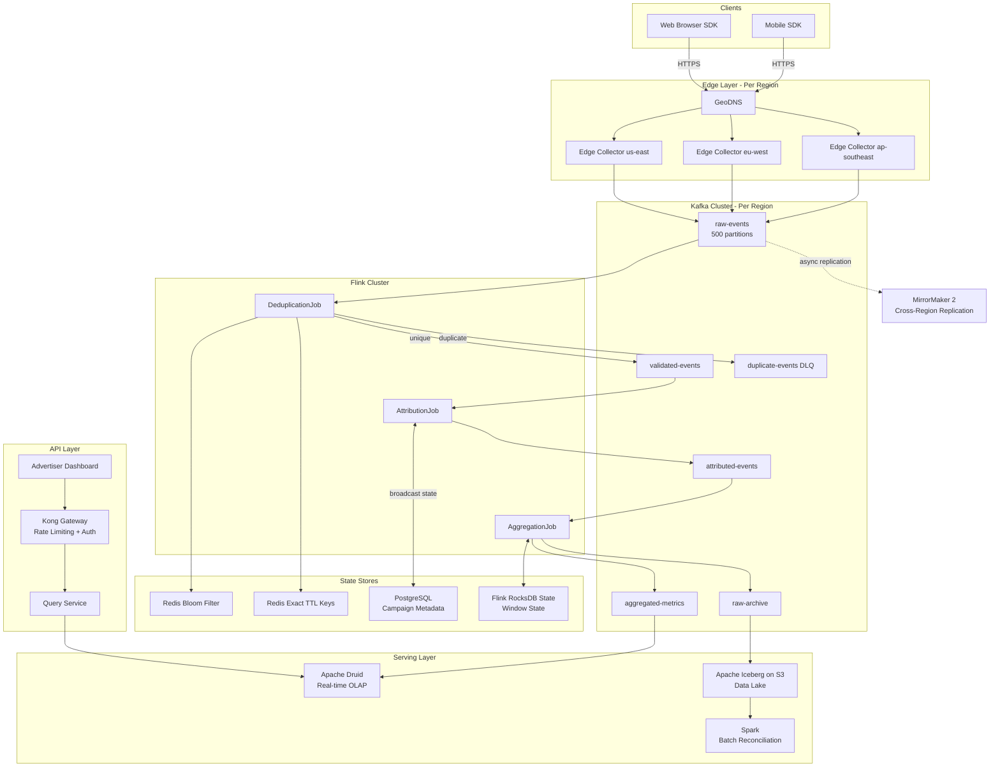

# Global Ad Click Aggregator and Attribution Engine

---

## Original Problem Statement

The requirement for near-real-time aggregation of advertising metrics is a cornerstone of the digital economy, demanding a system that can handle massive event volumes with strict correctness guarantees. In this scenario, the system must process billions of click and impression events daily from globally distributed sources, attributing clicks to specific campaigns and aggregating them for both billing and performance monitoring.

The primary functional requirement is the ingestion of high-velocity event streams from mobile devices and web browsers, which must be validated and deduplicated to prevent fraudulent or duplicate billing. The system must perform windowed aggregations-such as counting clicks per campaign per minute-using event-time semantics to ensure that late-arriving data is correctly attributed even if it arrives hours after the initial event occurred. Furthermore, the architecture must support multi-purpose serving layers, where aggregated data is pushed to a low-latency analytical store for real-time dashboards and a persistent data lake for historical audits and machine learning training.

Non-functional requirements for an ad click aggregator are dominated by the need for exactly-once processing and high availability. Any missed event results in lost revenue, while any duplicated event leads to overbilling and loss of advertiser trust. The system must be designed to tolerate regional failures, using cross-region replication and automated failover mechanisms to ensure continuous operation. Scalability is equally critical, as the platform must absorb sudden traffic spikes-such as during major sporting events or sales holidays-without introducing significant lag in the reporting pipeline.


| **Requirement Type** | **Metric/Specification**   | **Rationale**                                |
| -------------------- | -------------------------- | -------------------------------------------- |
| Throughput           | 10M+ events per minute     | Scalability for global ad networks           |
| ---                  | ---                        | ---                                          |
| Latency              | < 1 second for aggregation | Real-time budget pacing and monitoring       |
| ---                  | ---                        | ---                                          |
| Correctness          | Exactly-once delivery      | Financial integrity for billing and payments |
| ---                  | ---                        | ---                                          |
| Durability           | Seven-year retention       | Compliance and historical auditing           |
| ---                  | ---                        | ---                                          |


The technical challenges in this problem often center on the trade-offs between latency and correctness. For instance, the use of watermarking allows the system to bound the waiting time for late events, but setting a watermark too high increases latency, while setting it too low risks dropping data. Senior candidates are expected to discuss the implementation of idempotent consumers and transactional producers in systems like Apache Kafka or Flink to achieve these nines of reliability.

---

# Ad Click Aggregator & Attribution Engine — Architectural Design

---

## Phase 1: Scoping & Requirements

### Problem Restatement

Build a globally distributed pipeline that ingests billions of click and impression events per day from web/mobile clients, deduplicates and validates them, attributes each click to a campaign, performs windowed aggregations using event-time semantics (handling late arrivals), and serves results to two downstream consumers: a **real-time dashboard** (low-latency OLAP) and a **data lake** (historical audit + ML training). Financial correctness is non-negotiable — missed events = lost revenue, duplicated events = advertiser overbilling.

---

### Functional Requirements


| #    | Requirement                                                                     |
| ---- | ------------------------------------------------------------------------------- |
| FR-1 | Ingest click and impression events from globally distributed mobile/web clients |
| FR-2 | Validate events (schema, required fields, timestamp sanity)                     |
| FR-3 | Deduplicate events — prevent duplicate billing from client retries              |
| FR-4 | Attribute each click to a campaign (campaign_id, advertiser_id, creative_id)    |
| FR-5 | Windowed aggregations: clicks/impressions per campaign per minute (event-time)  |
| FR-6 | Handle late-arriving events up to 2 hours after event_time                      |
| FR-7 | Serve aggregated metrics to real-time dashboards (< 1s query latency)           |
| FR-8 | Persist raw events and aggregates to a data lake for audit and ML               |
| FR-9 | Support 7-year data retention for compliance                                    |


### Non-Functional Requirements


| Requirement                    | Target                                   | Rationale                 |
| ------------------------------ | ---------------------------------------- | ------------------------- |
| Throughput                     | 10M+ events/min (~167K events/sec)       | Global ad network scale   |
| End-to-end aggregation latency | < 1 second (p99)                         | Real-time budget pacing   |
| Availability                   | 99.99% (~52 min downtime/year)           | Revenue-critical path     |
| Consistency                    | Exactly-once processing                  | Financial integrity       |
| Durability                     | 7-year retention                         | Compliance, auditing      |
| Deduplication window           | 24 hours (exact), 7 days (probabilistic) | Handle delayed retries    |
| Geo-redundancy                 | Active-active, multi-region              | Tolerate regional failure |
| Query latency (dashboard)      | < 1s for last 24h, < 5s for 30-day range | SLA to advertisers        |


### Clarifying Assumptions Made

> Since this is a final design doc (not interactive), I'm locking in assumptions explicitly:

- **Attribution model**: Last-click attribution within a configurable window (default 30 min). Multi-touch attribution is a Phase 2 concern.
- **Event sources**: Client SDKs send events over HTTPS. No server-side click tracking assumed.
- **Deduplication key**: `(event_id, campaign_id, user_fingerprint)` — `event_id` is a UUID generated client-side.
- **Idempotency window**: Clients may retry within 24 hours; we must deduplicate within that window exactly.
- **Traffic pattern**: Diurnal with 5x spikes during major events (Super Bowl, Black Friday). Peak = 50M events/min.
- **Regions**: 3 regions (us-east-1, eu-west-1, ap-southeast-1). Writes go to nearest region, cross-region replication async.

> **Q:** What does attribution mean in ads? What is multi-touch attribution?
>
>> **A:** **Attribution** = answering "which ad touchpoint deserves credit for a conversion (purchase, signup, install)?" A user might see a banner ad, then click a search ad, then buy. Attribution decides which of those events gets credited for the sale — and therefore which campaign gets billed and measured.
>>
>> The basic mechanics: every impression and click event is logged with a `user_fingerprint` + `campaign_id` + timestamp. When a conversion occurs, the system looks back through that user's event history within a **lookback window** (e.g., 30 min) and assigns credit based on a model.
>>
>> **Common attribution models:**
>>
>> | Model | How credit is assigned | Use case |
>> |---|---|---|
>> | **Last-click** | 100% credit to the last ad clicked before conversion | Simple, favors performance channels (search) |
>> | **First-click** | 100% credit to the first ad seen | Brand awareness campaigns |
>> | **Linear** | Equal credit split across all touchpoints | Balanced view of the funnel |
>> | **Time-decay** | More credit to touchpoints closer to conversion | Short sales cycles |
>> | **Data-driven (algorithmic)** | ML model assigns credit based on historical conversion lift | Most accurate, requires scale |
>>
>> **This design uses last-click** (see Assumptions): the most recent clicked ad within 30 minutes before conversion gets 100% of the credit. Simplest to implement and the industry default for direct-response campaigns.
>>
>> **Multi-touch attribution (MTA)** distributes credit fractionally across *all* ad touchpoints in the conversion path, not just the last one. Example: a user sees a display ad (impression), then a video ad (impression), then clicks a search ad → converts. Last-click gives 100% to search. MTA might give 20% to display, 30% to video, 50% to search.
>>
>> **Why MTA is harder to build:**
>> - Requires assembling the full **user journey** across campaigns and channels, which means joining impression + click + conversion events on `user_fingerprint` across potentially hours or days of history — large stateful joins.
>> - Credit fractions must be computed atomically and re-computed if new touchpoints arrive late (late-data problem amplified).
>> - In this design, the Flink AttributionJob only does a 30-min sliding window keyed on `user_fingerprint → campaign_id`. MTA would need a much longer window (days) and a graph/path structure in state — hence deferred to Phase 2.

---

## Phase 2: High-Level Design & Architecture

### Back-of-Envelope Math

```
Baseline throughput:
  10M events/min = 166,667 events/sec
  Peak (5x spike): 50M events/min = 833,333 events/sec

Event size:
  Raw click event: ~500 bytes
  Ingestion bandwidth: 166K * 500B = ~83 MB/s baseline, ~415 MB/s peak

Daily volume:
  10M/min * 60 * 24 = 14.4 billion events/day
  Raw storage/day: 14.4B * 500B = 7.2 TB/day (uncompressed)
  Compressed (5:1 LZ4): ~1.5 TB/day

Annual raw storage:
  1.5 TB/day * 365 = ~547 TB/year
  7-year retention: ~3.8 PB total (compressed)

Kafka retention (7 days for replay buffer):
  1.5 TB/day * 7 = ~10.5 TB per region

Deduplication store sizing (24h exact):
  14.4B events/day * 32 bytes (event_id hash) = ~460 GB/day
  → Use Bloom filter (1% FP rate) first, Redis exact store as second pass
  Bloom filter for 14.4B items: ~20 GB (using 10 bits/element)
  Redis exact dedup (24h TTL): ~460 GB (acceptable; shard across Redis Cluster)

Druid hot store (30 days, aggregated rows):
  ~100M aggregated rows/day (campaign × minute × geo × device)
  ~200 bytes/row → 20 GB/day → 600 GB for 30 days (trivial)

QPS on serving layer:
  Assume 10,000 active advertiser dashboards, each refreshing every 5s
  → 2,000 queries/sec on Druid (well within a 20-node Druid cluster's capacity)
```

---

### High-Level Components


| Component               | Technology                                           | Role                                                  |
| ----------------------- | ---------------------------------------------------- | ----------------------------------------------------- |
| Edge Collector          | Nginx + Kafka REST Proxy (or gRPC gateway)           | TLS termination, initial validation, fan-out to Kafka |
| Message Broker          | Apache Kafka (3 regions, cross-region MirrorMaker 2) | Durable buffer, decouple ingestion from processing    |
| Stream Processor        | Apache Flink (stateful, event-time, watermarking)    | Dedup, validation, attribution, windowed aggregation  |
| Deduplication Store     | Redis Cluster (Bloom filter + exact TTL keys)        | Exactly-once guarantee at ingestion boundary          |
| Campaign Metadata Store | PostgreSQL (read replicas) + local Flink state       | Attribution lookup (campaign → advertiser mapping)    |
| Real-time OLAP Store    | Apache Druid                                         | Low-latency dashboard queries                         |
| Data Lake               | Apache Iceberg on S3 (with Parquet files)            | Historical audit, ML training, compliance             |
| Batch Reprocessor       | Apache Spark on Kubernetes                           | Late-data reconciliation, backfills                   |
| API Gateway             | Kong / Envoy                                         | Rate limiting, auth for advertiser API                |
| Monitoring              | Prometheus + Grafana + OpenTelemetry                 | Golden signals, SLO tracking                          |


---

### Data Flow (Happy Path)

**Ingestion Path:**

```
1. Client SDK generates click event with:
   { event_id: UUID, event_type: "click", campaign_id, creative_id,
     user_agent, ip, geo, device_type, event_time_ms, ad_slot_id }

2. SDK sends via HTTPS POST to nearest regional Edge Collector (GeoDNS routing)

3. Edge Collector:
   a. Validates TLS, authenticates publisher token (JWT)
   b. Schema validation (required fields, timestamp within ±1hr of server time)
   c. Produces to Kafka topic: raw-events (partitioned by campaign_id % N)
   d. Returns HTTP 202 Accepted immediately (async processing)

4. Kafka stores event durably (replication factor=3, min.insync.replicas=2)
   Topic: raw-events → 500 partitions (handles 167K events/sec easily)
```

**Processing Path:**

```
5. Flink Job (DeduplicationJob) consumes from raw-events:
   a. For each event, compute dedup_key = SHA256(event_id + campaign_id)
   b. Check Redis Bloom filter — if "definitely not seen", skip exact check
   c. If Bloom says "maybe seen", check Redis exact key (SETNX with 24h TTL)
   d. If duplicate → produce to dead-letter-topic: duplicate-events
   e. If unique → produce to Kafka topic: validated-events

6. Flink Job (AttributionJob) consumes from validated-events:
   a. Look up campaign metadata from Flink's broadcast state (refreshed every 60s from Postgres)
   b. Enrich event: add advertiser_id, campaign_name, bid_type, budget_remaining
   c. For click events: check if a matching impression exists within attribution window
      (30-min tumbling window keyed on user_fingerprint → campaign_id)
   d. Emit attributed_event to Kafka topic: attributed-events

7. Flink Job (AggregationJob) consumes from attributed-events:
   a. Uses event_time watermark (max event_time - 2hr watermark lag)
   b. Tumbling windows: 1-min, 5-min, 1-hr (emitted at watermark advance)
   c. Aggregates: clicks, impressions, spend, CTR per (campaign_id, geo, device, creative)
   d. Emits to two sinks simultaneously:
      - Kafka topic: aggregated-metrics (for Druid ingestion)
      - Kafka topic: raw-archive (for Iceberg sink)
```

**Serving Path:**

```
8. Druid ingests from aggregated-metrics topic in real-time (Kafka Supervisor)
   → Data available for query in < 1 second of aggregation emission

9. Iceberg Sink (Flink connector) writes attributed-events and aggregated-metrics
   to S3 in Parquet format, partitioned by (date, campaign_id)
   → File commits every 5 minutes (balancing file count vs latency)

10. Advertiser API → Kong Gateway → Query Service → Druid
    GET /v1/metrics?campaign_id=123&window=last_24h&granularity=1min
    → Druid returns pre-aggregated rollups in < 500ms
```

---

### Architecture Diagram




---

## Phase 3: Deep Dive — Data & Storage

### Data Model

**Raw Click Event (Kafka message / Iceberg raw layer)**

```json
{
  "event_id": "550e8400-e29b-41d4-a716-446655440000",
  "event_type": "click",
  "event_time_ms": 1741305600123,
  "ingest_time_ms": 1741305600456,
  "campaign_id": "cmp_xyz789",
  "creative_id": "cre_abc123",
  "ad_slot_id": "slot_pub_456",
  "publisher_id": "pub_999",
  "user_fingerprint": "hashed_user_id_or_cookie",
  "ip_hash": "sha256_of_ip",
  "geo": { "country": "US", "region": "CA", "city": "San Francisco" },
  "device": { "type": "mobile", "os": "iOS", "browser": "Safari" },
  "url": "https://publisher.com/article",
  "referrer": "https://google.com",
  "session_id": "sess_111"
}
```

**Attributed Event (enriched, written to Iceberg + used for aggregation)**

```json
{
  ...raw fields...,
  "advertiser_id": "adv_456",
  "campaign_name": "Summer Sale 2026",
  "bid_type": "CPC",
  "bid_amount_usd": 0.45,
  "attribution_type": "last_click",
  "attributed_impression_event_id": "550e8400-...",
  "is_valid": true,
  "fraud_score": 0.02
}
```

> **Q:** Is the advertiser_id discussed here refer to concept of advertiser id in Android devices which is anonymous and user-resettable identifier assigned to mobile devices or is it identifier of advertiser whose ad is being served?
>
> > **A:** **Identifier of the advertiser whose ad is being served** — e.g., `adv_456` representing Nike, Coca-Cola, etc. It's a business entity ID, not a device identifier.
> >
> > The Android Advertising ID (AAID) / iOS IDFA are device-side user tracking identifiers and map to what this document calls `user_fingerprint` — a pseudonymous, hashed per-user signal used for attribution (matching impressions to clicks for the same user). It is deliberately not stored raw; see the Security section: *"user_fingerprint is a pseudonymous ID (HMAC-SHA256 of user_id + daily salt)"*.
> >
> > So the two concepts in this system are:
> >
> > - `advertiser_id` → **who is paying** for the ad (business entity, server-side, stable)
> > - `user_fingerprint` → **who saw/clicked** the ad (device-side, hashed/pseudonymous, AAID/IDFA-derived)

**Aggregated Metric Row (Druid + Iceberg aggregated layer)**

```
Schema: aggregated_metrics
  window_start       TIMESTAMP    -- event-time window start
  window_end         TIMESTAMP    -- event-time window end
  granularity        VARCHAR(10)  -- '1min', '5min', '1hr'
  campaign_id        VARCHAR(64)
  advertiser_id      VARCHAR(64)
  creative_id        VARCHAR(64)
  geo_country        VARCHAR(10)
  device_type        VARCHAR(20)
  clicks             BIGINT
  impressions        BIGINT
  spend_usd          DECIMAL(18,6)
  unique_users_hll   HLL_SKETCH   -- HyperLogLog for cardinality
  ctr                FLOAT        -- clicks/impressions (computed)
  updated_at         TIMESTAMP    -- when this aggregate was last updated (for late data)
```

**Deduplication Schema (Redis)**

```
Key pattern:   dedup:{event_id_hash}
Value:         "1"
TTL:           86400 seconds (24 hours)
Type:          String (SETNX for atomic check-and-set)

Bloom filter:  Single Redis Bloom (RedisBloom module)
               Capacity: 20B items/day (with 1% FP rate)
               Use separate bloom per day, rotate at midnight
```

**Campaign Metadata (PostgreSQL)**

```sql
CREATE TABLE campaigns (
  campaign_id     VARCHAR(64) PRIMARY KEY,
  advertiser_id   VARCHAR(64) NOT NULL,
  campaign_name   VARCHAR(256),
  bid_type        VARCHAR(20),   -- CPC, CPM, CPA
  daily_budget    DECIMAL(18,2),
  start_date      DATE,
  end_date        DATE,
  status          VARCHAR(20),   -- active, paused, ended
  attribution_window_min INT DEFAULT 30,
  updated_at      TIMESTAMP DEFAULT NOW()
);

CREATE INDEX idx_campaigns_advertiser ON campaigns(advertiser_id);
CREATE INDEX idx_campaigns_status ON campaigns(status) WHERE status = 'active';
```

---

### Storage Strategy

#### Kafka (Message Buffer)

- **Why Kafka**: Decouples producers from consumers, handles backpressure, provides replay capability (critical for Flink job restarts and reprocessing). Topic compaction not used here — we want time-based retention.
- **Partitioning**: `raw-events` partitioned by `campaign_id % 500`. This ensures all events for the same campaign land on the same partition, enabling stateful processing in Flink without shuffle. Hot campaigns (Nike, Apple) might cause skew — mitigated by sub-partitioning (`campaign_id + creative_id`).
- **Retention**: 7 days on Kafka (short-term replay buffer). Long-term via Iceberg.
- **Replication**: RF=3, min.insync.replicas=2. Producer acks=all (idempotent producer enabled).
- **Cross-region**: MirrorMaker 2 replicates `validated-events` and `attributed-events` async to a secondary region for DR. ~500ms replication lag acceptable since we're not doing synchronous cross-region writes on the critical path.

#### Flink State (RocksDB)

- Window state (AggregationJob) uses **RocksDB** incremental checkpoints to S3 every 60 seconds.
- Attribution state (sliding 30-min window keyed on `user_fingerprint → campaign_id`) uses RocksDB with TTL-based state cleanup.
- Flink checkpointing: exactly-once semantics via two-phase commit to Kafka (transactional producer) and Iceberg (transactional file commits).

#### Apache Druid (Real-time OLAP)

- **Why Druid**: Column-oriented, pre-aggregated rollups, native HyperLogLog/Theta sketch support, Kafka-native ingestion. Query latency < 500ms for last-24h scans across 10K campaigns. Similar to how Pinterest uses Druid for ads analytics.
- **Segment granularity**: 1 hour (segments contain 1hr of data each).
- **Query granularity**: 1 minute (finest rollup granularity).
- **Dimensions**: `campaign_id, advertiser_id, creative_id, geo_country, device_type`
- **Metrics (pre-aggregated)**: `clicks=longSum, impressions=longSum, spend=doubleSum, unique_users=HLLSketchMerge`
- **Tiering**:
  - Hot tier (SSD, 32-node cluster): last 30 days
  - Historical tier (HDD, 8-node cluster): last 1 year
  - Data older than 1 year → queried from Iceberg via Trino (advertiser API has higher latency SLA for historical queries)
- **Partitioning**: Druid auto-segments by time. Within a segment, data is sorted by `campaign_id` for efficient scan.

> **Q:** Why not use low latency real-time OLAP stores like Clickhouse or Apache Pinot or Starrocks?
>
> > **A:** Any of the four would work. The choice was Druid for one specific reason: **native Kafka ingestion with pre-aggregation at ingest time**. Data lands from Kafka, Druid's Middle Managers roll it up into columnar segments immediately — you never scan raw rows, you query pre-rolled-up segments. For a workload that is almost entirely "sum clicks per campaign per minute," that's a 10–100× query speedup over scanning raw rows, which is what ClickHouse/Pinot/StarRocks do by default.
> >
> > That said, here's the honest per-alternative breakdown:
> >
> > **ClickHouse** — strongest alternative. `AggregatingMergeTree` can do Druid-style pre-aggregation; vectorized execution is faster than Druid on full-scan queries; far simpler to operate (no ZooKeeper post-22.x). Loses to Druid on native HLL/Theta sketch merge semantics and built-in tiered storage (hot SSD → warm HDD). *If the team already runs ClickHouse, switch to it* — Uber, ByteDance, and Cloudflare all use it for ad analytics at this scale.
> >
> > **Apache Pinot** — arguably the best fit for this specific problem, since LinkedIn built it for exactly this use case (ad analytics, user-facing dashboards). Wins on: upsert support (primary-key updates for late-data corrections without a Spark reprocess job), StarTree indexes on high-cardinality dimensions like `creative_id`, and the multi-stage query engine for joins. Loses on operational complexity and smaller community than Druid/ClickHouse.
> >
> > **StarRocks** — best choice if you want to collapse the Druid + historical Trino/Spark layers into one system. Its MPP engine handles both real-time (last 30 days) and historical (up to 1 year) without the Druid tiering complexity. Primary Key table type supports upserts natively. Downside: less mature at very high ingest rates, and pre-aggregation requires explicit materialized views rather than being automatic.
> >
> >
> > | Scenario                                            | Pick                    |
> > | --------------------------------------------------- | ----------------------- |
> > | Team already operates ClickHouse                    | ClickHouse              |
> > | Need upserts for late-data window corrections       | Pinot or StarRocks      |
> > | Pre-aggregation is the dominant access pattern      | Druid or Pinot          |
> > | Ad-hoc SQL with joins (campaign × user segment)     | StarRocks or ClickHouse |
> > | Want to eliminate a separate Spark historical layer | StarRocks               |
> >
> >
> > In a real interview I'd flag this as: *"Druid, Pinot, and ClickHouse are all valid — I'd pick based on what the team operates today and whether late-data upserts need to be first-class."*

#### Apache Iceberg on S3 (Data Lake)

- **Why Iceberg**: ACID transactions (critical for exactly-once sink from Flink), schema evolution without rewrites, time-travel queries for audit, hidden partitioning. Similar to how Netflix uses Iceberg for their data lake.
- **Table layout**:
  ```
  s3://ads-data-lake/
    raw_events/         → partitioned by (date, campaign_id)
    attributed_events/  → partitioned by (date, campaign_id)
    aggregated_metrics/ → partitioned by (date, granularity, campaign_id)
  ```
- **File format**: Parquet with Zstd compression (~5:1 ratio).
- **File size target**: 256 MB (Flink writes every 5 min, Spark compacts to 256MB daily).
- **Hot/Warm/Cold**:
  - Hot (S3 Standard): last 90 days
  - Warm (S3 Intelligent-Tiering): 90 days – 2 years
  - Cold (S3 Glacier Instant Retrieval): 2–7 years
- **Table maintenance**: Iceberg `EXPIRE SNAPSHOTS` runs daily via Spark to prevent metadata bloat. `REWRITE DATA FILES` runs weekly for compaction.

#### Redis (Deduplication)

- **Cluster mode**: 6 shards × 2 replicas = 12 nodes. ~460 GB dataset sharded across 6 primaries.
- **Bloom filter rotation**: `bloom:YYYY-MM-DD` key, rotated at midnight UTC. Keep 2 days of bloom filters to handle midnight boundary events.
- **Two-pass dedup**: Bloom first (cheap, ~1μs), exact Redis SETNX second (only when bloom says "maybe seen", ~1ms). ~99% of events will be first-time seen → bloom saves 99% of Redis exact-check calls.
- **Replication**: Redis Cluster with async replication. In case of Redis primary failure, we accept a small window of potential re-processing (detected and handled downstream by Iceberg dedup on re-materialization).

#### PostgreSQL (Campaign Metadata)

- Single-digit millisecond reads for campaign lookups. Master in primary region, 2 read replicas (one per other region).
- Flink AttributionJob caches campaign metadata as **broadcast state** (refreshed every 60s via JDBC source). This avoids per-event database lookups, keeping attribution at memory speed.
- Table size is small: ~10M campaigns max = ~5 GB. Easily fits in memory.

---

### Caching Strategy


| Layer             | Pattern                     | Detail                                                        |
| ----------------- | --------------------------- | ------------------------------------------------------------- |
| Flink Attribution | Broadcast State (in-memory) | Campaign metadata pushed to all Flink task managers every 60s |
| Druid             | Broker-level query cache    | LRU cache for repeated dashboard queries on same time range   |
| API Query Service | Look-aside + Redis          | Cache `GET /metrics?campaign=X&window=1hr` for 30s TTL        |
| Dedup             | Bloom filter (Redis)        | Probabilistic first-pass before exact TTL check               |


---

## Phase 4: Trade-offs & Justification

### Kafka vs. Pulsar vs. Kinesis

**Chose Kafka:**

- Battle-tested at 10M+ events/sec (LinkedIn, Uber, Netflix)
- Native exactly-once semantics via transactional API + idempotent producer
- MirrorMaker 2 for cross-region replication is mature
- Flink has first-class Kafka connector with checkpoint-aligned offsets

**Rejected Pulsar:**

- Multi-layer storage (BookKeeper + ZooKeeper) adds operational complexity
- Flink connector less mature than Kafka connector
- Geo-replication simpler in Pulsar but we don't need synchronous cross-region writes

**Rejected Kinesis:**

- Proprietary; shard-level limitations (1000 PUT/sec/shard) require careful management
- No replayability beyond 7 days (extended retention expensive)
- Vendor lock-in unacceptable for 7-year compliance requirement

---

### Flink vs. Spark Streaming vs. Kafka Streams

**Chose Flink:**

- True stream processing (not micro-batch). Spark Structured Streaming is micro-batch; at 10M events/min, 100ms micro-batches accumulate 17K events/batch — acceptable but adds latency.
- Native event-time support with watermarks is first-class in Flink, bolted-on in Spark.
- Stateful processing with RocksDB allows large state (attribution windows, dedup state) that doesn't fit in memory.
- Exactly-once end-to-end via two-phase commit to Kafka + Iceberg.
- Reference: Alibaba/Taobao runs Flink at 4.4T events/day for their ad platform.

**Rejected Kafka Streams:**

- No native event-time watermarking.
- Aggregation state lives in Kafka changelog topics — operationally complex at this scale.
- Can't run multi-stage pipelines cleanly (our 3-job DAG needs a proper cluster scheduler).

---

### Exactly-Once Semantics Implementation

This is the crux of the problem. End-to-end exactly-once requires:

```
1. Kafka Producer (Edge Collector → raw-events):
   - enable.idempotence=true + transactional.id per producer instance
   - Ensures no duplicate messages in Kafka despite TCP retries

2. Flink exactly-once checkpointing:
   - Checkpoint interval: 60s
   - State backend: RocksDB (incremental checkpoints to S3)
   - On restart, Flink rewinds Kafka offset to last committed checkpoint
   → May reprocess events, but dedup layer absorbs duplicates

3. Deduplication (Redis):
   - SETNX(dedup_key, "1", EX 86400) — atomic, exactly-once set
   - If SETNX returns 0 → already seen, discard
   - Handles duplicates from Flink reprocessing AND client retries

4. Flink Kafka producer (to downstream topics):
   - Transactional producers, committed atomically with Flink checkpoint
   - Downstream consumers use read_committed isolation

5. Iceberg sink:
   - Flink Iceberg sink uses two-phase commit: files written in "pending" state,
     committed atomically on Flink checkpoint completion
   → Exactly-once writes to Iceberg guaranteed
```

---

### Watermarking Strategy

The problem explicitly calls out the latency vs. correctness tradeoff:

```
Watermark = max(observed event_time) - 2 hours

Why 2 hours:
- Mobile events from users in tunnels/offline can be buffered up to 2 hours
- Setting lower (e.g., 5min) drops late events → missed revenue
- Setting higher (e.g., 12hrs) delays window closure → dashboard latency unacceptable

Handling beyond 2-hour late arrivals:
- Events arriving > 2hrs late are routed to a late-events Kafka topic
- Spark batch job reprocesses late-events daily and issues MERGE INTO on Iceberg
- Druid segments for affected windows are re-ingested from Iceberg (triggered via Druid API)
- Advertiser billing reconciliation runs nightly on Iceberg (source of truth)

Implementation in Flink:
  WatermarkStrategy
    .<ClickEvent>forBoundedOutOfOrderness(Duration.ofHours(2))
    .withTimestampAssigner((event, ts) -> event.eventTimeMs)
```

---

### Push vs. Pull for Dashboard

**Chose Pull (query-on-demand via Druid):**

- Advertiser dashboards have 10K+ different filter combinations; pre-pushing all permutations is infeasible.
- Druid's pre-aggregation at ingest time makes pull queries fast enough.

**For budget pacing (internal system):**

- **Push model**: Flink emits spend events directly to a Redis counter per campaign (`INCRBYFLOAT campaign:{id}:spend_today`). Budget enforcement service polls Redis at 100ms intervals, pauses campaigns that exceed budget. Lower latency than querying Druid.

---

### CAP Theorem Analysis

```
Ingestion pipeline (Edge Collector → Kafka):
  → Choose AP: return HTTP 202 even if some downstream processing is degraded.
    Missing a few events temporarily is better than rejecting client writes.

Deduplication (Redis):
  → Choose CP: would rather reject a duplicate than allow it (overbilling > missed event).
    Redis Cluster is consistent within a shard.

Druid serving:
  → Choose AP: stale reads (e.g., 5min lag during Kafka consumer lag) acceptable.
    Dashboard shows "data as of X" timestamp.

Billing reconciliation (Iceberg):
  → Strong consistency required. Iceberg transactions + nightly Spark job ensures
    billing numbers are exact. Druid numbers are approximate/real-time.
```

---

## Phase 5: Reliability, Scaling & Operations

### Bottleneck Analysis


| Bottleneck                       | Risk                                    | Mitigation                                                               |
| -------------------------------- | --------------------------------------- | ------------------------------------------------------------------------ |
| Hot partition (popular campaign) | Single Kafka partition overwhelmed      | Sub-partition by `campaign_id + creative_id`; Flink rescaling            |
| Redis dedup cluster              | Memory exhaustion or network saturation | Bloom filter pre-filter; Redis Cluster auto-sharding; daily key rotation |
| Flink state backend              | RocksDB compaction pauses               | Tune RocksDB: `max_background_compactions=4`, incremental checkpoints    |
| Druid ingestion lag              | Kafka consumer falls behind             | Auto-scaling Druid Middle Manager pods; increase task slots              |
| Attribution state explosion      | 30-min keyed state grows unbounded      | RocksDB TTL cleanup on state older than attribution window               |
| Watermark stall                  | Empty partition stalls watermark        | Use `withIdleness(Duration.ofMinutes(5))` on WatermarkStrategy           |


---

### Failure Handling

**Flink job crash:**

```
1. Kubernetes restarts Flink JobManager (liveness probe, restart policy: Always)
2. Flink restores from last S3 checkpoint (max 60s of reprocessing)
3. Kafka offsets rewound to checkpoint-committed position
4. Redis dedup absorbs any re-processed duplicates
5. Iceberg exactly-once sink ignores already-committed files (idempotent commit)
```

**Kafka broker failure:**

```
1. Controller election (ZooKeeper / KRaft): < 30s
2. Partition leaders re-elected, replicas catch up
3. min.insync.replicas=2 ensures 1 broker can fail without data loss
4. Producers with acks=all will buffer and retry (with backoff)
```

**Regional failure (full region outage):**

```
1. GeoDNS health check fails on affected region (30s TTL)
2. Traffic auto-routes to next-nearest region (e.g., us-east → eu-west)
3. MirrorMaker 2 replication allows secondary region to process from its own Kafka
   (there will be a gap for events already in-flight to dead region)
4. When region recovers: MirrorMaker 2 resyncs; Flink reprocesses from checkpoint
5. Druid re-ingests any missing windows from Iceberg (backfill API call)

RTO: ~5 minutes (GeoDNS TTL + Flink restart)
RPO: ~60 seconds (checkpoint interval)
```

**Bad deployment (poison code):**

```
1. Canary deployment: new Flink job version runs against 5% of Kafka partitions
2. Shadow comparison: new vs. old outputs compared on aggregated-metrics-shadow topic
3. If error rate > 0.1% or output divergence > 0.01%, rollback automatically (Helm rollback)
4. Blue/green Flink job cutover: start new job, drain old job, swap Kafka consumer groups
```

---

### Edge Cases

**Poison Pill Messages (malformed events):**

```
- Flink's deserialization failure handler routes bad messages to:
  dead-letter-topic: invalid-events (retained 30 days)
- PagerDuty alert if invalid-event rate > 0.1% of total events
- Separate "event repair" pipeline allows manually-fixed events to be re-injected
```

**Traffic Spikes (Super Bowl, Black Friday):**

```
- Kafka: pre-provisioned at 10x baseline capacity (Kafka auto-scaling via Cruise Control)
- Edge Collector: Kubernetes HPA on CPU/RPS metric, scales to 200 pods within 2 min
- Flink: Reactive mode (auto-rescaling) or pre-scaled day-before via operator
- Rate limiting at Edge Collector: per-publisher token bucket (1M events/min/publisher)
  → Publishers exceeding limit get HTTP 429 with Retry-After header
- Redis dedup: pre-warm Bloom filter for known high-traffic campaigns
```

**Clock Skew (client timestamp manipulation):**

```
- Reject events where |event_time - server_time| > 1 hour at Edge Collector
- For events slightly late (1hr-2hr): allowed via watermark
- Tag events with server_ingest_time for audit; both times stored in Iceberg
```

**Duplicate campaign_id + impression_id across publishers (fraudulent):**

```
- Fraud detection: separate Flink job consuming attributed-events
- Features: click-through-rate per publisher > 5x baseline → fraud flag
- High click velocity from same IP hash within 60s → filter
- Fraud-flagged events written to fraud-events topic for human review
- Not billed until cleared (conservative approach for advertiser trust)
```

---

### Observability

**Golden Signals:**


| Signal     | Metric                             | Alert Threshold            |
| ---------- | ---------------------------------- | -------------------------- |
| Latency    | `flink_job_lastCheckpointDuration` | > 30s → warn, > 90s → page |
| Latency    | `kafka_consumer_lag` per topic     | > 100K messages → warn     |
| Latency    | `druid_query_p99_latency_ms`       | > 1000ms → warn            |
| Traffic    | `events_ingested_per_sec`          | < 50K/sec → dead-man alert |
| Errors     | `dedup_collision_rate`             | > 5% → investigate fraud   |
| Errors     | `flink_job_exceptions_total`       | > 10/min → page            |
| Saturation | `kafka_partition_utilization`      | > 80% → add partitions     |
| Saturation | `redis_memory_used_pct`            | > 75% → scale cluster      |


**SLAs / SLOs:**

```
SLO-1: 99.9% of valid click events are ingested into Kafka within 500ms of client send
SLO-2: 99.99% of events are processed exactly once (measured via nightly Spark audit)
SLO-3: Aggregated metrics available in Druid within 60 seconds of event_time (p99)
SLO-4: Dashboard API latency < 1s (p99) for last-24h queries
SLO-5: Data available in Iceberg for audit queries within 10 minutes of event_time

Error Budget:
  SLO-3 (99.9% = 1.44 min/day allowed lag): monitored via Grafana SLO dashboard
  Burn rate alert: if error budget consumed > 5× faster than normal → page on-call
```

**Health Checks:**

- **Synthetic transactions**: Dedicated test publisher sends 1 synthetic click event every 30 seconds. End-to-end tracking from ingestion → Druid query. Alert if not visible in Druid within 90s.
- **Heartbeat**: Flink jobs emit `job_heartbeat_timestamp` metric every 10s to Prometheus. Dead-man alert if no heartbeat within 60s.
- **Data freshness**: Grafana panel shows `max(event_time)` in Druid per region. Alert if freshness > 5 minutes behind wall clock.

---

## Phase 6: Staff-Level Considerations

### Cost Analysis

```
Kafka (self-hosted on K8s, 30 nodes × r6i.4xlarge @ ~$0.40/hr):
  ~$8,600/month per region × 3 regions = ~$26K/month

Flink (15 nodes × c5.4xlarge @ ~$0.68/hr):
  ~$7,400/month per region

Redis Cluster (12 × r6g.2xlarge @ ~$0.41/hr):
  ~$4,400/month per region

Druid (40 nodes mixed × avg $0.50/hr):
  ~$14,400/month per region

S3 storage (3.8 PB @ $0.023/GB, amortized over 7 years):
  Year 1: ~$25K/month, growing to ~$87K/month by year 7
  S3 Glacier: ~$0.004/GB for cold tier — 10× cheaper for data >2 years

Total rough estimate: ~$150-200K/month at steady state (3 regions)
→ At 14.4B events/day: ~$0.00004 per event (well within typical ad tech margins)

Cost optimization levers:
- Spot instances for Flink workers (checkpoint recovery makes this safe)
- Reserved instances for Kafka brokers (3-year reservation = ~40% savings)
- Druid segment tiering (move >30d to HDD tier: 5× cheaper storage)
```

---

### Security

```
Data in transit:
  - TLS 1.3 enforced on all Edge Collector endpoints
  - mTLS between internal services (Flink ↔ Kafka, Druid ↔ Query Service)
  - Kafka TLS + SASL/SCRAM for broker authentication

Data at rest:
  - S3 SSE-KMS (AWS KMS or HashiCorp Vault for key management)
  - Redis encrypted-at-rest (RDB + AOF encryption)
  - Postgres TDE (Transparent Data Encryption)

PII Handling:
  - user_fingerprint is a pseudonymous ID (HMAC-SHA256 of user_id + daily salt)
  - ip_hash stored instead of raw IP (SHA256 with rotating salt, stored separately in vault)
  - GDPR right-to-erasure: Iceberg supports row-level deletes (copy-on-write mode)
    → "forget user" job issues DELETE on all Iceberg tables, recomputes affected aggregates
  - PII fields never written to Druid (only hashed/aggregated dimensions)

Access Control:
  - RBAC on Druid: advertisers can only query their own campaign_id namespace
  - Iceberg: Lake Formation policies restrict raw table access to data engineers only
  - All API access via OAuth 2.0 + JWT with campaign_id claim validation
  - Audit log: all data access logged to immutable S3 audit bucket
```

---

### Evolution: 10x Scale (100M events/min)

```
Current bottlenecks at 10x:
1. Kafka: 1.67M events/sec → scale partitions from 500 → 2000
   Use Kafka tiered storage (Confluent/AstraDB) to offload cold log segments to S3

2. Redis dedup: 10× events → 4.6 TB/day exact keys
   → Migrate to a distributed bloom filter (Cassandra-backed)
   → Or: use Flink's built-in dedup operator with RocksDB state (eliminate Redis hop)

3. Flink: horizontal scaling (add task managers), operator chaining to reduce network shuffles
   → Consider splitting into more granular micro-services per topic

4. Druid: scale to 100+ Middle Managers; use Druid auto-scaling (K8s operator)

5. Attribution window state: at 10x, 30-min state is 10× larger
   → Offload attribution lookup to external service (Apache Pinot for point lookups, < 1ms)

6. Edge Collector: multi-region active-active with local Kafka clusters
   → Already designed for this; just add more regions (APAC expansion)

7. Iceberg compaction: move from Spark to Flink streaming compaction (Iceberg v2 + Flink)

Architecture shift at 100x (1B events/min):
  → Move to a "Lambda 2.0" architecture with Apache Paimon (streaming lakehouse)
    replacing the Kafka + Flink + Iceberg separation
  → Real-time serving shifts to pre-materialized aggregation tables (Paimon primary-key tables)
    updated in-place, queryable via Flink SQL
```

---

## Summary: Technology Choices at a Glance


| Component            | Choice                               | Key Reason                                               |
| -------------------- | ------------------------------------ | -------------------------------------------------------- |
| Message Broker       | Apache Kafka                         | Exactly-once, replayable, high throughput                |
| Stream Processor     | Apache Flink                         | Event-time watermarks, stateful, exactly-once E2E        |
| Deduplication        | Redis Cluster (Bloom + SETNX)        | Sub-millisecond, atomic, TTL-based                       |
| Campaign Metadata    | PostgreSQL + Flink Broadcast State   | Relational integrity + zero-latency lookup               |
| Real-time OLAP       | Apache Druid                         | Pre-aggregation, < 500ms queries, native Kafka ingestion |
| Data Lake            | Apache Iceberg on S3                 | ACID, time-travel, schema evolution, Parquet/Zstd        |
| Batch Reconciliation | Apache Spark on K8s                  | Late-data reprocessing, Iceberg MERGE INTO               |
| API Gateway          | Kong                                 | Rate limiting, OAuth, per-advertiser routing             |
| Monitoring           | Prometheus + Grafana + OpenTelemetry | Golden signals, SLO tracking                             |


---

*Design by: Staff Engineer Candidate | Problem: Global Ad Click Aggregator & Attribution Engine*