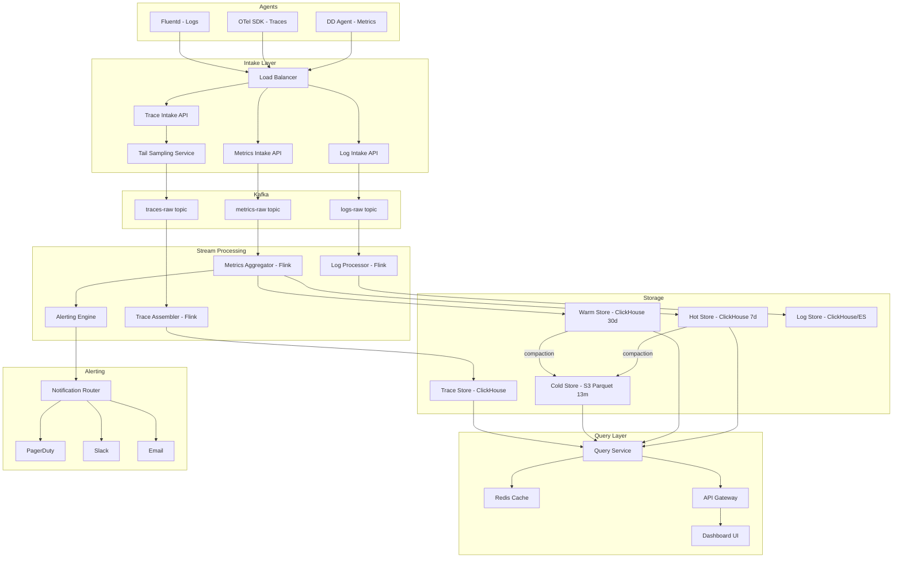

# Design: Application Performance Monitoring System (Datadog-like)

---

## Phase 1: Scoping & Requirements

### Problem Restatement

Design a scalable APM platform that ingests metrics, traces, and logs from potentially millions of hosts, enables real-time alerting, provides distributed tracing, and offers a fast ad-hoc exploration UI — all while keeping storage costs manageable.

### Functional Requirements

| # | Requirement | Detail |
|---|-------------|--------|
| F1 | **Metrics Collection** | Ingest infrastructure metrics (CPU, mem, disk, network) and custom application metrics (counters, gauges, histograms) from agents running on hosts/containers. |
| F2 | **Distributed Tracing** | Collect spans from instrumented services, assemble them into traces, and visualize request flow across services. |
| F3 | **Real-time Alerting** | Evaluate alert rules (threshold, anomaly detection, composite) against live metric streams. Expected detection latency: **< 30 seconds** from metric emission to alert firing. |
| F4 | **Dashboards & Ad-hoc Exploration** | Users can build dashboards and run arbitrary queries over metrics (e.g., "p99 latency of service X in region Y over the last 6 hours"). |
| F5 | **Service Map** | Auto-generated dependency graph derived from trace data showing inter-service communication, error rates, and latency. |
| F6 | **Log Aggregation** *(bonus)* | Ingest structured/unstructured logs, correlate with traces via trace IDs. |

### Non-Functional Requirements

| Property | Target |
|----------|--------|
| **Write throughput** | ~1M metric data points/sec, ~100K spans/sec |
| **Dashboard query latency** | < 1s for recent data (last hour), < 5s for historical (last 30 days) |
| **Alert detection latency** | < 30s end-to-end |
| **Availability** | 99.9% for ingestion, 99.95% for query/dashboard |
| **Consistency** | Eventually consistent reads acceptable (metric data is append-only, immutable) |
| **Data retention** | Hot: 7 days (full resolution), Warm: 30 days (1-min rollups), Cold: 13 months (1-hr rollups) |
| **Multi-tenancy** | System must isolate tenants and enforce per-tenant rate limits |

### Clarifying Assumptions

| Question | Assumed Answer |
|----------|----------------|
| Read-heavy or write-heavy? | **Extremely write-heavy** for ingestion. Read-heavy for dashboards but at much lower QPS. |
| Number of hosts/agents? | **100K hosts** sending data, scalable to 1M. |
| Metric cardinality? | ~100 unique time series per host = **10M active time series** at baseline. High-cardinality tag explosion is a known risk. |
| Trace sampling? | Head-based sampling at 10% by default. Tail-based sampling for errors/high-latency to capture 100% of interesting traces. |
| Multi-region? | Yes. Agents send to the nearest regional intake. Cross-region replication for alerting and dashboards. |

---

## Phase 2: Back-of-Envelope Estimation

### Metrics

| Item | Calculation | Result |
|------|-------------|--------|
| Metric write QPS | 100K hosts × 100 metrics / 10s interval | **1,000,000 points/sec** |
| Bytes per point | 8B timestamp + 8B value + 16B series ID + 18B overhead | **~50 bytes** |
| Daily raw storage | 1M × 86,400 × 50B | **~4.3 TB/day** |
| Monthly raw storage | 4.3 TB × 30 | **~130 TB/month** |
| 1-min rollup savings | ~6x compression (10s → 1min) | ~22 TB/month |
| 1-hr rollup savings | ~360x compression | ~0.36 TB/month |

### Traces

| Item | Calculation | Result |
|------|-------------|--------|
| Total spans before sampling | ~1M spans/sec across all services | |
| After 10% head sampling | 100K spans/sec | **100K spans/sec** |
| Avg span size | ~500 bytes (service, operation, duration, tags, trace_id, parent_id) | |
| Daily trace storage | 100K × 500B × 86,400 | **~4.3 TB/day** |

### Bandwidth

| Path | Bandwidth |
|------|-----------|
| Agents → Intake (metrics) | 1M × 50B = **50 MB/s** (~400 Mbps) |
| Agents → Intake (traces) | 100K × 500B = **50 MB/s** |
| Total ingestion bandwidth | **~100 MB/s** (pre-compression; ~30 MB/s with gzip) |

---

## Phase 3: High-Level Architecture

### Core Components

```
┌──────────────────────────────────────────────────────────────────────────────┐
│                              CLIENT SIDE                                     │
│                                                                              │
│  ┌──────────────┐  ┌──────────────┐  ┌──────────────┐                       │
│  │  DD Agent     │  │  Tracing SDK │  │  Log Shipper │                       │
│  │  (metrics)    │  │  (OTel)      │  │  (Fluentd)   │                       │
│  └──────┬───────┘  └──────┬───────┘  └──────┬───────┘                       │
└─────────┼──────────────────┼──────────────────┼──────────────────────────────┘
          │                  │                  │
          ▼                  ▼                  ▼
┌──────────────────────────────────────────────────────────────────────────────┐
│                           INTAKE LAYER (Regional)                            │
│                                                                              │
│  ┌────────────────────────────────────────────────────┐                      │
│  │              Load Balancer (NLB / Envoy)           │                      │
│  └────────────────────────┬───────────────────────────┘                      │
│                           │                                                  │
│  ┌────────────┐  ┌────────┴──────┐  ┌──────────────┐                        │
│  │  Metrics   │  │  Trace        │  │  Log          │                        │
│  │  Intake    │  │  Intake       │  │  Intake       │                        │
│  │  API       │  │  API          │  │  API          │                        │
│  └─────┬──────┘  └──────┬────────┘  └──────┬────────┘                        │
│        │                │                   │                                │
│        │    ┌───────────┴───────────┐       │                                │
│        │    │  Sampling Decision    │       │                                │
│        │    │  Service (tail-based) │       │                                │
│        │    └───────────┬───────────┘       │                                │
└────────┼────────────────┼───────────────────┼────────────────────────────────┘
         ▼                ▼                   ▼
┌──────────────────────────────────────────────────────────────────────────────┐
│                         MESSAGE BUS (Kafka)                                  │
│                                                                              │
│  ┌──────────────┐  ┌──────────────┐  ┌──────────────┐                       │
│  │ metrics-raw  │  │ traces-raw   │  │  logs-raw    │                       │
│  │ (partitioned │  │ (partitioned │  │ (partitioned │                       │
│  │  by series   │  │  by trace_id)│  │  by service) │                       │
│  │  hash)       │  │              │  │              │                       │
│  └──────┬───────┘  └──────┬───────┘  └──────┬───────┘                       │
└─────────┼──────────────────┼──────────────────┼──────────────────────────────┘
          │                  │                  │
          ▼                  ▼                  ▼
┌──────────────────────────────────────────────────────────────────────────────┐
│                     STREAM PROCESSING LAYER                                  │
│                                                                              │
│  ┌──────────────────┐  ┌──────────────────┐  ┌──────────────────┐           │
│  │  Metrics         │  │  Trace           │  │  Log             │           │
│  │  Aggregator      │  │  Assembler       │  │  Processor       │           │
│  │  (Flink)         │  │  (Flink)         │  │  (Flink)         │           │
│  │                  │  │                  │  │                  │           │
│  │  - 10s→1m rollup │  │  - Correlate     │  │  - Parse,        │           │
│  │  - 1m→1h rollup  │  │    spans→traces  │  │    structure     │           │
│  │  - Feed alerting │  │  - Build service │  │  - Enrich with   │           │
│  │    engine        │  │    dependency    │  │    trace IDs     │           │
│  │                  │  │    graph         │  │                  │           │
│  └────────┬─────────┘  └────────┬─────────┘  └────────┬─────────┘           │
│           │                     │                      │                     │
│           ├─────────────────────┼──────────────────────┘                     │
│           │                     │                                            │
│  ┌────────▼─────────┐          │                                            │
│  │  ALERTING ENGINE │          │                                            │
│  │  (see deep dive) │          │                                            │
│  └──────────────────┘          │                                            │
└───────────┼────────────────────┼─────────────────────────────────────────────┘
            │                    │
            ▼                    ▼
┌──────────────────────────────────────────────────────────────────────────────┐
│                          STORAGE LAYER                                       │
│                                                                              │
│  ┌───────────────────┐  ┌───────────────────┐  ┌───────────────────┐        │
│  │  HOT STORE        │  │  WARM STORE       │  │  COLD STORE       │        │
│  │  (ClickHouse /    │  │  (ClickHouse      │  │  (Parquet on S3)  │        │
│  │   custom TSDB)    │  │   rollup tables)  │  │                   │        │
│  │                   │  │                   │  │  1-hr resolution   │        │
│  │  Full resolution  │  │  1-min resolution │  │  13+ months        │        │
│  │  7 days           │  │  30 days          │  │                   │        │
│  └───────────────────┘  └───────────────────┘  └───────────────────┘        │
│                                                                              │
│  ┌───────────────────┐  ┌───────────────────┐                               │
│  │  Trace Store      │  │  Log Store        │                               │
│  │  (ClickHouse)     │  │  (ClickHouse /    │                               │
│  │                   │  │   Elasticsearch)  │                               │
│  └───────────────────┘  └───────────────────┘                               │
└──────────────────────────────────────────────────────────────────────────────┘
            │
            ▼
┌──────────────────────────────────────────────────────────────────────────────┐
│                          QUERY & API LAYER                                   │
│                                                                              │
│  ┌───────────────────┐  ┌───────────────────┐  ┌───────────────────┐        │
│  │  Metrics Query    │  │  Trace Query      │  │  Alert Rule       │        │
│  │  Service          │  │  Service          │  │  Manager          │        │
│  │  (fan-out/scatter │  │                   │  │  (CRUD + eval     │        │
│  │   gather across   │  │                   │  │   scheduling)     │        │
│  │   shards)         │  │                   │  │                   │        │
│  └───────────────────┘  └───────────────────┘  └───────────────────┘        │
│                                                                              │
│  ┌──────────────────────────────────────────────────────────────────┐        │
│  │                    API Gateway / GraphQL                         │        │
│  └──────────────────────────────────────────────────────────────────┘        │
│                                                                              │
│  ┌──────────────────────────────────────────────────────────────────┐        │
│  │                    Dashboard / UI (React)                        │        │
│  └──────────────────────────────────────────────────────────────────┘        │
└──────────────────────────────────────────────────────────────────────────────┘
```

### Data Flow: Metrics (Happy Path)

1. **Agent** on host collects system and app metrics every 10 seconds
2. Agent **pre-aggregates** locally (e.g., computes histogram percentiles) and **batches** data points
3. Agent sends a compressed (gzip/zstd) HTTP POST to the **Metrics Intake API** in the nearest region
4. Intake API **validates** payload (schema, tenant auth via API key), applies **rate limiting** per tenant
5. Intake API **tags** each metric with `tenant_id`, `host`, `region` and publishes to the **`metrics-raw` Kafka topic**, partitioned by `hash(metric_name + sorted_tags) % num_partitions` — this ensures all points for a given time series land on the same partition for ordered processing
6. **Metrics Aggregator** (Flink stateful job) consumes from Kafka:
   - Writes raw 10s-resolution data to the **Hot Store**
   - Computes 1-minute rollups (min, max, avg, sum, count, p50, p95, p99) in tumbling windows, writes to **Warm Store**
   - Feeds the live metric stream into the **Alerting Engine** for rule evaluation
7. A separate **Compaction Job** (batch, hourly) reads from Warm Store, computes 1-hour rollups, writes **Parquet files to S3** (Cold Store)
8. **Query Service** handles dashboard queries by routing to the appropriate tier based on the requested time range

### Data Flow: Distributed Tracing

1. Application code instrumented with **OpenTelemetry SDK** generates spans with `trace_id`, `span_id`, `parent_span_id`, operation name, duration, tags, and status
2. SDK sends spans (batched) to the local **DD Agent** (acting as an OTel Collector)
3. Agent applies **head-based sampling** (probabilistic, 10%) and forwards to **Trace Intake API**
4. Trace Intake publishes to `traces-raw` Kafka topic, partitioned by `trace_id` (ensures all spans of a trace go to the same partition)
5. **Trace Assembler** (Flink) uses a session window (~30s timeout) to:
   - Collect all spans for a `trace_id`
   - Build the trace tree
   - Apply **tail-based sampling**: if any span has `error=true` or `duration > p99_threshold`, retain the full trace regardless of head sampling
   - Emit the assembled trace to the Trace Store
6. A secondary Flink job reads assembled traces and updates the **Service Dependency Graph** (edges between services, aggregated error rates, latency percentiles) stored in a **graph/relational store** (PostgreSQL)

---

## Phase 4: Deep Dive — Data Model & Storage

### Metrics Data Model

**Time Series Identity:**

```
series_id = hash(metric_name, sorted(tag_key=tag_value pairs))
```

Example: `series_id = hash("http.request.duration", "env=prod,region=us-east,service=api-gateway")`

**Raw Data Point (Hot Store):**

```sql
-- ClickHouse MergeTree table
CREATE TABLE metrics_raw (
    tenant_id     UInt32,
    series_id     UInt64,       -- hash of metric_name + tags
    metric_name   LowCardinality(String),
    timestamp     DateTime64(3),
    value         Float64,
    tags          Map(LowCardinality(String), String)
)
ENGINE = MergeTree()
PARTITION BY (tenant_id, toDate(timestamp))
ORDER BY (tenant_id, series_id, timestamp)
TTL timestamp + INTERVAL 7 DAY DELETE;
```

**Rollup Data (Warm Store):**

```sql
CREATE TABLE metrics_1m_rollup (
    tenant_id     UInt32,
    series_id     UInt64,
    metric_name   LowCardinality(String),
    timestamp     DateTime,      -- rounded to minute
    min           Float64,
    max           Float64,
    avg           Float64,
    sum           Float64,
    count         UInt64,
    p50           Float64,
    p95           Float64,
    p99           Float64,
    tags          Map(LowCardinality(String), String)
)
ENGINE = MergeTree()
PARTITION BY (tenant_id, toYYYYMM(timestamp))
ORDER BY (tenant_id, series_id, timestamp)
TTL timestamp + INTERVAL 30 DAY DELETE;
```

**Cold Store (Parquet on S3):**

```
s3://apm-cold-store/
  └── metrics/
      └── tenant_id={tid}/
          └── year={YYYY}/
              └── month={MM}/
                  └── metric_name={name}/
                      └── {date}_{shard}.parquet
```

Partitioned by tenant → year → month → metric name. 1-hour resolution. Queried via **Trino/Presto** for ad-hoc analysis.

### Trace Data Model

```sql
CREATE TABLE traces (
    tenant_id     UInt32,
    trace_id      FixedString(16),   -- 128-bit
    span_id       FixedString(8),    -- 64-bit
    parent_span_id FixedString(8),
    service_name  LowCardinality(String),
    operation     LowCardinality(String),
    start_time    DateTime64(6),     -- microsecond precision
    duration_us   UInt64,
    status_code   Enum8('OK'=0, 'ERROR'=1, 'UNSET'=2),
    tags          Map(LowCardinality(String), String),
    events        Array(Tuple(DateTime64(6), String, Map(String, String)))
)
ENGINE = MergeTree()
PARTITION BY (tenant_id, toDate(start_time))
ORDER BY (tenant_id, service_name, start_time, trace_id)
TTL start_time + INTERVAL 15 DAY DELETE;
```

### Why ClickHouse?

| Property | Fit |
|----------|-----|
| **Columnar storage** | Time-series queries (sum, avg, percentiles over millions of rows) scan only relevant columns — massively reduces I/O |
| **Vectorized execution** | SIMD-optimized query engine. Metric aggregation queries run 10-100x faster than row-based stores |
| **Built-in compression** | LZ4/ZSTD on columns of similar data → 10-15x compression ratio on metric data |
| **MergeTree TTL** | Automatic data expiration per table — native hot/warm lifecycle without external cron jobs |
| **Sharding + replication** | Native distributed tables with shard-level parallelism for fan-out queries |
| **Materialized views** | Can auto-maintain rollup tables from raw inserts — reduces Flink complexity |

### Caching Strategy

```
┌──────────────┐     ┌───────────────────┐     ┌──────────────────┐
│  Dashboard   │────▶│  Query Service    │────▶│  ClickHouse      │
│  UI          │     │                   │     │                  │
│              │◀────│  ┌─────────────┐  │     └──────────────────┘
│              │     │  │ Redis Cache │  │
│              │     │  │ (look-aside)│  │
│              │     │  └─────────────┘  │
│              │     └───────────────────┘
└──────────────┘
```

- **Look-aside (cache-aside)** pattern on the Query Service
- Cache key: `hash(query, time_range_bucket, tenant_id)`
- **TTL varies by recency**:
  - Queries for data > 1 hour old → cache 5 minutes (data won't change)
  - Queries for data < 1 hour old → cache 30 seconds (near-real-time)
- Dashboard widgets on auto-refresh bypass cache for the most recent time bucket
- **Materialized views in ClickHouse** serve as a persistent cache for common rollup patterns

---

## Phase 5: Deep Dive — Alerting Engine

The alerting system is the most latency-sensitive component. It must evaluate potentially **millions of alert rules** against live metric streams with < 30s detection latency.

### Architecture

```
                                 ┌─────────────────────┐
                                 │  Alert Rule Store    │
                                 │  (PostgreSQL)        │
                                 │                      │
                                 │  - rule_id           │
                                 │  - tenant_id         │
                                 │  - metric_query      │
                                 │  - condition          │
                                 │  - threshold          │
                                 │  - window_duration   │
                                 │  - notification_cfg  │
                                 └──────────┬──────────┘
                                            │ periodic sync
                                            ▼
┌──────────────┐         ┌─────────────────────────────────────┐
│  Kafka       │         │        Alerting Engine               │
│  metrics-raw │────────▶│                                     │
│              │         │  ┌─────────────────────────────┐    │
│              │         │  │  Rule Router                │    │
│              │         │  │  (assigns rules to           │    │
│              │         │  │   evaluator partitions)      │    │
│              │         │  └──────────────┬──────────────┘    │
│              │         │                 │                    │
│              │         │  ┌──────────────▼──────────────┐    │
│              │         │  │  Alert Evaluators            │    │
│              │         │  │  (N stateful workers)        │    │
│              │         │  │                              │    │
│              │         │  │  - Sliding window state      │    │
│              │         │  │  - Threshold checks          │    │
│              │         │  │  - Anomaly detection          │    │
│              │         │  │    (EWMA, Z-score,           │    │
│              │         │  │     seasonal decomposition)  │    │
│              │         │  └──────────────┬──────────────┘    │
│              │         │                 │                    │
│              │         │  ┌──────────────▼──────────────┐    │
│              │         │  │  Alert Deduplication &       │    │
│              │         │  │  Grouping                    │    │
│              │         │  │                              │    │
│              │         │  │  - Suppress duplicates       │    │
│              │         │  │    within cooldown window    │    │
│              │         │  │  - Group related alerts      │    │
│              │         │  │    (same service, same root  │    │
│              │         │  │    cause)                    │    │
│              │         │  └──────────────┬──────────────┘    │
└──────────────┘         └─────────────────┼───────────────────┘
                                           │
                                           ▼
                          ┌────────────────────────────────┐
                          │  Notification Router           │
                          │                                │
                          │  - PagerDuty                   │
                          │  - Slack                       │
                          │  - Email                       │
                          │  - Webhook                     │
                          │  - OpsGenie                    │
                          └────────────────────────────────┘
```

### Alert Evaluation Strategy

**The core challenge**: We can't run each alert rule as an independent query against the TSDB — at millions of rules that would crush the storage layer.

**Solution: Inverted evaluation (push-based)**

1. Each alert rule specifies a metric query (e.g., `avg(cpu.usage){service:api-gw} > 90 for 5m`)
2. At rule creation time, we **decompose** the rule into the set of `series_id`s it matches
3. When a new data point arrives for `series_id=X`, the **Rule Router** looks up which alert rules are subscribed to that series (maintained in an in-memory inverted index: `series_id → [rule_ids]`)
4. The data point is forwarded to the specific **Alert Evaluator** worker that owns those rules
5. The evaluator updates the sliding window state and checks the condition

This is essentially **stream-stream join** between the metric stream and the rule set.

### Alert Types

| Type | How It Works |
|------|-------------|
| **Threshold** | `value > X for duration D` — simple sliding window, fire when all points in window breach |
| **Change** | `abs(current_avg - baseline_avg) > X%` — compare current window to a baseline (previous hour/day/week) |
| **Anomaly** | Use EWMA (Exponentially Weighted Moving Average) or seasonal decomposition. Fire when value deviates by N standard deviations from the predicted band. Requires per-series state (mean, variance). |
| **Composite** | Boolean combination of other alerts: `alert_A AND alert_B` — evaluated by a separate coordinator that subscribes to child alert state changes |
| **No Data** | Fire when a series that was previously reporting stops sending data for > X minutes. Tracked via a last-seen timestamp per series. |

### Preventing Alert Storms

- **Cooldown period**: After firing, suppress re-firing for configurable duration (default 5 min)
- **Alert grouping**: Alerts from the same service/host within a time window are grouped into a single notification
- **Severity escalation**: Warning → Critical → Page, with configurable escalation policies
- **Muting rules**: Scheduled maintenance windows suppress alerts for matching tags

---

## Phase 6: Trade-offs & Justification

### Message Bus: Kafka

| Why Kafka | Why Not X |
|-----------|-----------|
| Durable, replayable log — if a consumer falls behind, it can catch up without data loss | **RabbitMQ**: No replayability, not designed for high-throughput streaming |
| Handles 1M+ msg/sec per cluster easily | **AWS Kinesis**: Shard limits (1MB/s per shard), more expensive at scale, vendor lock-in |
| Partitioning aligns perfectly with our series-based parallelism | **Pulsar**: Viable alternative, but Kafka has larger ecosystem and operational maturity |
| Consumer groups give us exactly-once semantics with Flink | **Redis Streams**: Not designed for this throughput, no compaction |

### Stream Processing: Apache Flink

| Why Flink | Why Not X |
|-----------|-----------|
| True streaming (not micro-batch) — critical for < 30s alert latency | **Spark Streaming**: Micro-batch model adds latency (seconds to minutes) |
| First-class support for event-time windows, watermarks, and exactly-once state | **Kafka Streams**: Viable for simpler pipelines, but Flink handles complex stateful ops (session windows for trace assembly) better |
| Managed state with RocksDB backend — can maintain millions of sliding windows for alert evaluation | **Custom Go workers**: Tempting for simplicity, but reinventing windowing, state checkpointing, and exactly-once is a massive investment |

### Storage: ClickHouse vs. Alternatives

| Approach | Pros | Cons | Verdict |
|----------|------|------|---------|
| **ClickHouse** | Columnar, vectorized, incredible compression, native TTL, materialized views | Operational complexity, no native HA (relies on ZooKeeper/Keeper) | **Selected for hot + warm** |
| **TimescaleDB** | Postgres-compatible, good ecosystem | Row-based under the hood, slower at high-cardinality aggregations | Rejected |
| **InfluxDB** | Purpose-built TSDB | Clustering is enterprise-only ($$), cardinality limits | Rejected |
| **Prometheus + Thanos** | Great for pull-based metrics | Not designed for multi-tenant SaaS push model at this scale | Rejected |
| **Druid** | Good for OLAP, real-time ingestion | Higher operational complexity than ClickHouse for similar perf | Close second |

### Push vs. Pull Model

| Agent → Platform | Justification |
|-----------------|---------------|
| **Push (selected)** | Agents push metrics/traces to the intake API. Better for: (a) multi-tenant SaaS where we can't initiate connections to customer networks, (b) ephemeral containers that may not live long enough to be scraped, (c) higher throughput since clients batch and compress |
| Pull (rejected) | Prometheus-style pull works well for single-org Kubernetes clusters but breaks down for SaaS APM: firewall issues, discovery complexity, doesn't scale to 100K+ targets |

### Consistency vs. Availability

This system is firmly on the **AP** side of CAP:

- Metrics are **immutable, append-only** — no conflict resolution needed
- A few seconds of data loss during a partition is tolerable (agents buffer locally)
- Dashboard queries returning slightly stale data (30s) is acceptable
- **Exception**: Alert rule configuration (CRUD) uses PostgreSQL with strong consistency — we can't have phantom rules or lost rule updates

---

## Phase 7: Reliability, Scaling & Operations

### Bottlenecks & Mitigations

| Bottleneck | Mitigation |
|------------|-----------|
| **Kafka ingestion throughput** | Add partitions + brokers. Use batch compression (snappy/zstd). Separate clusters for metrics vs. traces |
| **ClickHouse write amplification** | Batch inserts (insert 10K-100K rows at a time, never row-by-row). Use `Buffer` engine in front of `MergeTree` |
| **High-cardinality tag explosion** | Enforce per-tenant cardinality limits (e.g., max 10M unique series). Block tags with unbounded values (e.g., `request_id`). Emit cardinality warnings |
| **Alert evaluator state size** | Partition rules across evaluator workers by `series_id` range. Each worker manages state for its partition. Scale horizontally |
| **Query fan-out latency** | Scatter-gather with timeout. If one shard is slow, return partial results with a warning. Caching reduces repeat query load |
| **Single point of failure: Kafka** | Multi-AZ Kafka cluster, `min.insync.replicas=2`, replication factor 3 |

### Failure Handling

| Failure | Recovery |
|---------|----------|
| **Agent can't reach Intake** | Agent buffers locally (disk-backed, 1GB default). Retries with exponential backoff. Data arrives late but is not lost |
| **Intake API crash** | Stateless; LB health checks detect and route around. No data loss (agent retries) |
| **Kafka broker down** | Replication factor 3, unclean leader election disabled. ISR set maintains availability. Automatic partition rebalancing |
| **Flink job failure** | Flink checkpoints state to S3 every 30 seconds. On restart, resumes from last checkpoint with exactly-once guarantees |
| **ClickHouse node down** | Replicated tables (ReplicatedMergeTree). Reads served by replica. Writes buffered in Kafka until node recovers |
| **Alert evaluator crash** | Flink manages evaluator state. On recovery, replays Kafka from last checkpoint. May cause brief alert delay (< 1 min) but no missed alerts |
| **Region outage** | Agents fail over to secondary region intake endpoint. Cross-region Kafka MirrorMaker replicates alert state |

### Edge Cases

| Edge Case | Handling |
|-----------|---------|
| **Metric spike (10x normal)** | Per-tenant rate limiting at Intake layer. Excess data returns HTTP 429. Agent backs off and drops lowest-priority metrics |
| **Poison pill (malformed data)** | Intake validates schema. Invalid payloads → dead letter queue (DLQ) for debugging. Never reaches Kafka |
| **Clock skew on hosts** | Intake API rejects data points with timestamps > 5 min in the future. Late data (up to 10 min) is accepted and inserted at correct event time |
| **Noisy neighbor** | Tenant isolation: separate Kafka consumer groups, per-tenant query concurrency limits, resource quotas in ClickHouse |
| **Tag cardinality bomb** | Pre-ingest check: if a metric's tag combination count exceeds threshold (100K unique combos), reject and alert the tenant |

### Observability (Meta-Monitoring)

Yes, the monitoring system needs monitoring. We use a separate, simpler monitoring stack for internal health.

**Golden Signals:**

| Signal | Metric | Alert Threshold |
|--------|--------|----------------|
| **Latency** | p99 Intake API response time | > 500ms |
| **Traffic** | Ingestion rate (points/sec per tenant) | Deviation > 50% from baseline |
| **Errors** | HTTP 5xx rate at Intake | > 0.1% |
| **Saturation** | Kafka consumer lag (messages) | > 1M messages behind |
| | ClickHouse merge queue size | > 100 pending merges |
| | Flink checkpoint duration | > 60 seconds |

**SLOs:**

| Service | SLO | Error Budget |
|---------|-----|-------------|
| Metrics Ingestion | 99.9% success rate | 43.8 min downtime/month |
| Dashboard Queries | 99.95% of queries < 5s | 21.9 min downtime/month |
| Alert Detection | 99.9% of alerts fire within 30s | 43.8 min/month of delayed alerts |

**Health Checks:**

- **Synthetic transactions**: A canary agent sends known metrics every 10s. An end-to-end monitor verifies the metric appears in the query layer within 30s
- **Kafka consumer lag monitor**: Independent process reads consumer group offsets and alerts if lag exceeds threshold
- **ClickHouse query watchdog**: Kills queries running > 60s to prevent resource starvation

---

## Phase 8: Staff-Level Considerations

### Cost Analysis

| Component | Monthly Cost Estimate (100K hosts) | Optimization |
|-----------|-----------------------------------|-------------|
| **Kafka** | 15-20 brokers (i3en.xlarge) ≈ $15K | Use tiered storage (Kafka + S3) to reduce broker disk |
| **Flink** | 30-40 task managers ≈ $12K | Right-size based on actual state size; use spot instances for batch jobs |
| **ClickHouse (Hot)** | 10-15 nodes (r6g.4xlarge) ≈ $20K | Aggressive TTL. Use LZ4 compression. Partition pruning reduces query cost |
| **ClickHouse (Warm)** | 6-8 nodes ≈ $10K | Rollups reduce data 6x |
| **S3 (Cold)** | ~130TB raw/month → ~10TB with rollups ≈ $230 | Lifecycle to Glacier after 6 months |
| **Total** | **~$60K/month** | |

**Key cost lever**: Rollup aggressiveness. Going from 10s → 1min resolution saves 6x storage. Most users don't need 10s resolution beyond 24 hours.

**At 10x scale (1M hosts):**

- Kafka and Flink scale linearly → $150K + $120K
- ClickHouse sharding scales sublinearly (better compression at scale) → ~$150K
- Total: ~$450K/month — still within reason for a SaaS product charging ~$15-23/host/month ($15M-23M monthly revenue)

### Security

| Concern | Approach |
|---------|----------|
| **Agent authentication** | Each tenant gets an API key. Keys are hashed, stored in a key management service. Intake validates every request |
| **Encryption in transit** | TLS 1.3 everywhere: Agent → Intake, Kafka inter-broker, Flink → ClickHouse |
| **Encryption at rest** | AES-256 for ClickHouse volumes (EBS encryption). S3 SSE-KMS for cold storage |
| **Tenant isolation** | Logical isolation via `tenant_id` in every table. Query layer enforces tenant scoping. No cross-tenant data leakage possible |
| **PII in tags** | Tag value scanning at ingest time. Flag and hash potential PII (email, IP). Configurable scrubbing rules per tenant |
| **RBAC** | Role-based access for dashboard/alert management. API keys scoped to specific permissions (read-only, write metrics, manage alerts) |

### Evolution: Scaling to 10x

| Dimension | Strategy |
|-----------|----------|
| **10M → 100M active series** | Introduce a **series metadata store** (a distributed hash map backed by Cassandra or FoundationDB) to map series IDs to their current shard. Enables re-sharding without downtime |
| **Multi-region active-active** | Each region operates independently for ingestion and alerting. Cross-region sync for dashboard queries (query fan-out to multiple regions). Global alert dedup |
| **Real-time ML anomaly detection** | Train per-series models offline (Prophet/LSTM), deploy as sidecar to alert evaluators. Use online learning for fast adaptation |
| **Unified query layer** | Federated query engine (Trino) that transparently queries Hot (ClickHouse), Warm (ClickHouse rollups), and Cold (S3 Parquet) — users don't need to know which tier they're hitting |
| **Custom metrics language** | Move from SQL to a purpose-built query language (like Datadog's metric query syntax or PromQL) for ergonomic dashboard building |

---

## Appendix: Mermaid Diagram — End-to-End Data Flow



---

## Key Design Decisions Summary

| Decision | Choice | Primary Justification |
|----------|--------|----------------------|
| Ingestion model | Push (agent → API) | SaaS-friendly, ephemeral container support, client-side batching |
| Message bus | Kafka | Replayability, throughput, partition-based parallelism |
| Stream processor | Flink | True streaming, stateful processing, exactly-once |
| Hot storage | ClickHouse | Columnar, vectorized, TTL, materialized views |
| Cold storage | Parquet on S3 | Cheap, durable, queryable via Trino |
| Alert evaluation | Push-based (inverted index) | Avoids N queries for N rules; O(1) lookup per data point |
| Trace sampling | Head (10%) + Tail (errors/slow) | Balance storage cost with debugging completeness |
| Caching | Redis look-aside | Simple, effective for read-heavy dashboard queries |
| Tenant isolation | Logical (tenant_id column) | Cost-effective; physical isolation for enterprise tier |
