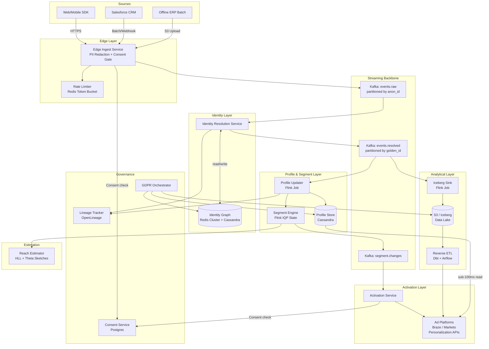

-----
 ## Original Problem Statement

 The modern Customer Data Platform (CDP) has evolved from a simple database into the "central nervous system" of the enterprise, responsible for ingesting, unifying, and activating first-party data at a global scale. For Staff and Principal Engineers, the challenge is no longer just "storing data," but solving the Single Customer View (SCV) problem across fragmented touchpoints while adhering to strict global privacy regulations like GDPR and CCPA. This requires a sophisticated interplay between high-throughput event ingestion, complex identity resolution (matching anonymous to known users), and sub-100ms activation across a "vertically integrated" stack.

 ## The Core Architectural Challenge: Identity Resolution and the Global Profile Store
 The "heart" of a CDP is Identity Resolution—the process of attributing all customer behavior from various online and offline systems to a single, unified profile. The technical hurdle lies in the "cascade" of matching: moving from strict Deterministic Matching (exact matches on IDs like email or phone) to Probabilistic Matching (using "soft signals" like IP address, device fingerprint, and behavioral similarity). At a Principal level, the system must maintain this "Identity Graph" at a scale of billions of nodes while ensuring that profile updates do not create "Tuesday afternoon dashboard collapses" due to inconsistent data snapshots.

 ### High-Level Requirements

| **Requirement Type** | **Description** |
| --- | --- |
| **Functional** | Multi-Source Ingestion: Capture structured, semi-structured, and unstructured data from web/mobile SDKs, CRMs (Salesforce), and offline ERPs. |
| **Functional** | Identity Resolution: Implement a hybrid model supporting both deterministic (PII-based) and probabilistic (fuzzy/ML-based) matching. |
| **Functional** | Real-Time Segmentation: Evaluate complex user predicates (e.g., "users who abandoned a cart within 5 mins") across live event streams. |
| **Functional** | Omnichannel Activation: Push unified segments to downstream marketing tools, advertising platforms, and personalization engines. |
| **Non-Functional** | Scale: Support 100,000+ Requests Per Second (RPS) and manage 250M+ rich customer profiles. |
| **Non-Functional** | Latency: Sub-100ms p99 latency for "Edge" calls (personalized content delivery). |
| **Non-Functional** | Privacy/Compliance: Native support for consent management, data lineage, and "Right to be Forgotten" (GDPR) automated deletes. |
| **Non-Functional** | Idempotency: Ensure that retried ingestion events do not corrupt profile state or trigger duplicate downstream activations. |

## Nuanced Considerations for Staff and Principal Engineers

1. The "Composable vs. Integrated" Architectural Choice
A Principal-level design must evaluate whether to build a Composable CDP—leveraging an existing Data Warehouse (Snowflake/BigQuery) as the source of truth—or an Integrated CDP with its own proprietary storage. The "Reverse ETL" pattern is critical here: pushing modeled warehouse data into operational tools to bridge the gap between "Insights at Rest" and "Action in Motion".

2. Hybrid Identity Resolution Cascades
Sophisticated systems do not choose between deterministic and probabilistic matching; they use a cascade.

- Deterministic: High-precision (80%+ accuracy) using PII (Email, Phone) for known users to ensure accurate personalization.

- Probabilistic: Higher reach (fuzzy matching) using device fingerprints and behavioral patterns for anonymous-to-known transitions.
The design must handle "Profile Stitching" where an anonymous session is retroactively merged into a known profile upon login, requiring a high-performance graph traversal.

3. Incremental Query Processing (IQP) for Real-Time Segments
To avoid re-scanning billions of rows, the CDP should utilize Incremental Query Processing (IQP). This patented-style approach maintains a "partial evaluation state" for every segment. When a single event arrives, the system only re-evaluates the delta needed to update the user's segment membership.

4. Privacy-Safe Computation and Data Governance
Governance is not an afterthought but an architectural pillar. The system must include:

- Consent Orchestration: Gating ingestion and activation based on per-user consent flags (e.g., "No Marketing").
- PII Redaction at the Edge: Redacting or hashing sensitive fields before they hit the central profile store to minimize the "blast radius" of potential data leaks.
- Auditability: Clear lineage trails showing why a profile was merged or a segment was activated, essential for regulatory audits.

5. Probabilistic Data Structures for Reach Estimation
When a marketer builds a segment, they need a "Reach Estimate" instantly. Instead of a linear scan of billions of users, the CDP uses HyperLogLog (HLL) for cardinality estimation (unique counts) and Theta Sketches for complex set intersections (e.g., "Users in Segment A but NOT in Segment B"). This reduces memory overhead from gigabytes to kilobytes while maintaining a controllable ~2% error margin.

-----

# Customer Data Platform (CDP) — Architectural Design

---

## Phase 1: Scoping & Requirements

### Problem Restatement

Design a production-grade Customer Data Platform that acts as the "central nervous system" for enterprise first-party data. The system must ingest events from heterogeneous sources, resolve fragmented identities into a Single Customer View (SCV), evaluate real-time segments, and activate those segments to downstream channels — all while enforcing GDPR/CCPA compliance natively.

---

### Functional Requirements

| # | Requirement |
|---|---|
| FR-1 | **Multi-Source Ingestion**: Accept structured (CRM/ERP), semi-structured (JSON events), and unstructured data from web/mobile SDKs, Salesforce, and offline batch uploads |
| FR-2 | **Identity Resolution**: Hybrid cascade — deterministic (email, phone hash) → probabilistic (device fingerprint, IP, behavioral similarity) |
| FR-3 | **Profile Unification**: Merge anonymous sessions into known profiles on login ("profile stitching"); maintain a live Identity Graph |
| FR-4 | **Real-Time Segmentation**: Evaluate predicates like "cart abandoned in last 5 min" using Incremental Query Processing (IQP) |
| FR-5 | **Omnichannel Activation**: Push segments to ad platforms, marketing automation, personalization engines via push and Reverse ETL |
| FR-6 | **Consent Orchestration**: Gate ingestion and activation on per-user consent flags; support opt-out propagation |
| FR-7 | **Right to be Forgotten**: Automated GDPR delete cascades across all stores within 30 days |
| FR-8 | **Reach Estimation**: Sub-second cardinality estimates for segment builders using probabilistic data structures |

### Non-Functional Requirements

| Dimension | Target |
|---|---|
| **Throughput** | 100,000+ RPS ingest; 10,000+ segment evaluations/sec |
| **Profile Scale** | 250M+ rich customer profiles |
| **Edge Latency** | p99 < 100ms for personalization reads |
| **Availability** | 99.99% for ingestion and activation paths |
| **Consistency** | Eventual consistency for profile updates; strong consistency for consent flags |
| **Idempotency** | Exactly-once semantics for ingestion and downstream activations |
| **Durability** | Zero data loss; WAL-backed event log retained for 7 days minimum |
| **Privacy** | PII redacted/hashed at edge before central store; full audit lineage |

### Assumptions

- "Composable CDP" model: a Data Warehouse (Iceberg on S3) is the analytical source of truth; an operational profile store handles sub-100ms reads.
- Multi-region active-active deployment (at least 2 regions).
- Consent is stored as a first-class entity, not a tag on the profile.
- Segment definitions are pre-compiled; IQP state is maintained per segment per user.

---

## Phase 2: High-Level Design

### Back-of-Envelope Math

```
Profiles:        250M users
Events/day:      ~500 events/user/month → ~4B events/day
Ingest RPS:      4B / 86400 ≈ 46K avg; 100K peak
Event size:      ~2KB avg (JSON, compressed ~600B)
Ingest bandwidth: 100K * 600B = 60 MB/s = ~216 GB/hr

Profile size:    ~10KB per profile (traits + segment memberships + identity edges)
Profile store:   250M * 10KB = 2.5 TB hot storage

Identity Graph:  250M nodes, avg 3 edges/node → ~750M edges
                 ~50 bytes/edge → ~37.5 GB (fits in distributed memory)

Segment eval:    10K active segments, 100K events/sec → 10M evaluations/sec
                 (IQP reduces this to delta-only re-evaluations)

GDPR deletes:    ~0.1% of users/month → 250K delete requests/month → ~100/hr
```

### High-Level Components

1. **Edge Ingest Layer** — SDK-facing, PII redaction, consent gating, rate limiting
2. **Event Bus (Kafka)** — Durable, replayable backbone; partitioned by `customer_id`
3. **Identity Resolution Service** — Deterministic + probabilistic matching; writes to Identity Graph
4. **Profile Store** — Operational key-value store (Cassandra) for sub-100ms reads
5. **Segment Engine** — IQP-based stream processor (Flink) maintaining partial evaluation state
6. **Activation Service** — Pushes segment membership deltas to downstream destinations
7. **Data Warehouse Layer** — Iceberg on S3 for analytical queries and Reverse ETL
8. **Consent & Governance Service** — Consent store (Postgres), lineage tracker, GDPR orchestrator
9. **Reach Estimation Service** — HyperLogLog/Theta Sketch computation layer
10. **Control Plane** — Segment definition compiler, schema registry, config management

### Data Flow — Happy Path (Web Event → Profile Update → Activation)

```
1. Browser SDK fires track("AddToCart", {product_id, price, ...})
2. Edge Ingest Service receives event over HTTPS
   a. Validates JWT / API key
   b. Checks consent flag (Redis cache) — if "No Marketing", strips marketing fields
   c. Hashes PII fields (email → SHA-256 + pepper) before forwarding
   d. Assigns anonymous_id if no known_id present
   e. Publishes raw event to Kafka topic: events.raw (partitioned by anonymous_id)
3. Identity Resolution Service consumes from events.raw
   a. Deterministic lookup: hash(email) → known_id in Identity Graph (Redis + Cassandra)
   b. If no match: probabilistic lookup via device fingerprint + IP → candidate known_id
   c. If match found: stitches anonymous_id → known_id in Identity Graph
   d. Publishes resolved event to events.resolved (partitioned by known_id / golden_id)
4. Profile Updater (Flink job) consumes events.resolved
   a. Merges event traits into profile in Cassandra (upsert with LWW or CRDT)
   b. Updates segment membership via IQP state machine
   c. Emits segment_delta events to segment.changes topic
5. Activation Service consumes segment.changes
   a. For each destination (e.g., Facebook Ads, Braze), checks activation consent
   b. Batches and pushes segment membership updates via destination connectors
6. Iceberg Sink (Flink job) writes events.resolved to S3 in Parquet/Iceberg format
   for analytical queries and Reverse ETL
```

### Architecture Diagram



---

## Phase 3: Deep Dive — Data & Storage

### Data Models

#### Event (Kafka / Iceberg)

```json
{
  "event_id":      "uuid-v4",           // idempotency key
  "anonymous_id":  "anon_abc123",
  "golden_id":     "usr_xyz789",        // null until resolved
  "event_type":    "AddToCart",
  "source":        "web_sdk",
  "timestamp":     "2026-03-23T10:00:00Z",
  "properties": {
    "product_id":  "prod_001",
    "price":       49.99
  },
  "consent_flags": {
    "marketing":   true,
    "analytics":   true
  },
  "pii_fields":    ["email_hash"],      // PII already hashed at edge
  "ingested_at":   "2026-03-23T10:00:01Z"
}
```

#### Identity Graph Node (Cassandra)

```sql
CREATE TABLE identity_graph (
    golden_id     UUID,
    id_type       TEXT,   -- 'email_hash' | 'phone_hash' | 'anon_id' | 'device_fp'
    id_value      TEXT,
    confidence    FLOAT,  -- 1.0 for deterministic, 0.0-1.0 for probabilistic
    source        TEXT,
    created_at    TIMESTAMP,
    PRIMARY KEY ((golden_id), id_type, id_value)
);

-- Reverse lookup index (Redis sorted set or secondary table)
CREATE TABLE id_to_golden (
    id_type   TEXT,
    id_value  TEXT,
    golden_id UUID,
    PRIMARY KEY ((id_type, id_value))
);
```

#### Customer Profile (Cassandra)

```sql
CREATE TABLE customer_profiles (
    golden_id       UUID PRIMARY KEY,
    traits          MAP<TEXT, TEXT>,        -- {"first_name": "Alice", "city": "NYC"}
    segment_ids     SET<UUID>,              -- current segment memberships
    last_seen_at    TIMESTAMP,
    consent_version INT,
    updated_at      TIMESTAMP
);
```

#### Consent Record (Postgres)

```sql
CREATE TABLE consent_records (
    golden_id       UUID NOT NULL,
    purpose         TEXT NOT NULL,          -- 'marketing', 'analytics', 'personalization'
    granted         BOOLEAN NOT NULL,
    granted_at      TIMESTAMPTZ,
    revoked_at      TIMESTAMPTZ,
    source          TEXT,                   -- 'web_banner', 'crm_sync'
    version         INT NOT NULL,
    PRIMARY KEY (golden_id, purpose, version)
);
```

#### Segment Definition (Control Plane — Postgres)

```sql
CREATE TABLE segment_definitions (
    segment_id    UUID PRIMARY KEY,
    name          TEXT,
    predicate     JSONB,   -- AST of the segment rule
    compiled_plan BYTEA,   -- serialized Flink operator plan
    hll_sketch    BYTEA,   -- current reach estimate sketch
    created_at    TIMESTAMPTZ,
    updated_at    TIMESTAMPTZ
);
```

### Storage Strategy

| Layer | Technology | Rationale |
|---|---|---|
| **Event Log** | Kafka (7-day retention) | Replayable, ordered, partitioned by `golden_id` post-resolution |
| **Identity Graph** | Redis Cluster (hot) + Cassandra (durable) | Redis for <1ms graph traversal; Cassandra as durable fallback and full graph store |
| **Profile Store** | Cassandra (multi-region) | Wide-row model fits sparse trait maps; tunable consistency; proven at 250M+ scale (similar to Segment's Personas architecture) |
| **Segment IQP State** | Flink RocksDB state backend | Local SST files for per-user segment state; checkpointed to S3 every 60s |
| **Consent Store** | Postgres (strong consistency) | Consent is a compliance-critical write; ACID semantics required; low write volume |
| **Analytical Lake** | Apache Iceberg on S3 | ACID table format with time-travel; supports schema evolution; integrates with Spark/Trino for Reverse ETL |
| **Reach Estimation** | In-memory HLL/Theta Sketch store | Apache DataSketches library; sketches persisted to Redis; mergeable for set operations |
| **Edge Cache** | Redis (consent + profile hot paths) | Look-aside cache for consent flags and top-1M active profiles |

### Partitioning Strategy

- **Kafka `events.raw`**: partitioned by `anonymous_id` (pre-resolution) — ensures ordering per device session
- **Kafka `events.resolved`**: partitioned by `golden_id` — ensures all events for a user land on the same Flink task
- **Cassandra `customer_profiles`**: partition key = `golden_id` (UUID) — natural distribution, no hot spots
- **Iceberg**: partitioned by `date(ingested_at)` + `source` — enables partition pruning for time-range queries
- **Identity Graph in Cassandra**: partition key = `golden_id` — all edges for a node co-located

### Hot/Warm/Cold Storage

| Tier | Store | Retention | Access Pattern |
|---|---|---|---|
| **Hot** | Cassandra + Redis | 90 days of recent events; live profiles | <10ms reads |
| **Warm** | Iceberg on S3 Standard | 1 year | Spark/Trino batch queries |
| **Cold** | S3 Glacier Instant Retrieval | 7 years (compliance) | Rare; GDPR audit requests |

### Caching

- **Consent flags**: Write-through to Redis on every consent update (Postgres → Redis pub/sub invalidation). TTL = 5 min as safety net.
- **Profile hot path**: Look-aside cache in Redis for top profiles by recency. Cache miss → Cassandra read → populate cache. TTL = 60s.
- **Identity Graph hot nodes**: Redis sorted set `id_to_golden:{id_type}` for O(1) deterministic lookups. Populated on first resolution, invalidated on merge.

---

## Phase 4: Deep Dives

### 4.1 Identity Resolution — Hybrid Cascade

```
Incoming event with anonymous_id + device_fp + ip + (optional) email_hash

Step 1 — Deterministic (precision-first):
  IF email_hash present:
    lookup id_to_golden["email_hash"][email_hash] in Redis
    → hit: return golden_id (confidence=1.0)
  IF phone_hash present: same lookup

Step 2 — Probabilistic (reach-extension):
  IF no deterministic match:
    compute candidate set from:
      - device_fp → candidate golden_ids (Redis inverted index)
      - ip + user_agent → behavioral cluster (ML model, updated hourly)
    score candidates by cosine similarity of behavioral vectors
    IF top candidate score > threshold (e.g., 0.85):
      assign golden_id (confidence=score), mark as probabilistic

Step 3 — Profile Stitching (login event):
  event_type == "identify" with known_id:
    merge anonymous_id's profile into known_id's golden profile
    update Identity Graph: anonymous_id → golden_id
    retroactively re-attribute last N events (async job)
    emit "profile_merged" event for downstream reprocessing
```

**Profile Stitching at Scale**: The merge operation is an async graph operation. We use a Union-Find (Disjoint Set Union) structure over golden_ids, with path compression, stored in Cassandra. Merges are idempotent — re-running the same merge produces the same result. Similar to how [Segment's Personas](https://segment.com/blog/the-identity-graph/) handles merges.

### 4.2 Incremental Query Processing (IQP) for Segmentation

Instead of re-scanning 250M profiles per segment evaluation:

```
Segment: "cart_abandoners_5min"
Predicate: event_type == "AddToCart" AND NOT event_type == "Purchase" WITHIN 5min

IQP State per user (in Flink RocksDB):
{
  "last_add_to_cart_ts": 1711188000,
  "last_purchase_ts":    null,
  "in_segment":          false
}

On event arrival:
  IF event_type == "AddToCart":
    state.last_add_to_cart_ts = event.ts
    schedule timer at event.ts + 5min
  IF event_type == "Purchase":
    state.last_purchase_ts = event.ts
    cancel timer if active
  On timer fire:
    IF state.last_purchase_ts < state.last_add_to_cart_ts:
      emit segment_enter("cart_abandoners_5min", golden_id)
      state.in_segment = true
```

This is O(1) per event per segment rather than O(N) full scan. Flink's event-time processing with watermarks handles late arrivals (up to 30s late arrival tolerance).

### 4.3 Reach Estimation with HyperLogLog + Theta Sketches

```
For each segment, maintain an HLL sketch (error ~1.04/sqrt(m), ~2% at m=2^12):
  On segment_enter event: HLL.add(golden_id)
  On segment_exit event: (HLL is append-only; use periodic full recompute for exact counts)

For set operations (A ∩ B, A \ B):
  Use Apache DataSketches Theta Sketches (mergeable, supports intersection/difference)
  Stored in Redis as byte arrays (~1.5KB per sketch at 2% error)
  Merged on-the-fly for marketer UI queries
```

Segment reach estimate latency: <5ms (Redis read + sketch merge in-process).

### 4.4 Consent Orchestration

Consent is a **blocking gate** at two points:

1. **Ingest gate** (Edge Ingest Service): Before writing to Kafka, check consent for `analytics` purpose. If denied, drop event entirely (no write, no log).
2. **Activation gate** (Activation Service): Before pushing to a destination, check consent for `marketing` purpose per destination type.

Consent updates propagate via:
```
User revokes consent → Consent Service (Postgres write) 
  → publishes consent_change event to Kafka: consent.changes
  → Edge Ingest Service consumes → invalidates Redis cache
  → Activation Service consumes → cancels pending activations
  → GDPR Orchestrator consumes → schedules delete cascade
```

Consent version is stored on the profile; any activation checks the version at time of segment evaluation to avoid race conditions.

---

## Phase 5: Trade-offs & Justification

### Kafka vs. Kinesis / Pulsar

**Chose Kafka** because:
- Replayability is critical: identity resolution failures need event replay without data loss
- Exactly-once semantics with Flink's Kafka connector (transactional producer + offset commit)
- Partition-level ordering guarantees needed for IQP state correctness
- Open-source; avoid vendor lock-in for a core data backbone

**Rejected Kinesis**: 24h retention default (extendable but costly), shard-based scaling is less flexible than Kafka's partition model, no open-source ecosystem for Flink integration.

**Rejected Pulsar**: Operationally more complex (BookKeeper dependency); smaller ecosystem for Flink connectors at the time of design.

### Cassandra vs. DynamoDB for Profile Store

**Chose Cassandra** because:
- Multi-region active-active with tunable consistency (LOCAL_QUORUM for reads, QUORUM for writes)
- No per-request pricing at 100K RPS scale — DynamoDB costs would be prohibitive (~$500K+/month at this scale)
- Wide-row model naturally fits sparse profile traits (MAP columns)
- Proven at this scale: Discord, Netflix, Apple all run Cassandra at 250M+ entity scale

**Trade-off**: Cassandra requires operational expertise; DynamoDB is fully managed. At staff level, the cost and flexibility argument wins.

### Flink vs. Spark Streaming for IQP

**Chose Flink** because:
- True stream processing (not micro-batch); critical for sub-second segment evaluation
- Native event-time processing with watermarks — essential for "within 5 min" predicates
- RocksDB state backend scales to billions of keys per task manager
- Exactly-once end-to-end with Kafka source + sink

**Rejected Spark Structured Streaming**: Micro-batch model introduces 1-30s latency; stateful operations are less ergonomic; no native event-time timer API.

### Composable CDP (Iceberg + Reverse ETL) vs. Integrated CDP

**Chose Composable** because:
- Avoids data duplication: warehouse is the analytical SoT; operational store is a materialized view
- Reverse ETL (dbt models → Airflow → destination connectors) enables sophisticated ML-enriched segments that can't be computed in streaming
- Easier to adopt: customers already have Snowflake/BigQuery; we integrate rather than replace

**Trade-off**: Reverse ETL introduces 15-60 min latency for warehouse-derived segments. Mitigated by using streaming IQP for real-time segments and Reverse ETL only for batch/ML segments.

### CAP Theorem Positioning

| Component | CAP Choice | Rationale |
|---|---|---|
| Profile Store (Cassandra) | AP (eventual) | Profile updates can be slightly stale; availability is paramount |
| Consent Store (Postgres) | CP (strong) | Consent must be consistent; a stale consent read could cause a compliance violation |
| Identity Graph (Redis) | AP (eventual) | Probabilistic matches are inherently approximate; eventual is acceptable |
| Segment State (Flink) | CP within partition | Flink checkpoints ensure exactly-once; partition-level ordering is strong |

---

## Phase 6: Reliability, Scaling & Operations

### Bottlenecks & Single Points of Failure

| Risk | Mitigation |
|---|---|
| **Kafka partition hot spot** | Events from a single viral user could overwhelm one partition. Mitigate: use `golden_id` hash + consistent hashing with virtual nodes; monitor partition lag per consumer group |
| **Identity Graph Redis OOM** | 750M edges × 50B = ~37.5GB; fits in Redis Cluster with 3 shards × 16GB. Monitor `used_memory_rss`; evict probabilistic low-confidence edges (LRU + confidence score) |
| **Flink state explosion** | IQP state per user per segment: 250M users × 10K segments × 50B = 125TB. Mitigate: only maintain state for active users (last 90 days); use RocksDB with S3 remote storage for checkpoints |
| **Cassandra write amplification** | At 100K RPS with RF=3, actual writes = 300K/s. Mitigate: use `UNLOGGED BATCH` for profile + segment updates; tune `commitlog_sync_period` |
| **GDPR delete cascade latency** | Delete must propagate to Kafka (compacted topic tombstone), Cassandra, Redis, Iceberg, Identity Graph. Mitigate: async orchestrator with SLA tracking; Iceberg supports row-level deletes via delete files |

### Failure Handling

**Node crash (Cassandra)**: Hinted handoff + read repair. RF=3 with LOCAL_QUORUM means 1 node failure is transparent.

**Region outage**: Multi-region Cassandra with `NetworkTopologyStrategy` (RF=3 per region). Kafka MirrorMaker 2 for cross-region replication. Flink jobs fail over to standby region (warm standby, ~30s RTO).

**Bad deployment (Flink job regression)**: Savepoint before deployment; rollback by restoring savepoint. Kafka retention (7 days) allows full replay if savepoint is corrupted.

**Poison pill events**: Flink dead-letter queue (DLQ) Kafka topic. Events that fail schema validation or cause processing exceptions are routed to `events.dlq` with error metadata. Alerting on DLQ lag triggers on-call.

**Idempotency**: `event_id` (UUID v4) is the idempotency key. Flink deduplicates within a 1-hour window using a Bloom filter per partition (false positive rate <0.1%). Downstream activations use `event_id` as the idempotency key with destination APIs.

### Edge Cases

- **Anonymous user with 10K events before login**: Profile stitching triggers a large retroactive re-attribution. Mitigate: cap retroactive re-attribution to last 1000 events; async job with backpressure.
- **Consent revocation during active segment activation**: Activation Service checks consent version at send time. If version mismatch, abort activation and emit `activation_aborted` event.
- **Clock skew on mobile events**: Events can arrive up to 24h late. Flink watermark strategy: `BoundedOutOfOrdernessWatermarks` with 30s tolerance for real-time segments; late events beyond 30s go to a side output for batch reprocessing.
- **Profile merge creating a "super profile"** (e.g., shared device in a household): Cap merge confidence threshold; flag profiles with >5 merged identities for manual review.

### Observability

#### Golden Signals

| Signal | Metric | Alert Threshold |
|---|---|---|
| **Latency** | `ingest_p99_latency_ms` | >200ms |
| **Latency** | `profile_read_p99_latency_ms` | >100ms |
| **Traffic** | `kafka_consumer_lag{topic=events.resolved}` | >100K messages |
| **Errors** | `identity_resolution_failure_rate` | >0.1% |
| **Errors** | `activation_failure_rate{destination=*}` | >1% |
| **Saturation** | `cassandra_write_latency_p99` | >50ms |
| **Saturation** | `flink_checkpoint_duration_ms` | >60s |

#### SLAs/SLOs

| SLO | Target |
|---|---|
| Ingest availability | 99.99% (52 min downtime/year) |
| Profile read p99 latency | <100ms |
| Segment evaluation freshness | <5s from event to segment membership |
| GDPR delete completion | 100% within 30 days |
| Activation delivery | 99.9% within 15 min of segment entry |

#### Health Checks

- **Synthetic transactions**: Canary user (`golden_id=test_canary`) fires events every 60s; monitors end-to-end latency from ingest to profile update.
- **Kafka heartbeat**: Dedicated `heartbeat` topic; consumer lag monitored by Prometheus + Grafana.
- **Flink checkpoint health**: Alert if checkpoint fails 3 consecutive times.
- **Consent propagation**: Synthetic consent revocation test every 5 min; validates Redis cache invalidation within 10s.

---

## Phase 7: Staff-Level Considerations

### Cost

At 100K RPS and 250M profiles, rough monthly cost estimate (self-hosted on Kubernetes):

| Component | Instance Type | Monthly Cost |
|---|---|---|
| Kafka (6 brokers, 3 AZs) | 6× r6i.4xlarge | ~$8K |
| Cassandra (12 nodes, 3 AZs) | 12× r6i.8xlarge | ~$32K |
| Redis Cluster (6 nodes) | 6× r6g.4xlarge | ~$8K |
| Flink (20 task managers) | 20× c6i.4xlarge | ~$16K |
| S3 + Iceberg (1PB/year) | S3 Standard + Glacier | ~$25K |
| Kubernetes control plane | 3× m6i.2xlarge | ~$2K |
| **Total** | | **~$91K/month** |

vs. Segment CDP Enterprise: ~$500K+/year for 250M profiles. Self-hosted saves ~$400K/year at the cost of ~3 FTE platform engineers.

**Cost optimization levers**:
- Spot instances for Flink task managers (stateful; use checkpoints to recover from preemption)
- S3 Intelligent-Tiering for Iceberg data
- Kafka log compaction to reduce storage for identity graph topics

### Security

- **PII at rest**: All Cassandra columns containing PII (traits map) encrypted with AES-256 using a per-tenant key managed by HashiCorp Vault. Key rotation every 90 days.
- **PII in transit**: TLS 1.3 everywhere; Kafka inter-broker TLS; mTLS between services.
- **PII at edge**: Email/phone hashed with SHA-256 + server-side pepper before leaving the Edge Ingest Service. Raw PII never written to Kafka.
- **Access control**: RBAC on Cassandra (per-table); Kafka ACLs per topic; Flink jobs run with least-privilege service accounts.
- **Audit log**: All profile reads by internal services logged to an append-only audit table (Postgres). Required for GDPR Article 30 compliance.
- **GDPR "Right to be Forgotten"**: Orchestrated delete cascade:
  1. Cassandra: `DELETE FROM customer_profiles WHERE golden_id = ?`
  2. Identity Graph: remove all edges for `golden_id`
  3. Redis: `DEL profile:{golden_id}`, `DEL consent:{golden_id}`
  4. Kafka: publish tombstone to compacted `profiles.changelog` topic
  5. Iceberg: write delete file targeting all rows with `golden_id` (row-level delete, no rewrite needed until next compaction)
  6. Mark delete as complete in GDPR audit table; SLA = 30 days

### Evolution — 10x Scale (2.5B Profiles, 1M RPS)

1. **Kafka**: Scale from 6 to 60 brokers; increase partitions per topic from 100 to 1000. Kafka's horizontal scaling is linear.
2. **Cassandra**: Add nodes to existing ring (no resharding needed; vnodes handle rebalancing). Target 120 nodes at 10x.
3. **Identity Graph**: At 2.5B nodes, Redis may not fit in memory. Migrate to a purpose-built graph database (Apache HugeGraph or JanusGraph on Cassandra backend) for the full graph; keep Redis as an L1 cache for hot nodes only.
4. **Flink**: Scale task managers horizontally; consider splitting the single Flink cluster into domain-specific clusters (identity, segmentation, activation) to isolate failure domains.
5. **Segmentation**: At 10x event volume, IQP state becomes the bottleneck. Introduce a two-tier approach: micro-segments evaluated in Flink (real-time), macro-segments evaluated in Spark on Iceberg (batch, 15-min SLA).
6. **Multi-tenancy**: Introduce tenant-level Kafka topic namespacing and Cassandra keyspace isolation for enterprise customers requiring data residency guarantees.
7. **ML-Enriched Profiles**: At 10x scale, introduce an online feature store (Feast) to serve ML model features (churn score, LTV) alongside profile traits, enabling real-time personalization beyond rule-based segments.

---

## Summary Architecture Decision Record (ADR)

| Decision | Choice | Key Reason |
|---|---|---|
| Event backbone | Kafka | Replayability, exactly-once with Flink, open-source |
| Profile store | Cassandra | Cost at scale, multi-region AP, wide-row model |
| Stream processor | Apache Flink | True streaming, event-time, RocksDB state |
| Identity graph hot path | Redis Cluster | Sub-millisecond graph traversal |
| Analytical SoT | Iceberg on S3 | ACID, time-travel, schema evolution, cost |
| Consent store | Postgres | Strong consistency required for compliance |
| Reach estimation | HLL + Theta Sketches | O(1) memory, mergeable, 2% error acceptable |
| CDP architecture | Composable (warehouse-native) | Avoid data duplication, leverage existing investments |
| PII strategy | Hash at edge, encrypt at rest | Minimize blast radius, compliance |
