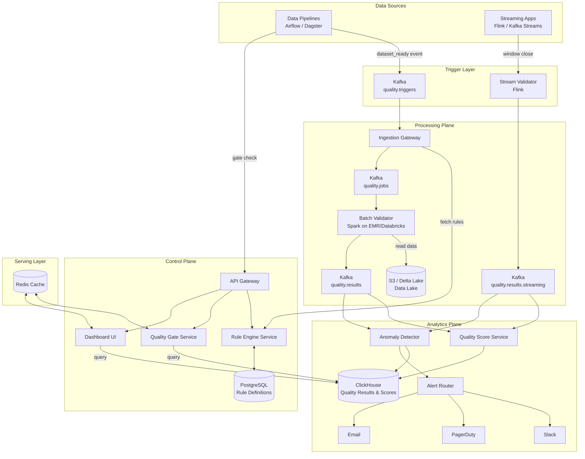

# Data Quality Framework — System Design

---

## Phase 1: Scoping & Clarification

### Problem Restatement

Design a **Data Quality Framework** that continuously monitors, validates, and enforces data quality across a large-scale data platform. The system must detect anomalies, validate schema and business rules, profile datasets, and provide full observability into the health of data flowing through pipelines — for both batch and streaming workloads.

### Functional Requirements

| # | Requirement | Description |
|---|-------------|-------------|
| FR1 | **Schema Validation** | Validate structure, data types, nullability, and format constraints on ingested data |
| FR2 | **Business Rule Validation** | Enforce domain-specific rules (e.g., `order_total > 0`, `email matches regex`, referential integrity) |
| FR3 | **Data Profiling** | Compute column-level statistics — cardinality, null %, distributions, min/max, percentiles |
| FR4 | **Anomaly Detection** | Detect statistical outliers, distribution drift, unexpected volume changes, freshness violations |
| FR5 | **Quality Scoring** | Compute a composite quality score per dataset across dimensions (completeness, accuracy, freshness, consistency) |
| FR6 | **Quality Gates** | Block or warn pipelines on quality failures (configurable soft/hard gates) |
| FR7 | **Self-Service Rule Management** | API + UI for teams to CRUD quality rules per dataset |
| FR8 | **Alerting & Notification** | Route quality failures to Slack, PagerDuty, email based on severity |
| FR9 | **Lineage Integration** | Trace quality failures upstream to the originating source/pipeline |
| FR10 | **Audit Trail** | Immutable log of all quality check results for compliance |

### Non-Functional Requirements

| Dimension | Target |
|-----------|--------|
| **Latency** | Batch checks complete within **5 minutes** of pipeline completion; streaming checks within **10 seconds** |
| **Throughput** | Support **10,000+ datasets**, **100+ TB/day**, **500+ pipelines** |
| **Availability** | **99.9%** for quality gate API (pipeline critical path); **99.5%** for dashboard |
| **Consistency** | **Strong** for rule definitions (reads-after-writes); **Eventual** for quality metrics and scores |
| **Durability** | All quality results retained for **1 year** (hot 7d → warm 90d → cold archive) |

### Assumptions (Clarifying Questions Resolved)

| Question | Assumed Answer |
|----------|----------------|
| Read-heavy or write-heavy? | **Write-heavy** for metrics ingestion; **read-heavy** for dashboards |
| Batch vs. streaming? | **Both** — batch is primary, streaming is growing |
| Should quality gates block pipelines? | **Configurable** — hard gate (block) vs. soft gate (warn + continue) |
| Cloud provider? | **AWS-primary**, but design is cloud-agnostic |
| Who owns rules? | **Decentralized** — each data team owns rules for their datasets (data mesh aligned) |

---

## Phase 2: High-Level Design & Architecture

### Back-of-Envelope Math

#### Why "3 partitions/day" and what does "partition" mean here?

The term **partition** in this estimate is not limited to date partitions. In real-world data lakes, datasets are partitioned by a variety of keys:

| Partition Type | Example | Partitions/day |
|----------------|---------|----------------|
| **Date/time** | `dt=2026-02-09` | 1 (daily), 24 (hourly) |
| **Geography** | `country=US`, `country=IN`, `state=CA` | 50-200+ (countries), 30-50 (states) |
| **Business unit** | `region=APAC`, `channel=web` | 5-20 |
| **Composite** | `country=US/dt=2026-02-09` | product of cardinalities |

The **"3 partitions/day avg"** is a blended estimate for *the number of distinct partitions that get written/updated per dataset per day*:
- ~65% of datasets are daily, single-partition (date only) → 1 partition/day
- ~25% produce 2-4 partitions/day (late-arriving data, backfills, small geo/region splits)
- ~10% are hourly or high-cardinality geo-partitioned → 10-24+ partitions/day
- Blended: `(0.65 × 1) + (0.25 × 3) + (0.10 × 15) ≈ 2.9 ≈ 3`

For a platform with many geography-partitioned datasets (e.g., 200 countries), this number would be **much higher**. In that case, not every partition may be checked on every run — you'd apply **sampling** or **tiered quality checks** (check top-10 countries exhaustively, sample the rest).

#### Why per-partition quality checks matter

Running quality checks and data profiles **per partition** rather than on the full dataset is critical for several reasons:

| Reason | Explanation |
|--------|-------------|
| **Localized failure detection** | A dataset-level aggregate can mask partition-level failures. Example: `country=JP` has 100% nulls in `email`, but it's only 2% of global rows — a dataset-wide null % check would pass. Per-partition check catches it immediately. |
| **Root cause isolation** | When a quality check fails, knowing *which partition* failed tells you exactly where to look. "Dataset X failed" is useless. "`country=BR` partition for `2026-02-09` failed the volume check" is actionable — you know the Brazil pipeline broke. |
| **Incremental validation** | Most pipelines only write 1-2 partitions per run. Checking the entire dataset (terabytes) every time is wasteful. Per-partition validation means you only scan **what changed** — orders of magnitude cheaper in Spark compute. |
| **Drift detection per segment** | Data distributions vary by partition. `country=US` might have avg `order_value = $85`, while `country=IN` has `$12`. A global anomaly detector would need to model all segments together (noisy). Per-partition anomaly detection captures segment-specific baselines and catches drift within each. |
| **SLA attribution** | Different partitions may have different SLAs. A US-market dataset might have a 1-hour freshness SLA while LATAM is 4 hours. Per-partition quality scoring enables per-segment SLA tracking. |
| **Pipeline debugging** | Many pipelines process partitions independently (e.g., one Airflow task per country). A per-partition quality failure maps 1:1 to a specific pipeline task, making debugging trivial. |
| **Backfill safety** | When reprocessing historical partitions, per-partition checks validate only the backfilled partitions without re-scanning untouched data. This also avoids false alerts on partitions that weren't reprocessed. |

**Example — why global checks fail:**

```
Dataset: orders (partitioned by country)

Global stats:
  total_rows: 10,000,000    null_email_pct: 3%   ✅ Passes (threshold: <5%)

Per-partition stats:
  country=US:  rows: 5,000,000   null_email_pct: 0.1%  ✅
  country=UK:  rows: 2,000,000   null_email_pct: 0.5%  ✅
  country=JP:  rows:   500,000   null_email_pct: 45%   ❌  ← Japan pipeline is broken!
  country=DE:  rows: 1,500,000   null_email_pct: 0.2%  ✅
  country=BR:  rows: 1,000,000   null_email_pct: 0.3%  ✅

The Japan problem is invisible at the global level because it's diluted by other countries.
```

```
Datasets:           10,000
Avg rules/dataset:  20
Total rules:        200,000

Batch checks/day:
  - 10,000 datasets × 3 partitions/day avg = 30,000 check runs/day
  - Each run evaluates ~20 rules = 600,000 rule evaluations/day
  - Peak QPS (4-hour batch window): 600K / (4 × 3600) ≈ 42 QPS

Streaming checks:
  - 500 streaming datasets × 1 check/10s = 50 checks/sec sustained

Quality results storage/year:
  - 600K batch results/day × 365 = 219M rows/year
  - 50 streaming/sec × 86400 × 365 = 1.58B rows/year
  - Total: ~1.8B rows/year
  - Avg row size: ~500 bytes → ~900 GB/year (uncompressed)
  - With columnar compression (10:1): ~90 GB/year

Data profile storage/year:
  - 10,000 datasets × 50 columns avg × 3 partitions/day × 365 = 547M rows/year
  - ~200 bytes/row → ~110 GB/year uncompressed → ~11 GB compressed

Bandwidth:
  - Quality check requests: 92 QPS × 2 KB = ~184 KB/s (negligible)
  - Spark reading source data for validation: dominated by data lake I/O (100+ TB/day)
```

### High-Level Components

| Component | Responsibility |
|-----------|---------------|
| **API Gateway** | Entry point for rule management, quality queries, quality gate decisions |
| **Rule Engine Service** | CRUD for quality rules, rule versioning, rule compilation |
| **Ingestion Gateway** | Receives quality check triggers (pipeline webhooks, scheduler, streaming) |
| **Batch Validator (Spark)** | Executes quality rules on batch datasets in the data lake |
| **Stream Validator (Flink)** | Executes quality rules on streaming data in real-time |
| **Profiler Service (Spark)** | Computes column-level statistics and distributions |
| **Anomaly Detector** | Statistical + ML-based anomaly detection on quality metrics time series |
| **Quality Score Service** | Computes composite scores across quality dimensions |
| **Quality Gate Service** | Synchronous API for pipeline go/no-go decisions |
| **Alert Router** | Routes quality failures to appropriate channels based on severity + ownership |
| **Metadata Store** | Persists rule definitions, quality results, profiles, scores |
| **Dashboard UI** | Self-service portal for rule management, quality observability, trends |
| **Kafka** | Decouples ingestion from processing, buffers results |

### Data Flow — Happy Path (Batch)

```
1. Pipeline completes writing to Data Lake (S3/Delta Lake)
2. Pipeline emits a "dataset_ready" event to Kafka topic `quality.triggers`
3. Ingestion Gateway consumes the trigger, fetches applicable rules from Rule Engine
4. Ingestion Gateway publishes a "quality_check_job" to Kafka topic `quality.jobs`
5. Batch Validator (Spark) picks up the job:
   a. Reads the dataset partition from S3
   b. Runs schema validation rules
   c. Runs business logic rules (SQL expressions)
   d. Runs profiling (column stats)
   e. Publishes results to Kafka topic `quality.results`
6. Quality Score Service consumes results → computes composite score → writes to Metadata Store
7. Anomaly Detector evaluates metrics against historical baseline → flags anomalies
8. Alert Router checks severity:
   - CRITICAL → PagerDuty + Slack
   - WARNING → Slack
   - INFO → Dashboard only
9. Quality Gate Service (if pipeline is waiting):
   - Queries latest results for the dataset + partition
   - Returns PASS / FAIL / WARN to the calling pipeline
10. Dashboard reflects updated quality status in near real-time
```

### Data Flow — Happy Path (Streaming)

```
1. Stream processor (e.g., Flink app) windows data every N seconds
2. At window close, sends micro-batch to Stream Validator (co-located Flink job)
3. Stream Validator applies lightweight rules (null checks, range checks, format checks)
4. Results emitted to Kafka topic `quality.results.streaming`
5. Anomaly Detector runs real-time detection (sliding window statistics)
6. Quality Score Service updates streaming dataset score
7. Alert Router fires if thresholds breached
```

### Architecture Diagram




---

## Phase 3: Deep Dive — Data & Storage

### Data Model

#### `rules` (PostgreSQL)

```sql
CREATE TABLE rules (
    rule_id         UUID PRIMARY KEY DEFAULT gen_random_uuid(),
    dataset_id      VARCHAR(255) NOT NULL,       -- e.g., "catalog.schema.table"
    rule_name       VARCHAR(255) NOT NULL,
    rule_type       VARCHAR(50) NOT NULL,         -- 'schema', 'null_check', 'range', 'regex',
                                                  -- 'custom_sql', 'freshness', 'volume', 'referential'
    rule_definition JSONB NOT NULL,               -- type-specific config (see below)
    severity        VARCHAR(20) DEFAULT 'WARNING',-- 'CRITICAL', 'WARNING', 'INFO'
    is_blocking     BOOLEAN DEFAULT FALSE,        -- hard gate vs soft gate
    dimension       VARCHAR(50),                  -- 'completeness', 'accuracy', 'freshness', 'consistency'
    owner_team      VARCHAR(100),
    tags            TEXT[],
    version         INTEGER DEFAULT 1,
    is_active       BOOLEAN DEFAULT TRUE,
    created_by      VARCHAR(100),
    created_at      TIMESTAMPTZ DEFAULT now(),
    updated_at      TIMESTAMPTZ DEFAULT now(),

    UNIQUE(dataset_id, rule_name, version)
);

CREATE INDEX idx_rules_dataset ON rules(dataset_id) WHERE is_active = TRUE;
```

**`rule_definition` JSONB examples:**

```json
// Schema check
{ "column": "email", "expected_type": "STRING", "nullable": false }

// Range check
{ "column": "age", "min": 0, "max": 150 }

// Custom SQL
{ "sql": "SELECT COUNT(*) FROM {dataset} WHERE order_total < 0", "threshold": 0 }

// Freshness
{ "max_delay_minutes": 60, "timestamp_column": "event_time" }

// Volume
{ "min_row_count": 1000, "max_row_count": 10000000 }

// Referential integrity
{ "column": "user_id", "reference_dataset": "catalog.core.users", "reference_column": "id" }
```

#### `quality_results` (ClickHouse)

```sql
CREATE TABLE quality_results (
    result_id       UUID,
    rule_id         UUID,
    dataset_id      LowCardinality(String),
    partition_value String,              -- e.g., "2026-02-09"
    pipeline_run_id String,
    rule_type       LowCardinality(String),
    severity        LowCardinality(String),
    dimension       LowCardinality(String),
    status          Enum8('PASS' = 1, 'FAIL' = 2, 'WARN' = 3, 'ERROR' = 4),
    metric_value    Float64,             -- actual measured value
    threshold_value Float64,             -- expected threshold
    rows_scanned    UInt64,
    rows_failed     UInt64,
    details         String,              -- JSON with additional context
    execution_ms    UInt32,
    executed_at     DateTime64(3),

    INDEX idx_status status TYPE set(4) GRANULARITY 1
)
ENGINE = MergeTree()
PARTITION BY toYYYYMM(executed_at)
ORDER BY (dataset_id, executed_at, rule_id)
TTL executed_at + INTERVAL 90 DAY TO VOLUME 'warm',
    executed_at + INTERVAL 365 DAY DELETE
SETTINGS index_granularity = 8192;
```

#### `data_profiles` (ClickHouse)

```sql
CREATE TABLE data_profiles (
    profile_id      UUID,
    dataset_id      LowCardinality(String),
    column_name     String,
    partition_value String,
    row_count       UInt64,
    null_count      UInt64,
    null_pct        Float32,
    distinct_count  UInt64,
    distinct_pct    Float32,
    min_value       String,
    max_value       String,
    mean_value      Float64,
    stddev_value    Float64,
    p50             Float64,
    p95             Float64,
    p99             Float64,
    histogram       String,              -- JSON bucketed histogram
    top_values      String,              -- JSON top-N frequent values
    profiled_at     DateTime64(3)
)
ENGINE = MergeTree()
PARTITION BY toYYYYMM(profiled_at)
ORDER BY (dataset_id, column_name, profiled_at)
TTL profiled_at + INTERVAL 365 DAY DELETE;
```

#### `quality_scores` (ClickHouse)

```sql
CREATE TABLE quality_scores (
    dataset_id          LowCardinality(String),
    partition_value     String,
    overall_score       Float32,         -- 0.0 to 1.0
    completeness_score  Float32,
    accuracy_score      Float32,
    freshness_score     Float32,
    consistency_score   Float32,
    total_rules         UInt16,
    passed_rules        UInt16,
    failed_rules        UInt16,
    warned_rules        UInt16,
    scored_at           DateTime64(3)
)
ENGINE = ReplacingMergeTree(scored_at)
ORDER BY (dataset_id, partition_value);
```

### Storage Strategy

| Data | Store | Justification |
|------|-------|---------------|
| Rule definitions | **PostgreSQL** (RDS) | Strong consistency, JSONB queries, ACID for rule versioning |
| Quality results | **ClickHouse** | Append-heavy time-series writes, fast analytical aggregations for dashboards |
| Data profiles | **ClickHouse** | Same pattern as quality results — time-series, columnar queries |
| Quality scores | **ClickHouse** | `ReplacingMergeTree` — latest score per dataset wins |
| Event bus | **Kafka (MSK)** | Decoupling, backpressure, replayability |
| Cache | **Redis (ElastiCache)** | Hot quality scores, dashboard query cache, quality gate latency |
| Source data | **S3 / Delta Lake** | Where the actual data lives — validators read from here |
| Archived results | **S3 (Parquet)** | Cold storage for compliance; ClickHouse TTL auto-exports |

### Partitioning & Sharding

| Store | Partition Strategy | Rationale |
|-------|-------------------|-----------|
| ClickHouse quality_results | `toYYYYMM(executed_at)` | Queries are time-bounded; old partitions auto-archived |
| Kafka quality.triggers | By `dataset_id` hash | Ensures ordering per dataset |
| Kafka quality.results | By `dataset_id` hash | Consumer can aggregate per-dataset |
| Redis | Key prefix `dq:{dataset_id}` | Natural key space; cluster mode shards automatically |

### Caching Strategy

```
┌─────────────┐     Cache Miss      ┌──────────────┐
│  Dashboard   │ ──────────────────► │  ClickHouse  │
│  / Gate API  │                     │              │
│              │ ◄────────────────── │              │
└──────┬───────┘    Query Result     └──────────────┘
       │
       │ Cache Hit (< 60s TTL)
       ▼
┌─────────────┐
│    Redis     │
│  Look-Aside  │
└─────────────┘
```

- **Pattern**: Look-aside (lazy loading)
- **TTL**: 60 seconds for quality scores (acceptable staleness for dashboards)
- **Quality Gate**: 5-second TTL (tighter freshness for pipeline decisions)
- **Invalidation**: On new results arrival, publish cache invalidation event via Kafka

---

## Phase 4: Trade-offs & Justification

### Batch Validator: Apache Spark

| | |
|---|---|
| **Why Spark?** | Native integration with S3/Delta/Parquet/Iceberg. Handles TB-scale datasets. Distributed execution. Mature ecosystem (Great Expectations, Deequ run on Spark). |
| **Why not Pandas/Dask?** | Single-node Pandas can't handle TB-scale. Dask lacks the ecosystem maturity and data lake integrations. |
| **Why not dbt tests?** | dbt tests are SQL-only and warehouse-bound. Our framework must validate data lake files pre-warehouse. dbt tests are complementary, not a replacement. |
| **Trade-off** | Spark has cold-start latency (30-60s for cluster spin-up). Mitigated by persistent EMR clusters during batch windows or Databricks serverless. |

### Stream Validator: Apache Flink

| | |
|---|---|
| **Why Flink?** | True event-time processing, exactly-once semantics, native windowing, low latency (~seconds). |
| **Why not Spark Structured Streaming?** | Higher micro-batch latency (seconds vs. Flink's milliseconds). Flink's watermark handling is more mature for event-time processing. |
| **Why not in-app validation?** | Centralizing quality logic avoids duplication across 500+ streaming apps. Teams define rules once; framework enforces everywhere. |
| **Trade-off** | Flink operational complexity is higher. Mitigated by managed Flink (AWS Kinesis Data Analytics / Confluent). Flink is only for teams that need real-time quality — most start with batch. |

### Results Store: ClickHouse

| | |
|---|---|
| **Why ClickHouse?** | Columnar storage with 10:1 compression. Handles 100K+ inserts/sec. Sub-second analytical queries on billions of rows. Perfect for time-series quality metrics. |
| **Why not TimescaleDB?** | TimescaleDB is PostgreSQL-based — better for smaller scale. ClickHouse scales horizontally with sharding and is purpose-built for analytical workloads. |
| **Why not DynamoDB?** | Quality dashboards need aggregations (`AVG(score) GROUP BY dataset, week`). DynamoDB can't do this without full scans or pre-aggregation. |
| **Why not Elasticsearch?** | Heavier resource footprint for the same write throughput. ClickHouse is more cost-effective for structured analytical data. |
| **Trade-off** | ClickHouse has eventual consistency for reads after writes (MergeTree merges are async). Acceptable — quality dashboards can tolerate seconds of staleness. Quality Gate uses Redis cache with write-through from Kafka consumer. |

### Message Queue: Kafka

| | |
|---|---|
| **Why Kafka?** | Decouples pipeline triggers from quality processing. Handles backpressure during batch storms. **Replayability** — re-run quality checks by resetting consumer offsets. Partitioned by dataset_id for ordered processing. |
| **Why not SQS?** | No replay capability. No ordering guarantees across messages. No consumer group semantics for parallel processing. |
| **Why not RabbitMQ?** | Lower throughput ceiling. No built-in replay. Better suited for task queues, not event streaming. |
| **Trade-off** | Kafka operational overhead. Mitigated by AWS MSK (managed). Kafka tiered storage to S3 after 24h keeps costs manageable. |

### Anomaly Detection: Hybrid Statistical + ML

| | |
|---|---|
| **Why hybrid?** | Statistical methods (Z-score, IQR, moving average) are interpretable and require zero training data — perfect for day 1. ML models (Isolation Forest, Prophet) capture complex seasonality and multi-variate anomalies — added iteratively. |
| **Why not pure ML?** | Cold-start problem: new datasets have no history. Statistical methods work immediately. |
| **Why not pure statistical?** | Can't capture weekly seasonality or multi-dimensional correlations. Miss subtle distribution drift. |
| **Trade-off** | ML models need retraining. Schedule weekly retraining on historical quality metrics. False positives will be higher initially — add feedback loop (user marks false positives → retraining input). |

### Push vs. Pull Model

| Interaction | Model | Justification |
|-------------|-------|---------------|
| Pipeline → Quality Framework | **Push** (event-driven) | Pipeline pushes `dataset_ready` event. Lower latency than polling. Framework doesn't need to know pipeline schedules. |
| Quality Gate check | **Pull** (synchronous API) | Pipeline pulls go/no-go decision. Blocking call with timeout. Quality Gate service must be highly available. |
| Results → Dashboard | **Push** (Kafka → ClickHouse → Redis invalidation) | Near real-time dashboard updates without polling overhead. |
| Alerts | **Push** | Quality failures push to Slack/PagerDuty immediately. No one should poll for alerts. |

### CAP Theorem Application

| Component | Preference | Justification |
|-----------|-----------|---------------|
| Rule Engine (PostgreSQL) | **CP** | Rules must be consistent — a stale rule could miss a critical check. Partition tolerance handled by RDS Multi-AZ failover. |
| Quality Results (ClickHouse) | **AP** | Dashboard can show slightly stale data. Availability is more important — we don't want dashboards to go down during a network partition. |
| Quality Gate (Redis + ClickHouse) | **CP** | If we can't determine quality, the gate should fail-closed (block pipeline) for critical datasets, fail-open for non-critical. Configurable per dataset. |
| Kafka | **AP** | Kafka prioritizes availability and partition tolerance. Messages are durable (replication factor 3). Eventual consistency between brokers is fine. |

---

## Phase 5: Reliability, Scaling & Operations

### Bottlenecks & Mitigations

| Bottleneck | Impact | Mitigation |
|------------|--------|------------|
| **Spark cluster saturation** during 2AM-6AM batch window | Quality checks queue up, SLO breach | Auto-scaling EMR cluster (min 10 → max 100 nodes). Priority queue: CRITICAL-severity datasets processed first. |
| **ClickHouse write storm** when 30K batch results land simultaneously | Write latency spikes, dashboard slowdown | Buffer writes through Kafka consumer with batched inserts (1000 rows/batch). ClickHouse async inserts. |
| **Quality Gate latency** under load | Pipelines blocked waiting for quality decision | Redis cache (5s TTL) for recent results. Pre-compute gate decisions on results arrival (push to Redis). Gate API reads from Redis, falls back to ClickHouse. |
| **Large dataset validation** (single 10TB table) | One Spark job hogs resources | Sampling strategy: validate 1% for statistical rules, full scan for deterministic rules. Incremental validation: only check new/changed partitions. |
| **Rule explosion** (200K rules) | Rule fetch latency, evaluation time | Rule compilation: convert rules to optimized Spark/Flink execution plans. Batch rules per dataset into single Spark job. Cache compiled rules. |

### Failure Handling

| Failure Scenario | Detection | Recovery |
|-----------------|-----------|----------|
| **Spark job crash** | Spark driver reports FAILED status to Kafka | Retry with exponential backoff (max 3 retries). Dead-letter topic `quality.jobs.dlq` for persistent failures. Alert on DLQ depth > 0. |
| **ClickHouse node failure** | Replica health check fails | ReplicatedMergeTree with 3 replicas across AZs. Reads route to healthy replica. ZooKeeper-coordinated failover. |
| **Kafka broker failure** | Under-replicated partitions alert | Replication factor 3, min.insync.replicas = 2. Producers retry on failure. Consumer rebalances automatically. |
| **Quality Gate service crash** | Health check fails, LB removes instance | 3+ instances behind ALB. Fail-open default (pipeline continues) unless dataset is marked `fail_closed`. Stateless service — instant recovery on restart. |
| **Region outage** | Route 53 health check fails | Multi-AZ within region (primary). For DR: async replicate rule definitions to standby region. Quality checks can resume from Kafka offsets. |
| **Bad deployment** (regression in rule evaluation) | Canary deployment detects quality score drop | Blue/green deployment. Canary runs on 5% traffic. Automated rollback if error rate > 1%. Feature flags for new rule types. |

### Edge Cases

| Edge Case | Handling |
|-----------|----------|
| **Pipeline produces 0 rows** (silent failure) | Volume anomaly detection: if `row_count = 0` and `expected > 0`, fire CRITICAL alert. Freshness check also catches this (no new data = stale). |
| **Poison pill message** in Kafka | Schema validation at Ingestion Gateway. Malformed messages routed to DLQ with alerting. Never let bad messages crash consumers. |
| **Clock skew** in distributed checks | Use pipeline-provided watermarks / partition timestamps, not wall clock. Quality results timestamped by the pipeline event time. |
| **Rule definition changes mid-run** | Rules are versioned. Quality check job includes `rule_version` at trigger time. In-flight checks use the version they started with. |
| **Circular dependency** in quality gates | Dataset A's quality depends on Dataset B, and vice versa. Detect cycles in rule graph at rule creation time. Reject circular gate dependencies. |
| **Schema evolution** | Integrate with schema registry. On schema change event, auto-flag affected rules for review. Support backwards-compatible rule migration. |
| **Backfill / reprocessing** | Tag quality check runs as `backfill = true`. Don't fire alerts for backfill runs. Separate backfill results in dashboard. |

### Observability

#### Golden Signals

| Signal | Metrics | Alert Threshold |
|--------|---------|-----------------|
| **Latency** | `quality_check_duration_ms` (p50, p95, p99) by rule_type, dataset | p99 > 5 min (batch), p99 > 10s (streaming) |
| **Traffic** | `quality_checks_per_second`, `rules_evaluated_per_minute`, `datasets_validated_per_hour` | Sudden drop > 50% from baseline |
| **Errors** | `quality_check_errors` (infra failures, not rule failures), `kafka_consumer_errors`, `clickhouse_write_errors` | Error rate > 1% |
| **Saturation** | Spark cluster utilization %, Kafka consumer lag, ClickHouse query queue depth, Redis memory % | Lag > 10K messages, CPU > 80% |

#### SLAs / SLOs

| SLO | Target | Error Budget |
|-----|--------|-------------|
| Batch quality check completion | 99% within 5 min of pipeline completion | 1% (~3 checks/day can be late) |
| Streaming quality check latency | 99.9% within 10 seconds | 0.1% |
| Quality Gate API availability | 99.9% uptime | 8.7 hours/year downtime |
| Quality Gate API latency | p99 < 200ms | — |
| Dashboard data freshness | < 60 seconds | — |
| Alert delivery latency | < 30 seconds from detection | — |

#### Health Checks

| Method | Description | Frequency |
|--------|-------------|-----------|
| **Synthetic transactions** | Inject known-bad data into a canary dataset. Verify the framework detects it, scores it, and alerts. End-to-end validation of the entire pipeline. | Every 5 minutes |
| **Heartbeats** | Every service publishes heartbeat to `/health` endpoint. ALB + Route 53 health checks. | Every 10 seconds |
| **Consumer lag monitoring** | Kafka consumer lag for all consumer groups tracked in Prometheus/Grafana. | Continuous |
| **Freshness monitor** | If no quality results received for a dataset that should have been checked by now (based on pipeline schedule), alert. | Every 15 minutes |
| **Quality-of-quality** | Track false positive rate for anomaly detection. Weekly report to data team for tuning. | Weekly |

---

## Phase 6: Staff-Level Considerations

### Cost Estimation (AWS, at scale)

| Component | Configuration | Monthly Cost |
|-----------|--------------|-------------|
| **EMR (Spark)** | 10-100 node auto-scaling, r5.4xlarge, 50% spot | ~$8,000 |
| **MSK (Kafka)** | 6 brokers, kafka.m5.2xlarge, tiered storage | ~$3,500 |
| **ClickHouse** (self-managed on EC2) | 3-node cluster, r6g.2xlarge, 2TB gp3 each | ~$2,500 |
| **RDS PostgreSQL** | db.r6g.xlarge, Multi-AZ | ~$800 |
| **ElastiCache Redis** | cache.r6g.large, 2 replicas | ~$500 |
| **S3** (cold archive) | ~1 TB/year, Glacier | ~$5 |
| **Networking / data transfer** | Inter-AZ, S3 reads | ~$1,000 |
| **Total** | | **~$16,000–20,000/month** |

**Cost Optimization Levers:**
- Spot instances for Spark (70% savings) — acceptable for non-blocking quality checks
- ClickHouse compression (10:1) keeps storage costs trivial
- Kafka tiered storage: only 24h on broker disk, rest on S3
- Reserved instances for steady-state components (RDS, Redis, Kafka brokers) — 30-40% savings
- Sampling for large datasets reduces Spark compute proportionally

### Security

| Concern | Approach |
|---------|----------|
| **PII in quality results** | Quality checks operate on metadata (counts, aggregates, statistics) — never store raw PII values in quality results. For custom SQL rules, mask PII columns in result details. |
| **Encryption at rest** | S3 SSE-S3, EBS encryption for EC2/ClickHouse, RDS encryption enabled, Redis encryption at rest |
| **Encryption in transit** | TLS 1.2+ everywhere: Kafka (SSL listeners), ClickHouse (HTTPS), Redis (TLS), API Gateway (HTTPS) |
| **Access control** | RBAC on rules: teams can only CRUD rules for datasets they own. IAM roles for service-to-service. API Gateway authentication via OAuth2/JWT. |
| **Audit** | All rule changes logged with `who`, `when`, `what changed`. Immutable audit trail in quality_results (append-only ClickHouse table). |
| **Network** | All components in private VPC. Quality Gate API exposed via internal ALB only (not public). Dashboard accessible via VPN/SSO. |

### Evolution — Scaling 10x

| Dimension | Current (10K datasets) | 10x (100K datasets) | Strategy |
|-----------|----------------------|---------------------|----------|
| **Compute** | Single EMR cluster | Multiple EMR clusters per domain / team | Federated quality checks — each domain runs its own Spark cluster. Central control plane aggregates results. |
| **Storage** | Single ClickHouse cluster | Sharded ClickHouse (by dataset_id hash) | ClickHouse Distributed engine with 3+ shards. Or migrate to ClickHouse Cloud (auto-scaling). |
| **Rule management** | Central rule store | **Quality-as-Code** | Rules defined in Git repos (YAML/JSON), CI/CD pipeline validates + deploys rules. Version control, code review for quality rules. |
| **ML anomaly detection** | Centralized model | Per-dataset models | Train individual models for high-value datasets. Shared model for long-tail datasets. Model registry for versioning. |
| **Architecture** | Centralized framework | **Data Mesh aligned** | Each domain owns their quality rules + validation infrastructure. Central platform provides the framework (SDK, shared services). Quality scores federated into central dashboard. |
| **Data contracts** | Implicit | **Explicit contracts** | Producers publish data contracts (schema + quality SLAs). Consumers subscribe. Framework enforces contracts automatically. Breaking changes require contract negotiation. |
| **Self-healing** | Alert + human action | **Automated remediation** | Auto-quarantine bad data partitions. Auto-trigger pipeline re-runs on transient failures. Auto-adjust anomaly thresholds based on feedback. |

### API Design (Key Endpoints)

```
# Rule Management
POST   /api/v1/rules                    # Create rule
GET    /api/v1/rules?dataset_id=X       # List rules for dataset
PUT    /api/v1/rules/{rule_id}          # Update rule
DELETE /api/v1/rules/{rule_id}          # Soft-delete rule

# Quality Gate (pipeline-facing, latency-critical)
GET    /api/v1/gate/{dataset_id}/{partition}  # Returns { status: PASS|FAIL|WARN, details: [...] }

# Quality Scores
GET    /api/v1/scores/{dataset_id}      # Latest score
GET    /api/v1/scores/{dataset_id}/history?from=&to=  # Score trend

# Data Profiles
GET    /api/v1/profiles/{dataset_id}/{column}  # Latest profile for column
GET    /api/v1/profiles/{dataset_id}            # All column profiles

# Quality Results
GET    /api/v1/results?dataset_id=X&from=&to=&status=FAIL  # Query results

# Trigger (manual)
POST   /api/v1/trigger/{dataset_id}/{partition}  # Manually trigger quality check
```

---

## Summary

The Data Quality Framework is an **event-driven, scalable platform** that validates data quality across both batch and streaming workloads. Key architectural decisions:

1. **Spark + Flink** dual execution engines (batch + stream) connected via Kafka
2. **ClickHouse** as the analytical store for quality metrics (high write throughput, fast aggregations)
3. **PostgreSQL** for strongly consistent rule management
4. **Redis** for low-latency quality gate decisions
5. **Hybrid anomaly detection** (statistical bootstrap → ML evolution)
6. **Configurable quality gates** (hard/soft) enabling teams to adopt incrementally
7. **Data Mesh ready** — decentralized rule ownership, federated execution, central observability

The system handles **100+ TB/day** across **10K+ datasets** at an estimated **$16-20K/month**, with a clear path to **10x scale** through federation, Quality-as-Code, and data contracts.
