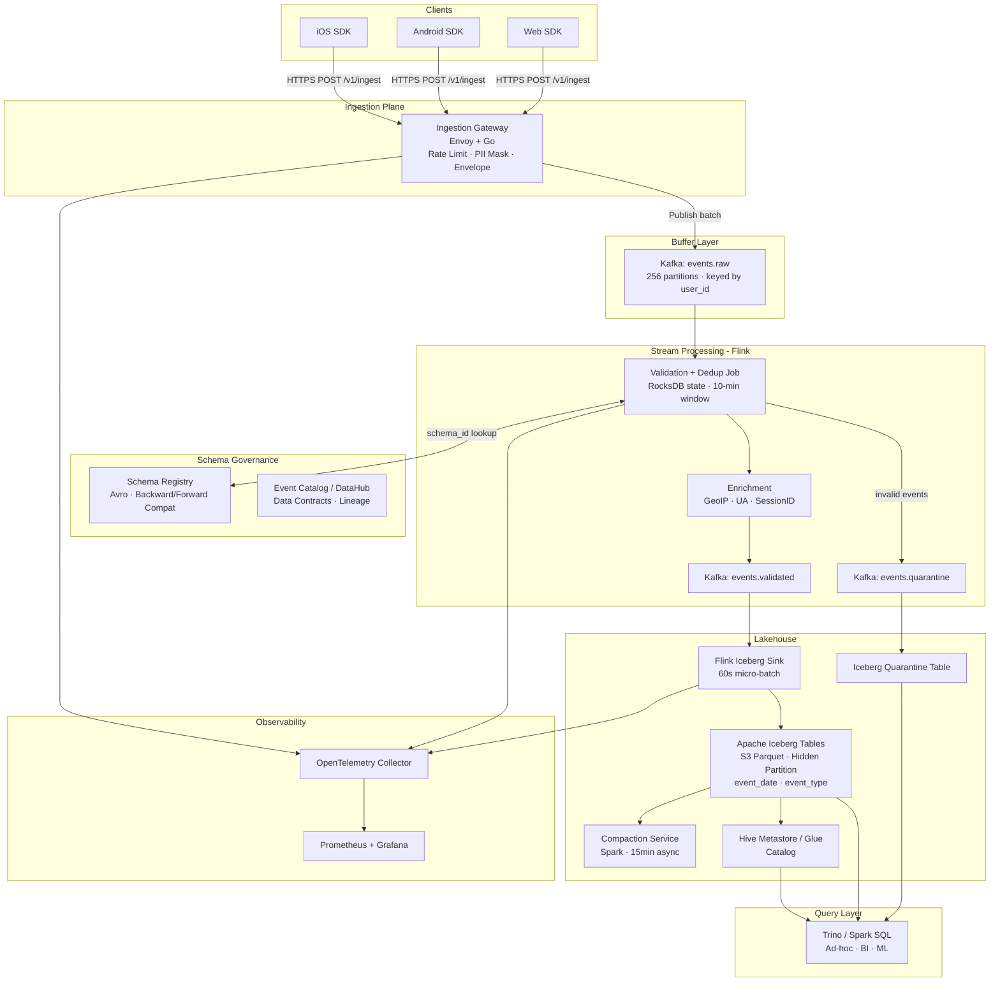

# Unified Event Ingestion and Governance Platform

-----
## Original Problem Statement

**Context**: Your organization operates high-traffic mobile and web applications generating hundreds of billions of monthly events (clicks, impressions, page views). Currently, data is fragmented, schemas are inconsistent across app versions, and "bad data" often crashes downstream analytics. You are tasked with designing a holistic ingestion system that serves as the single entry point for all behavioral data, ensuring it is validated, cataloged, and stored in a high-performance Lakehouse architecture.

1. High-Level Requirements
  Functional Requirements (FR)
  * Multi-Source Ingestion: Support high-throughput data collection from mobile (iOS/Android) and web clients via SDKs or HTTP APIs.
  * Schema Governance & Evolution: Implement a centralized Event Catalog and Schema Registry to manage event definitions and versioning across various app releases.
  * Data Validation & Quarantine: Automatically validate incoming events against registered schemas; invalid events must be routed to a Dead Letter Queue (DLQ) or "Quarantine" zone for inspection without stopping the main pipeline.
  * Open Lakehouse Storage: Persist ingested data into Apache Iceberg tables, supporting ACID transactions, schema evolution, and time-travel queries.
  * Event Enrichment: Support basic at-ingest enrichment (e.g., Geo-IP lookup, user-agent parsing, and session ID generation).

  Non-Functional Requirements (NFR)
  * Scalability: Support peak ingestion of $200,000+$ events per second with the ability to handle $3\times$ bursts during holiday or marketing events.
  * Availability: $99.99\%$ availability for the ingestion endpoints to ensure no user behavioral data is lost.
  * Data Freshness: Achieving "near real-time" availability in the Lakehouse (1–5 minute latency from event trigger to queryable state).
  * Durability & Reliability: Zero data loss after the system acknowledges an event; support for exactly-once or at-least-once delivery semantics.
  * Cost-Efficiency: Optimize storage and compute costs by utilizing tiered storage and file compaction.

2. Architectural Components & Detailing

| Component | Responsibility | Key Consideration |
|---|---|---|
| Ingestion Gateway | Global load balancing; terminating TLS; initial request validation. | Use an "Envelope Pattern" to wrap business payloads with standard metadata (event_id, timestamp, source). |
| Buffer Layer | Distributed message broker (e.g., Kafka or Kinesis) to decouple producers from consumers. | Partitioning strategy (e.g., by user_id) to ensure ordered processing for sessionization. |
| Schema Registry | Central source of truth for Avro/Protobuf/JSON schemas; enforces compatibility rules (Backward/Forward/Full). | Producers must embed a schema_id in the event header to avoid sending bulky schema definitions with every event. |
| Stream Processor | Flink or Spark Structured Streaming for validation, deduplication, and flattening nested JSON. | Stateless processing where possible to allow for seamless horizontal auto-scaling. |
| Lakehouse (Iceberg) | Final persistence layer in S3/GCS using Apache Iceberg format. | Use "Hidden Partitioning" to simplify query development and improve performance without manual partition management. Ideal table storage strategy - per event table vs one big table containing event as partition. What if there are thousands of events or hundred thousand events? |


3. Nuanced Considerations for Staff-Level Roles

  * Managing the "Small File Problem": 
    Streaming data into Iceberg often creates thousands of tiny files, which degrades query performance due to metadata overhead. A Staff-level design must include an Automated Compaction Service that runs asynchronously to merge small files into optimal sizes (e.g., $256-512$ MB) and expire old snapshots to reclaim storage space.

  * Data Contracts as an Organizational Wedge: 
    Instead of merely being a technical component, the Event Catalog should be presented as a "Data Contract" between product engineers (producers) and data scientists (consumers). Staff engineers should advocate for CI/CD integration where a PR to the mobile app is blocked if it introduces a breaking change to an event schema not approved in the registry.

  * Intelligent Handling of Invalid Events: 
    Rather than just dumping bad data, implement "Schema Drift as Data." This involves capturing unexpected fields into a "shadow" or "quarantine" table. This allows engineers to investigate if a new app version is sending unmapped data (intent) or if a bug has been introduced (corruption) without losing the data forever.

  * PII and Compliance at the Edge: 
    For global systems, privacy (GDPR/CCPA) must be handled at the point of ingestion. The system should support Edge-level Masking or Tokenization, where sensitive fields (e.g., IP addresses, emails) are hashed or redacted before they ever hit the persistent storage layer.

  * Cost vs. Freshness Trade-offs: 
    A critical Staff-level insight is knowing when not to use real-time streaming. The design should allow for "Micro-batch" ingestion for non-critical events (e.g., background impressions) while reserving the high-cost streaming paths for critical signals like conversion or fraud detection.

  * Reliability through Idempotency: 
    Ensure the entire pipeline is idempotent. Use globally unique event_ids (UUIDs/ULIDs) generated at the client side to handle retries from mobile apps (which may happen due to spotty network) without duplicating data in the final silver/gold tables.

-----

# Unified Event Ingestion and Governance Platform — Architectural Design

---

## Phase 1: Scoping & Requirements

### Problem Restatement

Design a **single, authoritative ingestion plane** for behavioral events (clicks, impressions, page views) originating from high-traffic mobile and web clients. The system must enforce schema governance at the point of ingestion, quarantine bad data without blocking the hot path, enrich events in-flight, and land validated data into an open Lakehouse (Apache Iceberg on object storage) with near-real-time freshness. It also needs to be the organizational wedge that enforces data contracts between producers and consumers.

---

### Functional Requirements

| # | Requirement |
|---|---|
| FR-1 | Accept events from iOS, Android, and web clients via HTTP/S SDKs and a REST/gRPC Ingestion API |
| FR-2 | Validate every event against a versioned schema in a centralized Schema Registry |
| FR-3 | Route invalid/unrecognized events to a Quarantine zone (DLQ) without blocking the main pipeline |
| FR-4 | Enrich events at ingest: Geo-IP lookup, user-agent parsing, session ID generation |
| FR-5 | Persist validated events into Apache Iceberg tables on object storage (S3/GCS) |
| FR-6 | Support schema evolution with backward/forward/full compatibility enforcement |
| FR-7 | Expose an Event Catalog (Data Contract) for producers and consumers |
| FR-8 | Support PII masking/tokenization before any data hits persistent storage |
| FR-9 | Support deduplication using client-generated event IDs (ULIDs) |
| FR-10 | Provide a micro-batch path for non-critical events and a streaming path for critical signals |

### Non-Functional Requirements

| Attribute | Target |
|---|---|
| **Peak Throughput** | 200,000 events/sec sustained; 600,000 events/sec burst (3×) |
| **Availability** | 99.99% on ingestion endpoints (~52 min downtime/year) |
| **Data Freshness** | 1–5 min end-to-end latency (event trigger → queryable in Iceberg) |
| **Durability** | Zero data loss post-acknowledgment; at-least-once delivery with idempotent dedup |
| **Consistency** | Eventual consistency acceptable; Iceberg ACID for table-level operations |
| **Latency (p99)** | < 200ms for HTTP acknowledgment to client |
| **Retention** | Hot: 7 days (Kafka), Warm: 90 days (Iceberg on S3 Standard), Cold: 7 years (S3 Glacier) |

---

## Phase 2: High-Level Design

### Back-of-Envelope Math

```
Sustained throughput:    200,000 events/sec
Burst throughput:        600,000 events/sec (3×)
Avg event size:          ~1 KB (compressed ~300 bytes with Snappy)

--- Kafka ---
Sustained write BW:      200,000 × 1 KB = ~200 MB/s raw
With 3× replication:     ~600 MB/s disk write on Kafka brokers
Kafka retention (7d):    200 MB/s × 86,400 × 7 ≈ ~120 TB

--- Iceberg (S3) ---
Daily raw volume:        200,000 × 86,400 × 1 KB ≈ ~17 TB/day
Compressed (3:1):        ~5.7 TB/day
Annual storage:          ~2 PB/year (before tiering)
After cold tiering:      ~200 TB hot + 1.8 PB cold (S3 Glacier)

--- Ingestion Gateway ---
200,000 req/s @ p99 200ms → ~40,000 concurrent connections
Horizontal pod autoscaling: 50–200 pods (4 vCPU / 8 GB each)

--- Kafka Partitions ---
Target: 1 MB/s per partition
200 MB/s ÷ 1 MB/s = 200 partitions minimum (use 256 for headroom)
```

### High-Level Components

| Component | Technology | Role |
|---|---|---|
| **Client SDKs** | iOS/Android/Web (custom) | Batch events, generate ULIDs, retry with backoff |
| **Ingestion Gateway** | Envoy + custom Go service | TLS termination, rate limiting, envelope wrapping, PII masking |
| **Buffer Layer** | Apache Kafka (Confluent-compatible) | Durable ordered log; decouples producers from consumers |
| **Schema Registry** | Confluent Schema Registry (OSS) | Avro schema storage, compatibility enforcement, schema_id lookup |
| **Stream Processor** | Apache Flink | Validation, deduplication, enrichment, routing to Iceberg / DLQ |
| **Enrichment Services** | MaxMind GeoIP, ua-parser (sidecar) | Geo-IP, user-agent, session ID generation |
| **Lakehouse** | Apache Iceberg on S3 + Hive Metastore / AWS Glue | ACID storage, time-travel, hidden partitioning |
| **Compaction Service** | Iceberg maintenance jobs (Spark / Flink) | Small file compaction, snapshot expiry |
| **Event Catalog** | Apache Atlas or DataHub | Data contracts, lineage, schema documentation |
| **DLQ / Quarantine** | Kafka topic + Iceberg quarantine table | Invalid/unknown events with full payload preserved |
| **Observability** | Prometheus + Grafana + OpenTelemetry | Golden signals, pipeline health |

---

### Data Flow — Happy Path

```
1. Client SDK batches N events (up to 500 or 5s flush interval)
2. SDK assigns ULID event_id client-side, wraps in Envelope:
   { event_id, schema_id, app_version, timestamp_client, payload }
3. HTTPS POST /v1/ingest → Ingestion Gateway (Envoy sidecar + Go handler)
   a. TLS termination
   b. Rate limiting (token bucket per client_id)
   c. PII masking: IP → hashed, email → tokenized (before any persistence)
   d. Envelope validation: required fields present, schema_id non-null
   e. Publish batch to Kafka topic `events.raw` (async, ack after Kafka leader ack)
   f. Return HTTP 202 Accepted to client
4. Kafka `events.raw` topic (256 partitions, keyed by user_id for ordering)
5. Flink Validation Job (consumes `events.raw`):
   a. Fetch schema from Schema Registry by schema_id (cached in-process)
   b. Deserialize Avro payload, validate against schema
   c. On valid: enrich (GeoIP, UA parse, session ID), emit to `events.validated`
   d. On invalid: emit to `events.quarantine` with error_reason + original payload
   e. Deduplication: stateful operator keyed by event_id, 10-min window (RocksDB state)
6. Flink Iceberg Sink Job (consumes `events.validated`):
   a. Buffers micro-batches (60s or 10k events)
   b. Writes Parquet files to S3 under Iceberg table layout
   c. Commits Iceberg snapshot (atomic, ACID)
   d. Iceberg hidden partition: event_date (day), event_type
7. Compaction Service (async, every 15 min):
   a. Merges small Parquet files → 256–512 MB target
   b. Expires snapshots older than 7 days
   c. Rewrites manifests for query performance
8. Quarantine path:
   a. `events.quarantine` → Iceberg quarantine table (raw JSON preserved)
   b. Alert fired if quarantine rate > 1% of total volume
   c. Engineers inspect via Trino/Spark; "schema drift" events flagged separately
```

### Architecture Diagram



---

## Phase 3: Deep Dive — Data & Storage

### Event Envelope Schema (Avro)

```json
{
  "namespace": "com.company.events",
  "type": "record",
  "name": "EventEnvelope",
  "fields": [
    { "name": "event_id",        "type": "string"  },
    { "name": "schema_id",       "type": "int"     },
    { "name": "event_type",      "type": "string"  },
    { "name": "app_version",     "type": "string"  },
    { "name": "platform",        "type": { "type": "enum", "name": "Platform", "symbols": ["IOS","ANDROID","WEB"] } },
    { "name": "user_id",         "type": ["null","string"], "default": null },
    { "name": "session_id",      "type": ["null","string"], "default": null },
    { "name": "timestamp_client","type": "long"    },
    { "name": "timestamp_server","type": "long"    },
    { "name": "geo_country",     "type": ["null","string"], "default": null },
    { "name": "geo_city",        "type": ["null","string"], "default": null },
    { "name": "ip_hash",         "type": ["null","string"], "default": null },
    { "name": "user_agent_parsed","type": ["null","string"], "default": null },
    { "name": "payload",         "type": "bytes"   }
  ]
}
```

`payload` is the Avro-serialized business event, validated against the schema identified by `schema_id`.

### Iceberg Table Strategy

**The "one big table vs. per-event-type table" decision is the crux here.**

| Approach | Pros | Cons |
|---|---|---|
| **One table per event type** | Simple schema per table, clean partitioning, no wide sparse rows | Table explosion at scale (100k event types = 100k Iceberg tables, Metastore overload) |
| **Single monolithic table** | Simple catalog, easy cross-event queries | Schema becomes a lowest-common-denominator blob; payload as bytes loses query ergonomics |
| **Hybrid: Domain-bucketed tables** ✅ | ~50–200 tables by domain (commerce, engagement, system), payload as typed struct per domain | Manageable catalog size, good query performance, schema evolution per domain |

**Chosen: Hybrid domain-bucketed approach**, inspired by Meta's Scribe + Hive table organization.

```
s3://data-lake/events/
  domain=engagement/        ← clicks, impressions, page_views
  domain=commerce/          ← add_to_cart, purchase, checkout
  domain=system/            ← app_open, crash, perf_metrics
  domain=quarantine/        ← all invalid events, raw JSON
```

Each domain table uses **Iceberg hidden partitioning**:

```sql
CREATE TABLE events.engagement (
  event_id        STRING,
  event_type      STRING,
  user_id         STRING,
  session_id      STRING,
  timestamp_ms    BIGINT,
  event_date      DATE,       -- derived from timestamp_ms
  geo_country     STRING,
  payload         MAP<STRING, STRING>  -- flattened KV for flexibility
)
USING iceberg
PARTITIONED BY (days(event_date), event_type)
TBLPROPERTIES (
  'write.target-file-size-bytes' = '268435456',  -- 256 MB
  'write.parquet.compression-codec' = 'zstd'
);
```

Hidden partitioning on `days(event_date)` means queries like `WHERE event_date = '2026-03-23'` automatically prune without the user knowing the physical layout.

### Partitioning & Sharding

| Layer | Partition Key | Rationale |
|---|---|---|
| Kafka `events.raw` | `user_id` (murmur2 hash) | Preserves per-user ordering for sessionization; avoids hot partitions for anonymous users (use `session_id` fallback) |
| Kafka `events.validated` | `event_type` | Allows per-event-type consumer groups to scale independently |
| Iceberg | `days(event_date)`, `event_type` | Time-range pruning for analytics; event_type pruning for domain queries |
| Flink state (dedup) | `event_id` | Uniform distribution, no hot keys |

### Hot / Warm / Cold Storage Tiering

```
Hot   (0–7 days):   Kafka retention — full replay capability
Warm  (7–90 days):  Iceberg on S3 Standard — queryable via Trino
Cold  (90d–7 years):Iceberg on S3 Glacier Instant Retrieval — compliance archival
                    Triggered by Iceberg lifecycle policy + snapshot expiry
```

Iceberg's snapshot and metadata management means cold data is still queryable via time-travel without restoring files — Glacier Instant Retrieval gives ~ms restore latency for occasional compliance queries.

### Caching

| Cache | Technology | Strategy | TTL |
|---|---|---|---|
| Schema Registry lookups | In-process Caffeine cache (Flink operator) | Look-aside; populate on first miss | 5 min (schemas rarely change) |
| GeoIP database | MaxMind `.mmdb` loaded into JVM heap | In-memory read-only | Refresh daily |
| Iceberg metadata | Flink's `HadoopCatalog` file cache | Metadata JSON cached locally | Invalidated on new snapshot commit |

---

## Phase 4: Trade-offs & Justification

### Kafka vs. Kinesis

**Chose Kafka.**

- **Why Kafka**: Replayability (7-day retention), consumer group flexibility, partition key control, no per-shard throughput caps, open-source (no vendor lock-in). At 200k events/sec, Kinesis would require ~200 shards at $0.015/shard-hr = ~$2,160/month just for shards, before PUT costs.
- **Why not Kinesis**: 1 MB/s per shard hard limit requires careful resharding; no native exactly-once with Flink without significant workarounds; harder to replay from arbitrary offsets.
- **Trade-off**: Kafka requires operational overhead (ZooKeeper/KRaft, broker management). Mitigated by running on Kubernetes with Strimzi operator or using Confluent Cloud.

### Flink vs. Spark Structured Streaming

**Chose Flink.**

- **Why Flink**: True streaming (event-time processing, low-latency watermarks), native Iceberg sink with exactly-once semantics via two-phase commit, RocksDB state backend for large dedup windows, better backpressure handling.
- **Why not Spark Structured Streaming**: Micro-batch by nature (adds latency), stateful dedup at scale requires larger checkpoints, Iceberg sink integration is less mature for sub-minute latency.
- **Trade-off**: Flink has a steeper operational curve. Mitigated by deploying on Kubernetes with Flink Operator.

### Iceberg vs. Delta Lake vs. Hudi

**Chose Apache Iceberg.**

- **Why Iceberg**: Best-in-class hidden partitioning, spec-driven (engine-agnostic — works with Trino, Spark, Flink, DuckDB), time-travel via snapshot IDs, row-level deletes for GDPR compliance, strong community (Netflix, Apple, LinkedIn).
- **Why not Delta Lake**: Tight Spark coupling historically; less engine-agnostic; Delta Sharing is proprietary.
- **Why not Hudi**: Upsert-optimized (good for CDC), but more complex for append-heavy event workloads; MOR tables add read overhead.

### Schema Registry: Avro vs. Protobuf vs. JSON Schema

**Chose Avro** for the hot path, **JSON Schema** for the Event Catalog (human-readable contracts).

- Avro: Compact binary, schema evolution built-in, native Confluent Schema Registry support, schema_id in 5-byte header = minimal per-message overhead.
- Protobuf: Better for cross-language RPC; field numbers make evolution more explicit but adds complexity for analytics teams.
- JSON Schema: Too verbose for 200k/s; no binary encoding.

### CAP Theorem Positioning

- **Ingestion Gateway + Kafka**: AP (Availability + Partition Tolerance). We accept eventual consistency — a duplicate event is far better than a dropped event. Kafka's at-least-once delivery + Flink's idempotent dedup gives us effective exactly-once in the Lakehouse.
- **Iceberg commits**: CP for table metadata (atomic snapshot commits via object storage conditional writes). Readers see the last committed snapshot — strong consistency at the table level.

### Push vs. Pull

- **Clients → Gateway**: Push (HTTP POST). Clients batch and push; server is stateless.
- **Kafka → Flink**: Pull (consumer group). Flink pulls at its own pace, enabling natural backpressure without overwhelming the processor.
- **Flink → Iceberg**: Push (Flink Iceberg sink commits on checkpoint).

---

## Phase 5: Reliability, Scaling & Operations

### Bottlenecks & Single Points of Failure

| Component | Risk | Mitigation |
|---|---|---|
| Ingestion Gateway | Single region failure | Multi-region deployment behind Anycast/GeoDNS; active-active |
| Kafka brokers | Broker failure | RF=3, `min.insync.replicas=2`; auto-leader election via KRaft |
| Schema Registry | Unavailability blocks validation | In-process schema cache (5 min TTL); fail-open mode: route to quarantine if registry unreachable |
| Flink checkpoint storage | Checkpoint failure = reprocessing | Checkpoints to S3 every 60s; incremental checkpoints via RocksDB |
| Iceberg Metastore | Single point for catalog | Use AWS Glue (HA managed) or replicated Hive Metastore with ZooKeeper |
| GeoIP enrichment | Stale DB | Daily refresh via cron; fallback to `geo_country=UNKNOWN` on miss |

### Failure Handling

**Kafka broker crash**: KRaft controller re-elects leader within seconds. Producers retry with exponential backoff (built into Kafka client). No data loss due to RF=3.

**Flink job crash**: Flink restarts from last checkpoint (max 60s reprocessing window). Dedup state in RocksDB is restored from checkpoint. Iceberg two-phase commit ensures no partial writes land in the table.

**Region outage**: Ingestion Gateway is multi-region (active-active). Kafka is replicated cross-region using MirrorMaker 2 for DR. RPO < 60s, RTO < 5 min.

**Bad deployment (schema breaking change)**: CI/CD pipeline runs `schema-compatibility-check` against Schema Registry before merging. Breaking changes require a new `schema_id` (versioned). Old consumers continue reading old schema; new consumers read new schema. Flink handles both via schema_id dispatch.

### Edge Cases

**Traffic spike (3× burst)**: Kafka absorbs the burst (it's a buffer). Ingestion Gateway scales horizontally via HPA (CPU + RPS metrics). Flink scales via reactive mode. Iceberg write throughput scales with Flink parallelism.

**Hot partition (celebrity user)**: `user_id`-keyed Kafka partitions can hot-spot on viral users. Mitigation: composite key `user_id + random_suffix(0-9)` with a shuffle step in Flink to re-aggregate before sessionization.

**Poison pill messages**: Flink's `DeserializationSchema` wraps deserialization in try-catch. Failed deserialization → route to `events.quarantine` with `error_type=DESERIALIZATION_FAILURE`. Dead letter offset is committed so the job doesn't stall.

**Clock skew (mobile clients)**: Client timestamps can be hours off. Use `timestamp_server` (set at Gateway) as the authoritative event time for Iceberg partitioning. `timestamp_client` is preserved for analytics but not used for partitioning.

**Schema drift (new app version sending unknown fields)**: Unknown fields in Avro are dropped by default (backward compatibility). But we capture the raw bytes in a `shadow_payload` column in the quarantine table. This lets engineers detect "intent" (new feature rolling out) vs. "corruption" (bug).

### Observability

**Golden Signals**

| Signal | Metric | Alert Threshold |
|---|---|---|
| **Latency** | `gateway_request_duration_p99` | > 200ms |
| **Latency** | `event_to_iceberg_latency_p95` | > 5 min |
| **Traffic** | `events_ingested_per_sec` | < 50% of expected (drop alert) |
| **Errors** | `validation_failure_rate` | > 1% of total volume |
| **Errors** | `gateway_5xx_rate` | > 0.1% |
| **Saturation** | `kafka_consumer_lag` (Flink) | > 1M messages |
| **Saturation** | `flink_checkpoint_duration_p99` | > 60s |

**SLAs / SLOs**

| SLO | Target |
|---|---|
| Ingestion endpoint availability | 99.99% |
| Event acknowledgment latency p99 | < 200ms |
| Event-to-queryable latency p95 | < 5 min |
| Data loss rate | 0% (post-acknowledgment) |
| Quarantine rate | < 0.5% of total volume (steady state) |

**Health Checks**

- **Synthetic transactions**: A canary producer emits a synthetic event every 30s with a known `event_id`. A monitor queries Iceberg every 5 min to verify the event landed. Alerts if not found within 10 min.
- **Kafka heartbeat**: Kafka consumer group lag monitored via Burrow or Confluent Control Center.
- **Flink health**: Flink REST API `/jobs` polled every 30s; alert on `FAILING` or `RESTARTING` state.

---

## Phase 6: Staff-Level Considerations

### Cost Optimization

| Area | Strategy | Estimated Saving |
|---|---|---|
| Kafka storage | 7-day retention only; compress with Snappy | ~60% vs. uncompressed |
| S3 storage | Zstd compression on Parquet (3:1 ratio); S3 Intelligent-Tiering | ~70% vs. raw JSON on S3 Standard |
| Flink compute | Micro-batch for non-critical events (background impressions) — 60s flush vs. 5s for critical events | ~40% fewer Flink task slots |
| Iceberg compaction | Async compaction reduces small file overhead → fewer S3 LIST/GET calls for Trino queries | ~30% query cost reduction |
| Schema Registry | In-process caching eliminates 99%+ of registry HTTP calls | Negligible infra cost |

**Critical insight**: Reserve the high-cost streaming path (5s flush, stateful Flink operators) for conversion events, fraud signals, and real-time dashboards. Route impression/background events through a 60s micro-batch path. This alone can reduce Flink cluster size by ~40%.

### Security & Privacy

| Concern | Implementation |
|---|---|
| **PII at the edge** | IP address hashed (SHA-256 + salt) at Gateway before Kafka publish. Email tokenized via format-preserving encryption (FPE). Raw PII never hits S3. |
| **Encryption in transit** | TLS 1.3 on all client→gateway and service→service paths |
| **Encryption at rest** | S3 SSE-KMS; Kafka broker disk encryption via LUKS |
| **Access control** | Kafka ACLs per topic; Iceberg table-level ACLs via Apache Ranger or Lake Formation |
| **GDPR right-to-erasure** | `user_id` tokenized at ingest; token→user_id mapping in a separate PII vault. On deletion request: delete mapping in vault + Iceberg row-level delete on `user_id` token. No need to rewrite Parquet files — Iceberg delete files handle this. |
| **Audit logging** | All schema changes in Schema Registry are versioned and audit-logged. Gateway access logs shipped to immutable S3 bucket. |

### Data Contracts as Organizational Wedge

The Event Catalog (DataHub) is not just documentation — it's enforced via CI/CD:

```
Mobile App PR → GitHub Actions:
  1. Extract event schema changes from PR diff
  2. POST to Schema Registry compatibility check API
  3. If INCOMPATIBLE → PR blocked with error: "Breaking change to checkout_completed v3"
  4. If COMPATIBLE → schema auto-registered with new version
  5. DataHub lineage updated automatically
```

This shifts schema governance left, making product engineers accountable for data quality before code ships.

### 10× Evolution Path

| Scale Point | Bottleneck | Solution |
|---|---|---|
| 2M events/sec | Kafka broker I/O | Scale to 2,560 partitions; add brokers; consider Apache Pulsar for tiered storage |
| 10M events/sec | Ingestion Gateway CPU | Move to eBPF-based packet processing at edge; use QUIC instead of TCP for mobile |
| 100k event types | Iceberg Metastore catalog size | Shard Metastore by domain; use Nessie (versioned catalog) for Git-like branching |
| Global multi-region writes | Cross-region Iceberg consistency | Adopt Iceberg REST Catalog with a globally consistent backend (e.g., CockroachDB) |
| ML feature freshness < 1 min | Iceberg commit latency | Add a parallel Redis/Druid path for real-time feature serving; Iceberg remains source of truth |

---

## Summary: Key Design Decisions

| Decision | Choice | One-Line Rationale |
|---|---|---|
| Message broker | Apache Kafka | Replayability, partition control, no throughput caps |
| Stream processor | Apache Flink | True streaming, native Iceberg exactly-once, RocksDB state |
| Table format | Apache Iceberg | Engine-agnostic, hidden partitioning, row-level deletes for GDPR |
| Table organization | Domain-bucketed (~50–200 tables) | Avoids Metastore explosion; better than one-per-event-type at 100k scale |
| Schema format | Avro + Confluent Schema Registry | Binary compact, schema_id header, backward/forward compat enforcement |
| PII handling | Edge masking at Gateway | PII never hits persistent storage |
| Deduplication | ULID event_id + Flink stateful 10-min window | Client-side idempotency + server-side dedup |
| Compaction | Async Spark job every 15 min | Solves small file problem without blocking ingest |
| Micro-batch vs. streaming | Streaming for critical, micro-batch for background | Cost-freshness trade-off; ~40% compute saving |

---

*References: Netflix Iceberg blog (2021), LinkedIn Kafka partitioning strategy, Uber's schema registry design, Meta Scribe architecture, Flink exactly-once Iceberg sink RFC.*
