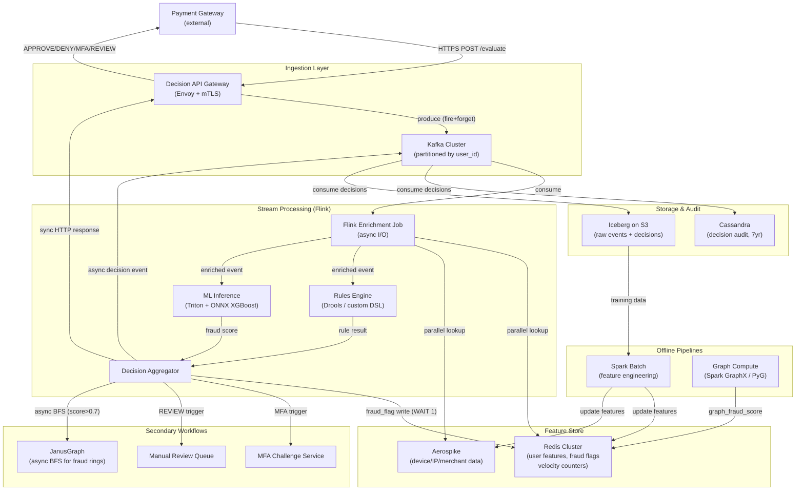
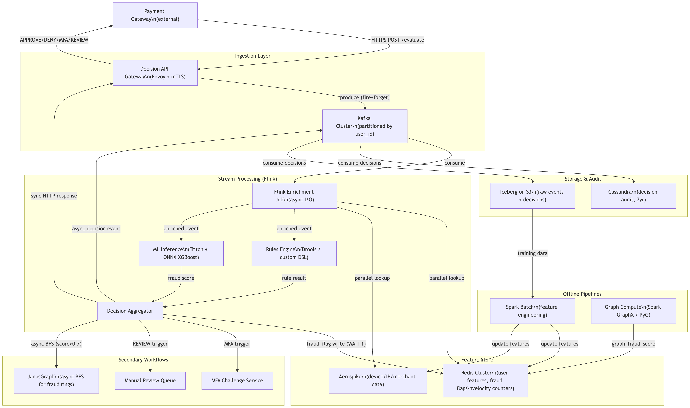

# Real-time Fraud Detection and Decisioning Engine

-----
## Original Problem Statement

Financial systems must evaluate every transaction for potential fraud in the time it takes for a user to tap their card, requiring a seamless fusion of streaming data, historical context, and machine learning.

The functional requirements for a fraud detection engine are twofold: detection and intervention. Detection involves capturing streaming transaction events (e.g., amount, location, merchant) and immediately enriching them with historical features, such as the user's average spend over the last 90 days or their last known location. This enriched data is then passed to a decision engine that applies both business rules (e.g., "deny if amount > \$5000 and user is unverified") and ML models. Intervention requirements dictate that the system must make a "stop/go" decision in real-time, potentially triggering secondary workflows like multi-factor authentication (MFA) or manual review for suspicious cases.

Non-functional requirements are dominated by ultra-low latency and "five-nines" availability. The end-to-end decision must often occur in less than 100 milliseconds to avoid degrading the customer experience. The system must be designed for extreme throughput, handling thousands of transactions per second during peak times, such as Black Friday or Cyber Monday. Consistency is also paramount; if a fraud flag is raised, it must be immediately visible to all subsequent transactions to prevent "burst" fraud attacks.

| **Decision Step** | **Latency Budget** | **Mechanism** |
| --- | --- | --- |
| Ingestion | < 5 ms | High-throughput streaming (e.g., Kafka)  |
| --- | --- | --- |
| Enrichment | < 40 ms | In-memory feature lookup (e.g., Aerospike, Redis)  |
| --- | --- | --- |
| ML Inference | < 30 ms | Optimized model serving (e.g., TensorRT, ONNX)  |
| --- | --- | --- |
| Intervention | < 10 ms | Webhook or API response to payment gateway  |
| --- | --- | --- |

The future outlook for fraud detection involves the use of graph-based features to identify "fraud rings". By representing users, devices, and bank accounts as nodes in a graph, systems can identify suspicious clusters that would be invisible to traditional row-based analysis. A senior engineer must explain how to balance the computational cost of graph traversals with the strict latency requirements of the payment path.

-----

# Real-time Fraud Detection and Decisioning Engine — Architecture Design

---

## Phase 1: Scoping & Requirements

### Problem Restatement

Design a sub-100ms, five-nines-available fraud detection system that ingests streaming payment transactions, enriches them with historical and behavioral features in real-time, evaluates them against both deterministic business rules and ML models, and returns an approve/deny/challenge decision to the payment gateway before the transaction times out. The system must also support future graph-based fraud-ring detection without blocking the hot decision path.

---

### Functional Requirements

| # | Requirement |
|---|-------------|
| FR1 | Ingest streaming transaction events (amount, merchant, location, device, user) |
| FR2 | Enrich each event with pre-computed user features (spend velocity, location history, device trust) |
| FR3 | Evaluate enriched event against deterministic rule engine (e.g., `amount > $5000 AND unverified_user`) |
| FR4 | Score the enriched event through an ML model and produce a fraud probability score |
| FR5 | Aggregate rule + ML score into a single APPROVE / DENY / MFA / REVIEW decision |
| FR6 | Return decision to payment gateway via synchronous API response |
| FR7 | Trigger secondary workflows (MFA challenge, manual review queue) asynchronously |
| FR8 | Propagate fraud flags immediately so subsequent transactions for the same user see the flag |
| FR9 | Emit every decision to an audit log for regulatory compliance and model retraining |
| FR10 | (Future) Incorporate graph-based fraud-ring scores without blocking the critical path |

> **Q:** What are velocity counters in fraud detection context?
>
>> **A:** Velocity counters are sliding-window counts (or sums) of events for a given entity over a recent time window. They answer questions like: *"how many transactions has this user made in the last 10 minutes?"* or *"how much total spend from this card in the last 1 hour?"*
>>
>> They're one of the most powerful fraud signals because fraudsters, once they have a stolen card, tend to transact rapidly before it gets blocked.
>>
>> **Common velocity features used in this system (FR2 — "spend velocity"):**
>>
>> | Counter | Window | Signal |
>> |---|---|---|
>> | `txn_count_per_user` | 1 min, 5 min, 1 hr | Rapid-fire card testing |
>> | `spend_sum_per_user` | 1 hr, 24 hr | Sudden spend spike |
>> | `txn_count_per_card` | 10 min | Card enumeration attack |
>> | `txn_count_per_merchant` | 1 min | Merchant-side bust-out fraud |
>> | `distinct_ip_count_per_user` | 1 hr | Account takeover (multiple locations) |
>> | `failed_auth_count_per_user` | 5 min | Brute-force credential stuffing |
>>
>> **Implementation in this doc (Redis):** Each counter is stored as a Redis key with a TTL equal to the window size. On each transaction, atomically `INCR` the counter and `EXPIRE` it if it doesn't exist. For sliding windows (not fixed tumbling), use a Redis sorted set: members are event timestamps, score is the timestamp — `ZREMRANGEBYSCORE` prunes entries older than `now - window`, `ZCARD` gives the count.
>>
>> ```
>> # Fixed window (cheaper, slightly less accurate at window boundary)
>> INCR  txn_count:user_123:5min
>> EXPIRE txn_count:user_123:5min 300   # only if key is new
>>
>> # Sliding window (exact, more memory)
>> ZADD  txn_ts:user_123 <now_ms> <event_id>
>> ZREMRANGEBYSCORE txn_ts:user_123 0 <now_ms - 300000>
>> ZCARD txn_ts:user_123   # = exact count in last 5 min
>> ```
>>
>> The rule engine (FR3) then fires rules like `txn_count_5min > 10 → DENY` or `spend_sum_1hr > $2000 AND unverified_device → MFA`.

---

### Non-Functional Requirements

| Dimension | Target |
|-----------|--------|
| End-to-end decision latency | p99 < 100 ms |
| Ingestion latency | < 5 ms |
| Feature enrichment latency | < 40 ms |
| ML inference latency | < 30 ms |
| Intervention (callback) latency | < 10 ms |
| Peak throughput | 10,000 TPS (Black Friday / Cyber Monday) |
| Steady-state throughput | 2,000 TPS |
| Availability | 99.999% (~5 min/year downtime) |
| Fraud-flag visibility | Strong consistency (synchronous replication) |
| Historical decisions | Retained 7 years (regulatory) |
| Feature freshness | Behavioral features updated within 60 s of a transaction |

---

### Assumptions

- Mid-to-large fintech scale (not Visa/Mastercard global, which is ~65K TPS). 10K TPS peak is representative of a large regional payment processor.
- ~100 M registered users, each with a feature profile.
- ML model is pre-trained offline; online serving only. Retraining is a separate pipeline out of scope here.
- Payment gateway calls us synchronously and expects a response before its own timeout (~150ms).
- Regulatory jurisdiction requires a 7-year audit log of all decisions.

---

## Phase 2: High-Level Design & Architecture

### Back-of-Envelope Math

```
Peak TPS:              10,000 TPS
Avg TPS:                2,000 TPS
Transaction payload:       ~2 KB
Peak ingest bandwidth: 10,000 × 2 KB = ~20 MB/s

Daily transactions:    2,000 × 86,400 = ~172 M/day
Raw event storage:     172 M × 2 KB   = ~344 GB/day
Decision storage:      172 M × 0.5 KB = ~86 GB/day
Annual raw storage:    344 GB × 365   = ~125 TB/year

User feature profiles: 100 M × 10 KB  = ~1 TB (hot tier, Redis/Aerospike)
Kafka partitions:      100 partitions → 100 TPS/partition (safely within Kafka per-partition limits of ~10K msg/s)

ML Inference:
  10,000 TPS with p99 < 30 ms
  → ~300 inferences in-flight at any moment
  → 2–4 Triton Inference Server pods @ 8-core GPU-enabled nodes handles this comfortably
    (XGBoost ONNX: ~0.3 ms/inference, 10K concurrent → 3 ms p50 with 4 pods)
```

---

### High-Level Components

```
┌────────────────────────────────────────────────────────────────────────┐
│                         PAYMENT GATEWAY (external)                     │
└───────────────────────────────┬────────────────────────────────────────┘
                                │ HTTPS POST /evaluate  (synchronous)
                                ▼
┌───────────────────────────────────────────────────────────────────────┐
│                 Decision API Gateway (Envoy + gRPC)                   │
│             Rate Limiting · TLS Termination · Auth (mTLS)             │
└────────────┬──────────────────────────────────────┬───────────────────┘
             │ async write                           │ sync reply
             ▼                                       ▼
┌────────────────────────┐          ┌─────────────────────────────────┐
│   Kafka Ingest Topic   │          │     Decision Aggregator Service  │
│  (partitioned by       │          │  (combines rule + ML score)      │
│   user_id, 100 parts.) │◄─────────│  returns APPROVE/DENY/MFA/REVIEW │
└───────────┬────────────┘          └─────────────┬──────────┬────────┘
            │                                     │          │
            ▼                                     │          │
┌───────────────────────┐           ┌─────────────┴──┐  ┌────┴──────────────┐
│  Flink Stream Engine  │──────────►│  Rules Engine   │  │  ML Inference     │
│  (enrichment + fan-   │           │  (Drools CEP /  │  │  (Triton Server   │
│   out to rule + ML)   │           │   custom DSL)   │  │   ONNX/XGBoost)   │
└────────┬──────────────┘           └────────────────┘  └───────────────────┘
         │  parallel lookups
         ▼
┌────────────────────────────────────────────────────────────────────────┐
│                         Feature Store                                  │
│  Redis Cluster (hot, <2ms)  │  Aerospike (warm, <10ms)                │
│  - fraud_flag (strong cons) │  - device history, IP reputation         │
│  - velocity counters        │  - merchant stats                        │
│  - graph_fraud_score (pre-  │                                          │
│    computed, TTL=5min)      │                                          │
└────────────────────────────┬───────────────────────────────────────────┘
                             │
         ┌───────────────────┼──────────────────────────┐
         ▼                   ▼                          ▼
┌────────────────┐  ┌──────────────────┐   ┌──────────────────────────┐
│   Cassandra    │  │ Iceberg on S3    │   │  Feature Compute Pipeline │
│  (decision     │  │ (audit log,      │   │  (Flink real-time aggs   │
│   audit, 7yr)  │  │  raw events)     │   │   + Spark batch, writes  │
└────────────────┘  └──────────────────┘   │   back to Redis/Aero)    │
                                           └──────────────────────────┘
                                                        │
                                           ┌────────────┴───────────┐
                                           │  Graph Compute (Spark   │
                                           │  GraphX / PyG, offline  │
                                           │  → score cached Redis)  │
                                           └────────────────────────┘
```

---

### Critical Path Data Flow (Happy Path, target < 100ms)

| Step | Action | Component | Budget |
|------|--------|-----------|--------|
| 1 | Payment gateway POSTs transaction to Decision API Gateway over mTLS | Envoy | < 1 ms |
| 2 | API Gateway writes event to Kafka (fire-and-forget producer, acks=1) and immediately spawns async enrichment | Kafka producer | < 2 ms |
| 3 | Flink consumer picks up event (poll loop, < 1ms lag at 10K TPS) | Flink | < 1 ms |
| 4 | Flink fires 3 parallel lookups: Redis (user features), Aerospike (device/IP), Redis (fraud_flag) | Feature Store | < 15 ms |
| 5 | Enriched payload dispatched in parallel to Rules Engine and ML Inference (gRPC) | Flink fan-out | < 1 ms |
| 6a | Rules Engine evaluates all matching rules, returns DENY/PASS + triggered rule ID | Drools | < 3 ms |
| 6b | Triton Inference Server runs ONNX XGBoost model, returns fraud_score ∈ [0,1] | Triton | < 25 ms |
| 7 | Decision Aggregator combines: if `fraud_flag=true OR rule=DENY OR score > 0.85 → DENY`, `score > 0.6 → MFA`, else `APPROVE` | Aggregator | < 2 ms |
| 8 | If DENY: write `fraud_flag=true` to Redis synchronously (WAIT 1 replica) | Redis | < 5 ms |
| 9 | Decision returned to API Gateway → payment gateway HTTP response | Envoy | < 3 ms |
| 10 | Async: emit decision to Kafka `decisions` topic → Cassandra + Iceberg; trigger MFA/review workflows | Async | out-of-path |
| **Total** | | | **~58 ms** (well under 100ms p99 budget) |

---

## Phase 3: Deep Dive — Data & Storage

### Data Model

**Transaction Event (Kafka message, also stored in Iceberg)**
```json
{
  "transaction_id": "uuid-v4",
  "user_id": "string",
  "amount_cents": 12500,
  "currency": "USD",
  "merchant_id": "string",
  "merchant_category_code": "5411",
  "location": { "lat": 37.7749, "lon": -122.4194 },
  "device_id": "string",
  "device_fingerprint": "sha256-hash",
  "ip_address": "string",
  "card_last4": "1234",
  "payment_method": "CHIP|TAP|CNP",
  "timestamp_ms": 1741381200000
}
```

**User Feature Profile (Redis Hash, key = `feat:user:{user_id}`)**
```json
{
  "avg_spend_7d_cents":   8500,
  "avg_spend_30d_cents":  9200,
  "avg_spend_90d_cents":  9100,
  "txn_count_1h":         3,
  "txn_count_24h":        12,
  "last_location_lat":    37.7749,
  "last_location_lon":   -122.4194,
  "last_txn_ts_ms":       1741381100000,
  "trusted_device_ids":   ["dev-abc", "dev-xyz"],
  "fraud_flag":           false,
  "fraud_flag_ts_ms":     0,
  "graph_fraud_score":    0.04,
  "graph_score_updated_ms": 1741381150000
}
```

**Decision Record (Cassandra table + Iceberg partition)**
```
CREATE TABLE decisions (
  user_id        TEXT,
  decision_date  DATE,          -- partition key (wide row per user per day)
  transaction_id UUID,          -- clustering key (DESC)
  decision       TEXT,          -- APPROVE | DENY | MFA | REVIEW
  ml_score       FLOAT,
  rule_triggered TEXT,
  intervention   TEXT,
  latency_ms     INT,
  created_at     TIMESTAMP,
  PRIMARY KEY ((user_id, decision_date), transaction_id)
) WITH CLUSTERING ORDER BY (transaction_id DESC)
  AND default_time_to_live = 220752000;  -- 7 years in seconds
```

**Device / IP Record (Aerospike, key = `dev:{device_id}`)**
```json
{
  "device_id": "string",
  "first_seen_ms": 1700000000000,
  "trusted_users": ["user-a", "user-b"],
  "ip_reputation_score": 0.1,
  "vpn_flag": false,
  "tor_exit_flag": false,
  "country_iso": "US",
  "last_seen_ms": 1741381100000
}
```

---

### Storage Strategy

#### Feature Store (Hot Path — must be < 40ms total)

| Store | Data | Why | Latency |
|-------|------|-----|---------|
| **Redis Cluster** | User behavioral features, fraud flags, velocity counters | Sub-ms reads; supports atomic INCR for velocity; WAIT for strong consistency on fraud flags | < 2 ms |
| **Aerospike** | Device history, IP reputation, merchant stats | Handles TB-scale data that doesn't fit in Redis budget; SSD-native, <5ms reads | < 8 ms |

Redis Cluster topology: 6 nodes (3 primary + 3 replica), spread across 3 AZs. Replication factor = 2, `min-replicas-to-write = 1`. Fraud flag writes use `WAIT 1 100` (wait for 1 replica ACK within 100ms) to satisfy strong consistency requirement.

#### Decision Audit Store (Cassandra)

- Partition key: `(user_id, decision_date)` — co-locates a user's daily decisions, supports "all decisions for user X on date Y" queries efficiently.
- Replication: RF=3 across 3 AZs, `LOCAL_QUORUM` writes/reads.
- TTL: 7 years per regulatory requirement.
- Hot data (last 90 days) on NVMe nodes; older data compacted and tiered to cheaper storage.

> **Q:** What is the purpose of storing decisions in Cassandra? What user flows could this data serve? All data along with decisions is already stored in Iceberg tables.
>
>> **A:** This is a fair challenge — and the honest answer is that **Cassandra here is serving operational/online query patterns that Iceberg fundamentally cannot serve**, not analytical ones.
>>
>> **Why Iceberg alone is insufficient:**
>> Iceberg on S3 is a batch-oriented analytical store. A query like *"show me all fraud decisions for user X in the last 30 days"* on Iceberg requires: S3 object listing → Parquet file scan → filter. Even with partition pruning, this is 200ms–2s latency. Unacceptable for the following online flows:
>>
>> **User flows Cassandra serves that Iceberg cannot:**
>>
>> | Flow | Query pattern | Latency requirement |
>> |---|---|---|
>> | **Dispute resolution UI** (ops agent looks up why a transaction was denied) | `SELECT * FROM decisions WHERE user_id=X AND decision_date=today` | < 50ms |
>> | **Customer-facing transaction history** (app shows user their flagged transactions) | Same partition key lookup | < 100ms |
>> | **Fraud flag propagation check** (is this user currently flagged?) | Point lookup on `user_id` | < 10ms (could be Redis, but Cassandra is the durable source) |
>> | **Regulatory audit export** (regulator asks for all decisions for user X) | Time-range scan on `(user_id, date)` | Seconds acceptable, but must be operational, not requiring a Spark job |
>> | **Real-time rule feedback** (did this user get denied in the last 5 mins?) | Recent partition lookup | < 20ms |
>>
>> **The core distinction:**
>> - **Iceberg** = source of truth for bulk/analytical access (model retraining, compliance batch exports, BI). Latency: seconds to minutes.
>> - **Cassandra** = operational store for low-latency, key-scoped lookups by `user_id`. Latency: single-digit ms to 50ms.
>>
>> If you remove Cassandra, all of these flows either: (a) hit Iceberg and miss latency SLAs, or (b) get served from Redis — but Redis has no 7-year durability guarantee and is memory-expensive at that retention. Cassandra gives you durable, cheap (disk-based), sub-50ms key-lookup with TTL-based retention in one store.
>>
>> **Legitimate counterargument:** If you're comfortable with Apache Pinot or ClickHouse for operational analytics, you could replace Cassandra with one of those and serve both the analytical and operational query patterns. That's a valid simplification if the team already operates one.

#### Raw Event Archive (Iceberg on S3)

- All raw transaction events and decisions land in Apache Iceberg tables on S3.
- Partitioned by `event_date` and `user_id` bucket (1024 buckets) for efficient time-range + user scans.
- Hot: S3 Standard (last 90 days). Warm: S3-IA (90d–1yr). Cold: S3 Glacier (1yr+).
- Used for: model retraining, regulatory audit export, offline feature engineering.

#### Caching Strategy

- **Feature Store is the cache** — Redis/Aerospike pre-materialized features are the primary read path for the hot path. There is no additional "look-aside" cache on top of these.
- **Feature freshness**: The real-time Flink pipeline updates velocity counters and `last_location` in Redis within 60s of a transaction completing. Graph scores are refreshed every 5 minutes by the batch graph job.
- **Write-through on fraud flags**: When a DENY decision is issued, the fraud flag is written synchronously to Redis before the HTTP response returns. This is the one case where we accept additional latency (~5ms) in exchange for strong consistency.

---

### Partitioning & Sharding

| Layer | Partition Key | Rationale |
|-------|--------------|-----------|
| Kafka ingest topic | `user_id` (murmur2 hash) | All transactions for one user land on same partition → preserves ordering for velocity checks; avoids cross-partition joins in Flink |
| Redis Cluster | `user_id` (CRC16 hash slot) | Even key distribution; hot users stay on a predictable shard |
| Cassandra | `(user_id, decision_date)` | Avoids unbounded partitions; scoped to daily slices |
| Iceberg | `event_date` / `user_id` bucket | Efficient time-range queries and user-level pruning |

**Hot-shard mitigation**: High-velocity users (e.g., a corporate card processing 1000s of transactions/day) could create hot partitions. Mitigation: suffix-shard the Kafka key for these users (`user_id + "_" + (ts_ms % 4)`) and fan-in before velocity aggregation in Flink.

---

## Phase 4: Trade-offs & Justification

### Kafka vs. Pulsar vs. Kinesis

**Chose Kafka**: 10K TPS is well within Kafka's comfort zone (~1M msg/s per cluster). Kafka's partition-based model maps cleanly onto user_id sharding for ordered processing. Consumer group semantics give us free horizontal scaling of Flink workers. Replayability is critical for reprocessing with new model versions.

**Rejected Pulsar**: Better multi-tenancy, but operational complexity is higher (BookKeeper + ZooKeeper + broker). The marginal gains don't justify the ops burden at this scale.

**Rejected Kinesis**: Managed, but shard limit (500 shards × 1MB/s = 500MB/s) is overkill cost-wise; also locks us into AWS. Kafka on Kubernetes gives us cloud portability.

---

### Redis vs. Aerospike (Feature Store split)

**Chose Redis for hot user features**: Sub-ms latency, native data structures (Hash, SortedSet for velocity windows, HyperLogLog for cardinality), and the `WAIT` command for synchronous replication of fraud flags. 1 TB of user features fits comfortably in a 6-node cluster with 256GB RAM each.

**Chose Aerospike for device/IP/merchant data**: This data is device-keyed rather than user-keyed, grows to multiple TBs, and has a more relaxed latency budget (< 10ms). Aerospike's hybrid memory (index in DRAM, data on NVMe SSD) is purpose-built for this: cheaper than all-DRAM Redis at TB scale, still < 5ms reads. Similar to how PayPal uses Aerospike for their account data lookups.

**Rejected a single Postgres/MySQL**: 40ms enrichment budget with 10K concurrent lookups is not achievable with a row-store DB under transactional load.

---

### Flink vs. Spark Streaming vs. custom consumer

**Chose Apache Flink**: True streaming (not micro-batch), sub-second event time processing, exactly-once semantics via checkpointing, and native async I/O operators for parallel feature store lookups without blocking the processing thread. Critical for the 40ms enrichment budget.

**Rejected Spark Structured Streaming**: Micro-batch introduces artificial latency floors (~100ms minimum). Acceptable for analytics, not for real-time fraud scoring.

---

### ML Model: XGBoost/LightGBM over Deep Learning

**Chose XGBoost (ONNX export → Triton)**: Gradient-boosted trees dominate fraud detection benchmarks in production (Stripe, PayPal) for tabular data. ONNX export + Triton gives < 1ms per inference at batch size 1. GPU not required — CPU-optimized ONNX Runtime is fast enough, lowering infra cost.

**Rejected LSTM / Transformer**: Sequential models would give better sequence modeling of user behavior but add 50–200ms inference latency. Out of budget. Sequence features (spend velocity windows) are instead pre-computed offline and injected as scalar inputs to the GBT.

**Rejected real-time neural net serving on GPU**: Unnecessary cost. GBT inference at 10K TPS on 4× 32-core CPU pods is ~$2K/month vs. ~$8K/month for equivalent GPU pods.

---

### Graph Features: Offline-Computed Score vs. Real-Time Traversal

**Fraud-ring detection**: Representing users, devices, and bank accounts as a graph is powerful but graph traversals (BFS/DFS to identify community clusters) are O(V+E) — too slow for the 100ms budget.

**Approach: Pre-computed graph_fraud_score cached in Redis**

1. Offline Spark GraphX / PyG job runs every 5 minutes over the full transaction graph (users ↔ devices ↔ merchants ↔ bank accounts).
2. Computes PageRank-style fraud centrality and community detection (Louvain algorithm) to identify suspicious clusters.
3. Each user node gets a `graph_fraud_score ∈ [0,1]` written to Redis with TTL=10 min.
4. On the critical path, the enrichment step reads this scalar — no graph traversal required. Latency impact: 0 ms (already a Redis Hash field).

**For high-risk transactions** (ML score > 0.7): an async post-decision job submits a real-time BFS query to **JanusGraph** (backed by Cassandra) to validate the cluster. If the async job confirms a fraud ring, it immediately raises a fraud flag for all nodes in the cluster. This is out of the critical decision path.

**Trade-off**: 5-minute staleness on graph scores. Acceptable because fraud rings typically operate over hours to days, not seconds. The ML model and velocity rules handle burst fraud (seconds-scale) independently.

---

### Consistency vs. Availability (CAP)

For fraud flags specifically, we sacrifice some availability for strong consistency (CP in CAP terms): a fraud flag must be immediately visible to all subsequent transactions. We achieve this with Redis `WAIT 1 100` (synchronous replication to at least 1 replica). The ~5ms penalty is worth it to prevent burst fraud.

For feature updates (velocity counters, spend averages), we accept eventual consistency. A 60-second staleness window is acceptable — the ML model provides the primary fraud signal; features give it context.

---

## Phase 5: Reliability, Scaling & Operations

### Bottlenecks & Single Points of Failure

| Component | Risk | Mitigation |
|-----------|------|-----------|
| Redis Cluster | Hot-shard on high-velocity user | Suffix-sharding + read replicas for hot keys |
| Triton Inference | Model loading latency on cold start | Pre-warm pods; Kubernetes readiness gate blocks traffic until warm |
| Flink checkpoint | Recovery lag after crash | Checkpoint every 30s to S3; configure `restart-strategy: fixed-delay, 3 attempts`; Flink HA via ZooKeeper for job manager |
| Kafka | Broker failure mid-partition | RF=3, `min.insync.replicas=2`; Cruise Control for auto partition rebalancing |
| Decision API Gateway | Single region outage | Active-active multi-region; payment gateway sends to regional endpoint with DNS failover (Route53 health checks, 10s TTL) |

---

### Failure Handling

**Node crash (Flink TaskManager)**: Flink automatically reassigns tasks to remaining workers, replaying from last checkpoint (max 30s reprocessing window). Kafka offsets are committed at checkpoint, so no data loss. Exactly-once semantics via Flink's two-phase commit to Kafka output topics.

**Redis primary failure**: Redis Sentinel / Redis Cluster promotes a replica to primary in < 30s. During the failover window, enrichment falls back to Aerospike for available features; fraud flag lookup misses fail-open (APPROVE with REVIEW flag) to avoid blocking all transactions. This is a deliberate availability-over-consistency trade-off for the failover window only.

**ML Inference pod crash**: Circuit breaker (Resilience4j) trips after 5 consecutive failures or 50% error rate over 10s. Traffic falls back to **rules-only mode**: decisions are made purely from deterministic rules. Fraud capture rate drops but the system remains available. Alert fires immediately for on-call.

**Region outage**: Active-active deployment in 2 regions (e.g., us-east-1, us-west-2). Each region has a full stack. Payment gateway routes to healthy region via DNS failover. Redis cross-region replication is asynchronous (CRDT-based via Redis Enterprise Active-Active) — slight inconsistency window during failover is acceptable given the short duration.

> **Q:** What is DNS failover?
>
>> **A:** DNS failover is a mechanism where a DNS record's IP address is automatically switched from an unhealthy endpoint to a healthy one when a health check fails.
>>
>> In this context: the payment gateway has a hostname like `api.payments.example.com`. Normally that resolves to us-east-1's load balancer IP. A health checker pings us-east-1 every few seconds. If it fails N consecutive checks, the DNS record is updated to point to us-west-2's load balancer instead. Clients that re-resolve the hostname now hit the healthy region.
>>
>> **The catch — DNS TTL:** DNS records are cached by clients and resolvers for the duration of the TTL (time-to-live). If TTL is set to 60s, clients may keep hitting the dead region for up to 60s after failover. This is why critical services set DNS TTL to 30–60s (not the default 300s or higher). The "< 30s failover" claim in this doc is only achievable with a low TTL + fast health check interval.
>>
>> **How it compares to alternatives:**
>> - **Anycast routing** (BGP-level): faster (~sub-second), used by CDNs/DNS providers themselves — not typically available to application-layer services
>> - **Load balancer health checks** (e.g., AWS Global Accelerator, Cloudflare): similar outcome but routes at the network edge before DNS resolution — faster and more reliable than DNS TTL-based failover
>>
>> In production fraud/payment systems, AWS Route 53 health checks + low TTL (30s) or Global Accelerator are the standard approaches.

**Bad model deployment**: New models deploy via shadow mode first — running in parallel with the current model, logging scores but not affecting decisions. Comparison dashboard monitors divergence. Full cutover only after 24h of shadow validation. Instant rollback by flipping a feature flag in Redis (`model_version: v1`).

---

### Edge Cases

**Traffic spike (Black Friday)**: Kafka buffers absorb the burst. Flink and Triton pods auto-scale via KEDA (Kubernetes Event-Driven Autoscaling) based on Kafka consumer lag metric. Pre-scale to 2× capacity 1h before known peak events (scheduled HPA override).

**Poison pill message**: Malformed or unparseable Kafka messages are routed to a Dead Letter Topic (`txn.events.dlq`) after 3 retry attempts. Alerts fire; message is available for manual inspection without blocking the main pipeline.

**Velocity attack (burst fraud)**: An attacker runs 50 transactions in 10 seconds. Redis INCR with a sliding window (ZADD + ZCOUNT pattern) detects `txn_count_1h > threshold` and triggers the Rules Engine DENY path. Because all events for a user land on the same Kafka partition and Flink processes them in order, the counter is accurate with no race conditions.

**Clock skew**: Flink processes events by event-time (Kafka message timestamp), not processing-time. Watermarks with a 2-second allowed lateness handle minor clock skew between payment terminal and ingestion. Events arriving more than 5 seconds late are sent to a late-data side output topic for async reprocessing.

---

### Observability

**Golden Signals (monitored in Prometheus + Grafana)**

| Signal | Metric | Alert Threshold |
|--------|--------|-----------------|
| Latency | `decision_latency_ms` (p50/p95/p99) | p99 > 80ms (warn), > 100ms (page) |
| Traffic | `decisions_per_second` | < 500 TPS (warn — possible upstream issue) |
| Errors | `decision_error_rate` | > 0.1% (warn), > 1% (page) |
| Saturation | Kafka consumer lag | > 10K messages (warn), > 100K (page) |
| Feature Store | Redis `cache_hit_rate` | < 95% (warn) |
| ML | `ml_inference_latency_ms` p99 | > 25ms (warn) |
| Fraud Rate | `deny_rate` rolling 5min | ±3σ from baseline (anomaly — could be attack or model drift) |

**SLOs**

| SLO | Target |
|-----|--------|
| Decision p99 latency | < 100 ms over 30-day rolling window |
| Availability (decision endpoint) | 99.999% |
| Feature freshness | 99% of features < 60s stale |
| Fraud flag propagation | 99.99% of flags visible within 100ms of issuance |

**Health Checks**

- **Synthetic transactions**: Every 30s, a canary service submits a known test transaction (with a fixed synthetic user_id) to the live stack and asserts the expected decision (DENY) is returned within 80ms. Failure triggers immediate alert.
- **Heartbeats**: Each Flink job emits a heartbeat metric every 10s. Absence for > 30s fires an alert.
- **Feature store probe**: Health check endpoint in enrichment service does a Redis GET + Aerospike GET every 10s and reports latency. Included in dependency health dashboard.

---

## Phase 6: Staff-Level Considerations

### Cost

| Component | Rough Monthly Cost | Notes |
|-----------|-------------------|-------|
| Kafka (3 broker, r5.2xlarge) | ~$1,500 | Includes cross-AZ data transfer |
| Redis Cluster (6 × r6g.4xlarge, 128GB RAM each) | ~$4,800 | Hot feature store |
| Aerospike (4 × i3en.3xlarge, NVMe) | ~$2,800 | Warm feature + device data |
| Flink (10 × c5.4xlarge) | ~$3,200 | Auto-scales down off-peak |
| Triton Inference (4 × c5.9xlarge) | ~$2,400 | CPU ONNX, no GPU needed |
| Cassandra (6 × r5.4xlarge) | ~$3,600 | Decision audit, 7yr TTL |
| S3 + Iceberg (125 TB/yr) | ~$3,000 | Tiered storage |
| **Total Approx** | **~$21,300/month** | ~$256K/year |

Cost levers: right-size Redis after measuring actual hit rates; use Spot instances for Flink workers (checkpointing makes Flink resilient to spot interruptions); archive Cassandra data to S3-backed cold storage after 1 year.

---

### Security

| Concern | Mechanism |
|---------|-----------|
| Transit encryption | mTLS between all services (Envoy sidecar via Istio service mesh) |
| At-rest encryption | S3 SSE-KMS; Cassandra TDE; Redis `requirepass` + TLS |
| PII handling | `user_id` is tokenized (not the real user identifier) in Kafka and feature store. PII → token mapping held in a separate vaulted service |
| Audit trail | Every decision event (including all inputs) written immutably to Iceberg; signed with SHA-256 hash for tamper evidence |
| Model access | Triton models stored in S3 with IAM role-based access; model weights never exposed via API |
| Rate limiting | Envoy global rate limiter per upstream client (payment gateway) prevents API abuse |

---

### Evolution: 10× Scale (100K TPS)

| Bottleneck at 10× | Solution |
|-------------------|---------|
| Kafka throughput | Increase partitions from 100 → 1000; add brokers. Kafka is linearly scalable. |
| Redis memory (10 TB of features) | Migrate hot features to Redis on Flash (RoF) / Dragonfly — NVMe-backed, 10× cheaper than all-DRAM Redis |
| ML inference (100K TPS × 0.3ms = 30K inferences/s) | Upgrade to GPU inference (Triton + A10G GPUs); batched inference with dynamic batching (batch_size=8, adds ~1ms latency, 8× throughput) |
| Flink processing | Scale Flink to 100 TaskManagers; partition Kafka by user_id hash so each TM handles a shard |
| Graph computation | Move from batch Spark job (5min refresh) to streaming GNN inference (PyG + Flink) for < 30s graph score freshness |
| Multi-region | Move from 2-region active-active to 3-region (us, eu, apac) with regional feature stores seeded from a global compacted Kafka topic |

The foundational architecture (Kafka → Flink → Feature Store → Rules + ML → Decision Aggregator) scales horizontally at each layer without structural changes. The main engineering investment at 10× is the Redis-to-NVMe-Flash migration and the GPU inference upgrade.

---

## Architecture Diagram (Mermaid)






---

*References:*
- *Uber's Michelangelo ML platform — feature store architecture*
- *Stripe's fraud detection blog (2019) — GBT + rules hybrid approach*
- *LinkedIn's real-time feature serving (Venice) — inspiration for Aerospike hybrid store pattern*
- *PayPal's Aerospike case study — TB-scale low-latency lookup*
- *Apache Flink documentation — Async I/O operator for external enrichment*
- *Klarna engineering blog — graph-based fraud ring detection*
