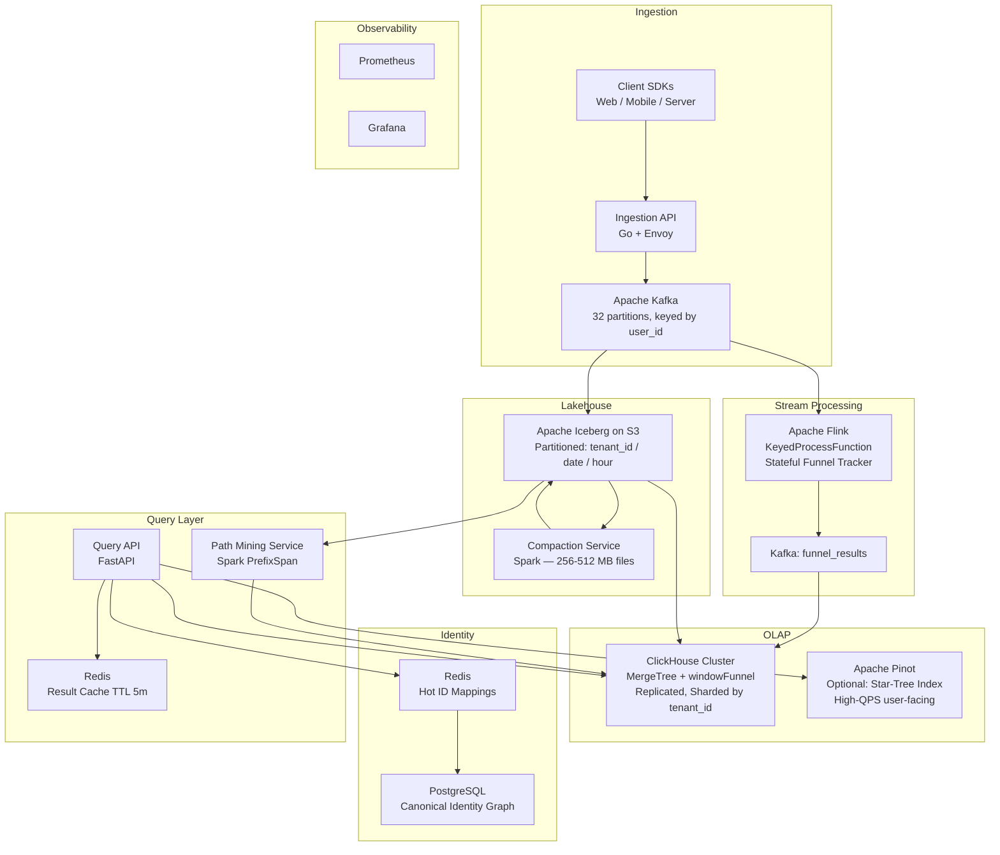

# Behavioral Analytics Engine: Architecting Funnel and Path Analysis for Clickstream Data

----- 

## Orignal Problem Statement

In the modern digital economy, understanding the "how" and "why" of user journeys is more critical than simple metric aggregation. For a Staff or Principal Engineer, the challenge is designing a system that can reconstruct billions of temporal event sequences into coherent funnels and exploratory paths in near real-time. This requires navigating the trade-offs between the flexibility of raw event analysis and the performance constraints of high-cardinality, petabyte-scale datasets.

This problem statement focuses on building a scalable behavioral analytics platform that enables product teams to define complex event sequences and discover unexpected user flows.

## The Core Architectural Challenge: Temporal Sequence Matching at Scale
The fundamental technical hurdle in behavioral analytics is the Temporal Join Problem. Unlike standard OLAP queries that aggregate independent rows, funnel and path analysis require joining sequences of events belonging to the same user over time. At a Principal level, the system must move away from rigid pre-aggregation—which fails when a user wants to analyze a new, ad-hoc sequence—toward a Raw Event Query Model. This requires specialized indexing, user-centric data partitioning, and efficient state management to handle out-of-order events and high-cardinality identity resolution.

### High-Level Requirements

| **Requirement Type** | **Description** |
| --- | --- |
| **Functional** | Ad-hoc Funnel Builder: Support N-step funnels with "Specific Order" (Step A before B) or "Any Order" logic. |
| **Functional** | Conversion Controls: Enable user-defined conversion windows (e.g., 24h, 30 days) and exclusion steps that disqualify users. |
| **Functional** | Path Discovery: Automated discovery of frequent event sequences (Top-N flows) using Sequential Pattern Mining. |
| **Functional** | Serving & Visualization: High-performance API for rendering Sankey/Sunburst diagrams and conversion trend lines. |
| **Non-Functional** | Latency (Batch): P95 query response < 3 seconds for complex funnels over 30 days of data . |
| **Non-Functional** | Scalability: Horizontal scaling for ingestion (100k+ events/sec) and storage (petabytes) . |
| **Non-Functional** | Freshness: Real-time funnel availability within 1-5 minutes of event occurrence (optional requirement). |
| **Non-Functional** | User-Centric Isolation: Multi-tenant resource isolation to prevent "noisy neighbor" queries from impacting cluster stability. |

### Nuanced Considerations for Staff and Principal Engineers

1. The Behavioral OLAP Engine: Pinot vs. ClickHouse
A Principal-level design must evaluate the storage tier based on the query patterns. Apache Pinot is often superior for high-QPS, user-facing analytics via Star-Tree indexing. ClickHouse excels at deep scans and complex analytical joins through vectorized execution and high-efficiency columnar compression. The design should leverage specialized functions like windowFunnel to avoid expensive query-time self-joins.

2. Identity Resolution and "Profile Stitching"
One of the most complex Staff-level challenges is Identity Aliasing. A user may interact anonymously on mobile and later login on web. The system must "stitch" these timelines at query-time without rewriting historical immutable data. This involves maintaining an Identity Graph (e.g., in DynamoDB or FoundationDB) and performing a query-time mapping to merge event streams from multiple aliases.

3. Solving the "Small File Problem" in Lakehouses
Streaming clickstream data into a Lakehouse (Iceberg/Delta) often creates thousands of tiny files, which increases metadata overhead and query latency . A sophisticated design should implement Dynamic Time-Range Files and an asynchronous Compaction Service to merge small fragments into optimal sizes (256-512 MB) based on server upload time rather than just event time .

4. Sequential Pattern Mining for Path Analysis
For path discovery, standard SQL is insufficient. The architecture should support algorithms like PrefixSpan (Prefix-Projected Sequential Pattern Mining). This allows the system to recursively project sequence databases into smaller subsets to identify frequent paths without the exponential "candidate generation" bottleneck of older algorithms .

5. Probabilistic Data Structures for Interactive Exploration
To achieve sub-second latencies on high-cardinality cohorts, the system should utilize Probabilistic Data Structures. HyperLogLog (HLL) should be used for rapid unique visitor estimates, while Roaring Bitmaps or Theta Sketches are required for precise set operations (unions/intersections) during cohort-based funnel analysis .

6. Real-Time Stateful Processing (Additional Requirement)
To support real-time funnels, the design must incorporate a stateful stream processor like Apache Flink. Using the KeyedProcessFunction, the system can partition streams by user_id and maintain a local, fault-tolerant state for each user's current funnel progress, triggering updates the moment a completion event arrives.

-----

# Behavioral Analytics Engine: Funnel & Path Analysis — Architectural Design

---

## Phase 1: Scoping & Requirements

### Problem Restatement

Design a scalable behavioral analytics platform that ingests high-volume clickstream events (100k+ events/sec), stores them in a user-centric, petabyte-scale lakehouse, and serves ad-hoc N-step funnel queries and exploratory path analysis in near real-time (<3s P95). The core challenge is the **Temporal Join Problem**: reconstructing ordered event sequences per user without pre-aggregating into rigid schemas, while handling identity aliasing, out-of-order events, and multi-tenant query isolation.

---

### Functional Requirements

| # | Requirement |
|---|---|
| FR-1 | Ad-hoc N-step funnel builder: "Specific Order" (A → B → C) and "Any Order" modes |
| FR-2 | Conversion window controls (e.g., 24h, 7d, 30d) and exclusion steps |
| FR-3 | Path discovery: Top-N frequent event sequences via Sequential Pattern Mining |
| FR-4 | High-performance API for Sankey/Sunburst diagrams and conversion trend lines |
| FR-5 | Identity stitching: merge anonymous + authenticated timelines at query time |
| FR-6 | Real-time funnel availability within 1–5 minutes of event occurrence (optional) |

### Non-Functional Requirements

| Dimension | Target |
|---|---|
| Latency (batch) | P95 < 3s for complex funnels over 30 days |
| Latency (real-time) | Funnel state updated within 1–5 min of event |
| Throughput (ingestion) | 100k+ events/sec sustained |
| Storage | Petabyte-scale, horizontal |
| Availability | 99.99% for query API |
| Consistency | Eventual (AP system; funnel counts may lag by minutes) |
| Multi-tenancy | Resource isolation — noisy neighbor prevention |

---

## Phase 2: Back-of-Envelope Estimates

**Assumptions:**
- 100k events/sec ingestion peak; ~50k avg
- Average event payload: 500 bytes (compressed ~200 bytes)
- 30-day query window is the most common; 365-day max
- 10k distinct event types; 500M MAU

**Storage:**
```
50k events/sec × 86400 sec/day × 200 bytes = ~864 GB/day (compressed)
~315 TB/year raw compressed
With 2× replication in lakehouse → ~630 TB/year
```

**QPS (Query API):**
```
Assume 5,000 product analysts; avg 10 funnel queries/hour during business hours
= ~14 QPS sustained, ~100 QPS peak
Each query scans ~30 days × 864 GB/day = 25 TB logical scan
→ Must rely on partitioning + columnar pruning to scan <1% of data per query
```

**Kafka throughput:**
```
100k events/sec × 500 bytes = 50 MB/sec → ~180 GB/hr
32 partitions × ~1.5 MB/sec/partition → comfortable headroom
```

---

## Phase 3: High-Level Architecture

### Core Components

| Component | Technology | Role |
|---|---|---|
| Event Ingestion API | Go / Envoy | Stateless HTTP/gRPC endpoint; validates, batches, publishes |
| Message Bus | Apache Kafka | Durable, replayable event stream; partitioned by `user_id` |
| Stream Processor | Apache Flink | Real-time stateful funnel tracking; computes 1–5 min funnel state |
| Lakehouse Writer | Flink → Apache Iceberg on S3 | Micro-batch writes; handles compaction, partitioning |
| Compaction Service | Spark (scheduled) | Merges small files; rewrites into 256–512 MB optimal Parquet files |
| OLAP Engine | ClickHouse (primary) + Apache Pinot (optional) | Batch funnel queries; `windowFunnel` function; columnar scans |
| Identity Graph | Redis (hot) + PostgreSQL (cold) | Maps anonymous IDs → canonical user IDs |
| Query API | Python / FastAPI | Translates funnel DSL → SQL; fans out to ClickHouse; caches results |
| Result Cache | Redis | Caches funnel result sets by query fingerprint (TTL 5 min) |
| Path Mining Service | Spark (PrefixSpan) | Offline sequential pattern mining; writes top-N paths to ClickHouse |
| Metadata Store | PostgreSQL | Funnel definitions, saved queries, tenant configs |
| Observability | Prometheus + Grafana + OpenTelemetry | Golden signals across all services |

---

### Data Flow: Happy Path (Batch Funnel Query)

```
1. User defines funnel: [page_view → add_to_cart → purchase] within 7 days
2. Query API receives request → resolves tenant, validates DSL
3. Identity resolution: fetch canonical_user_id mappings from Redis/Postgres
4. Query API generates ClickHouse SQL using windowFunnel() with conversion window
5. ClickHouse scans Iceberg-backed MergeTree table, pruned by (date, tenant_id) partition
6. ClickHouse returns per-step counts + drop-off rates
7. Query API enriches with cohort metadata, caches result in Redis (TTL 5 min)
8. Response returned to client → rendered as Sankey diagram
```

### Data Flow: Real-Time Funnel (Flink Path)

```
1. Event arrives at Ingestion API → published to Kafka topic `events` (key=user_id)
2. Flink KeyedProcessFunction consumes, keyed by user_id
3. For each active funnel definition (broadcast state), Flink checks if event advances user's funnel state
4. On completion or timeout, Flink emits a FunnelCompletionEvent to Kafka topic `funnel_results`
5. A sink consumer writes aggregated real-time counts to ClickHouse `funnel_realtime` table
6. Query API merges batch + real-time counts for freshness within 1–5 min
```

---

### Architecture Diagram



---

## Phase 4: Deep Dive — Data Model & Storage

### 4.1 Raw Event Schema (Iceberg + ClickHouse)

```sql
-- Iceberg / ClickHouse MergeTree table
CREATE TABLE events (
    event_id        UUID,
    tenant_id       String,           -- partition key (multi-tenant)
    canonical_uid   String,           -- resolved user ID post-identity-stitch
    anonymous_id    String,           -- original device/session ID
    event_name      LowCardinality(String),  -- e.g. 'page_view', 'add_to_cart'
    event_time      DateTime64(3),    -- millisecond precision
    server_time     DateTime64(3),    -- for out-of-order detection
    session_id      String,
    properties      String,           -- JSON blob (sparse attributes)
    platform        LowCardinality(String),  -- web/ios/android
    geo_country     LowCardinality(String),
    date            Date MATERIALIZED toDate(event_time)  -- partition pruning
)
ENGINE = MergeTree()
PARTITION BY (tenant_id, toYYYYMMDD(date))
ORDER BY (tenant_id, canonical_uid, event_time)   -- sort key = temporal join key
SETTINGS index_granularity = 8192;
```

**Why `ORDER BY (tenant_id, canonical_uid, event_time)`**: ClickHouse's MergeTree physically co-locates all events for a user within a partition. The `windowFunnel` function then scans a contiguous block per user — no shuffle, no self-join.

### 4.2 Identity Graph Schema

```sql
-- PostgreSQL (cold store)
CREATE TABLE identity_aliases (
    anonymous_id    TEXT NOT NULL,
    canonical_uid   TEXT NOT NULL,
    tenant_id       TEXT NOT NULL,
    first_seen      TIMESTAMPTZ,
    last_seen       TIMESTAMPTZ,
    PRIMARY KEY (tenant_id, anonymous_id)
);
CREATE INDEX ON identity_aliases (tenant_id, canonical_uid);
```

Redis hot layer: `HSET tenant:{tenant_id}:alias:{anonymous_id} canonical_uid {uid}` — O(1) lookup, TTL 24h.

> **Q:** What does identity graph actually contain? How is this relevant in answering funnel queries?
>
>> **A:** The identity graph is a mapping table: **anonymous_id → canonical_uid**. That's it at its core. Each row says "device/session ID X belongs to the same person as canonical user Y."
>>
>> **Why it exists:** A single user typically generates events under multiple IDs before you can stitch them together:
>> - Pre-login mobile session: `anon_id = device-uuid-abc`
>> - Post-login web session: `anon_id = session-xyz`, resolved to `canonical_uid = user-123`
>> - The `identify()` call (e.g. from Segment/Mixpanel SDK) creates the alias row linking `device-uuid-abc → user-123`
>>
>> **How it's used in funnel queries:**
>>
>> The events table stores `canonical_uid` (resolved at write time if possible, or at query time). The problem is historical events written *before* the identity merge happened still carry the old `anonymous_id`. So at query time:
>>
>> 1. Query API receives funnel request
>> 2. Looks up all `anonymous_id`s that map to the target `canonical_uid`s (or vice versa for cohort filters)
>> 3. Injects the full alias set as an additional filter: `WHERE canonical_uid IN ('user-123', 'device-uuid-abc', 'session-xyz')`
>> 4. ClickHouse scans events for all those IDs — the `ORDER BY (tenant_id, canonical_uid, event_time)` sort key means they're physically adjacent on disk
>> 5. `windowFunnel` then sees the merged, time-ordered event stream as if it were a single user
>>
>> **Why not rewrite historical events on merge?** Immutability. Rewriting petabytes of Iceberg/ClickHouse data every time two IDs are linked is operationally catastrophic. Query-time resolution is a deliberate trade-off: slightly more complex queries, but zero write amplification on identity events.
>>
>> **The schema in this doc** (`identity_aliases`) is the minimal version. A fuller identity graph would also store edge metadata (merge confidence score, merge source like `identify_call` vs `email_match`), and support multi-hop chains (anon-A → anon-B → canonical-C) via a graph traversal or pre-flattened transitive closure table.

### 4.3 Funnel Definition Schema (PostgreSQL)

```sql
CREATE TABLE funnel_definitions (
    funnel_id       UUID PRIMARY KEY DEFAULT gen_random_uuid(),
    tenant_id       TEXT NOT NULL,
    name            TEXT,
    steps           JSONB NOT NULL,   -- [{event_name, filters}, ...]
    order_mode      TEXT CHECK (order_mode IN ('strict', 'any')),
    conversion_window_seconds BIGINT,
    exclusion_steps JSONB,
    created_by      TEXT,
    created_at      TIMESTAMPTZ DEFAULT now()
);
```

### 4.4 Partitioning Strategy

| Layer | Partition Key | Sort/Cluster Key | Rationale |
|---|---|---|---|
| Iceberg (S3) | `tenant_id / date / hour` | — | Prune by tenant + time range; hour-level for compaction granularity |
| ClickHouse | `(tenant_id, toYYYYMMDD(event_time))` | `(tenant_id, canonical_uid, event_time)` | Co-locate user events; enable `windowFunnel` without shuffle |
| Kafka | `user_id` hash | — | Ordered delivery per user to Flink; avoids cross-partition state |

### 4.5 Hot / Warm / Cold Storage

| Tier | Storage | Retention | Access Pattern |
|---|---|---|---|
| Hot (real-time) | ClickHouse in-memory + NVMe | Last 7 days | Sub-second funnel queries |
| Warm (batch) | ClickHouse MergeTree on SSD | 7–90 days | <3s P95 funnel queries |
| Cold (archive) | Iceberg on S3 Standard-IA | 90 days – 2 years | Ad-hoc Spark/Trino queries |
| Glacier | S3 Glacier | 2+ years | Compliance / audit only |

### 4.6 Caching Strategy

- **Result cache (Redis)**: Funnel query results keyed by `SHA256(tenant_id + funnel_definition + time_range + cohort_filters)`. TTL 5 min for real-time, 30 min for historical. Invalidated on funnel definition change.
- **Identity cache (Redis)**: Anonymous → canonical ID mapping. TTL 24h, write-through on new alias events.
- **No query-level row cache in ClickHouse**: ClickHouse's internal mark cache + OS page cache is sufficient; application-level Redis cache handles repeat identical queries.

---

## Phase 5: Funnel Query Execution

### ClickHouse `windowFunnel` Pattern

```sql
-- 3-step funnel: page_view → add_to_cart → purchase within 7 days
SELECT
    level,
    count() AS users
FROM (
    SELECT
        canonical_uid,
        windowFunnel(604800)(  -- 7 days in seconds
            event_time,
            event_name = 'page_view',
            event_name = 'add_to_cart',
            event_name = 'purchase'
        ) AS level
    FROM events
    WHERE
        tenant_id = 'acme'
        AND date BETWEEN '2026-02-21' AND '2026-03-23'
        AND event_name IN ('page_view', 'add_to_cart', 'purchase')
    GROUP BY canonical_uid
)
GROUP BY level
ORDER BY level;
```

`windowFunnel` is O(n) per user — it scans the sorted event stream once, tracking the furthest step reached within the conversion window. No self-join, no subquery explosion.

> **Q:** How would funnel query look like if there were windowFunnel function in Clickhouse?
>
>> **A:** Interpreting this as "if there were **no** `windowFunnel`" — you'd have to implement the temporal sequence match manually using self-joins or window functions. Here's the equivalent for the same 3-step funnel:
>>
>> ```sql
>> -- Step 1: find first page_view per user
>> WITH s1 AS (
>>     SELECT canonical_uid, min(event_time) AS t1
>>     FROM events
>>     WHERE tenant_id = 'acme'
>>       AND date BETWEEN '2026-02-21' AND '2026-03-23'
>>       AND event_name = 'page_view'
>>     GROUP BY canonical_uid
>> ),
>> -- Step 2: first add_to_cart AFTER t1 and within 7 days
>> s2 AS (
>>     SELECT e.canonical_uid, min(e.event_time) AS t2
>>     FROM events e
>>     JOIN s1 ON e.canonical_uid = s1.canonical_uid
>>     WHERE e.tenant_id = 'acme'
>>       AND e.event_name = 'add_to_cart'
>>       AND e.event_time > s1.t1
>>       AND e.event_time <= s1.t1 + INTERVAL 7 DAY
>>     GROUP BY e.canonical_uid
>> ),
>> -- Step 3: first purchase AFTER t2 and within 7 days of t1
>> s3 AS (
>>     SELECT e.canonical_uid, min(e.event_time) AS t3
>>     FROM events e
>>     JOIN s2 ON e.canonical_uid = s2.canonical_uid
>>     JOIN s1 ON e.canonical_uid = s1.canonical_uid
>>     WHERE e.tenant_id = 'acme'
>>       AND e.event_name = 'purchase'
>>       AND e.event_time > s2.t2
>>       AND e.event_time <= s1.t1 + INTERVAL 7 DAY
>>     GROUP BY e.canonical_uid
>> )
>> SELECT
>>     1 AS level, count(DISTINCT s1.canonical_uid) AS users FROM s1
>> UNION ALL
>>     SELECT 2, count(DISTINCT s2.canonical_uid) FROM s2
>> UNION ALL
>>     SELECT 3, count(DISTINCT s3.canonical_uid) FROM s3
>> ORDER BY level;
>> ```
>>
>> **Why this is painful at scale:**
>> - Each CTE step is a **full scan + join** back to the events table — O(n) scans × N steps = O(n²) for an N-step funnel
>> - For N=5 steps over 30 days of data, you're doing 5 separate shuffle joins across potentially billions of rows
>> - No way to short-circuit: even users who dropped at step 1 are re-scanned at step 2 join
>> - Query plan explodes combinatorially for "any order" funnels (need to enumerate all N! orderings)
>>
>> `windowFunnel` avoids all of this by doing a **single sorted scan per user** in C++ inside the aggregation kernel — the sort is already baked into the MergeTree `ORDER BY` key, so it's essentially free.

> **Q:** If batch were to answered for Iceberg tables through Trino or Spark, how would funnel query look like? Assume that there is Clickhouse in the architecture and latency of querying Iceberg tables is acceptable.
>
>> **A:** Without `windowFunnel`, you're back to the self-join CTE pattern — but Trino and Spark both have `MATCH_RECOGNIZE` (Trino) or window functions that make it less ugly. Here's the idiomatic approach for each.
>>
>> **Trino — using `MATCH_RECOGNIZE` (cleanest option):**
>>
>> ```sql
>> SELECT
>>     match_id,
>>     count(DISTINCT CASE WHEN step >= 1 THEN canonical_uid END) AS step1_users,
>>     count(DISTINCT CASE WHEN step >= 2 THEN canonical_uid END) AS step2_users,
>>     count(DISTINCT CASE WHEN step >= 3 THEN canonical_uid END) AS step3_users
>> FROM (
>>     SELECT canonical_uid, step
>>     FROM events
>>     MATCH_RECOGNIZE (
>>         PARTITION BY canonical_uid
>>         ORDER BY event_time
>>         MEASURES
>>             MATCH_NUMBER() AS match_id,
>>             CLASSIFIER() AS step_name,
>>             MATCH_NUMBER() AS step
>>         ALL ROWS PER MATCH
>>         AFTER MATCH SKIP PAST LAST ROW
>>         PATTERN (A B? C?)
>>         DEFINE
>>             A AS event_name = 'page_view',
>>             B AS event_name = 'add_to_cart'
>>                 AND event_time <= A.event_time + INTERVAL '7' DAY,
>>             C AS event_name = 'purchase'
>>                 AND event_time <= A.event_time + INTERVAL '7' DAY
>>     )
>>     WHERE tenant_id = 'acme'
>>       AND date BETWEEN DATE '2026-02-21' AND DATE '2026-03-23'
>> )
>> ```
>>
>> `MATCH_RECOGNIZE` is SQL:2016 standard, supported in Trino natively. It partitions by `canonical_uid`, sorts by `event_time`, and pattern-matches the sequence in one pass per user — semantically equivalent to `windowFunnel`.
>>
>> **Spark SQL — window function approach (more portable):**
>>
>> ```sql
>> WITH ranked AS (
>>     SELECT
>>         canonical_uid,
>>         event_name,
>>         event_time,
>>         -- tag each event with which funnel step it satisfies
>>         CASE event_name
>>             WHEN 'page_view'   THEN 1
>>             WHEN 'add_to_cart' THEN 2
>>             WHEN 'purchase'    THEN 3
>>         END AS funnel_step,
>>         -- first occurrence of each step per user
>>         MIN(event_time) OVER (
>>             PARTITION BY canonical_uid,
>>             CASE event_name
>>                 WHEN 'page_view'   THEN 1
>>                 WHEN 'add_to_cart' THEN 2
>>                 WHEN 'purchase'    THEN 3
>>             END
>>         ) AS first_step_time
>>     FROM events
>>     WHERE tenant_id = 'acme'
>>       AND date BETWEEN '2026-02-21' AND '2026-03-23'
>>       AND event_name IN ('page_view', 'add_to_cart', 'purchase')
>> ),
>> per_user AS (
>>     SELECT
>>         canonical_uid,
>>         MAX(CASE WHEN funnel_step = 1 THEN first_step_time END) AS t1,
>>         MAX(CASE WHEN funnel_step = 2 THEN first_step_time END) AS t2,
>>         MAX(CASE WHEN funnel_step = 3 THEN first_step_time END) AS t3
>>     FROM ranked
>>     GROUP BY canonical_uid
>> ),
>> levels AS (
>>     SELECT
>>         canonical_uid,
>>         CASE
>>             WHEN t1 IS NOT NULL
>>              AND t2 > t1
>>              AND t3 > t2
>>              AND t3 <= t1 + INTERVAL 7 DAYS THEN 3
>>             WHEN t1 IS NOT NULL
>>              AND t2 > t1
>>              AND t2 <= t1 + INTERVAL 7 DAYS THEN 2
>>             WHEN t1 IS NOT NULL THEN 1
>>             ELSE 0
>>         END AS level
>>     FROM per_user
>> )
>> SELECT level, count(*) AS users
>> FROM levels
>> WHERE level > 0
>> GROUP BY level ORDER BY level;
>> ```
>>
>> **Key operational differences vs. ClickHouse `windowFunnel`:**
>>
>> | Dimension | Trino/Spark on Iceberg | ClickHouse `windowFunnel` |
>> |---|---|---|
>> | Latency | 10–60s (shuffle + S3 I/O) | <3s (local MergeTree scan) |
>> | Shuffle cost | High — `PARTITION BY canonical_uid` triggers a full shuffle across workers | Zero — data already sorted by `canonical_uid` on disk |
>> | Iceberg partition pruning | Yes — `date` partition prunes files before scan | Yes — ClickHouse partition key does same |
>> | Conversion window enforcement | Manual (`t2 > t1 AND t2 <= t1 + 7 DAYS`) | Built into `windowFunnel(window_seconds)` |
>> | Multi-step "any order" | Requires N! UNION ALL or MATCH_RECOGNIZE with alternation | `windowFunnel(..., STRICT_ORDER=0)` flag |
>>
>> **When you'd actually use Trino/Spark here:** Historical backfills beyond ClickHouse's warm tier (>90 days in cold Iceberg), or ad-hoc analyst queries that don't need <3s SLA. The Query API can route based on time range: `date < now() - 90d → Trino`, else `→ ClickHouse`.

### Identity Resolution at Query Time

```
1. Query API receives funnel request with tenant_id
2. If cohort filter includes anonymous_id ranges → batch lookup Redis
3. Redis miss → PostgreSQL fallback → write back to Redis
4. Inject resolved canonical_uid set as IN-clause or temp table into ClickHouse query
5. ClickHouse filters on canonical_uid; events from all aliases are co-located by sort key
```

This avoids rewriting historical events when a new alias is discovered — the identity graph is the source of truth, not the event table.

> **Q:** Where is identity resolution used in funnel query? Provide an example. How does the Clickhouse query with windowFunnel function look like with identity resolution at query time?
>
>> **A:** Identity resolution is used **before the ClickHouse query is issued**, in the Query API layer. It's not inside the SQL — it's a pre-processing step that expands the set of IDs to query.
>>
>> **Concrete example:**
>>
>> User `alice@example.com` (canonical_uid = `user-123`) browsed anonymously on mobile before logging in:
>>
>> | anonymous_id | canonical_uid | event |
>> |---|---|---|
>> | `device-abc` | *(not yet known)* | `page_view` at T=0 |
>> | `session-xyz` | `user-123` | `add_to_cart` at T=2h |
>> | `session-xyz` | `user-123` | `purchase` at T=3h |
>>
>> After the `identify()` call, the identity graph records: `device-abc → user-123`.
>>
>> Without identity resolution, the funnel query only sees `user-123`'s events (step 2 + 3) and counts Alice as a **drop-off at step 1**. With resolution, it also pulls `device-abc`'s `page_view` and correctly counts her as a **full conversion**.
>>
>> **Query API pre-processing (pseudocode):**
>>
>> ```python
>> # 1. Start with the canonical_uid from the funnel request
>> canonical_uids = ['user-123']
>>
>> # 2. Reverse-lookup: find all anonymous_ids that map to these canonical_uids
>> # Redis: SMEMBERS tenant:acme:canonical:user-123:aliases
>> alias_ids = redis.smembers('tenant:acme:canonical:user-123:aliases')
>> # → {'device-abc', 'session-xyz'}
>>
>> # 3. Union: all IDs that represent this user
>> all_ids = canonical_uids + list(alias_ids)
>> # → ['user-123', 'device-abc', 'session-xyz']
>> ```
>>
>> **Resulting ClickHouse query with `windowFunnel` + identity resolution:**
>>
>> ```sql
>> SELECT
>>     level,
>>     count() AS users
>> FROM (
>>     SELECT
>>         -- normalize: treat all aliases as the same user
>>         canonical_uid,
>>         windowFunnel(604800)(   -- 7-day conversion window
>>             event_time,
>>             event_name = 'page_view',
>>             event_name = 'add_to_cart',
>>             event_name = 'purchase'
>>         ) AS level
>>     FROM events
>>     WHERE
>>         tenant_id = 'acme'
>>         AND date BETWEEN '2026-02-21' AND '2026-03-23'
>>         AND event_name IN ('page_view', 'add_to_cart', 'purchase')
>>         -- identity resolution injected here by Query API
>>         AND canonical_uid IN ('user-123', 'device-abc', 'session-xyz')
>>     GROUP BY canonical_uid
>> )
>> GROUP BY level
>> ORDER BY level;
>> ```
>>
>> **Why `canonical_uid IN (...)` works:** The events table `ORDER BY (tenant_id, canonical_uid, event_time)` physically co-locates all rows for `device-abc`, `session-xyz`, and `user-123` near each other within the partition. ClickHouse scans each ID's block independently, and `windowFunnel` runs per `canonical_uid` group — so `device-abc`'s `page_view` and `user-123`'s `add_to_cart`/`purchase` are each in their own group.
>>
>> **Wait — that means they're still in separate groups!** Correct. For a single-user funnel (cohort of 1), you'd need to also **rewrite `canonical_uid` to the resolved value at write time** for pre-login events, OR do a final merge step:
>>
>> ```sql
>> -- Option: coalesce all aliases to canonical_uid at scan time
>> SELECT
>>     level,
>>     count() AS users
>> FROM (
>>     SELECT
>>         -- map any alias back to canonical at query time
>>         multiIf(
>>             canonical_uid = 'device-abc', 'user-123',
>>             canonical_uid = 'session-xyz', 'user-123',
>>             canonical_uid
>>         ) AS resolved_uid,
>>         windowFunnel(604800)(
>>             event_time,
>>             event_name = 'page_view',
>>             event_name = 'add_to_cart',
>>             event_name = 'purchase'
>>         ) AS level
>>     FROM events
>>     WHERE
>>         tenant_id = 'acme'
>>         AND date BETWEEN '2026-02-21' AND '2026-03-23'
>>         AND event_name IN ('page_view', 'add_to_cart', 'purchase')
>>         AND canonical_uid IN ('user-123', 'device-abc', 'session-xyz')
>>     GROUP BY resolved_uid   -- ← all aliases now merged into one group
>> )
>> GROUP BY level
>> ORDER BY level;
>> ```
>>
>> The Query API generates the `multiIf(...)` expression dynamically from the alias map. This is the critical step — without it, `windowFunnel` sees fragmented per-alias event streams instead of the merged timeline.

---

## Phase 6: Path Analysis — Sequential Pattern Mining

### PrefixSpan on Spark

Path discovery runs as an **offline Spark job** (hourly or daily), not at query time:

```python
# PySpark pseudocode
from pyspark.ml.fpm import PrefixSpan

# Build sequences per user: list of event_name ordered by event_time
sequences = events_df \
    .filter(col("tenant_id") == tenant_id) \
    .filter(col("date") >= lookback_date) \
    .groupBy("canonical_uid") \
    .agg(sort_array(collect_list(struct("event_time", "event_name"))).alias("seq")) \
    .select(col("seq.event_name").alias("items"))

ps = PrefixSpan(minSupport=0.01, maxPatternLength=5)
frequent_paths = ps.findFrequentSequentialPatterns(sequences)

# Write top-N paths to ClickHouse `path_patterns` table
frequent_paths.orderBy(col("freq").desc()).limit(1000).write \
    .format("jdbc").option("url", clickhouse_url).save()
```

**Why PrefixSpan over Apriori/GSP**: PrefixSpan avoids candidate generation by projecting the sequence database recursively. At petabyte scale, candidate generation is O(2^n) — infeasible. PrefixSpan is O(n × avg_seq_length) in practice.

---

## Phase 7: Real-Time Stateful Funnel (Flink)

### KeyedProcessFunction Design

```
State per user (RocksDB state backend):
  - Map<funnel_id, FunnelProgress>
    - FunnelProgress: { current_step: int, step_timestamps: List<long>, started_at: long }

On each event:
  1. For each active funnel definition (broadcast state):
     a. Check if event_name matches expected next step
     b. Check conversion window: event_time - started_at < window
     c. Check exclusion steps: if event matches exclusion → reset progress
     d. If step matches → advance current_step
     e. If current_step == total_steps → emit FunnelCompletionEvent
  2. Register event-time timer for conversion window expiry → emit partial completion on timeout
```

**State backend**: RocksDB (incremental checkpointing to S3). Avoids JVM heap pressure for 500M user states.

**Funnel definition broadcast**: Product team updates funnel definitions via API → published to Kafka `funnel_config` topic → Flink BroadcastProcessFunction updates all parallel task instances atomically.

---

## Phase 8: Trade-offs & Justification

### ClickHouse vs. Apache Pinot

| Dimension | ClickHouse | Apache Pinot |
|---|---|---|
| Funnel queries (deep scan) | **Winner** — vectorized execution, `windowFunnel`, high compression | Slower on full-table scans |
| High-QPS point lookups | Adequate | **Winner** — Star-Tree index, sub-100ms at 10k QPS |
| Operational complexity | Lower (single binary) | Higher (Helix, ZooKeeper, Controller, Broker, Server) |
| Our choice | **Primary OLAP engine** | Optional: add Pinot only if user-facing dashboards need <100ms at >5k QPS |

**Decision**: Start with ClickHouse only. Pinot is an optional future addition for user-facing real-time leaderboards. Similar to how Mixpanel migrated from MySQL to ClickHouse for funnel performance (Mixpanel Engineering Blog, 2021).

### Kafka vs. Kinesis

Kafka wins on: replayability, partition-level ordering (critical for per-user event ordering to Flink), open-source operational control, and no per-shard cost model that penalizes high-cardinality user keys.

### Iceberg vs. Delta Lake

Both are viable. Chose Iceberg because:
- Vendor-neutral (no Databricks dependency)
- Native Flink sink support (Iceberg Flink sink with exactly-once semantics)
- Hidden partitioning + partition evolution without rewriting data
- Trino/Spark/ClickHouse all read Iceberg natively

### Consistency vs. Availability

This system is **AP** (Availability + Partition Tolerance). Funnel counts may be eventually consistent (lag up to 5 min for real-time path, up to compaction delay ~1h for batch). This is acceptable — product analytics is not a financial ledger. We prioritize query availability over strict consistency.

### Push vs. Pull (Ingestion)

**Push model** (clients push to Ingestion API): chosen because:
- Clients (web/mobile) cannot run a pull-based consumer
- Ingestion API can validate, enrich (server_time, geo), and batch before Kafka publish
- Simpler client SDK surface area

---

## Phase 9: Reliability, Scaling & Operations

### Bottlenecks & Mitigations

| Bottleneck | Mitigation |
|---|---|
| Kafka hot partition (viral user_id) | Consistent hash + salting for extreme outliers; monitor partition lag per key |
| ClickHouse query fan-out on large tenants | Per-tenant query quotas (`max_concurrent_queries`, `max_memory_usage` per user); query queue |
| Small file problem in Iceberg | Compaction Service (Spark) runs every 15 min; merges files < 32 MB into 256–512 MB targets; uses `server_time` as compaction boundary (not event_time) to avoid reprocessing late arrivals |
| Flink state explosion (500M users × N funnels) | RocksDB state backend with TTL eviction (evict inactive user state after conversion_window + 1h); incremental checkpoints to S3 |
| Identity graph lookup latency | Redis cluster (read replicas per AZ); PostgreSQL as fallback; pre-warm cache on tenant login |

### Failure Handling

| Failure | Recovery |
|---|---|
| Ingestion API node crash | Stateless; load balancer routes to healthy instances; Kafka retains events |
| Kafka broker failure | Replication factor 3; ISR ≥ 2; producer `acks=all` |
| Flink job failure | Checkpoint every 30s to S3; restart from last checkpoint; exactly-once via Kafka transactions |
| ClickHouse node failure | ReplicatedMergeTree with 2 replicas per shard; queries route to healthy replica |
| S3 region outage | Cross-region replication for Iceberg metadata + critical partitions; Iceberg snapshots enable point-in-time recovery |
| Bad deployment (poison pill events) | Dead Letter Queue (DLQ) Kafka topic; Flink deserialization errors → DLQ → alert; schema registry (Confluent) enforces Avro schema at producer |

### Edge Cases

- **Out-of-order events**: Flink uses event-time watermarks (5 min allowed lateness). Late events beyond watermark go to a side output → reprocessed as a micro-batch correction to ClickHouse via `ALTER TABLE ... UPDATE` or insert + deduplication.
- **Identity merge after funnel completion**: When two anonymous IDs are merged post-fact, historical funnel counts are not retroactively corrected (too expensive). A nightly reconciliation job re-runs affected funnels for the prior 7 days and updates a `funnel_corrections` table.
- **Exclusion step race**: If exclusion event and funnel step arrive out of order → Flink's event-time processing with watermark handles this correctly; server_time used as tiebreaker.
- **Traffic spike (10× burst)**: Ingestion API auto-scales (Kubernetes HPA on CPU + RPS). Kafka absorbs burst. Flink scales via reactive mode (auto-parallelism). ClickHouse query queue + circuit breaker in Query API returns 429 with Retry-After.

### Observability

**Golden Signals:**

| Signal | Metric | Alert Threshold |
|---|---|---|
| Latency | `query_api_p95_latency_ms` | > 3000ms for 5 min |
| Traffic | `kafka_consumer_lag_by_partition` | > 100k events lag |
| Errors | `ingestion_api_5xx_rate` | > 0.1% |
| Saturation | `clickhouse_memory_usage_ratio` | > 80% |
| Freshness | `flink_watermark_lag_seconds` | > 300s |

**SLOs:**

| SLO | Target |
|---|---|
| Query API availability | 99.99% (< 52 min downtime/year) |
| Funnel query P95 latency | < 3s over 30-day window |
| Real-time funnel freshness | < 5 min end-to-end |
| Ingestion durability | 99.999% (no event loss after Kafka ack) |

**Health Checks:**
- Synthetic funnel query runs every 60s against a canary tenant; alerts if P95 > 2s
- Flink checkpoint age monitored; alert if last successful checkpoint > 5 min ago
- Kafka consumer group lag dashboard per service

---

## Phase 10: Staff-Level Considerations

### Cost

| Component | Cost Driver | Optimization |
|---|---|---|
| S3 (Iceberg) | Storage volume | Parquet + Zstd compression (~4–6× reduction); lifecycle policies to IA/Glacier |
| ClickHouse | Compute (query CPU) | Per-tenant query quotas; result caching eliminates repeat scans; tiered storage (SSD hot, HDD warm) |
| Kafka | Broker storage | Retention 7 days (events are in Iceberg for long-term); log compaction for config topics |
| Flink | Parallelism × instance size | RocksDB state TTL reduces state size; scale down during off-peak |
| Spark (compaction + PrefixSpan) | Spot instances | Run on spot/preemptible; Iceberg ACID ensures safe retries |

Rough estimate at 100k events/sec: ~$150–250k/month fully loaded (compute + storage + network), dominated by ClickHouse and Kafka infrastructure.

### Security

- **PII handling**: `properties` JSON blob is encrypted at the field level for PII columns (AES-256 via application-layer encryption before Kafka publish). ClickHouse stores encrypted blobs; decryption only in Query API layer after authz check.
- **Encryption at rest**: S3 SSE-S3 for Iceberg; ClickHouse disk encryption enabled.
- **Encryption in transit**: TLS 1.3 everywhere (Kafka, ClickHouse, internal gRPC).
- **Multi-tenant isolation**: `tenant_id` is a mandatory partition key and query filter; enforced at Query API layer (JWT claim → tenant_id binding). ClickHouse row-level policies as defense-in-depth.
- **Audit log**: All funnel definition changes and query executions logged to append-only PostgreSQL audit table.

### Evolution: 10× Scale

| Current | 10× Challenge | Solution |
|---|---|---|
| 100k events/sec | 1M events/sec | Kafka: scale to 256 partitions; Flink: increase parallelism to 512; Ingestion API: horizontal pod autoscaling |
| 315 TB/year | 3.15 PB/year | Iceberg partition evolution (add `hour` sub-partition); ClickHouse tiered storage + object storage backend (S3-backed MergeTree) |
| 500M MAU | 5B MAU | Identity graph: migrate from PostgreSQL to FoundationDB or Cassandra for horizontal key-value scale |
| 14 QPS queries | 140 QPS | Add Pinot for high-QPS user-facing queries; expand Redis result cache cluster; read replicas per AZ |
| Single region | Multi-region | Iceberg cross-region replication; ClickHouse geo-distributed replicas; Kafka MirrorMaker 2 for cross-region replication |

---

## Summary Architecture Decision Record

| Decision | Choice | Rejected Alternatives |
|---|---|---|
| OLAP Engine | ClickHouse | Druid (higher ops overhead), Redshift (proprietary, slow for user-centric queries) |
| Lakehouse Format | Apache Iceberg | Delta Lake (Databricks-centric), Hudi (complex write path) |
| Stream Processor | Apache Flink | Spark Streaming (micro-batch latency too high for 1-min freshness), Kafka Streams (limited state backend options) |
| Message Bus | Apache Kafka | AWS Kinesis (vendor lock-in, per-shard cost), Pulsar (less mature ecosystem) |
| Identity Store (hot) | Redis | Memcached (no hash type), DynamoDB (proprietary) |
| Path Mining | PrefixSpan on Spark | GSP (candidate generation explosion), standard SQL recursive CTEs (not scalable) |
| State Backend (Flink) | RocksDB | JVM heap (GC pressure at 500M user states) |
