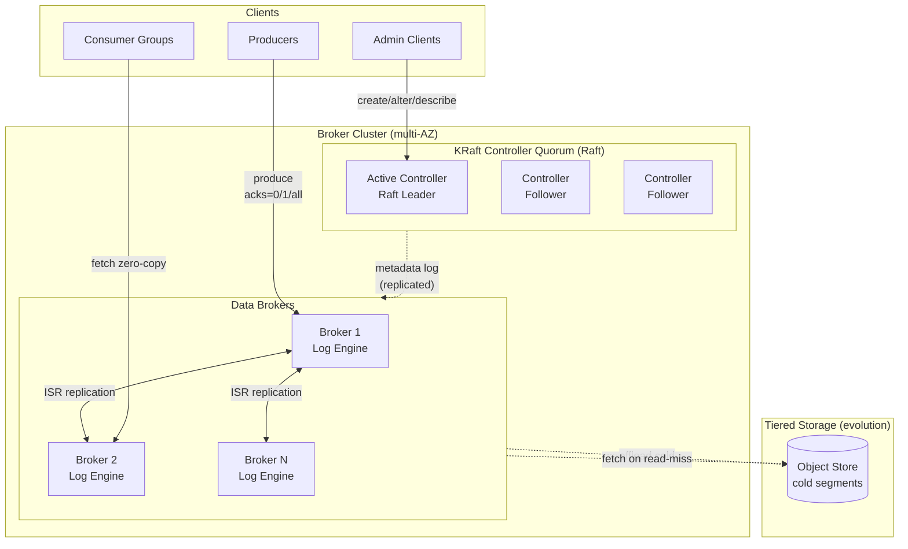

# Architecture: Distributed Event Streaming Platform (Kafka-class)

> Companion design document to [PROBLEM.md](./PROBLEM.md). This is the candidate's
> end-to-end solution for the core distributed commit-log and messaging infrastructure.

---

## 0. Scope Lock & Operating Assumptions

Agreed scope and assumptions carried from the clarification round:

1. **Self-managed metadata plane** — a built-in **Raft quorum (KRaft-style)**, no external ZooKeeper.
2. **Dual workload profiles** the cluster must serve concurrently:
   - **Profile A — High topic density:** millions of topics, tens of partitions each. Bottleneck = *metadata-plane scale* (partition-replica count, leadership churn, metadata propagation).
   - **Profile B — High per-partition throughput:** a handful of topics, hundreds–thousands of partitions each, each partition pushing very high MB/s. Bottleneck = *log-storage throughput, replication fan-out, page-cache pressure*.
3. **Storage substrate:** local **NVMe SSD** as the primary hot store; **tiered object storage (S3-compatible)** as a documented evolution for cold segments.
4. **Exactly-Once Semantics (EOS):** full deep-dive — idempotent producer + transaction coordinator + transaction markers + `read_committed` isolation.
5. **Topology:** single-region, multi-AZ core. Geo-replication (active-passive) documented as a stretch goal.

**Out of scope:** stream processing, schema registry, KSQL, Connect.

---

## Phase 2: High-Level Design & Architecture

### 2.1 Back-of-the-Envelope Math

**Write path (from the baseline capacity table):**

| Quantity | Derivation | Value |
|---|---|---|
| Peak cluster write | given | 10 GB/s |
| Avg message size | given | 1 KB |
| Peak msg rate (cluster) | 10 GB/s ÷ 1 KB | ~10M msg/s |
| Per-broker write target | given | ≥1M msg/s |
| Brokers for ingest (write only) | 10M ÷ 1M | ~10 brokers worth of ingest capacity |

**Replication amplification (the real disk/network cost):**

- With **RF=3**, every produced byte is written **3×** to disk and crosses the network **2×** (leader → 2 followers).
- Disk write load = 10 GB/s × 3 = **30 GB/s** cluster-wide.
- Replication network = 10 GB/s × 2 = **20 GB/s** of broker-to-broker (east-west) traffic, *plus* fan-out to consumers on the read path.

**Read path (fan-out matters more than ingest):**

- A topic read by *N* independent consumer groups multiplies egress by *N*. With a modest avg fan-out of ~3 groups: read egress ≈ 10 GB/s × 3 = **30 GB/s**.
- Read target ≥2M msg/s/broker is achievable **only** because of zero-copy (`sendfile`) — data never enters user space. More on this in §3.

**Storage:**

| Quantity | Derivation | Value |
|---|---|---|
| Raw/day | 10 GB/s × 86,400 s | ~860 TB/day |
| Raw 7-day | 860 TB × 7 | ~6 PB |
| Replicated 7-day (RF=3) | 6 PB × 3 | **~18 PB** |

> Note: the problem table lists "~6 PB with RF=3," which under-counts — 6 PB is the *raw* 7-day footprint; **replicated it is ~18 PB**. This correction matters for capacity planning. At ~15 TB usable NVMe per broker, 18 PB ⇒ **~1,200 brokers** for storage alone. Storage, not ingest CPU, is the dominant sizing driver. This is precisely why **tiered storage** (§3.5) becomes economically mandatory at this scale.

**Partition-density math (Profile A):**

- Suppose 1M topics × 20 partitions × RF=3 = **60M partition-replicas**.
- Spread over ~1,200 brokers ⇒ **~50K partition-replicas/broker**. Each open partition costs: 2 file descriptors (log + index), memory for the index, and a slice of page cache. This is the classic Kafka density wall — it pushes us toward the **KRaft metadata model** (§3.6) and per-broker partition-density tuning rather than the old ZooKeeper-watch model that collapses here.

**Sizing headline:** ingest needs ~10–15 brokers; **storage drives the cluster to ~1,000+ brokers**, and **metadata scale (partition count) is the second-order constraint**. The architecture must be correct on all three axes.

### 2.2 Core Components



| Component | Responsibility |
|---|---|
| **Producer client** | Batching, compression, partitioning, idempotent sequencing, retry, transaction begin/commit. |
| **Broker (data plane)** | Hosts partition replicas; appends to the log; serves fetches via zero-copy; runs the replica fetcher threads; enforces quotas. |
| **KRaft Controller Quorum (metadata plane)** | A small (3–5 node) Raft group that *is* the source of truth for cluster metadata: topics, partitions, replica assignments, ISR, leadership, configs, ACLs. The active controller is the Raft leader. |
| **Consumer client** | Group membership, fetch loop, offset commit, seek/replay, partition assignment via the rebalance protocol. |
| **Group Coordinator** | A broker-resident role (one per consumer group, sharded by group ID) that drives rebalancing and stores committed offsets in the internal `__consumer_offsets` topic. |
| **Transaction Coordinator** | A broker-resident role (sharded by transactional ID) that manages the transaction log (`__transaction_state`), fences zombies, and writes commit/abort markers. |

**Two control surfaces, deliberately separated:**
- **Cluster metadata** (who leads what) → **KRaft controllers** (Raft).
- **Application coordination** (consumer groups, transactions, offsets) → **broker-resident coordinators** backed by **internal topics**. This keeps the small, strongly-consistent Raft quorum from becoming a per-consumer-heartbeat bottleneck — group/offset traffic scales horizontally as ordinary partitioned topics.

### 2.3 Data Flow — Producer Happy Path (`acks=all`)

1. **Partition selection (client-side):** key present → `murmur2(key) % numPartitions`; no key → sticky-batch round-robin (fill a batch for one partition, then move on — reduces request count vs. naive RR).
2. **Batch & compress:** the producer accumulates records per-partition into a batch (bounded by `batch.size` / `linger.ms`), compresses (LZ4/zstd) once per batch.
3. **Metadata lookup:** client consults its cached topic→leader map (refreshed from any broker's `Metadata` response, ultimately sourced from KRaft). Sends the batch to the **partition leader**.
4. **Leader append:** leader validates (idempotent sequence #, ACL, quota), assigns a contiguous **offset range**, appends to the active log segment (page cache; `fsync` policy per config), updates the offset/time indexes.
5. **Replication:** follower **fetcher threads pull** the new records from the leader (replication is *pull-based*, identical to the consumer fetch protocol — see §4 "Push vs Pull"). Each follower appends and reports its **log-end offset (LEO)**.
6. **High-Watermark (HW) advance:** once all **ISR** members have the record, the leader advances the **HW** = min(LEO across ISR). Records below HW are "committed."
7. **Ack:** with `acks=all`, the leader acks only after the record is **committed** (≥ `min.insync.replicas`). Consumers can only read up to the HW — committed data only.

### 2.4 Data Flow — Consumer Happy Path

1. Consumer joins a group → Group Coordinator assigns it a subset of partitions (§5 rebalance).
2. For each owned partition, consumer issues a **`Fetch(topic, partition, offset, maxBytes)`** to that partition's leader.
3. Broker serves bytes **[offset, HW)** directly from page cache to socket via **`sendfile()`** — zero-copy, no user-space buffer.
4. Consumer processes records in offset order, periodically **commits offsets** (to the Group Coordinator → `__consumer_offsets`).
5. On restart/rebalance, the new owner resumes from the last committed offset.

---

## Phase 3: Deep Dive — Data & Storage

### 3.1 The Log: Physical Layout

A **partition** is an ordered, append-only sequence of records, materialized on disk as a directory of **segments**:

```
/data/topic-A-7/                 # partition 7 of topic-A
    00000000000000000000.log     # segment base offset 0
    00000000000000000000.index   # offset -> physical position (sparse)
    00000000000000000000.timeindex# timestamp -> offset (sparse)
    00000000000000368420.log     # next segment, base offset 368420
    00000000000000368420.index
    ...
    leader-epoch-checkpoint      # epoch -> start offset (for truncation safety)
```

- **Active segment** = the one currently being appended; only one per partition. Rolls over on `segment.bytes` (e.g., 1 GB) or `segment.ms`.
- **Records** are stored in **batches** (the producer's compressed batch is written as-is — compression survives end-to-end, decompressed only at the consumer). A batch header carries: base offset, length, CRC, producer ID, producer epoch, base sequence, and record count.

**Why sparse indexes?** A dense index (every record) would be huge and thrash page cache. The `.index` stores one entry every `index.interval.bytes` (e.g., 4 KB). To find offset *O*: binary-search the sparse index for the nearest lower entry, then linearly scan the log from that physical position. This is O(log n) seek + bounded scan, and the index is small enough to stay memory-resident.

### 3.2 Append Path & The fsync Trade-off

- Appends go to the **OS page cache**; the kernel flushes to disk asynchronously. Kafka deliberately **does not fsync on every write** — it relies on **replication for durability** rather than fsync-per-record.
- **Why:** fsync-per-record would cap throughput far below 1M msg/s. With RF=3 across independent failure domains (AZs), the probability of losing all 3 copies before the page cache flushes is acceptably low, and `acks=all` guarantees the data is in *3 brokers' page caches* before ack.
- **Tunable:** `flush.ms` / `flush.messages` allow forcing fsync for workloads that distrust replication-only durability (regulatory). Trade-off: latency/throughput vs. surviving a simultaneous power loss of all ISR members.

### 3.3 Zero-Copy Read Path

Traditional read = `read()` (disk→kernel→**user buffer**) then `write()` to socket (user buffer→**kernel socket buffer**→NIC): 4 copies, 2 context switches.

**`sendfile(socket, file, offset, len)`** transfers page-cache pages directly to the NIC's socket buffer (DMA), bypassing user space entirely: **2 copies, often "zero-copy"** because the data never touches the application. This is why a broker can serve ≥2M msg/s reads — the CPU barely participates.

**Critical constraint:** zero-copy requires the bytes on the wire to be *exactly* the bytes on disk. This is why:
- The on-disk format = the on-wire format = the producer's compressed batch.
- **TLS breaks zero-copy** (encryption must touch user space). Mitigation: terminate TLS but accept the CPU hit for client links; keep intra-cluster replication on a fast, optionally-mTLS path; or use kernel TLS (kTLS) where available to push encryption into the kernel and partially preserve the benefit.

### 3.4 Data Model — Metadata Schemas

Stored in the **KRaft metadata log** (replicated state machine), materialized into in-memory structures on every broker:

```
TopicRecord        { topicId(UUID), name, ... }
PartitionRecord    { topicId, partitionId, replicas:[brokerIds],
                     isr:[brokerIds], leader, leaderEpoch, partitionEpoch }
ConfigRecord       { resource(topic/broker), key, value }      # runtime config
BrokerRegistration { brokerId, epoch, endpoints, rack/AZ, ... }
ProducerIdsRecord  { blockBase, blockLen }                     # PID allocation
AclRecord          { principal, resource, op, permission }
```

Application-level state lives in **internal compacted topics**, not in Raft:

```
__consumer_offsets    key=(group, topic, partition)  val=(offset, metadata, commitTs)   # log-compacted
__transaction_state   key=transactionalId            val=(pid, epoch, state, partitions) # log-compacted
```

> Storing offsets/txn-state as **log-compacted topics** is the key scaling trick: they get the same replication, retention, and zero-copy machinery as user data, and **compaction keeps only the latest value per key** (the whole point of compaction, §3.7). The Raft quorum stays small and fast.

### 3.5 Storage Strategy: Hot / Warm / Cold (Tiered)

| Tier | Medium | Holds | Access |
|---|---|---|---|
| **Hot** | Local NVMe SSD + page cache | Active + recent segments (e.g., last few hours) | Zero-copy, P99 < 10 ms |
| **Warm** | Local NVMe (older segments) | Up to local retention | Disk read, still fast |
| **Cold** | S3-compatible object store | Segments past local retention, up to topic retention | Higher-latency fetch, async |

**Tiered storage mechanics (the §2.1 economics force this):**
- Closed (non-active) segments are **offloaded** to object storage by a background thread; the local copy can then be deleted while metadata remembers the remote location.
- A consumer reading an old offset triggers a **remote fetch**: broker streams the segment from S3 (cached locally for the duration). Active segment + replication never leave local disk, so the hot path is unaffected.
- **Wins:** decouples *storage* from *compute*. Brokers shrink to "ingest + hot cache" sizing (~10–50 brokers for ingest) instead of ~1,200 for raw storage. Retention can extend to months/years cheaply. **Rebalancing and recovery get dramatically faster** — a new broker doesn't have to re-replicate petabytes, only the hot tail.
- **Cost (Phase 6):** S3 at ~$0.021/GB-mo vs. NVMe TCO; 18 PB on NVMe is the dominant line item, and most of it is cold. Tiering cuts storage cost by an order of magnitude and is the single highest-leverage decision at this scale. This mirrors **Confluent Tiered Storage / Apache Kafka KIP-405** and **Uber/Pinterest** tiered designs.

### 3.6 Partitioning & Placement

- **Partition key (data):** `hash(messageKey) % numPartitions` → gives per-key ordering and even spread. Hot-key risk (Profile B): a single scorching key pins one partition's throughput. Mitigation: composite keys / key-salting, or a custom partitioner — at the cost of losing strict per-original-key ordering.
- **Replica placement:** **rack/AZ-aware** — the 3 replicas of a partition must land in 3 distinct AZs so a full-AZ outage loses at most one replica per partition (preserves quorum). The controller's placement algorithm balances (a) leader count per broker, (b) replica count per broker, (c) AZ spread, (d) disk usage.
- **Leadership balance:** leadership is the load multiplier (leaders do all client I/O + drive replication). The controller runs **preferred-leader election** to keep leaders evenly distributed; `auto.leader.rebalance` periodically restores the preferred leader after failovers.

### 3.7 Retention & Log Compaction

Two independent, composable cleanup policies:

- **`delete` (default):** drop whole **segments** once the *newest* record in them is older than `retention.ms` OR partition size exceeds `retention.bytes`. Cheap — it's a file delete, never a rewrite.
- **`compact`:** retain **the latest record per key**; older values for the same key are garbage-collected by a background **log cleaner** that merges segments. A `null` value is a **tombstone** (delete that key, retained briefly so consumers observe the deletion). Use cases: CDC, KTable-style state, the internal offset/txn topics. Compaction guarantees a consumer that reads the whole log sees *at least* the final state of every key.
- **`compact,delete`:** both — bounded-time retention of the latest-per-key.

### 3.8 Caching

There is **no separate cache tier** — and that's a deliberate design choice. The **OS page cache is the cache**:
- Consumers reading the tail (the common case) hit pages the producer *just* wrote → served from RAM via `sendfile`, near-zero disk I/O.
- Adding an app-level cache (e.g., Redis) would *duplicate* page cache, double memory, and break zero-copy. Rejected.
- **Look-aside/write-through patterns don't apply** to an append-only log; the log *is* the durable store and the cache is the kernel's job. Client-side, producers cache the topic→leader metadata map (TTL + invalidate on `NOT_LEADER` errors).

---

## Phase 4: Trade-offs & Justification

### 4.1 Metadata Plane — KRaft (Raft) over ZooKeeper

- **Why KRaft:** ZooKeeper is a separate system to operate, and its **watch-based metadata propagation does not scale to millions of partitions** — controller failover requires reloading full state from ZK (minutes at scale). KRaft makes metadata an **event-sourced replicated log**; the active controller is the Raft leader; brokers consume the **metadata log as a stream** and apply deltas. Failover is fast (a follower already has the log materialized).
- **Why not ZooKeeper:** operational double-stack, the partition-scalability ceiling, and the awkward two-consensus-systems split-brain surface. (This is exactly the industry migration: **Kafka KIP-500 / KRaft**.)
- **Why not etcd/Consul as the store:** same "external system" cost as ZK, and we'd still need our own controller logic on top. Embedding Raft directly is simpler to operate and lets metadata reads be local (every broker has the log).
- **Trade-off:** we own a Raft implementation (correctness-critical). Quorum stays small (3–5) so it's tractable; all *high-volume* coordination (offsets, txns, groups) is pushed off Raft onto partitioned internal topics.

### 4.2 Replication — Leader/Follower ISR vs. Quorum (Raft-per-partition)

- **Why leader-based ISR:** with **N replicas you tolerate N-1 failures** and only need *all current ISR members* (not a majority) to ack. A Raft/Paxos-per-partition needs a **majority** to commit, so tolerating 2 failures needs 5 replicas (2.5× storage) vs. ISR's 3. At 18 PB, that ratio is enormous money.
- **Why not quorum-per-partition:** storage amplification, and we'd run millions of independent Raft groups (one per partition) — operationally brutal. ISR concentrates consensus into the *small* metadata quorum (which decides ISR membership and leadership) while data replication stays cheap and pull-based.
- **The subtlety — `min.insync.replicas`:** ISR can shrink to 1 (all followers lagging). To avoid acking `acks=all` against a lone replica, `min.insync.replicas=2` makes the leader *reject* writes if ISR < 2. This is the **CAP knob** (below).
- **Trade-off:** ISR sacrifices some availability for durability — if too many replicas fall out of ISR, writes are refused rather than risk silent data loss.

### 4.3 CAP Positioning

A partition is a **CP system for committed writes**:
- **Consistency chosen over availability** on the write path: with `acks=all` + `min.insync.replicas=2`, if a network partition isolates the leader from its followers, the leader stops accepting writes (unavailable) rather than ack data that could be lost — **no committed message loss** (NFR §3).
- **Unclean leader election** is the explicit escape hatch: `unclean.leader.election.enable=true` lets an out-of-sync replica become leader to restore availability **at the risk of losing un-replicated records** — i.e., consciously trading C for A. Default = **disabled** (safety first). This is *the* knob to discuss in an interview.
- **Reads** are effectively AP-leaning: any in-sync replica *could* serve reads up to the HW, but to preserve simple ordering/HW semantics, clients read from the **leader** by default (follower-fetch is an optimization for cross-AZ egress savings).

### 4.4 Push vs. Pull (both replication and consumption are PULL)

- **Consumers pull:** the broker never pushes. Pull lets each consumer **control its own rate** (natural back-pressure — a slow consumer just fetches less; it can never be overwhelmed), enables **batching** (fetch many records per round-trip), and makes **replay** trivial (just fetch from an older offset). A push model would require the broker to track per-consumer flow control and risk overrunning slow consumers.
- **Followers pull (replicate via Fetch):** replication reuses the *exact same* fetch protocol as consumers — a follower is "just another consumer that happens to write what it reads." This unifies code paths and is why HW/LEO bookkeeping is uniform.
- **Trade-off:** pull adds latency when the log is empty (consumer polls, finds nothing, waits). Solved with **long-polling** (`fetch.max.wait.ms`): the broker holds the fetch open until data arrives or the timeout fires — giving push-like latency without push's flow-control burden.

### 4.5 Other Key Choices (condensed)

| Decision | Chose | Over | Because |
|---|---|---|---|
| On-disk format | Append-only segmented log | B-tree / LSM | Sequential I/O saturates disk; O(1) append; zero-copy reads. |
| Compression | Per-batch, client-side | Per-record / broker-side | Better ratio (cross-record), preserves zero-copy (no broker recompress). |
| Offset store | Internal compacted topic | External DB | Reuses replication/durability; scales horizontally; survives controller failover. |
| Coordinators | Broker-resident, sharded | Centralized service | Removes a SPOF; scales with the cluster; co-locates with the offset topic. |

---

## Phase 5: Reliability, Scaling & Operations

### 5.1 Replication Internals — HW, LEO, Leader Epoch

- **LEO (Log End Offset):** next offset a replica will write. **HW (High Watermark):** highest offset replicated to *all* ISR members = the consumer-visible boundary.
- **ISR membership:** a follower is in-sync if it has fetched up to the leader's LEO within `replica.lag.time.max.ms` (e.g., 10 s). Fall behind → leader **shrinks ISR** (a metadata change committed via the controller). Catch up → **expand ISR**.
- **Leader epoch:** every leadership change bumps a monotonic **epoch**. Followers use epochs to **safely truncate** divergent suffixes after a leader change (the pre-epoch design could silently lose/diverge data — fixed by KIP-101). On becoming follower, a replica asks the new leader "what's your LEO for my epoch?" and truncates anything beyond it.

### 5.2 Leader Election & Failover (target < 30 s)

1. Broker B (leader of partitions P1..Pk) dies. Its **session with the controller quorum expires** (heartbeat timeout, e.g., `broker.session.timeout.ms` ~9 s).
2. The **active controller** detects this from the metadata stream, and for each affected partition **elects a new leader from the current ISR** (preferring the *preferred replica* if it's in ISR), bumps the **leaderEpoch + partitionEpoch**, and appends `PartitionRecord` updates to the metadata log.
3. The change **propagates to all brokers** as metadata-log deltas; old followers of P become followers of the new leader; clients get `NOT_LEADER_FOR_PARTITION` and refresh metadata, redirecting to the new leader.
4. Because election only picks from **ISR**, the new leader already has all committed records → **no data loss** (NFR §4). Total time is dominated by session-timeout detection, comfortably < 30 s.

### 5.3 Consumer Group Rebalancing

- **Coordinator-driven:** each group is owned by a **Group Coordinator** (broker hosting that group's `__consumer_offsets` partition). Members send periodic **heartbeats**; a missed heartbeat (`session.timeout.ms`) or a join/leave triggers a rebalance.
- **Eager (stop-the-world):** all members revoke all partitions, rejoin, and the coordinator's elected **leader member** computes a new assignment (range/round-robin) which the coordinator distributes. Simple but causes a **global pause** — bad for large groups (Profile B).
- **Cooperative / incremental (default for scale):** only the partitions that *must* move are revoked; everyone else keeps consuming. Done in two rebalance rounds (revoke-then-assign). Minimizes stop-the-world and is essential when a group owns thousands of partitions. (Kafka **Incremental Cooperative Rebalancing**, KIP-429.)
- **Static membership (KIP-345):** members carry a stable `group.instance.id` so a quick restart (rolling deploy, pod reschedule) does **not** trigger a rebalance — the coordinator waits out the session and reassigns the same partitions. Critical for operability of large groups.

### 5.4 Exactly-Once Semantics (EOS) — Full Mechanism

EOS = **idempotent producer** (no duplicates) **+ transactions** (atomic multi-partition writes & atomic offset commit).

**1. Idempotent producer (dedup within a partition):**
- On init, producer gets a **Producer ID (PID)** + **epoch**. Each record batch carries `(PID, epoch, sequenceNumber)` monotonically increasing per partition.
- The leader tracks the **last 5 sequence numbers per (PID, partition)**. A retry that re-sends an already-appended sequence is **silently de-duplicated** (returns success without re-appending). A gap → `OutOfOrderSequence` error. This makes producer retries safe → kills duplicates from network-level retries.

**2. Transactions (atomicity across partitions + offsets):**
- The **Transaction Coordinator** (sharded by `transactional.id`, backed by `__transaction_state`) assigns the PID, **fences zombies** via the epoch (a restarted producer with the same `transactional.id` gets a higher epoch; the old instance's writes are rejected), and drives a 2-phase commit:
  1. Producer `beginTransaction`, writes records to N partitions, and sends consumed-offsets to the coordinator (`sendOffsetsToTransaction`).
  2. `commitTransaction` → coordinator writes **PREPARE_COMMIT** to its log, then writes **transaction markers (COMMIT)** into *every* involved partition (including the `__consumer_offsets` partition), then **COMPLETE_COMMIT**. Abort is symmetric with ABORT markers.
- **`read_committed` consumers** filter out records belonging to aborted/in-flight transactions using the markers + the **Last Stable Offset (LSO)** — they only see records up to the LSO (the offset before the earliest still-open transaction). `read_uncommitted` sees everything (default).
- **Atomic offset commit** is the linchpin of stream-processing EOS: "consume → process → produce → commit input offsets" all happen in one transaction. Either everything commits or nothing does → no double-processing across a crash.

**3. EOS limits to state honestly:** exactly-once is *within the Kafka boundary*. End-to-end EOS to an external sink still needs an idempotent/transactional sink. We provide the primitives; the application closes the loop.

### 5.5 Bottlenecks & Hot Spots

| Bottleneck | Symptom | Mitigation |
|---|---|---|
| **Hot partition** (skewed key, Profile B) | one partition's leader saturates a broker | key-salting; more partitions; isolate via quotas; spread leadership |
| **Partition density** (Profile A) | FD exhaustion, GC pressure, slow failover | cap partitions/broker; KRaft (fast metadata); tiered storage shrinks per-partition footprint |
| **Controller throughput** | metadata-log apply lag during mass leadership change | batch metadata records; keep quorum on fast disks; limit blast radius via AZ-aware placement |
| **Replication lag** | ISR shrinks, `acks=all` stalls | dedicated replication network; tune fetcher threads; rack-aware so followers are close |
| **GC / page-cache thrash** | latency spikes | size heap small, give RAM to page cache; avoid huge per-partition memory |
| **Slow consumer / lag blow-up** | lag grows unbounded | back-pressure is automatic (pull); alert on lag; scale the group; tiered storage lets cold reads not evict hot pages |

### 5.6 Failure Handling

- **Broker crash:** controller fails over its leaderships from ISR (§5.2); on restart the broker **recovers from local log** (replays the last segment, rebuilds indexes, truncates past HW using leader epochs), then **catches up as a follower** before rejoining ISR. Target rejoin < 60 s (faster with tiered storage — only the hot tail re-replicates).
- **AZ / region outage:** AZ-aware placement guarantees ≥2 surviving replicas per partition → no data loss, automatic failover. Full-region loss → geo-replication (§6) failover to the passive cluster.
- **Network partition:** minority side loses leadership (can't reach controller quorum / falls out of ISR); majority side continues. `min.insync.replicas` prevents the isolated side from acking unsafe writes.
- **Disk failure:** with JBOD, only that disk's partitions are affected → re-replicate from ISR onto a healthy disk/broker. RF=3 covers the gap.
- **Rolling upgrade:** drain leadership off the target broker (move leaders to peers), restart, let it rejoin ISR, move on. Zero downtime because every partition always has a live leader elsewhere.

### 5.7 Edge Cases

- **Poison pill** (un-deserializable / repeatedly-failing record): the broker is byte-agnostic, so this is a *consumer* concern → route to a **dead-letter topic** after K retries; never block the partition (head-of-line blocking would stall everything behind it).
- **Traffic spike:** **quotas** (byte-rate + request-rate per client/principal) throttle by *delaying* responses (the broker holds the response, which back-pressures the client without dropping data). Producer-side `buffer.memory` + `max.block.ms` apply natural back-pressure upstream.
- **Duplicate on retry:** handled by idempotent producer (§5.4).
- **Zombie producer** after a long GC pause: fenced by transaction epoch (§5.4).

### 5.8 Observability

- **Golden signals:**
  - *Latency:* produce/fetch P50/P99; end-to-end (producer→consumer) via timestamps.
  - *Traffic:* messages/s & bytes/s in/out per topic/partition/broker.
  - *Errors:* failed produce/fetch, `NOT_LEADER`, ISR shrink events, unclean elections (should be ~0).
  - *Saturation:* disk %, page-cache hit ratio, network %, request-handler thread idle %, **under-replicated partitions** (the single most important health metric), **offline partitions** (= data unavailable).
- **Consumer lag:** `HW − committedOffset` per group/partition — the primary SLO-facing metric. Exposed via the admin API + a lag exporter.
- **Metrics transport:** **Prometheus-compatible** endpoints (NFR §7); Grafana dashboards; alert on under-replicated > 0, offline > 0, ISR shrink rate, controller-failover count, lag breaching threshold.
- **Health:** broker↔controller **heartbeats** (liveness); **synthetic canary** producer/consumer per cluster measuring real end-to-end latency and exactly-once correctness continuously.

### 5.9 SLAs / SLOs

| Objective | Target |
|---|---|
| Availability (produce/consume) | 99.99% (≤ 52 min/yr) |
| Produce latency P99 (`acks=all`, in-region) | < 10 ms |
| Leader failover | < 30 s |
| Broker rejoin after restart | < 60 s |
| Committed-message durability | No loss with ≤ RF-1 simultaneous failures |
| Consumer-lag alert threshold | breach of N seconds of data (per-tenant) |
| Geo-replication lag (stretch) | < 5 s p95 |

---

## Phase 6: Staff-Level Considerations

### 6.1 Cost

- **Storage dominates.** 18 PB replicated NVMe is the headline cost; **tiered storage to S3 (§3.5) is the highest-leverage cost lever** — moving cold segments to object storage cuts the storage bill by ~10× and shrinks the broker fleet from ~1,200 toward an ingest-sized ~50. *Recommendation: tiered storage is not optional at this scale.*
- **Cross-AZ network** is a real and often-surprising line item: replication + cross-AZ consumer fetch incur inter-AZ data charges. **Follower-fetch (rack-aware consumers reading the local-AZ replica)** cuts cross-AZ egress materially — a deliberate AP-leaning read optimization (§4.3).
- **Right-size acks/RF per topic:** not every topic needs RF=3 / `acks=all`. Low-value telemetry can run RF=2 / `acks=1`; a source-of-truth topic gets RF=3 / `acks=all` + fsync. Per-topic config makes cost track value.

### 6.2 Security

- **In transit:** TLS for client↔broker and broker↔broker; note the **zero-copy trade-off** (§3.3) — use kTLS where available, or accept CPU cost on client links while keeping a fast internal path.
- **At rest:** disk-level encryption (LUKS) and/or per-topic envelope encryption for object-store tier (SSE-KMS).
- **AuthN:** **mTLS** and **SASL/SCRAM** (NFR §8).
- **AuthZ:** **topic-level ACLs** (read/write/describe/delete) keyed on principal; stored as `AclRecord`s in the metadata log.
- **PII:** the platform is byte-agnostic, so PII policy lives at the boundary — encrypt/tokenize PII fields client-side before produce; use **log compaction tombstones** to honor right-to-erasure (write a tombstone for the key); short retention on PII topics.
- **Audit:** every admin op (create/alter/delete/reassign) is an event in the metadata log → immutable **audit trail** by construction.

### 6.3 Multi-Tenancy

- **Logical isolation** via topic **namespaces/prefixes** (`teamA.orders`) + prefixed ACLs.
- **Quotas** per principal/client: produce/fetch **byte-rate** and **request-rate** throttling (enforced by delaying responses, §5.7) so one noisy tenant can't starve others.
- **Hard isolation** for the most demanding/regulated tenants: dedicated broker pools or even dedicated clusters (Profile B's huge-throughput topics may warrant their own brokers to avoid noisy-neighbor on page cache).

### 6.4 Scaling 10× (to ~100 GB/s, ~100M msg/s)

1. **Tiered storage first** — already decouples storage from compute, so 10× *retention* costs ~10× cheap object storage, not 10× brokers.
2. **Add brokers** for ingest/leadership — throughput scales near-linearly because partitions are independent; the controller just rebalances leadership onto new brokers.
3. **Metadata plane:** KRaft already removes the ZK ceiling. At 10× partitions, keep the quorum on fast NVMe, batch metadata records, and consider **metadata-log snapshotting** to bound apply time; shard the broker fleet into multiple clusters federated by **cross-cluster replication** if a single metadata log becomes the limit.
4. **Coordinators scale out** automatically (more `__consumer_offsets` / `__transaction_state` partitions → more coordinator shards).
5. **Geo-replication (stretch → core):** **active-passive** mirror via an async cross-cluster replicator (MirrorMaker-2-style) that consumes from source and produces to the DR cluster, translating offsets; target lag < 5 s. For multi-region *active-active*, accept per-region partitions and last-writer-wins / app-level conflict handling — a substantial follow-on design.

---

## Appendix A — Key References (industry alignment)

| Concept here | Real-world basis |
|---|---|
| KRaft metadata quorum | Apache Kafka **KIP-500 / KIP-595** (Raft) |
| Leader-epoch truncation | **KIP-101 / KIP-279** |
| Incremental cooperative rebalance | **KIP-429** |
| Static membership | **KIP-345** |
| Exactly-once / transactions | **KIP-98 / KIP-129** |
| Tiered storage | **KIP-405**; Confluent / Uber / Pinterest tiered designs |
| Zero-copy | `sendfile(2)`; LinkedIn's original Kafka paper |

## Appendix B — Summary of the Big Trade-offs (interview cheat-sheet)

1. **ISR replication vs. quorum:** chose ISR → tolerate N-1 with N replicas (cheap durability) vs. Raft-per-partition needing a majority (2.5× storage).
2. **`acks=all` + `min.insync.replicas`:** chose CP on writes — refuse writes rather than risk loss; `unclean.leader.election` is the conscious C-for-A escape hatch.
3. **Pull everywhere:** consumers and followers pull → natural back-pressure, trivial replay, unified code path; long-poll recovers low latency.
4. **Page cache, not an app cache:** the kernel is the cache; preserves zero-copy; rejected Redis/look-aside.
5. **Tiered storage:** the decisive cost + operability lever at 18 PB — decouples storage from compute, speeds recovery/rebalance.
6. **Two control surfaces:** small Raft quorum for cluster metadata; horizontally-scaled internal topics for offsets/txns/groups.
