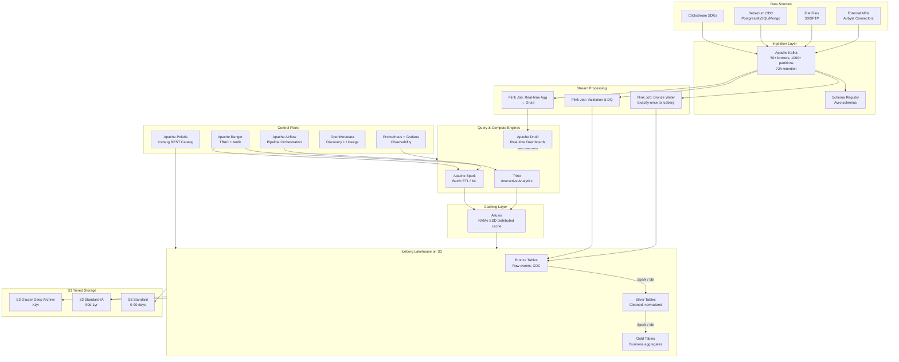

# Designing a Petabyte-Scale Data Lakehouse with Tiered Storage and Governance

-----

# Original Problem Statement

## Designing a Petabyte-Scale Data Lakehouse with Tiered Storage and Governance

In the era of hyper-scale data, the traditional separation between data lakes for unstructured data and data warehouses for structured analytics has become a bottleneck for organizational agility. The objective is to design a unified Data Lakehouse architecture that provides the performance and governance of a warehouse on the foundation of a highly durable, low-cost object store like Amazon S3, which offers durability.^1^ This design must support the ingestion of over 500 billion events per day, translating to roughly 1.3 PB of daily data growth.^5^

### The Core Architectural Challenge

The primary technical hurdle in a petabyte-scale lakehouse is managing the \"small file problem\" while ensuring that high-cardinality metadata does not become a bottleneck for query engines. Engineers must implement strategies for data organization, using clear zones such as raw, processed, and curated, while leveraging columnar file formats like Parquet or ORC to minimize I/O by reading only necessary columns.^1^ Furthermore, the introduction of partition pruning---keyed to frequently filtered columns like date or region---allows query engines like Redshift Spectrum or Presto to skip massive amounts of irrelevant data during scan operations.^1^

### High-Level Requirements

| **Requirement Type** | **Description** |
| --- | --- |
| **Functional** | Implement a decoupled architecture where storage and compute scale independently.^1^ |
| **Functional** | Support for ACID transactions to ensure data consistency during concurrent writes and schema updates.^2^ |
| **Functional** | Automated data organization into raw, silver (cleaned), and gold (business-ready) zones.^1^ |
| **Functional** | Centralized metadata tracking for dataset schemas, versions, and physical storage locations.^8^ |
| **Non-Functional** | Availability: for the query engine and metadata services.^1^ |
| **Non-Functional** | Durability: Eleven nines () for data at rest.^1^ |
| **Non-Functional** | Performance: Sub-second latency for warm data queries and predictable SLAs for petabyte-scale historical analysis.^2^ |
| **Non-Functional** | Governance: Fine-grained access control at the row and column level across all storage tiers.^1^ |

### Nuanced Considerations for Staff Engineers

A sophisticated approach involves the use of \"Liquid Clustering\" or similar techniques to reduce the overhead of integrity enforcement by organizing data based on Kimball key columns.^2^ Additionally, to handle the massive strain on network resources and API throughput, a local cache system---preferably application-agnostic---should be integrated into the compute nodes to minimize socket communication and network fetching for interactive analytics.^6^ Security must be centralized through tools like AWS Lake Formation, which replaces the audit nightmare of managing fragmented IAM roles and bucket policies with a unified tag-based access control (TBAC) mechanism.^1^ This allows for the decoupling of policy maintenance from data growth, where permissions are granted based on the sensitivity of data tags (e.g., finance, PII) rather than individual table grants.^1^

-----


## 1. Problem Statement

In the era of hyper-scale data, the traditional separation between data lakes (unstructured) and data warehouses (structured analytics) is a bottleneck for organizational agility. We need a **unified Data Lakehouse** that delivers warehouse-grade performance and governance on top of a highly durable, low-cost object store (S3, 11 nines durability). The system ingests **500B+ events/day (~1.3 PB daily growth)** from heterogeneous sources — clickstream, CDC from transactional databases (SQL/NoSQL), flat files, and external APIs.

---

## 2. Requirements & Scope

### 2.1 Functional Requirements

| # | Requirement |
|---|---|
| FR1 | Decoupled storage and compute — scale each independently |
| FR2 | ACID transactions on columnar object store (concurrent writes, schema evolution, time-travel) |
| FR3 | Medallion architecture: automated pipelines across Bronze (raw) → Silver (cleaned) → Gold (curated) |
| FR4 | Centralized metadata catalog — schema registry, versioning, physical location tracking |
| FR5 | Fine-grained governance — row-level and column-level access control, tag-based (TBAC) |
| FR6 | Support heterogeneous ingestion: clickstream, CDC, flat files, API sources |
| FR7 | Ad-hoc interactive analytics + batch ETL/ML training workloads |
| FR8 | (Extension) Real-time dashboard serving with seconds-level freshness |

### 2.2 Non-Functional Requirements

| Dimension | Target |
|---|---|
| **Availability** | 99.99% for query engine + metadata services (~52 min downtime/year) |
| **Durability** | 99.999999999% (S3-backed, 11 nines) |
| **Query Latency** | Sub-second for warm/hot data interactive queries; predictable SLAs for PB-scale scans |
| **Ingestion Throughput** | 500B events/day → ~5.8M events/sec sustained, ~15M events/sec peak |
| **Consistency** | Serializable isolation for writes; snapshot isolation for reads (Iceberg guarantees) |
| **Retention** | Hot/queryable for 1 year; archive beyond 1 year |
| **Governance** | Centralized TBAC, full audit trail, PII masking/encryption |

### 2.3 Assumptions

- AWS as cloud provider; S3 as the object store
- Apache Iceberg as the open table format
- Open-source first; managed offerings noted where they reduce operational burden
- Single-org architecture first; multi-tenancy as an extension

---

## 3. Back-of-Envelope Estimation

### 3.1 Ingestion

| Metric | Value |
|---|---|
| Events/day | 500 billion |
| Events/sec (sustained) | ~5.8 million |
| Events/sec (peak, 3x burst) | ~17.4 million |
| Avg event size (raw JSON) | ~2.6 KB (to hit 1.3 PB/day) |

### 3.2 Storage

| Metric | Value | Notes |
|---|---|---|
| Raw daily ingestion | **1.3 PB** | JSON/Avro before columnar encoding |
| After Parquet + compression | **~260 TB/day** | ~5x compression ratio (Parquet + Snappy/Zstd) |
| Annual storage (compressed) | **~95 PB** | 260 TB × 365 days |
| Annual storage (raw archive) | **~475 PB** | Pre-compression, archived after 1 year |

### 3.3 Storage Cost Estimate (Annual, S3)

| Tier | Volume | Rate | Annual Cost |
|---|---|---|---|
| S3 Standard (0-90 days) | ~23.4 PB | $23/TB/mo | ~$6.5M |
| S3 Standard-IA (90-365 days) | ~71.5 PB | $12.5/TB/mo | ~$10.7M |
| S3 Glacier Deep Archive (>1 year) | Growing | $1/TB/mo | Marginal |
| **Total storage** | | | **~$17.2M/year** |

### 3.4 Throughput & Network

| Metric | Value |
|---|---|
| Kafka ingestion bandwidth | ~15 GB/sec sustained |
| S3 PUT throughput (compacted Parquet) | ~3 GB/sec (after compression) |
| S3 GET throughput (query scans) | Depends on concurrency; S3 scales to 5,500 GET/sec per prefix |
| Inter-AZ transfer | Minimize via rack-aware Kafka placement and same-AZ compute affinity |

---

## 4. High-Level Architecture

### 4.1 Core Components

```
┌─────────────────────────────────────────────────────────────────────────────────┐
│                              DATA SOURCES                                       │
│  Clickstream │ Transactional DBs │ Flat Files (S3/SFTP) │ External APIs         │
└──────┬───────┴────────┬──────────┴──────────┬───────────┴──────────┬────────────┘
       │                │                     │                      │
       ▼                ▼                     ▼                      ▼
┌──────────────┐ ┌─────────────┐  ┌────────────────┐  ┌──────────────────┐
│  Kafka       │ │  Debezium   │  │  Airbyte /     │  │  Custom API      │
│  Producers   │ │  CDC        │  │  Spark Batch   │  │  Connectors      │
│  (clickstrm) │ │  Connectors │  │  Ingestors     │  │  (Airbyte)       │
└──────┬───────┘ └──────┬──────┘  └───────┬────────┘  └────────┬─────────┘
       │                │                  │                     │
       ▼                ▼                  ▼                     ▼
┌─────────────────────────────────────────────────────────────────────────────────┐
│                        APACHE KAFKA CLUSTER                                     │
│           (Event Bus / Unified Ingestion Backbone)                              │
│   Topics: clickstream.raw, cdc.*, files.landed, api.raw                        │
│   Partitions: 1000+ per high-volume topic                                       │
│   Retention: 72 hours (replay buffer)                                           │
└─────────────────────────────┬───────────────────────────────────────────────────┘
                              │
              ┌───────────────┼───────────────┐
              ▼               ▼               ▼
┌──────────────────┐ ┌──────────────┐ ┌───────────────────┐
│  Apache Flink    │ │  Apache Flink│ │  Apache Flink     │
│  (Stream → Bronze│ │  (Real-time  │ │  (Validation &    │
│   Iceberg Writer)│ │   Agg for    │ │   DQ checks)      │
│                  │ │   Dashboards)│ │                    │
└───────┬──────────┘ └──────┬───────┘ └────────┬──────────┘
        │                   │                   │
        ▼                   ▼                   ▼
┌───────────────────────────────────────────────────────────────────┐
│                     APACHE ICEBERG                                │
│              (Open Table Format on S3)                            │
│                                                                   │
│  ┌──────────┐     ┌──────────┐     ┌──────────┐                 │
│  │  BRONZE  │────▶│  SILVER  │────▶│   GOLD   │                 │
│  │  (Raw)   │     │ (Cleaned)│     │ (Curated)│                 │
│  └──────────┘     └──────────┘     └──────────┘                 │
│                                                                   │
│  Storage: S3 (Parquet + Zstd)                                    │
│  Metadata: Iceberg manifest files on S3                          │
└───────────────────────┬──────────────────────────────────────────┘
                        │
       ┌────────────────┼────────────────┐
       ▼                ▼                ▼
┌─────────────┐ ┌──────────────┐ ┌───────────────┐
│   Trino     │ │ Apache Spark │ │  Apache Druid │
│  (Ad-hoc    │ │ (Batch ETL,  │ │  (Real-time   │
│   Analytics)│ │  ML Training)│ │   Dashboards) │
└──────┬──────┘ └──────┬───────┘ └───────┬───────┘
       │               │                 │
       ▼               ▼                 ▼
┌─────────────────────────────────────────────────────────────────┐
│                   ALLUXIO CACHING LAYER                         │
│          (Distributed cache between compute & S3)               │
│          Local NVMe SSD on compute nodes                        │
└─────────────────────────────────────────────────────────────────┘
       │               │                 │
       ▼               ▼                 ▼
┌─────────────────────────────────────────────────────────────────┐
│                        S3 STORAGE TIERS                         │
│  ┌───────────┐  ┌────────────────┐  ┌─────────────────────┐    │
│  │ S3 Std    │  │ S3 Std-IA      │  │ S3 Glacier Deep     │    │
│  │ (0-90d)   │  │ (90d-1yr)      │  │ Archive (>1yr)      │    │
│  │ Hot       │  │ Warm           │  │ Cold                 │    │
│  └───────────┘  └────────────────┘  └─────────────────────┘    │
└─────────────────────────────────────────────────────────────────┘

┌─────────────────────────────────────────────────────────────────┐
│                    CONTROL PLANE                                │
│                                                                  │
│  ┌──────────────┐ ┌────────────┐ ┌────────────┐ ┌───────────┐  │
│  │ Apache       │ │ Apache     │ │ Apache     │ │ Prometheus │  │
│  │ Polaris      │ │ Ranger     │ │ Airflow    │ │ + Grafana  │  │
│  │ (Iceberg     │ │ (AuthZ /   │ │ (Pipeline  │ │ (Metrics & │  │
│  │  REST        │ │  TBAC /    │ │  Orchest.) │ │  Observ.)  │  │
│  │  Catalog)    │ │  Audit)    │ │            │ │            │  │
│  └──────────────┘ └────────────┘ └────────────┘ └───────────┘  │
│                                                                  │
│  ┌──────────────┐ ┌────────────┐                                │
│  │ OpenMetadata │ │ Schema     │                                │
│  │ (Data        │ │ Registry   │                                │
│  │  Discovery & │ │ (Avro /    │                                │
│  │  Lineage)    │ │  Confluent)│                                │
│  └──────────────┘ └────────────┘                                │
└─────────────────────────────────────────────────────────────────┘

All compute runs on Kubernetes (EKS) with cluster autoscaling.
```

### 4.2 Data Flow — Happy Path

#### 4.2.1 Clickstream Ingestion (Streaming)

```
1. Client SDKs / Edge servers emit events → Kafka Producers
2. Events land in Kafka topic `clickstream.raw` (partitioned by user_id hash, 1000+ partitions)
3. Flink Streaming Job (consumer group):
   a. Deserializes using Schema Registry (Avro)
   b. Applies lightweight validation (null checks, timestamp bounds)
   c. Writes to Iceberg Bronze table using Flink-Iceberg sink
      - Commits every 1-2 minutes (configurable checkpoint interval)
      - Each commit produces Parquet files (~256 MB target size)
4. Iceberg metadata updated atomically (new snapshot)
```

#### 4.2.2 CDC Ingestion (Transactional Sources)

```
1. Debezium captures row-level changes from PostgreSQL/MySQL/MongoDB
2. Change events published to Kafka topics: `cdc.{source_db}.{table}`
   - Format: Debezium envelope (before/after images, operation type)
3. Flink CDC processing job:
   a. Reads from cdc.* topics
   b. Applies deduplication (exactly-once via Flink checkpointing + Kafka transactions)
   c. Writes to per-source Bronze Iceberg tables
   d. For upsert semantics: uses Iceberg's merge-on-read (position delete files)
```

#### 4.2.3 Batch Ingestion (Files & APIs)

```
1. Flat files land in S3 staging bucket (via SFTP gateway or partner uploads)
2. S3 Event Notification → triggers Airflow DAG
3. Spark batch job reads files, applies schema inference, writes to Bronze
4. API connectors (Airbyte) run on scheduled intervals → write to Kafka or directly to Bronze
```

#### 4.2.4 Medallion Pipeline (Bronze → Silver → Gold)

```
Bronze → Silver (Spark / Flink):
  - Deduplication (event_id based)
  - Schema normalization (flatten nested structs, type coercion)
  - Data quality checks (Great Expectations / Deequ)
  - PII detection and tagging
  - Write to Silver Iceberg tables (sorted, compacted)

Silver → Gold (Spark / dbt):
  - Business logic aggregations (DAU, revenue metrics, funnel conversions)
  - Dimensional modeling (star schema: fact + dimension tables)
  - Incremental materialization (dbt incremental models on Iceberg)
  - Write to Gold Iceberg tables (optimized for query patterns)
```

---

## 5. Deep Dive — Data Model & Storage

### 5.1 Iceberg Table Schemas

#### Bronze: Clickstream Events

```sql
CREATE TABLE lakehouse.bronze.clickstream_events (
    event_id        STRING,          -- UUID, dedup key
    event_type      STRING,          -- 'page_view', 'click', 'purchase', etc.
    event_ts        TIMESTAMP,       -- event generation time
    ingestion_ts    TIMESTAMP,       -- when we received it
    user_id         STRING,
    session_id      STRING,
    device_type     STRING,
    os              STRING,
    browser         STRING,
    page_url        STRING,
    referrer_url    STRING,
    geo_country     STRING,
    geo_region      STRING,
    custom_props    MAP<STRING, STRING>  -- flexible schema for event-specific fields
)
USING iceberg
PARTITIONED BY (days(event_ts), event_type)
TBLPROPERTIES (
    'write.parquet.compression-codec' = 'zstd',
    'write.target-file-size-bytes'    = '268435456',  -- 256 MB
    'write.distribution-mode'         = 'hash',
    'write.sort-order'                = 'event_ts ASC, user_id ASC'
);
```

#### Bronze: CDC Events

```sql
CREATE TABLE lakehouse.bronze.cdc_events (
    cdc_event_id    STRING,
    source_db       STRING,
    source_schema   STRING,
    source_table    STRING,
    operation       STRING,          -- INSERT / UPDATE / DELETE
    op_ts           TIMESTAMP,       -- when the change happened at source
    ingestion_ts    TIMESTAMP,
    primary_key     STRING,          -- composite key serialized
    before_image    STRING,          -- JSON of row before change
    after_image     STRING           -- JSON of row after change
)
USING iceberg
PARTITIONED BY (days(op_ts), source_db, source_table)
TBLPROPERTIES (
    'write.parquet.compression-codec' = 'zstd',
    'write.target-file-size-bytes'    = '268435456'
);
```

#### Silver: Unified User Activity

```sql
CREATE TABLE lakehouse.silver.user_activity (
    activity_id     STRING,
    activity_type   STRING,
    activity_ts     TIMESTAMP,
    user_id         STRING,
    session_id      STRING,
    source          STRING,          -- 'clickstream', 'app_backend', 'crm'
    entity_type     STRING,          -- 'page', 'product', 'order'
    entity_id       STRING,
    attributes      MAP<STRING, STRING>,
    geo_country     STRING,
    device_type     STRING,
    dq_score        FLOAT            -- data quality confidence
)
USING iceberg
PARTITIONED BY (days(activity_ts), bucket(16, user_id))
TBLPROPERTIES (
    'write.parquet.compression-codec' = 'zstd',
    'write.target-file-size-bytes'    = '536870912',  -- 512 MB (larger for scan efficiency)
    'write.sort-order'                = 'user_id ASC, activity_ts ASC'
);
```

#### Gold: Daily Active Users Fact

```sql
CREATE TABLE lakehouse.gold.fact_daily_user_activity (
    dt              DATE,
    user_id         STRING,
    session_count   BIGINT,
    page_views      BIGINT,
    clicks          BIGINT,
    purchases       BIGINT,
    total_revenue   DECIMAL(18,2),
    first_activity  TIMESTAMP,
    last_activity   TIMESTAMP,
    top_category    STRING
)
USING iceberg
PARTITIONED BY (dt)
TBLPROPERTIES (
    'write.parquet.compression-codec' = 'zstd',
    'write.sort-order'                = 'user_id ASC'
);
```

### 5.2 Apache Iceberg Internals at Scale

Iceberg's metadata architecture is critical to understand at PB scale:

```
                    ┌─────────────────────┐
                    │  Catalog (Polaris)  │
                    │  Points to current  │
                    │  metadata file      │
                    └──────────┬──────────┘
                               │
                    ┌──────────▼──────────┐
                    │  Metadata File      │  ← JSON/Avro on S3
                    │  (table schema,     │    One per commit (snapshot)
                    │   partition spec,   │
                    │   snapshot list)    │
                    └──────────┬──────────┘
                               │
                    ┌──────────▼──────────┐
                    │  Manifest List      │  ← Avro file on S3
                    │  (pointers to       │    One per snapshot
                    │   manifest files)   │
                    └──────────┬──────────┘
                          ┌────┴────┐
                    ┌─────▼───┐ ┌───▼─────┐
                    │Manifest │ │Manifest │  ← Avro files on S3
                    │File A   │ │File B   │    Each tracks ~thousands of data files
                    │(tracks  │ │(tracks  │    Contains partition values, file stats
                    │data     │ │data     │    (min/max per column) for pruning
                    │files)   │ │files)   │
                    └────┬────┘ └────┬────┘
                    ┌────┴────┐ ┌────┴────┐
                    │Parquet  │ │Parquet  │  ← Actual data on S3
                    │Files    │ │Files    │    256-512 MB each
                    └─────────┘ └─────────┘
```

**Why Iceberg scales here:**

- **Partition pruning**: Query engines read manifest files (small) to skip entire partitions. A query for `WHERE event_ts = '2025-01-15'` only reads manifests for that day's partition — skipping 364/365 of the data.
- **Column-level stats**: Each manifest entry stores min/max/null-count per column. This enables predicate pushdown before reading any Parquet file.
- **Snapshot isolation**: Readers see a consistent snapshot even while writers are committing. No locking between readers and writers.
- **Schema evolution**: Add/rename/drop columns without rewriting data files. Old files are read with the evolved schema (missing columns default to null).
- **Hidden partitioning**: Users write `WHERE event_ts = '2025-01-15 08:30:00'` and Iceberg automatically applies the `days()` transform. No need to expose partition columns in queries.

### 5.3 Solving the Small File Problem

At 5.8M events/sec, a naive streaming writer would produce millions of tiny files per hour. This is fatal for query performance (each S3 GET has ~10ms latency overhead).

**Strategy: Two-Phase Write + Async Compaction**

```
Phase 1: Streaming Writes (Flink)
├── Checkpoint interval: 1-2 minutes
├── Files produced per checkpoint: many small files (~10-50 MB each)
├── Acceptable for Bronze — these are "delta" files
└── Iceberg merge-on-read handles small files transparently for queries

Phase 2: Async Compaction (Background Spark Jobs)
├── Triggered: every 30-60 minutes via Airflow
├── Iceberg's `rewrite_data_files` action:
│   ├── Reads small files for a partition
│   ├── Merges into target-sized files (256-512 MB)
│   ├── Atomically swaps metadata (old files → new files)
│   └── Old files cleaned up by `expire_snapshots` + `remove_orphan_files`
├── Bin-packing strategy: minimizes number of output files
└── Sort-order aware: maintains sort within compacted files
```

**Z-Order / Hilbert Curve Sorting** (Iceberg equivalent of "Liquid Clustering"):

For tables frequently filtered on multiple columns (e.g., `user_id` AND `event_ts`), we apply Z-order sorting during compaction. This interleaves the sort keys spatially, so queries filtering on any subset of those columns benefit from data locality.

```python
# Spark compaction with Z-order (via Iceberg's rewrite_data_files)
spark.sql("""
    CALL lakehouse.system.rewrite_data_files(
        table => 'lakehouse.silver.user_activity',
        strategy => 'sort',
        sort_order => 'zorder(user_id, activity_ts)',
        options => map(
            'target-file-size-bytes', '536870912',
            'min-input-files', '5',
            'max-concurrent-file-group-rewrites', '50'
        )
    )
""")
```

### 5.4 Storage Tiering with S3 Lifecycle

```
┌───────────────────────────────────────────────────────────┐
│                  S3 Lifecycle Policy                       │
│                                                           │
│  Day 0-90:    S3 Standard         ← Hot queries          │
│  Day 90-365:  S3 Standard-IA      ← Queryable, cheaper   │
│  Day 365+:    S3 Glacier Deep     ← Archived, restore    │
│               Archive               on-demand (12-48h)   │
│                                                           │
│  Iceberg metadata files: ALWAYS S3 Standard               │
│  (must be instantly accessible for query planning)        │
└───────────────────────────────────────────────────────────┘
```

**Implementation**: S3 Lifecycle rules on the data prefix (`s3://lakehouse/data/`) based on object creation date. Iceberg metadata prefix (`s3://lakehouse/metadata/`) excluded from tiering.

**Accessing archived data**: When a query hits Glacier data, the query engine returns an error. A separate "restore" workflow initiates S3 Glacier Restore, and after restoration (12-48h), the query can proceed. For planned historical analysis, a pre-warming Airflow DAG can bulk-restore required partitions.

### 5.5 Caching Strategy — Alluxio

At PB scale, every S3 GET costs latency (~50-100ms first byte) and money. We introduce **Alluxio** as a transparent caching layer between compute and S3.

```
┌──────────────┐        ┌──────────────┐        ┌──────────┐
│  Trino /     │──read──│   Alluxio    │──miss──│    S3    │
│  Spark       │        │   Workers    │──cache─│          │
│  (compute)   │◀─data──│  (NVMe SSD)  │◀─fill──│          │
└──────────────┘        └──────────────┘        └──────────┘
```

**Policy:**

| Data Zone | Caching Strategy | TTL |
|---|---|---|
| Gold (curated) | **Aggressively cached** — small, read-heavy | 24 hours |
| Silver (recent 7 days) | **Warm cache** — LRU eviction | 6 hours |
| Bronze (recent) | **On-demand** — cache on first read | 1 hour |
| Bronze (historical) | **No cache** — full scan jobs bypass | N/A |

**Alternative**: For tighter compute-storage coupling, use **NVMe local SSD caching** built into the query engine (Trino's Hive connector file cache, or Spark's local disk caching). Simpler to operate than Alluxio but less flexible. We use Alluxio because it's application-agnostic — both Trino and Spark benefit from the same cache.

---

## 6. Trade-offs & Justification

### 6.1 Table Format: Apache Iceberg

| Factor | Iceberg | Delta Lake | Apache Hudi |
|---|---|---|---|
| **Open governance** | Apache Foundation, vendor-neutral | Databricks-driven (OSS core, but ecosystem tied) | Apache Foundation |
| **Engine compatibility** | Trino, Spark, Flink, Presto, Dremio, Snowflake | Best with Spark/Databricks; Trino support maturing | Spark-centric; Flink improving |
| **Hidden partitioning** | Yes — partition transforms | No — physical partition columns exposed | Partial |
| **Partition evolution** | Yes — change partitioning without rewrite | Requires rewrite | Requires rewrite |
| **Row-level deletes** | Merge-on-read (position deletes) + copy-on-write | Copy-on-write (merge-on-read in newer versions) | Merge-on-read (core strength for CDC) |
| **Catalog** | REST Catalog standard (Polaris, Nessie, Gravitino) | Unity Catalog (Databricks), or HMS | HMS |

**Decision**: Iceberg wins on engine neutrality, hidden partitioning, and the emerging REST Catalog standard. Hudi's merge-on-read is strong for CDC, but Iceberg's position deletes + compaction achieve similar results with simpler semantics.

### 6.2 Ingestion: Kafka + Flink

**Why Kafka?**
- **Replayability**: 72-hour retention allows re-ingestion on bug fixes — critical at 1.3 PB/day where reprocessing from source is expensive.
- **Backpressure handling**: Consumer lag is visible and manageable. Producers don't block.
- **Ecosystem**: Debezium, Schema Registry, Kafka Connect — all plug in natively.
- **Throughput**: Proven at >10M msgs/sec per cluster (LinkedIn's Kafka handles trillions/day).

**Why not Pulsar?** Pulsar offers tiered storage and multi-tenancy natively, but Kafka's ecosystem maturity, tooling, and talent pool are significantly larger. At this scale, operational familiarity matters.

**Why Flink over Spark Structured Streaming?**
- Flink's true streaming (event-at-a-time) gives lower latency than Spark's micro-batch.
- Flink's checkpoint mechanism + Kafka transactions enable exactly-once delivery to Iceberg.
- Flink-Iceberg sink is mature and handles small-file commits efficiently.
- For batch workloads (Silver→Gold), Spark is superior — so we use **both**: Flink for streaming, Spark for batch. Similar to how **Uber uses Flink for real-time ingestion into Hudi and Spark for batch processing** in their data platform.

### 6.3 Query Engine: Trino for Interactive, Spark for Batch

**Why Trino for ad-hoc?**
- Sub-second query latency on warm data with Alluxio cache.
- MPP architecture designed for interactive BI queries.
- Native Iceberg connector with partition pruning, predicate pushdown, and dynamic filtering.
- Used at scale by Netflix, Lyft, LinkedIn for interactive analytics on petabyte data lakes.

**Why not Trino for everything?** Trino is a query engine, not a processing framework. It doesn't handle complex ETL (UDFs, ML pipelines, iterative algorithms). Spark fills that gap.

**Why not Presto?** Trino *is* the continuation of Presto (the original creators forked to Trino). Trino moves faster in the open-source community.

### 6.4 Catalog: Apache Polaris (Iceberg REST Catalog)

**Why Polaris?**
- Implements the Iceberg REST Catalog spec — the emerging standard.
- Open-sourced by Snowflake, now an Apache incubating project.
- Supports multi-engine access (Trino, Spark, Flink all speak REST catalog).
- Provides namespace-level access control (important for multi-tenancy extension).

**Why not Hive Metastore (HMS)?** HMS is legacy, single-threaded Thrift service. At PB scale with thousands of tables and millions of partitions, HMS becomes a bottleneck. It also has no built-in access control — all consumers have god-mode access.

**Why not AWS Glue Catalog?** Vendor lock-in. Glue Catalog is convenient but non-portable. Polaris gives us the same functionality in an open-source, self-hosted package.

**Managed offering**: Snowflake Open Catalog (hosted Polaris) or Tabular (now part of Databricks) — but self-hosting on K8s is preferred for control.

### 6.5 Push vs. Pull Model

| Segment | Model | Rationale |
|---|---|---|
| Sources → Kafka | **Push** | Producers emit events as they occur. Low latency. |
| Kafka → Bronze (Flink) | **Pull** | Flink consumers pull at their own pace. Enables backpressure. |
| Bronze → Silver → Gold | **Pull** (Scheduled) | Spark/Airflow jobs pull data on schedule. Predictable resource usage. |
| Gold → Dashboards | **Pull** | Trino/Druid serve queries on-demand. |

---

## 7. Governance & Access Control

### 7.1 Architecture: Apache Ranger + Tag-Based Access Control

```
┌──────────────┐    ┌──────────────┐    ┌──────────────────────┐
│  Data        │    │  Apache      │    │  Iceberg Tables      │
│  Stewards    │───▶│  Ranger      │───▶│  (enforced at query  │
│  (define     │    │  (Policy     │    │   engine level)      │
│   policies)  │    │   Engine)    │    │                      │
└──────────────┘    └──────┬───────┘    └──────────────────────┘
                           │
                    ┌──────▼───────┐
                    │  Apache Atlas│
                    │  / OpenMeta  │
                    │  (Tag Store) │
                    └──────────────┘
```

### 7.2 Tag-Based Access Control (TBAC) Design

Instead of granting `SELECT ON table_x TO role_y` (which doesn't scale with thousands of tables), we tag data and grant access to tags.

**Tag taxonomy:**

| Tag | Values | Applied To |
|---|---|---|
| `sensitivity` | `public`, `internal`, `confidential`, `restricted` | Column or table |
| `domain` | `finance`, `marketing`, `engineering`, `hr` | Table or namespace |
| `pii_type` | `email`, `phone`, `ssn`, `ip_address`, `name` | Column |
| `data_zone` | `bronze`, `silver`, `gold` | Namespace |

**Policy examples:**

```
Policy: "Analysts can access internal + public data in marketing domain"
  Subject: role:marketing_analyst
  Resource: tag:domain=marketing AND tag:sensitivity IN (public, internal)
  Action: SELECT
  
Policy: "PII columns masked for non-privileged users"
  Subject: role:* EXCEPT role:data_admin
  Resource: tag:pii_type=*
  Action: SELECT
  Transform: MASK (hash for emails, redact for SSN)

Policy: "No one reads Bronze directly except pipelines"
  Subject: role:* EXCEPT role:pipeline_service_account
  Resource: tag:data_zone=bronze
  Action: DENY SELECT
```

### 7.3 Enforcement Points

| Engine | Enforcement |
|---|---|
| **Trino** | Ranger plugin intercepts every query plan. Row-level filters and column masking applied at planning time. |
| **Spark** | Ranger plugin for Spark SQL. For DataFrame API, enforce via Iceberg views + Polaris catalog ACLs. |
| **Flink** | Pipeline service accounts have write access to Bronze/Silver; enforced via Ranger + K8s RBAC. |

### 7.4 Audit Trail

Every data access is logged by Ranger to a Kafka topic (`audit.ranger`), which is then stored in an Iceberg audit table:

```sql
CREATE TABLE lakehouse.governance.access_audit (
    event_ts        TIMESTAMP,
    user_id         STRING,
    client_ip       STRING,
    query_engine    STRING,
    action          STRING,      -- SELECT, INSERT, ALTER
    resource_type   STRING,      -- TABLE, COLUMN
    resource_name   STRING,
    database_name   STRING,
    policy_id       STRING,
    result          STRING,      -- ALLOWED, DENIED
    session_id      STRING
)
USING iceberg
PARTITIONED BY (days(event_ts), result);
```

---

## 8. Reliability, Scaling & Operations

### 8.1 Bottlenecks & Mitigation

| Bottleneck | Impact | Mitigation |
|---|---|---|
| **Iceberg catalog (Polaris)** | Single point for all metadata lookups | HA deployment (3+ replicas behind LB), read replicas, client-side catalog caching (Trino caches catalog responses) |
| **Kafka broker saturation** | At 15 GB/sec, individual brokers can saturate disk I/O | Use 50+ brokers, spread partitions evenly, use tiered storage (Kafka KIP-405) to offload old segments to S3 |
| **S3 throttling** | 5,500 GET/sec per prefix; PB-scale scans can hit limits | Randomize S3 key prefixes (Iceberg does this by default with UUIDs), use S3 Express One Zone for hot data |
| **Small file metadata overhead** | Millions of manifest entries slow query planning | Aggressive compaction, manifest rewriting (`rewrite_manifests`), and `expire_snapshots` to prune history |
| **Flink checkpoint backpressure** | Large state checkpoints can stall ingestion | Incremental checkpoints to S3, RocksDB state backend, tune checkpoint interval vs. file size trade-off |

### 8.2 Failure Handling

#### Kafka Broker Failure
- Replication factor = 3, min.insync.replicas = 2. Survive loss of any single broker.
- Producers use `acks=all` for durability. Consumers resume from committed offsets.

#### Flink Job Failure
- Flink's checkpoint mechanism stores offsets + state to S3.
- On restart, resumes from last checkpoint. Exactly-once semantics maintained.
- Iceberg's atomic commits mean partial writes from a failed job are never visible to readers.

#### Iceberg Metadata Corruption
- Iceberg metadata is immutable (each commit creates a new metadata file).
- Time-travel: roll back to any previous snapshot via `CALL rollback_to_snapshot(...)`.
- S3 versioning enabled on metadata prefix for belt-and-suspenders.

#### Region / AZ Outage
- S3 provides cross-AZ replication by default (11 nines durability).
- Kafka: rack-aware replica placement across AZs.
- Compute (EKS): multi-AZ node groups. Trino/Spark reschedule tasks to surviving AZ.
- For full-region DR: S3 Cross-Region Replication to a standby region. Iceberg catalog state replicated via Polaris's backend DB (PostgreSQL with streaming replication).

#### Bad Deployment / Poison Data
- **Circuit breaker** on Flink pipelines: if error rate exceeds threshold, pause consumption and alert.
- **Dead letter queue** (DLQ): malformed events routed to `dlq.*` Kafka topics for manual inspection.
- **Iceberg time-travel**: if bad data lands in Silver/Gold, `rollback_to_snapshot` to last-known-good, fix pipeline, replay from Bronze (Bronze is append-only, so it's always the source of truth).

### 8.3 Edge Cases

| Scenario | Handling |
|---|---|
| **Traffic spike (10x burst)** | Kafka absorbs burst (72h retention). Flink scales horizontally (reactive autoscaler on K8s). Backlog clears with temporary lag. |
| **Schema change at source** | Schema Registry enforces backward compatibility. Iceberg schema evolution (add column) is non-breaking. Breaking changes require new topic version + dual-write period. |
| **Late-arriving data** | Iceberg allows writing to any partition regardless of time. Compaction merges late data with existing files. Query engines always see consistent snapshots. |
| **Concurrent writers** | Iceberg's optimistic concurrency: if two commits conflict (same file modified), one retries. At our scale, partition-level isolation minimizes conflicts. |

### 8.4 Observability

#### Golden Signals

| Signal | Metric | Tool |
|---|---|---|
| **Latency** | P50/P95/P99 query latency (Trino), Flink commit latency, S3 GET latency | Prometheus + Grafana |
| **Traffic** | Events/sec ingested, queries/min, bytes scanned/query | Kafka metrics (JMX), Trino query stats |
| **Errors** | Failed Flink checkpoints, Iceberg commit retries, DLQ message rate, Trino query failures | Alertmanager |
| **Saturation** | Kafka partition lag, S3 request rate vs. limit, Alluxio cache hit ratio, K8s CPU/memory utilization | Prometheus + custom dashboards |

#### SLAs / SLOs

| Service | SLO | Measurement |
|---|---|---|
| Ingestion (event → Bronze) | < 5 min latency, 99.9% | Flink checkpoint lag + commit timestamp vs. event timestamp |
| Bronze → Silver freshness | < 30 min | Airflow DAG completion time |
| Interactive query (Gold) | P95 < 3 sec | Trino query stats |
| Catalog availability | 99.99% | Polaris health check (synthetic probe every 30s) |
| Data completeness | > 99.99% events ingested | Compare Kafka offset high-watermark vs. Iceberg row count (reconciliation job) |

#### Health Monitoring

- **Synthetic queries**: Scheduled canary queries against Gold tables every 60 seconds. Alert if latency degrades or results are stale.
- **Iceberg table health**: Monitor snapshot count (should stay bounded after `expire_snapshots`), manifest file count, average file size. Alert on drift from targets.
- **Kafka consumer lag**: Per-consumer-group lag monitored via Burrow or Kafka Exporter. Alert if lag exceeds 10 min.

---

## 9. Staff-Level Considerations

### 9.1 Cost Optimization

| Lever | Strategy | Impact |
|---|---|---|
| **Compression** | Zstd over Snappy for Parquet (10-15% better ratio, slightly more CPU) | Saves ~$2M/year in S3 costs at this scale |
| **Compaction** | Fewer, larger files = fewer S3 API calls | Reduces S3 request costs (PUT/GET charged per request) |
| **S3 Intelligent-Tiering** | Alternative to manual lifecycle rules; auto-tiers based on access patterns | Eliminates over-provisioning of hot tier |
| **Spot instances** | Spark batch jobs on 70-90% spot instances (with graceful decommissioning) | Cuts compute cost by ~60% for batch workloads |
| **Reserved capacity** | Kafka brokers and Trino coordinators on reserved instances | ~40% savings on always-on infrastructure |
| **Data pruning** | Expire old snapshots, remove orphan files aggressively | Prevents metadata bloat and wasted storage |

**Total estimated annual cost**: ~$25-30M (storage $17M + compute $8-13M). At 475 PB raw data/year, this is ~$0.06/GB — competitive with managed lakehouse offerings.

### 9.2 Security

| Layer | Implementation |
|---|---|
| **Encryption at rest** | S3 SSE-KMS (AWS KMS managed keys, per-namespace key for isolation) |
| **Encryption in transit** | TLS 1.3 everywhere: Kafka ↔ clients, Flink ↔ S3, Trino ↔ clients |
| **PII handling** | PII columns tagged in Apache Atlas. Ranger enforces masking (SHA-256 hash for pseudonymization, redaction for display). Separate encryption key for PII columns (Parquet column-level encryption). |
| **Authentication** | Kerberos for Hadoop ecosystem components; OIDC/OAuth2 for Trino, Polaris API |
| **Network isolation** | VPC with private subnets for all data components. S3 VPC endpoints (no public internet). Security groups restrict inter-service communication. |
| **Secrets management** | HashiCorp Vault for Kafka credentials, DB passwords, API keys. Rotated automatically. |

### 9.3 Evolution — Scaling 10x

At 10x (5 trillion events/day, 13 PB/day), the architecture evolves:

| Component | Current | At 10x | Migration Path |
|---|---|---|---|
| **Kafka** | 50+ brokers, single cluster | Federated Kafka (MirrorMaker 2 across regional clusters) | Add regional clusters, route by source geography |
| **Flink** | Single K8s cluster, ~200 TaskManagers | Multiple Flink clusters per ingestion domain | Shard by event_type/source, independent scaling |
| **S3** | Single bucket with prefix isolation | Multiple buckets per zone (Bronze/Silver/Gold) for independent scaling + policy management | S3 prefix → bucket migration via Iceberg metadata rewrite (no data copy!) |
| **Iceberg catalog** | Single Polaris instance (HA) | Sharded catalog per domain (marketing, finance, etc.) | Namespace migration, catalog federation |
| **Trino** | Single cluster, 100+ workers | Multiple purpose-specific clusters (BI cluster, data science cluster) with resource groups | Add clusters, route via query router |
| **Cost** | ~$25-30M/year | ~$200-250M/year (sub-linear due to compression and caching improvements) | Progressive: spot expansion, Glacier usage, better compaction |

---

## 10. Extension: Real-Time Dashboard Strategy

For sub-second dashboard freshness (complementing the batch lakehouse):

### 10.1 Architecture Addition

```
                    Kafka Topics
                         │
              ┌──────────┼──────────┐
              ▼                      ▼
     ┌─────────────────┐   ┌─────────────────┐
     │  Flink (existing │   │  Flink           │
     │  Bronze writer)  │   │  (Real-time Agg) │
     └────────┬────────┘   └────────┬─────────┘
              │                      │
              ▼                      ▼
     ┌─────────────────┐   ┌─────────────────┐
     │  Iceberg Bronze  │   │  Apache Druid   │
     │  (source of      │   │  (OLAP serving  │
     │   truth)         │   │   layer)        │
     └─────────────────┘   └────────┬─────────┘
                                     │
                            ┌────────▼─────────┐
                            │   Grafana /      │
                            │   Superset       │
                            │   (Dashboards)   │
                            └──────────────────┘
```

### 10.2 Why Druid for Real-Time Serving?

| Feature | Druid | ClickHouse | Trino (direct) |
|---|---|---|---|
| **Ingestion latency** | Sub-second (Kafka indexing service) | Sub-second (Kafka engine) | Minutes (Iceberg commit cycle) |
| **Query latency** | P95 < 200ms for aggregations | P95 < 200ms | P95 ~1-5s on cached Gold |
| **Concurrency** | 1000s of concurrent queries | Hundreds | Tens to low hundreds |
| **Pre-aggregation** | Native rollup at ingestion | Materialized views | No |
| **Exactly-once** | With Kafka transactional ingestion | At-least-once | N/A |

**Decision**: Druid for real-time dashboards. ClickHouse is a strong alternative (and has a simpler operational model), but Druid's native Kafka ingestion and rollup capabilities make it better suited for high-concurrency dashboard serving. ClickHouse wins if the team also needs ad-hoc real-time queries beyond dashboards.

### 10.3 Consistency Between Druid and Iceberg

The dual-write (Kafka → Druid for speed, Kafka → Iceberg for truth) creates a potential consistency gap.

**Reconciliation strategy:**
1. Druid serves real-time data (last 24-48 hours).
2. Iceberg Gold tables are the source of truth for historical data.
3. A nightly reconciliation Spark job compares Druid segments vs. Iceberg partitions for the overlap window. Discrepancies trigger re-ingestion from Bronze.
4. Druid data older than 48 hours is dropped; dashboards automatically fall through to Trino/Iceberg for historical ranges.

This is the **Lambda-style dual path** — but scoped narrowly to dashboards only. The lakehouse (Iceberg) remains the canonical store.

---

## 11. Extension: Multi-Tenancy & Isolation

### 11.1 Tenancy Model

Extending the single-org architecture to serve multiple tenants (business units or external customers):

```
┌─────────────────────────────────────────────────────────────────┐
│                    MULTI-TENANT CONTROL PLANE                   │
│                                                                  │
│  ┌──────────────┐  ┌──────────────┐  ┌────────────────────┐    │
│  │  Tenant      │  │  Resource    │  │  Billing /         │    │
│  │  Management  │  │  Quotas &    │  │  Chargeback        │    │
│  │  Service     │  │  Limits      │  │  Service           │    │
│  └──────────────┘  └──────────────┘  └────────────────────┘    │
└─────────────────────────────────────────────────────────────────┘
                              │
         ┌────────────────────┼────────────────────┐
         ▼                    ▼                     ▼
┌─────────────────┐  ┌─────────────────┐  ┌─────────────────┐
│  Tenant A       │  │  Tenant B       │  │  Tenant C       │
│  ┌────────────┐ │  │  ┌────────────┐ │  │  ┌────────────┐ │
│  │ Namespace: │ │  │  │ Namespace: │ │  │  │ Namespace: │ │
│  │ tenant_a   │ │  │  │ tenant_b   │ │  │  │ tenant_c   │ │
│  │ (in Polaris│ │  │  │ (in Polaris│ │  │  │ (in Polaris│ │
│  │  catalog)  │ │  │  │  catalog)  │ │  │  │  catalog)  │ │
│  └────────────┘ │  │  └────────────┘ │  │  └────────────┘ │
│  S3 prefix:     │  │  S3 prefix:     │  │  S3 prefix:     │
│  s3://lake/     │  │  s3://lake/     │  │  s3://lake/     │
│  tenant_a/      │  │  tenant_b/      │  │  tenant_c/      │
│  KMS key:       │  │  KMS key:       │  │  KMS key:       │
│  key-tenant-a   │  │  key-tenant-b   │  │  key-tenant-c   │
└─────────────────┘  └─────────────────┘  └─────────────────┘
```

### 11.2 Isolation Dimensions

| Dimension | Strategy | Level |
|---|---|---|
| **Catalog isolation** | Separate Polaris namespace per tenant. Tenant can only discover/access their own tables. | Logical |
| **Storage isolation** | Separate S3 prefix per tenant. S3 bucket policies enforce prefix-level access. | Physical prefix, logical bucket |
| **Encryption isolation** | Per-tenant KMS keys. Even if storage is co-located, data is cryptographically isolated. | Cryptographic |
| **Compute isolation** | Kubernetes namespaces per tenant with ResourceQuotas (CPU, memory limits). | Logical (shared cluster) |
| **Compute isolation (strict)** | Dedicated Trino/Spark clusters per tenant (for premium tiers). | Physical |
| **Network isolation** | K8s NetworkPolicies prevent cross-tenant pod communication. | Logical |
| **Kafka isolation** | Dedicated topics per tenant (`tenant_a.clickstream.raw`). ACLs enforce topic-level access. | Logical |
| **Governance isolation** | Ranger policies scoped to tenant namespace. Tenants cannot see or modify each other's policies. | Logical |

### 11.3 Noisy Neighbor Prevention

| Resource | Mechanism |
|---|---|
| **Query compute** | Trino resource groups: per-tenant query concurrency limits, memory limits, queue depth. Queries exceeding quota are queued or rejected. |
| **Ingestion bandwidth** | Kafka quotas: per-client-id byte-rate limits. Flink jobs per tenant with K8s resource limits. |
| **S3 API throughput** | Prefix partitioning ensures tenants don't compete for the same S3 partition's 5,500 req/sec limit. |
| **Catalog load** | Rate limiting on Polaris REST API per tenant (token bucket). |

### 11.4 Chargeback Model

```
Tenant Cost = Storage Cost + Compute Cost + Ingestion Cost

Storage Cost:
  = SUM(bytes_stored per tier × tier_rate) per month
  Metered via S3 inventory reports filtered by tenant prefix

Compute Cost:
  = (Trino CPU-seconds × rate) + (Spark vCPU-hours × rate)
  Metered via K8s metrics-server (namespace-level resource accounting)

Ingestion Cost:
  = Events ingested × per-event rate
  Metered via Kafka consumer offset tracking per tenant topic
```

### 11.5 Shared vs. Dedicated Tier Model

| Tier | Compute | Storage | Catalog | Use Case |
|---|---|---|---|---|
| **Standard** | Shared Trino/Spark (resource groups) | Shared bucket, prefix isolation | Shared Polaris | Small teams, cost-sensitive |
| **Premium** | Dedicated Trino cluster, shared Spark (priority queue) | Shared bucket, per-tenant KMS | Shared Polaris | Mid-size orgs needing SLA guarantees |
| **Enterprise** | Fully dedicated compute clusters | Dedicated S3 bucket | Dedicated Polaris instance | Regulated industries, strict compliance |

---

## 12. Managed Offerings Reference

For each open-source component, the corresponding managed alternative that reduces operational overhead:

| Component | Open Source | Managed Offering | Notes |
|---|---|---|---|
| **Kafka** | Apache Kafka on K8s (Strimzi operator) | Amazon MSK, Confluent Cloud | MSK is cost-effective; Confluent for Schema Registry + connectors |
| **Flink** | Apache Flink on K8s (Flink Operator) | Amazon Managed Flink, Ververica | Amazon Managed Flink integrates well with MSK |
| **Spark** | Apache Spark on K8s (spark-operator) | Amazon EMR on EKS, Databricks | EMR on EKS gives K8s-native Spark with managed orchestration |
| **Trino** | Trino on K8s (Helm charts) | Starburst Galaxy | Galaxy adds caching, security, and enterprise features |
| **Iceberg Catalog** | Apache Polaris (self-hosted) | Snowflake Open Catalog, Tabular | Tabular (now Databricks) offers hosted Iceberg REST catalog |
| **Ranger** | Apache Ranger on K8s | Privacera (SaaS) | Privacera wraps Ranger with UI + policy management |
| **Airflow** | Apache Airflow on K8s | Amazon MWAA, Astronomer | MWAA for simple setups; Astronomer for complex DAG management |
| **Druid** | Apache Druid on K8s | Imply Cloud | Imply adds operational tooling + Druid-native UI |
| **Metadata/Lineage** | OpenMetadata on K8s | Atlan, Alation | Commercial catalogs offer better UX for data discovery |
| **Monitoring** | Prometheus + Grafana | Amazon Managed Prometheus + Grafana | Reduces storage management for metrics |
| **Cache** | Alluxio on K8s | Alluxio Enterprise | Enterprise adds HA, security, tiered caching policies |
| **Kubernetes** | Self-managed K8s | Amazon EKS | EKS is the obvious choice on AWS |

---

## 13. Summary Architecture Diagram (Mermaid)



---

## 14. Key References

| Reference | Context |
|---|---|
| Netflix — Iceberg at scale | Netflix migrated from Hive to Iceberg for their PB-scale data lake. Their experience with partition evolution and hidden partitioning directly informs our schema design. |
| Uber — Unified Data Platform | Uber's architecture uses Kafka → Flink → Hudi with a medallion-like zone approach. Our streaming ingestion pattern mirrors this, substituting Iceberg for Hudi. |
| LinkedIn — Trino at scale | LinkedIn operates one of the largest Trino deployments for interactive analytics on their data lake. Their resource group and multi-cluster strategy informs our query engine scaling. |
| Apple — Iceberg REST Catalog | Apple's proposal for the Iceberg REST Catalog spec (adopted as the standard) drives our Polaris-based catalog choice. |
| Tabular / Databricks — Table maintenance | Best practices for `rewrite_data_files`, `expire_snapshots`, and `remove_orphan_files` at PB scale come from Iceberg maintainers' published guidance. |
| Snowflake — Apache Polaris | Snowflake open-sourced Polaris as an Iceberg-native catalog, now Apache incubating. Our catalog architecture follows their multi-namespace design. |
