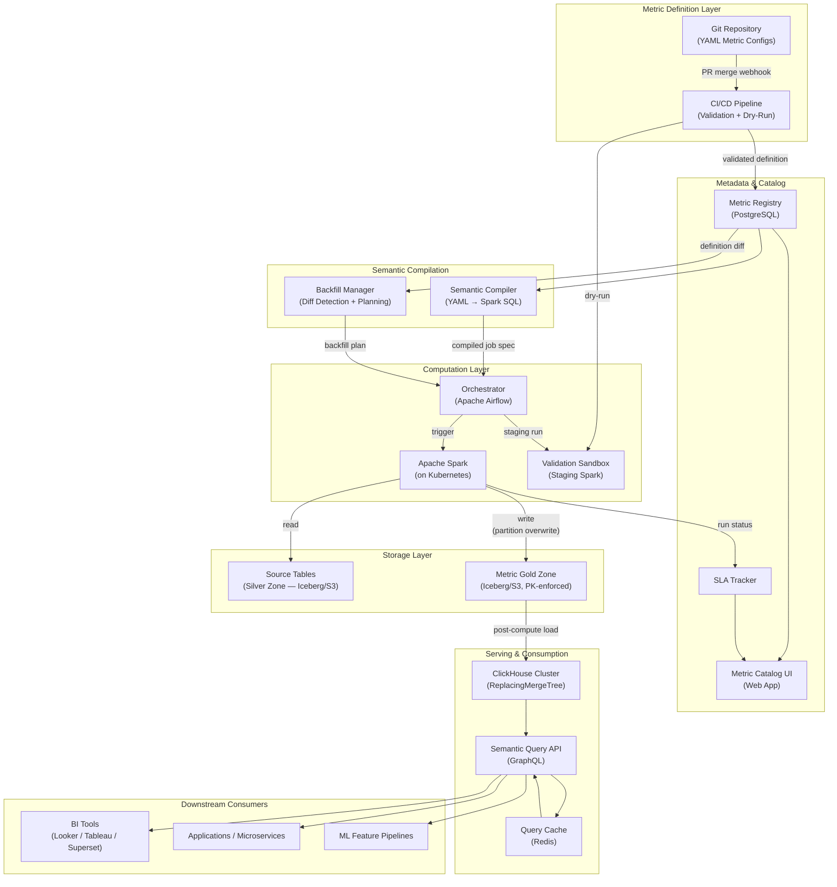

# Distributed Metrics Repositories for Consistent Data Consumption

-----

## Original Problem Statement

One of the most persistent problems in large organizations is \"metric discrepancy,\" where different teams report different values for the same business KPI (e.g., Revenue or Active Users) because they derive them from slightly different data sources or transformations. The solution is a distributed metrics store, exemplified by Airbnb's Minerva, which standardizes how metrics are defined, calculated, and consumed.

### The Core Architectural Challenge

The system must transition the organization from \"thinking in terms of tables\" to \"thinking in terms of metrics and dimensions\". This requires a declarative design where data producers provide self-sufficient metadata---defining *what* needs to be produced rather than *how*. The platform then handles the programmatic joining of tables and ensures that backfills are triggered automatically whenever business logic changes, maintaining a consistent historical view.

### High-Level Requirements

| **Requirement Type** | **Description** |
| --- | --- |
| **Functional** | Declarative metric definition layer that abstracts away the underlying SQL complexity. |
| **Functional** | Automated backfill management for historical data when metric definitions are updated. |
| **Functional** | Support for periodic snapshot fact tables at multiple grains (daily, weekly, monthly). |
| **Functional** | Unified API or Semantic Model for consistent consumption by BI tools and applications. |
| **Non-Functional** | Consistency: The same metric must return identical results across all downstream platforms. |
| **Non-Functional** | Scalability: Computational and operational efficiency through the reuse of existing pre-aggregations. |
| **Non-Functional** | Testability: Prototyping tools for users to validate metric correctness before production deployment. |
| **Non-Functional** | Availability: Staging environments for safe data backfills and SLA-guaranteed production datasets. |

### Nuanced Considerations for Staff Engineers

A key optimization in designing such a system is the removal of high-cardinality dimensions from pre-aggregation layers to ensure that rollup tables remain performant. For Staff Engineers, the focus is on the \"single pane of glass\" observability, where users can see expected SLAs, breach justifications, and mitigation timelines for every dataset. The architecture should also support \"idempotent gold zones,\" where primary key enforcement allows for the safe replaying of transactions from silver layers without the risk of duplicating data or corrupting historical trends.

-----


## Architectural Design Document

### Phase 1: Scoping & Requirements

#### Problem Restatement

We need to build a **distributed metrics store** — a centralized semantic layer that standardizes how business KPIs (Revenue, Active Users, Conversion Rate, etc.) are defined, computed, and consumed across an entire organization. The system eliminates "metric discrepancy" — the pervasive problem where different teams report different numbers for the same KPI because they derive from different source tables, apply different filters, or use different aggregation logic. This is architecturally equivalent to what Airbnb built with **Minerva**, what LinkedIn built with **UMP (Unified Metrics Platform)**, and what dbt's **MetricFlow** provides as a semantic layer.

The key paradigm shift: move the organization from **"thinking in tables"** to **"thinking in metrics and dimensions"** — where metric definitions are declarative, computation is centralized and idempotent, and every downstream consumer (BI dashboard, API, ML pipeline) reads from a single authoritative source.

#### Functional Requirements

| # | Requirement |
|---|-------------|
| F1 | Declarative metric definition layer (YAML/DSL in Git) abstracting underlying SQL/join complexity. Users specify *what* to compute, not *how*. |
| F2 | Semantic Compiler that parses metric definitions and generates optimized computation plans (Spark SQL / dbt models). |
| F3 | Automated multi-grain materialization — periodic snapshot fact tables at daily, weekly, and monthly grains. |
| F4 | Automated backfill management: when a metric definition changes, historically recompute affected partitions without manual intervention. |
| F5 | Unified Semantic Query API for consistent consumption by BI tools (Looker, Tableau, Superset), applications, and ad-hoc SQL users. |
| F6 | Validation sandbox / staging environment where metric authors test changes against historical data before production promotion. |
| F7 | Metric catalog with searchable registry: ownership, SLA, lineage, documentation, and version history. |
| F8 | High-cardinality dimension exclusion from pre-aggregation layers to keep rollup tables performant. |

#### Non-Functional Requirements

| Attribute | Target |
|-----------|--------|
| Consistency | Same metric query → identical result across all consumers (BI, API, dashboards, ML) — this is *the* core invariant |
| Freshness | Daily metrics available by T+6h; near-real-time metrics (extension) within 5 minutes |
| Query Latency (Serving) | p99 < 2 seconds for dashboard queries over pre-computed metrics |
| Serving Availability | 99.9% for the Semantic Query API and serving layer |
| Pipeline Availability | 99.5% for the computation pipeline (Spark + Airflow) |
| Scale | ~1,000 metric definitions, ~10K dimension combinations, ~50K metric queries/day |
| Backfill Throughput | Recompute 1 year of daily partitions for a single metric within 4 hours |
| Idempotency | All computations must be idempotent — safe to replay from Silver layer without duplicating data |
| Testability | Every metric change must be validatable in staging before production deployment |

#### Assumptions

- Source data lives in a Medallion-architecture data lakehouse (Iceberg on S3): Bronze → Silver → Gold
- Open-source first; AWS as cloud provider
- Batch-dominant workloads; real-time as a future extension
- Single-org, multi-team environment (~500 data consumers, ~50 metric-authoring teams)

---

### Phase 2: High-Level Design & Architecture

#### Back-of-Envelope Estimation

**Storage (Gold Zone — Materialized Metrics):**

| Parameter | Estimate |
|-----------|----------|
| Active metrics | 1,000 |
| Avg rows per metric per day (after high-cardinality pruning) | 50,000 |
| Row size (metric_name + dimensions + value + metadata) | ~200 bytes |
| Daily storage (all metrics, daily grain) | 1,000 × 50K × 200B = **10 GB/day** |
| Weekly + monthly grains overhead | ~20% additional → **12 GB/day** |
| Annual storage (hot, queryable) | 12 GB × 365 = **~4.4 TB/year** |
| 3-year hot retention | **~13 TB** |
| ClickHouse with 10:1 compression | **~1.3 TB on disk** |

**Compute:**

| Parameter | Estimate |
|-----------|----------|
| Daily materialization jobs | 1,000 metrics × 3 grains = 3,000 jobs (many batched into metric sets) |
| Avg job duration | 5 min on 4 Spark cores |
| Daily core-hours | ~250 core-hours |
| Backfill (1 metric × 365 partitions) | 365 × 5 min = 30 hours sequential → **~3 hours** on 10 parallel executors |

**Query Load:**

| Parameter | Estimate |
|-----------|----------|
| Daily queries | 50,000 |
| Avg QPS | ~0.6 QPS |
| Peak QPS | ~5 QPS |
| With caching | ~80% cache-hit → ~1 QPS effective to ClickHouse |

Verdict: moderate scale — a single ClickHouse cluster and a mid-size Spark cluster handle this comfortably. The challenge is **architectural correctness** (consistency, backfills, semantic compilation), not raw throughput.

#### High-Level Components

| Component | Technology | Role |
|-----------|------------|------|
| Metric Definition Repository | Git (GitHub/GitLab) | Version-controlled YAML metric configs with PR review workflow |
| Metric Registry | PostgreSQL | Metadata store: parsed definitions, versions, ownership, SLA tracking |
| Semantic Compiler | Custom service (Python/Scala) | Translates YAML definitions → optimized Spark SQL / computation DAGs |
| Computation Engine | Apache Spark (on K8s) | Executes materialization jobs — reads Silver/Gold Iceberg → writes Metric Gold Zone |
| Orchestrator | Apache Airflow | DAG-based scheduling for daily materialization + backfill jobs |
| Backfill Manager | Custom service + Airflow | Detects definition diffs, generates backfill plans, schedules partition-level recomputation |
| Metric Gold Zone | Apache Iceberg on S3 | ACID-transactional, partitioned, idempotent storage for computed metrics |
| Serving Layer | ClickHouse | Low-latency columnar store for pre-computed metric queries |
| Semantic Query API | GraphQL gateway | Unified API that resolves metric+dimension queries → ClickHouse SQL |
| Metric Catalog UI | Web application | Discovery portal: search metrics, view lineage, SLA status, ownership |
| Validation Sandbox | Staging Spark + shadow Iceberg tables | Pre-production testing of metric changes |

#### Data Flow (Happy Path)

```
1. DEFINE    Metric author writes YAML definition → opens Pull Request in Git

2. VALIDATE  CI pipeline triggers:
             → Semantic Compiler parses YAML (syntax + dependency check)
             → Dry-run against staging data (row count sanity, schema validation)
             → Data quality assertions (Great Expectations / dbt tests)

3. REGISTER  On PR merge → webhook fires → Metric Registry (Postgres) updated
             → new version recorded, old version soft-deactivated

4. COMPILE   Semantic Compiler generates optimized Spark SQL job specification
             → resolves source tables, joins, filters, GROUP BY dimensions
             → emits parameterized SQL template + Spark resource config

5. SCHEDULE  Orchestrator (Airflow) creates/updates DAG for this metric
             → daily sensor waits for source data availability
             → then triggers Spark job

6. COMPUTE   Spark reads source tables from Silver/Gold Iceberg
             → applies joins, filters, aggregations per compiled SQL
             → writes to Metric Gold Zone (Iceberg) via partition overwrite (idempotent)

7. LOAD      Post-materialization hook triggers ClickHouse ingestion
             → fresh partitions loaded into metric_serving table
             → ReplacingMergeTree deduplicates by (metric, grain, date, dimensions)

8. SERVE     BI tool / application queries Semantic Query API (GraphQL)
             → API resolves metric name → looks up serving table schema
             → generates ClickHouse SQL → returns consistent result

9. BACKFILL  On definition change:
             → Backfill Manager detects YAML diff (filter changed, dimension added, etc.)
             → generates backfill plan: metric X, partitions [start..end], priority
             → validates sample in staging → schedules production recomputation
             → Iceberg partition overwrite → ClickHouse reload
```

#### Architecture Diagram



---

### Phase 3: Deep Dive — Data Model & Storage

#### Metric Definition Schema (YAML)

```yaml
metric:
  name: daily_active_users
  display_name: "Daily Active Users"
  description: "Count of unique users with at least one qualifying action per day"
  type: count_distinct          # count, sum, avg, count_distinct, ratio, derived
  expression: user_id

  source:
    table: silver.user_activity
    database: analytics

  filters:
    - field: event_type
      operator: in
      values: [login, page_view, api_call]
    - field: is_bot
      operator: "="
      value: false

  dimensions:
    - name: country
      column: geo_country
      cardinality: low
    - name: platform
      column: device_platform
      cardinality: low
    - name: user_segment
      column: user_tier
      cardinality: low

  excluded_from_rollup:
    - user_id              # high-cardinality — only computed on-demand

  grains: [daily, weekly, monthly]

  owner: growth-team
  sla:
    freshness_hours: 6
    availability_pct: 99.9

  tests:
    - type: row_count_delta
      threshold_pct: 30    # alert if output swings > 30% from prior run
    - type: not_null
      columns: [metric_value]

  tags: [growth, engagement, kpi]
  version: 3
```

Metric sets (Minerva concept) allow grouping metrics that share the same source table and filters into a single computation pass:

```yaml
metric_set:
  name: growth_engagement_set
  source:
    table: silver.user_activity
    database: analytics
  shared_filters:
    - field: is_bot
      operator: "="
      value: false
  metrics:
    - daily_active_users
    - daily_sessions
    - avg_session_duration
  grains: [daily, weekly]
  owner: growth-team
```

#### Metric Registry (PostgreSQL)

```sql
CREATE TABLE metric_definitions (
    metric_id         UUID PRIMARY KEY DEFAULT gen_random_uuid(),
    name              VARCHAR(255) UNIQUE NOT NULL,
    display_name      VARCHAR(500),
    description       TEXT,
    metric_type       VARCHAR(50) NOT NULL,
    expression        TEXT NOT NULL,
    source_table      VARCHAR(500) NOT NULL,
    filters_json      JSONB,
    dimensions_json   JSONB,
    excluded_dims     TEXT[],
    grains            TEXT[] NOT NULL,
    owner             VARCHAR(255),
    sla_freshness_h   INTEGER DEFAULT 6,
    sla_availability  DECIMAL(5,2) DEFAULT 99.90,
    tests_json        JSONB,
    tags              TEXT[],
    version           INTEGER DEFAULT 1,
    is_active         BOOLEAN DEFAULT TRUE,
    compiled_sql      TEXT,
    created_at        TIMESTAMPTZ DEFAULT now(),
    updated_at        TIMESTAMPTZ DEFAULT now()
);

CREATE TABLE metric_versions (
    version_id        UUID PRIMARY KEY DEFAULT gen_random_uuid(),
    metric_id         UUID REFERENCES metric_definitions(metric_id),
    version           INTEGER NOT NULL,
    definition_yaml   TEXT NOT NULL,
    compiled_sql      TEXT,
    changed_by        VARCHAR(255),
    change_summary    TEXT,
    created_at        TIMESTAMPTZ DEFAULT now(),
    UNIQUE(metric_id, version)
);

CREATE TABLE metric_computation_runs (
    run_id            UUID PRIMARY KEY,
    metric_id         UUID REFERENCES metric_definitions(metric_id),
    grain             VARCHAR(20),
    partition_date    DATE,
    status            VARCHAR(20),   -- pending | running | success | failed
    started_at        TIMESTAMPTZ,
    completed_at      TIMESTAMPTZ,
    row_count         BIGINT,
    definition_ver    INTEGER,
    is_backfill       BOOLEAN DEFAULT FALSE,
    spark_app_id      VARCHAR(255),
    error_message     TEXT
);

CREATE TABLE metric_sla_tracking (
    metric_id         UUID REFERENCES metric_definitions(metric_id),
    partition_date    DATE,
    grain             VARCHAR(20),
    expected_by       TIMESTAMPTZ,
    available_at      TIMESTAMPTZ,
    breached          BOOLEAN DEFAULT FALSE,
    breach_reason     TEXT,
    mitigation        TEXT,
    PRIMARY KEY (metric_id, partition_date, grain)
);
```

#### Materialized Metric Table (Iceberg on S3 — Gold Zone)

```sql
CREATE TABLE gold.metric_facts (
    metric_name       STRING,
    grain             STRING,
    period_start      DATE,
    period_end        DATE,
    dimension_key     STRING,       -- deterministic composite: country|platform|segment
    country           STRING,
    platform          STRING,
    user_segment      STRING,
    metric_value      DOUBLE,
    supporting_count  BIGINT,       -- row count feeding this aggregation
    definition_ver    INT,
    computed_at       TIMESTAMP
)
PARTITIONED BY (metric_name, grain, period_start)
TBLPROPERTIES (
    'format-version' = '2',
    'write.delete.mode' = 'merge-on-read',
    'write.update.mode' = 'merge-on-read'
);
```

**Why Iceberg?** Partition overwrite gives us idempotent writes — the same job can be replayed safely. Snapshot isolation means readers never see partial writes. Time-travel allows instant rollback if a backfill produces bad data. This is the "idempotent gold zone" referenced in the problem statement: primary key enforcement via `dimension_key` + partition overwrite ensures no duplicates.

#### Serving Layer (ClickHouse)

```sql
CREATE TABLE metric_serving (
    metric_name      LowCardinality(String),
    grain            LowCardinality(String),
    period_start     Date,
    period_end       Date,
    country          LowCardinality(String),
    platform         LowCardinality(String),
    user_segment     LowCardinality(String),
    metric_value     Float64,
    definition_ver   UInt32,
    computed_at      DateTime
)
ENGINE = ReplacingMergeTree(computed_at)
PARTITION BY (metric_name, toYYYYMM(period_start))
ORDER BY (metric_name, grain, period_start, country, platform, user_segment);
```

`ReplacingMergeTree` with `computed_at` as the version column ensures that reloads/backfills naturally replace stale rows. Background merges deduplicate asynchronously; `FINAL` keyword forces dedup at query time when needed.

#### Storage Strategy

| Tier | Technology | Data | Retention |
|------|------------|------|-----------|
| **Hot** | ClickHouse (serving layer) | Pre-computed rollups, latest 90 days | 90 days |
| **Warm** | Iceberg on S3 (Gold Zone) | Full metric history, all grains | 3 years |
| **Cold** | S3 Glacier Deep Archive | Archived metric snapshots | >3 years, regulatory |

#### Caching Strategy

- **Redis look-aside cache** in front of Semantic Query API
- Cache key: `hash(metric_name, grain, date_range, dimension_filters)`
- TTL: matches metric freshness SLA (e.g., 6 hours for daily metrics)
- Cache invalidation: triggered by post-materialization webhook (explicit invalidation on fresh data)
- Expected hit rate: ~80% (dashboards issue repetitive queries)

---

### Phase 4: Deep Dives — Key Subsystems

#### 4.1 Semantic Compiler

The Semantic Compiler is the intellectual core — the component that makes "thinking in metrics" possible. Given a metric definition, it:

1. **Resolves source dependencies**: Identifies all source tables. For derived metrics (e.g., `revenue_per_dau = revenue / daily_active_users`), resolves the dependency DAG.
2. **Generates aggregation SQL**: Maps `type: count_distinct` + `expression: user_id` → `COUNT(DISTINCT user_id)`. Maps `type: ratio` → numerator/denominator with coalesce guards.
3. **Injects filters**: Applies WHERE clauses from the definition, parameterized by `{{ partition_date }}` for incremental computation.
4. **Handles grain rollups**:
   - For **additive** metrics (SUM, COUNT): weekly/monthly grains re-aggregate from pre-computed daily grain → single scan, no source re-read.
   - For **non-additive** metrics (COUNT_DISTINCT, percentiles): must recompute from raw source at each grain. The compiler detects this and generates separate jobs.
5. **Metric set optimization**: If multiple metrics share the same source + filter, generates a single scan with multiple aggregations. Reduces source I/O by 3-5x for co-located metrics. Directly inspired by Minerva's "metric set" pattern.
6. **Emits Spark job spec**: Parameterized SQL template + Spark config (executor count, memory, shuffle partitions). Registered as an Airflow task.

Example compiled output for `daily_active_users`:

```sql
-- Auto-generated by Semantic Compiler v3 for metric: daily_active_users
-- Definition version: 3 | Grain: daily | Partition: {{ ds }}
INSERT OVERWRITE TABLE gold.metric_facts
PARTITION (metric_name = 'daily_active_users', grain = 'daily', period_start = DATE '{{ ds }}')
SELECT
    'daily_active_users'                                        AS metric_name,
    'daily'                                                     AS grain,
    DATE '{{ ds }}'                                             AS period_start,
    DATE '{{ ds }}'                                             AS period_end,
    CONCAT_WS('|', geo_country, device_platform, user_tier)     AS dimension_key,
    geo_country                                                 AS country,
    device_platform                                             AS platform,
    user_tier                                                   AS user_segment,
    CAST(COUNT(DISTINCT user_id) AS DOUBLE)                     AS metric_value,
    COUNT(*)                                                    AS supporting_count,
    3                                                           AS definition_ver,
    CURRENT_TIMESTAMP()                                         AS computed_at
FROM silver.user_activity
WHERE dt = DATE '{{ ds }}'
  AND event_type IN ('login', 'page_view', 'api_call')
  AND is_bot = FALSE
GROUP BY geo_country, device_platform, user_tier;
```

#### 4.2 Backfill Manager

The most operationally critical subsystem. When business logic changes (e.g., "we decided bots should be excluded from DAU" or "add a new `acquisition_channel` dimension"), historical data must be recomputed so that time-series comparisons remain valid.

**Workflow:**

```
1. DETECT    Git webhook on PR merge → compare old YAML vs. new YAML
             → classify change type:
               • Filter change       → affects ALL historical partitions
               • New dimension       → affects ALL (new GROUP BY column)
               • Expression change   → affects ALL
               • SLA-only change     → NO recompute needed
               • Tag/owner change    → NO recompute needed

2. PLAN      Generate backfill plan:
             → metric: daily_active_users
             → affected grains: [daily, weekly, monthly]
             → date range: [metric_creation_date .. yesterday]
             → partition chunks: 30-day batches (parallelizable)
             → estimated cost: 365 partitions × 5 min = ~3h on 10 executors
             → priority: MEDIUM (backfill) — lower than daily production

3. STAGE     Run sample recomputation (last 7 days) in staging
             → compare output vs. production (row count, value distribution)
             → run data quality assertions
             → require human approval for >50% value change (safety net)

4. EXECUTE   Schedule via Airflow:
             → separate resource pool (backfill_pool, lower priority)
             → 30-day partition chunks run in parallel
             → each chunk: Spark job → Iceberg partition overwrite (idempotent)
             → progress tracked in metric_computation_runs table

5. RELOAD    On chunk completion:
             → trigger ClickHouse reload for affected partitions
             → invalidate Redis cache for affected metric+date combos

6. VERIFY    Post-backfill validation:
             → compare row counts, checksums with pre-backfill snapshot
             → run SLA tracker assertions
             → if anomaly detected: rollback via Iceberg time-travel
```

**Key design decisions:**
- Backfills run in a **separate Spark resource pool** with lower priority than production daily jobs. Prevents backfills from starving SLA-critical daily computations.
- **Partition-level granularity**: only affected partitions are recomputed, not the entire history. If a filter changes, all partitions are affected. If only an SLA tag changes, zero recomputation.
- **Iceberg partition overwrite** ensures idempotency — a failed-and-retried backfill produces the same result, never duplicates.

#### 4.3 Semantic Query API

The GraphQL-based API is the single entry point for all metric consumers. Translates high-level metric queries into optimized ClickHouse SQL.

**Query interface:**

```graphql
query {
  metric(name: "daily_active_users") {
    timeseries(
      grain: DAILY
      dateRange: { start: "2025-01-01", end: "2025-12-31" }
      dimensions: { country: "US", platform: ["ios", "android"] }
    ) {
      period_start
      country
      platform
      metric_value
    }
  }
}
```

**Query routing logic:**

```
1. Look up metric in Registry → get definition, grains, dimensions, serving schema
2. Check if requested dimensions are in pre-computed rollup
   → YES: route to ClickHouse (fast path, p99 < 2s)
   → NO (high-cardinality excluded dims): route to Trino on Iceberg (slow path, on-demand)
3. Check Redis cache → if hit, return immediately
4. Generate ClickHouse SQL → execute → cache result → return
```

This transparent routing ensures consumers never need to know whether a metric is pre-computed or computed on-demand. The API abstracts this entirely.

#### 4.4 High-Cardinality Dimension Handling

Per the problem statement, this is a critical optimization. Without it, a metric with a `user_id` dimension would produce billions of rows in the rollup table, defeating the purpose of pre-aggregation.

| Dimension Cardinality | Handling | Query Path |
|----------------------|----------|------------|
| **Low** (< 1,000 unique values) | Included in pre-computed rollup | ClickHouse (fast) |
| **Medium** (1K–100K) | Included in rollup with table size monitoring | ClickHouse (fast) |
| **High** (> 100K, e.g., user_id, session_id) | Excluded from rollup, marked in definition | Trino on Iceberg (slow, on-demand) |

The Semantic Compiler enforces this: dimensions marked `cardinality: high` or listed in `excluded_from_rollup` are omitted from the GROUP BY in materialization jobs. The Semantic Query API detects when a query involves excluded dimensions and transparently routes to the on-demand computation path.

---

### Phase 5: Trade-offs & Justification

| Decision | Choice | Why This | Why Not Alternatives |
|----------|--------|----------|---------------------|
| Metric definitions | Git-backed YAML | Version control, PR review workflow, audit trail, GitOps-native. Similar to Airbnb Minerva's config-as-code. | DB-only: no review workflow, no diff visibility. UI-only: hard to version, no code review. |
| Metadata store | PostgreSQL | ACID for definition versioning, rich JSONB support for flexible schema, battle-tested. | MongoDB: unnecessary flexibility, weaker consistency. etcd: not designed for relational queries. |
| Computation engine | Apache Spark (on K8s) | Handles PB-scale joins/aggregations, native Iceberg support, dynamic resource allocation. | dbt: excellent for SQL-first but struggles with complex multi-source joins at PB scale. Flink: overkill for batch. |
| Orchestration | Apache Airflow 2.x | Industry standard, dynamic DAG generation via API, rich sensor/operator ecosystem, DAG serialization for scale. | Dagster: better data-aware primitives but smaller ecosystem. Prefect: less battle-tested at scale. |
| Gold Zone format | Apache Iceberg | ACID partition overwrite (idempotent), snapshot isolation, time-travel for rollback, partition evolution without rewrites. | Delta Lake: strong but tighter Databricks coupling. Hudi: more complex operations, MOR compaction overhead. |
| Serving layer | ClickHouse | Columnar, ReplacingMergeTree handles upserts naturally, 10:1 compression, simpler ops vs. Druid, excellent single-node perf. | Druid: higher concurrency ceiling but far more complex ops (ZooKeeper, Deep Storage, etc.). Pinot: LinkedIn-optimized, heavier. |
| Query API | GraphQL | Strongly-typed metric queries, dimension filtering maps naturally to GraphQL args, introspectable schema for BI integration. | REST: workable but less expressive for nested dimension queries. gRPC: overkill for BI tools, no browser-native support. |
| Caching | Redis (look-aside) | Simple, sub-ms latency, TTL-based expiry aligned to metric freshness SLA, explicit invalidation on new data. | Varnish/CDN: too coarse-grained, can't invalidate per-metric. In-process: not shared across API instances. |
| Pre-compute vs. on-the-fly | **Hybrid** | Pre-compute standard grains for consistency + performance; fall back to on-the-fly (Trino on Iceberg) for ad-hoc/high-cardinality. | Pure pre-compute: can't handle ad-hoc exploration. Pure on-the-fly: slow, no consistency guarantee. |

#### Consistency vs. Availability (CAP)

This system **strongly favors consistency**. The entire raison d'être is "same metric = same number everywhere." Achieved through:

- **Single materialization path**: one Spark job per metric per grain — no competing writers
- **Atomic partition overwrite**: Iceberg snapshot isolation — readers see old or new, never partial
- **ReplacingMergeTree**: ClickHouse deduplicates by `computed_at` version — latest always wins
- **Single Semantic API**: all consumers query through one gateway — no direct lakehouse access for dashboards

If the serving layer goes down, dashboards are **unavailable** — but they **never show inconsistent data**. This is the correct trade-off for a metrics store.

#### Push vs. Pull Model

| Boundary | Model | Rationale |
|----------|-------|-----------|
| Computation → Gold Zone (Iceberg) | Push | Spark writes completed partitions proactively |
| Gold Zone → Serving Layer (ClickHouse) | Push | Post-materialization webhook triggers load |
| Serving → Consumers | Pull | BI tools query on demand via Semantic API |
| Definition change → Backfill | Push | Git webhook triggers Backfill Manager |

---

### Phase 6: Reliability, Scaling & Operations

#### Bottlenecks & Mitigation

| Bottleneck | Risk | Mitigation |
|------------|------|------------|
| Spark cluster saturation during backfills | Backfills starve daily production SLAs | Separate resource pools: `production_pool` (high priority) and `backfill_pool` (low priority, preemptible). Spark Dynamic Resource Allocation. |
| Airflow scheduler with 1000+ DAGs | Scheduler loop latency increases | Airflow 2.x DAG serialization, separate scheduler per DAG folder, KubernetesExecutor for elastic workers. |
| ClickHouse ingestion during bulk backfill loads | Write amplification from merges | Batch inserts (100K rows/batch), stagger loads across partitions, use `Buffer` engine as write buffer. |
| Semantic Compiler single-threaded | Compilation bottleneck on mass definition changes | Stateless compiler → horizontal scale. Cache compiled SQL keyed by definition content hash. Parallel compilation. |
| Hot metric queries (exec dashboard) | Single ClickHouse partition hot | Redis cache absorbs repeated queries. ClickHouse distributed table with replicas for read fanout. |

#### Failure Handling

| Failure Scenario | Recovery Strategy |
|-----------------|-------------------|
| Spark job fails mid-computation | Idempotent: retry overwrites same Iceberg partition. Airflow retry policy: 3 attempts, exponential backoff (1m, 5m, 15m). |
| ClickHouse node crash | `ReplicatedReplacingMergeTree` with RF=2. Reads served by surviving replica. Auto-recovery via ZooKeeper/ClickHouse Keeper. |
| Bad metric definition merged | Staging validation catches most issues (dry-run + DQ assertions). If production breaks: revert Git commit → re-run with previous version. Iceberg time-travel to rollback Gold Zone. |
| Source Silver data arrives late | Airflow `ExternalTaskSensor` / `S3KeySensor` waits for data. SLA tracker records delay, alerts owner. Job runs when data appears. |
| Backfill produces anomalous data | Post-backfill validation compares vs. pre-backfill snapshot. Anomaly > threshold → auto-rollback via Iceberg `rollback_to_snapshot`. |
| Poison metric definition (Cartesian explosion) | Dry-run in staging enforces row count ceiling (10x expected). Circuit breaker kills jobs exceeding 10x row output or 5x duration. |
| Redis cache corruption | Look-aside: miss falls through to ClickHouse. Warm-up script pre-populates cache for top-50 dashboard metrics after each materialization cycle. |

#### Edge Cases

- **Concurrent definition changes**: Git merge conflicts handled by Git. Metric Registry uses optimistic locking (`version` column — `UPDATE ... WHERE version = expected`).
- **Clock skew in grain boundaries**: All computation uses UTC. Grain boundaries are deterministic via `DATE_TRUNC`. No timezone-dependent logic.
- **Metric deletion**: Soft-delete in Registry (`is_active = FALSE`). Iceberg data retained for time-travel/audit. ClickHouse data TTL-expired after 90 days.
- **Derived metric circular dependency**: Semantic Compiler builds a DAG and rejects cycles at validation time. Topological sort determines execution order.

#### Observability — Golden Signals

| Signal | Metric | Alert Threshold |
|--------|--------|-----------------|
| **Freshness** | `metric.freshness_lag_hours` — hours since last successful computation | > SLA freshness hours |
| **Computation Latency** | `metric.job_duration_seconds` — p50/p95/p99 | Duration > 2x p95 baseline |
| **Query Latency** | `api.query_latency_p99` — API response time | p99 > 2 seconds |
| **Error Rate** | `metric.job_failure_rate`, `api.query_error_rate` | Job failure > 5%; API error > 1% |
| **Data Quality** | `metric.row_count_delta_pct` — % change from previous run | > 30% swing triggers review |
| **Saturation** | Spark executor util, ClickHouse CPU/memory, Airflow queue depth | > 80% sustained |

#### SLAs & SLOs

| SLO | Target | Measurement |
|-----|--------|-------------|
| Daily metric freshness | Available by T+6h (06:00 UTC for prior day) | `metric_sla_tracking` table |
| Semantic API availability | 99.9% (< 8.7h downtime/year) | Uptime probe (synthetic GET every 60s) |
| Query latency | p99 < 2 seconds | API instrumentation |
| Metric consistency | Zero discrepancy across consumers | Periodic cross-consumer validation (query same metric from Looker + API + direct SQL, assert identical) |
| Backfill completion | 1-year recomputation within 4 hours | `metric_computation_runs` timing |

#### Single Pane of Glass (per problem statement)

The Metric Catalog UI provides an operational dashboard per metric:

```
┌────────────────────────────────────────────────────────────────────┐
│  Metric: daily_active_users (v3)             Owner: growth-team    │
├────────────────────────────────────────────────────────────────────┤
│  Status:         ● HEALTHY                                         │
│  Last Computed:  2026-02-23 04:32 UTC (T+4.5h — within SLA)       │
│  SLA:            T+6h | Breaches (30d): 0                          │
│  Grains:         daily ✓ | weekly ✓ | monthly ✓                    │
│  Freshness:      2026-02-22 (daily), 2026-W08 (weekly)             │
│  Row Count:      52,341 → 51,987 → 53,102 (stable)                │
│  Active Backfills: None                                            │
│  Lineage:        silver.user_activity → [compile] → gold.metrics   │
│                  → [load] → clickhouse.metric_serving               │
│  Downstream:     exec_dashboard, growth_weekly, ml_features         │
│  Definition:     [View YAML] [Compiled SQL] [Version History]      │
│  SLA History:    [View 90-day timeline]                            │
└────────────────────────────────────────────────────────────────────┘
```

---

### Phase 7: Staff-Level Considerations

#### Cost Analysis

| Cost Driver | Estimate | Optimization |
|-------------|----------|-------------|
| Spark compute (daily production) | ~250 core-hours/day × $0.05 = **~$12.50/day** | Reserved instances for predictable base load |
| Spark compute (backfills) | Variable, ~3h burst per metric change | **Spot instances** — idempotent jobs are safe to retry on preemption |
| ClickHouse cluster | 3-node, 1.3 TB compressed = **~$2K/month** | 10:1 compression, TTL-based expiry of old hot data |
| S3 storage (Iceberg Gold) | ~4.4 TB/year × $0.023/GB/month = **~$100/month** | S3 Intelligent Tiering for older partitions |
| Airflow + PostgreSQL | Small cluster = **~$500/month** | Managed Airflow (MWAA) to reduce ops burden |
| Redis cache | Single node, ~10 GB = **~$100/month** | ElastiCache reserved instance |
| **Total estimated** | **~$5K/month** | Dominated by ClickHouse + Spark |

**Key cost risk**: backfill cascades. A change to a foundational metric (e.g., `daily_active_users` feeding 20 derived metrics) triggers recomputation of the parent + all dependents. Mitigation: incremental backfill (only recompute partitions where output actually changes), partition-level diffing, mandatory cost estimation in backfill plan before approval.

#### Security

| Concern | Implementation |
|---------|---------------|
| Metric definition integrity | Git branch protection, required PR reviews, CODEOWNERS per domain |
| Column-level access control | PII-derived dimensions tagged in Iceberg metadata; Apache Ranger / OPA policies enforce team-level access |
| ClickHouse RBAC | Per-team read-only users, row-level security (team sees own metrics + public metrics) |
| API authentication | OAuth2 / JWT via IdP; metric-level authorization at API gateway |
| Encryption at rest | S3 SSE-KMS (Iceberg), ClickHouse encrypted disk volumes |
| Encryption in transit | TLS 1.3 everywhere (Spark ↔ S3, API ↔ ClickHouse, client ↔ API) |
| Audit trail | Definition changes in Git history; queries logged with user identity; backfills tracked in `metric_computation_runs` |

#### Evolution — Scaling 10x

| Evolution Path | Approach |
|----------------|----------|
| **Real-time metrics** | Add Apache Flink for streaming computation (e.g., real-time revenue). Dual-write to Iceberg (batch, source-of-truth) and ClickHouse (streaming, low-latency). API resolves path based on freshness needs. Similar to LinkedIn's Lambda architecture for UMP. |
| **ML Feature Store integration** | Metrics are features. Export definitions to Feast/Tecton for model training. Materialized metric tables become feature tables. Similar to how Minerva feeds both dashboards and ML. |
| **Derived metrics & composability** | Support `type: derived` (e.g., `revenue_per_dau = revenue / dau`). Compiler resolves dependency DAG, orchestrator ensures topological execution order. Enables business users to compose metrics without touching source data. |
| **Self-serve metric authoring** | UI-based metric builder with guardrails: cardinality limits, mandatory SLA, required DQ tests. Generates YAML under the hood, auto-creates PR for review. |
| **Multi-region serving** | ClickHouse cross-datacenter replication for global dashboards. Computation stays centralized to preserve single source of truth. |
| **10x metric count (10K metrics)** | Partition Airflow DAGs by domain. Shard Semantic Compiler horizontally. Tiered ClickHouse: separate clusters per domain with federated query. |
| **Experimentation integration** | Metrics store as source for A/B test analysis. Experiment platform queries API with cohort dimensions. Eliminates "experiment team vs. analytics team report different numbers." |

---

### References

| Reference | Relevance |
|-----------|-----------|
| [Airbnb Minerva](https://medium.com/airbnb-engineering/how-airbnb-achieved-metric-consistency-at-scale-f23cc53dea70) | Canonical metrics store — config-as-code, metric sets, backfill automation |
| [dbt MetricFlow / Semantic Layer](https://docs.getdbt.com/docs/build/about-metricflow) | Open-source semantic layer — compile-time SQL generation, dimension handling |
| [LinkedIn UMP](https://engineering.linkedin.com/blog/2020/unified-metrics-platform) | Unified Metrics Platform — centralized computation at LinkedIn scale |
| [Uber uMetric](https://www.uber.com/en-US/blog/umetric/) | Uber's metric standardization — similar declarative approach |
| [Apache Iceberg](https://iceberg.apache.org/) | Open table format — ACID transactions, partition overwrite, time-travel |
| [ClickHouse ReplacingMergeTree](https://clickhouse.com/docs/en/engines/table-engines/mergetree-family/replacingmergetree) | Serving layer engine for idempotent metric ingestion |

-----
