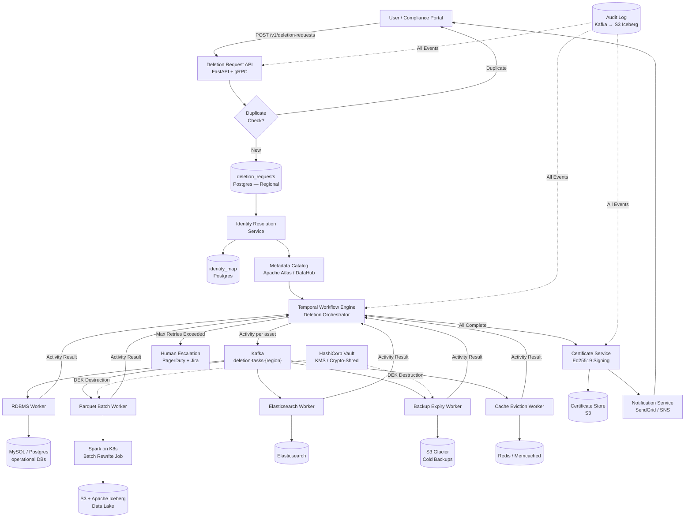

# Privacy-Aware Data Deletion and GDPR Compliance Orchestrator

-----

## Original Problem Statement

Regulations like GDPR (General Data Protection Regulation) and CCPA (California Consumer Privacy Act) have introduced the "Right to be Forgotten," a technical nightmare for systems designed for append-only, immutable storage.

Functionally, the system must act as a centralized coordinator for deletion requests. When a user requests deletion, the platform must first identify every location where that user's data is stored, referencing the enterprise metadata catalog. It must then orchestrate the deletion across a diverse set of technologies: from issuing DELETE statements in relational databases to rewriting large Parquet files on HDFS or S3 to remove specific rows. The system must provide a "Certificate of Deletion" once all traces have been purged, including backups and secondary indexes. A crucial requirement is the ability to handle data residency, ensuring that data for European users is processed and stored in compliance with local laws.

Non-functional requirements focus on auditability and accuracy. The system must be "fail-safe"; if a deletion fails in one downstream system, the request must stay in a retry loop until it succeeds, or be escalated to a human operator. Accuracy is vital; the system must never accidentally delete the wrong user's data due to a collision in identifiers. Furthermore, the deletion process should be "cost-aware," grouping deletion requests together to minimize the expensive overhead of rewriting massive data files.

| **Storage Type** | **Deletion Mechanism** | **Challenge** |
| --- | --- | --- |
| RDBMS | DELETE WHERE user_id =? | Locking and performance impact  |
| --- | --- | --- |
| Data Lake (Parquet) | Read-Modify-Write / Compaction | High I/O and compute cost  |
| --- | --- | --- |
| ElasticSearch | Delete by Query | Index fragmentation and CPU spikes  |
| --- | --- | --- |
| Cold Backups | Delayed deletion / Expiration | Operational complexity and visibility  |
| --- | --- | --- |

The broader implication of privacy engineering is the move toward "Privacy by Design". Senior engineers are increasingly adopting techniques such as Crypto-shredding, where each user's data is encrypted with a unique key. To "delete" the data, the system simply destroys the key, rendering the data unreadable without the need for massive file rewrites.

-----

# Privacy-Aware Data Deletion & GDPR Compliance Orchestrator — Architectural Design

---

## Phase 1: Scoping & Assumptions

### Problem Restatement

Design a centralized orchestration platform that fulfills regulatory "Right to be Forgotten" requests (GDPR Article 17, CCPA) by discovering every location where a user's data lives, executing the appropriate deletion strategy per storage type, and issuing a cryptographically-signed **Certificate of Deletion** — all while being fail-safe, cost-aware, and data-residency-compliant.

### Functional Requirements

1. Accept deletion requests via API from end-users or a compliance portal.
2. Resolve a user's identity across all downstream systems (email → user_id → device_id, etc.).
3. Query the enterprise metadata catalog to enumerate *every* data asset that holds user data.
4. Execute the correct deletion strategy per storage type (SQL DELETE, Crypto-Shred, Parquet rewrite, index delete, backup expiry).
5. Batch Parquet rewrites to minimize compute cost.
6. Provide an immutable, signed **Certificate of Deletion** upon full completion.
7. Handle **data residency**: EU user data must never leave EU during processing.
8. Escalate to a human operator if a deletion task exceeds max retries.
9. Support GDPR (30-day SLA), CCPA (45-day SLA), and LGPD (15-day SLA).
10. Never delete data belonging to the wrong user (identifier collision protection).

### Non-Functional Requirements

| Dimension | Target |
|---|---|
| Deletion SLA (GDPR) | 100% of requests fulfilled within 30 days |
| System Availability | 99.99% (orchestrator + API) |
| Throughput | 50,000 deletion requests/day (~0.58 req/sec avg; 5 req/sec peak) |
| Audit Log Durability | 99.999999999% (S3 11-nines) |
| Identifier Accuracy | Zero tolerance for cross-user data deletion |
| Certificate Integrity | Cryptographic non-repudiation (RSA-2048 or ECDSA-P256) |
| Data Residency | Strict regional isolation (EU, US, APAC) |
| Parquet Rewrite Latency | Best-effort within 7 days (well inside 30-day SLA) |

### Clarifying Assumptions

Since this is a design exercise, assumptions are made explicit here:

- **Scale**: ~10M active users; ~50K deletion requests/day at peak.
- **Data topology**: ~50 registered data assets (Postgres clusters, S3 data lake partitions, Elasticsearch indices, Glacier archives, Redis caches).
- **Crypto-shredding is opt-in but preferred**: New data assets onboarded post-launch will enforce per-user encryption at write time. Legacy assets require Parquet rewrite.
- **Metadata catalog exists**: Apache Atlas (or DataHub) is already operational and data assets are tagged with `pii=true` and `owner_id_column`.
- **Temporal is used for orchestration**: Its durable workflow model is ideal for long-running, multi-step compliance workflows.
- **Deletion is logically irreversible**: A soft-delete (tombstone) window of 72 hours is applied before physical deletion to catch accidental requests, after which the window closes.

---

## Phase 2: Back-of-Envelope Estimation

```
Deletion requests/day:        50,000
Avg data assets per user:     ~30 (across 50 registered systems)
Deletion tasks/day:           50,000 × 30 = 1,500,000 tasks/day  → ~17 tasks/sec avg
Peak tasks/sec:               ~170 tasks/sec (10× factor)

Certificate storage:          50,000 × ~5KB = 250 MB/day  → ~90 GB/year
Audit log:                    1,500,000 events × ~1KB = 1.5 GB/day  → ~550 GB/year

Parquet rewrite batches:
  - Assume 10% of tasks require rewrite (non-crypto-shredded assets)
  - 150,000 rewrite tasks/day grouped into ~200 batch jobs
  - Each batch Spark job: ~5-10 min on 4-node cluster

RDBMS tasks (SQL DELETE):     ~40% of tasks → 600,000 DELETEs/day → ~7 DELETE/sec (fine, off-peak scheduled)
```

---

## Phase 3: High-Level Architecture

### Core Services

| Service | Technology | Role |
|---|---|---|
| Deletion Request API | FastAPI / gRPC (Python) | Accepts and validates deletion requests |
| Identity Resolution Service | Custom (Postgres-backed) | Maps logical user identity to system-specific IDs |
| Metadata Catalog Client | Apache Atlas / DataHub SDK | Discovers all data assets tagged with user PII |
| Orchestration Engine | **Temporal** | Durable, fault-tolerant deletion workflow execution |
| Task Queue | **Apache Kafka** | Decouples orchestrator from deletion workers |
| Deletion Workers | Pluggable adapters (Python/JVM) | Execute storage-specific deletion logic |
| KMS / Crypto-Shred Service | **HashiCorp Vault** | Stores and destroys per-user DEKs |
| Batch Scheduler | Airflow (triggers Spark on K8s) | Groups Parquet rewrite tasks into cost-efficient batches |
| Certificate Service | Custom (Ed25519 signing) | Generates and stores signed deletion certificates |
| Audit Log | Kafka → S3 (Parquet/Iceberg) | Immutable record of all system events |
| Notification Service | SNS / SendGrid | Notifies user of completion with certificate link |
| Human Escalation Bridge | PagerDuty + Jira | Raises incidents for tasks exceeding max retries |
| Regional Controller | Per-region deployment | Enforces data residency; EU instance never calls US infra |

### Data Flow (Happy Path)

```
1.  User submits DELETE request → Deletion Request API
2.  API validates request (rate limit, duplicate check, tombstone window set)
3.  Request persisted to deletion_requests (Postgres, regional)
4.  Identity Resolution Service resolves user_id → {email, device_ids, ad_ids, ...}
5.  Metadata Catalog queried: returns list of ~30 data_asset records tagged with this user's PII
6.  Temporal Workflow created: DeletionWorkflow(request_id, user_id, asset_list)
7.  Temporal dispatches a DeletionTask activity per data asset
8.  Each activity publishes a task message to Kafka topic: deletion-tasks-{region}
9.  Appropriate worker consumes the message and executes deletion strategy
10. Worker ACKs Kafka offset only after confirmed deletion
11. Worker reports status back to Temporal via activity result
12. Temporal workflow waits for all activities; retries failed ones (exponential backoff)
13. After all activities succeed → Certificate Service generates signed cert
14. Certificate stored in S3, reference written to deletion_requests.certificate_id
15. Notification Service emails user with cert link
```

### Architecture Diagram



---

## Phase 4: Deep Dive — Data Model

### `deletion_requests`

```sql
CREATE TABLE deletion_requests (
    request_id          UUID PRIMARY KEY DEFAULT gen_random_uuid(),
    user_id             VARCHAR(255) NOT NULL,
    email_hash          VARCHAR(64) NOT NULL,          -- SHA-256; never store raw email
    regulation_type     VARCHAR(10) NOT NULL,           -- 'GDPR', 'CCPA', 'LGPD'
    status              VARCHAR(20) NOT NULL DEFAULT 'PENDING',
                        -- PENDING | TOMBSTONE_WINDOW | IN_PROGRESS
                        -- COMPLETED | PARTIALLY_FAILED | ESCALATED
    requested_at        TIMESTAMPTZ NOT NULL DEFAULT now(),
    tombstone_expires_at TIMESTAMPTZ NOT NULL,          -- requested_at + 72h
    deadline_at         TIMESTAMPTZ NOT NULL,           -- 30d/45d/15d from requested_at
    completed_at        TIMESTAMPTZ,
    certificate_id      UUID,
    workflow_id         VARCHAR(255),                   -- Temporal workflow run ID
    data_residency_region VARCHAR(10) NOT NULL,         -- 'EU', 'US', 'APAC'
    requester_ip_hash   VARCHAR(64),
    created_at          TIMESTAMPTZ DEFAULT now()
);

CREATE INDEX idx_dr_user_id ON deletion_requests (user_id);
CREATE INDEX idx_dr_status_deadline ON deletion_requests (status, deadline_at);
CREATE INDEX idx_dr_region ON deletion_requests (data_residency_region);
```

### `identity_map`

```sql
CREATE TABLE identity_map (
    user_id             VARCHAR(255) NOT NULL,
    system_id           VARCHAR(100) NOT NULL,   -- 'orders_db', 'analytics_lake', 'ad_platform'
    external_id         VARCHAR(255) NOT NULL,
    id_type             VARCHAR(50) NOT NULL,     -- 'user_id', 'email', 'device_id', 'session_id'
    verified_at         TIMESTAMPTZ NOT NULL,
    PRIMARY KEY (user_id, system_id, id_type)
);
```

### `deletion_tasks`

```sql
CREATE TABLE deletion_tasks (
    task_id             UUID PRIMARY KEY DEFAULT gen_random_uuid(),
    request_id          UUID NOT NULL REFERENCES deletion_requests(request_id),
    data_asset_id       VARCHAR(255) NOT NULL,    -- asset name in metadata catalog
    storage_type        VARCHAR(20) NOT NULL,
                        -- RDBMS | DATA_LAKE | ELASTICSEARCH | BACKUP | CACHE
    storage_locator     TEXT NOT NULL,            -- DSN / S3 prefix / ES index name
    deletion_strategy   VARCHAR(20) NOT NULL,
                        -- CRYPTO_SHRED | SQL_DELETE | PARQUET_REWRITE | INDEX_DELETE | EXPIRE
    status              VARCHAR(20) NOT NULL DEFAULT 'PENDING',
                        -- PENDING | BATCHED | IN_PROGRESS | COMPLETED | FAILED | ESCALATED
    retry_count         SMALLINT DEFAULT 0,
    max_retries         SMALLINT DEFAULT 5,
    batch_job_id        VARCHAR(255),             -- Airflow DAG run ID for PARQUET_REWRITE tasks
    rows_affected       BIGINT,
    scheduled_at        TIMESTAMPTZ,
    started_at          TIMESTAMPTZ,
    completed_at        TIMESTAMPTZ,
    error_message       TEXT
);

CREATE INDEX idx_dt_request_id ON deletion_tasks (request_id);
CREATE INDEX idx_dt_status_strategy ON deletion_tasks (status, deletion_strategy);
CREATE INDEX idx_dt_batch ON deletion_tasks (batch_job_id) WHERE batch_job_id IS NOT NULL;
```

### `deletion_certificates`

```sql
CREATE TABLE deletion_certificates (
    certificate_id      UUID PRIMARY KEY DEFAULT gen_random_uuid(),
    request_id          UUID NOT NULL REFERENCES deletion_requests(request_id),
    user_id_hash        VARCHAR(64) NOT NULL,    -- SHA-256 of user_id
    regulation_type     VARCHAR(10) NOT NULL,
    issued_at           TIMESTAMPTZ NOT NULL DEFAULT now(),
    s3_uri              TEXT NOT NULL,           -- s3://certs-bucket/{region}/{cert_id}.json
    signature           TEXT NOT NULL,           -- Base64 Ed25519 signature
    public_key_id       VARCHAR(100) NOT NULL    -- references key version in Vault
);
```

### `crypto_shred_keys` (Vault-managed, not a DB table)

HashiCorp Vault Transit Secret Engine:
- **Path**: `transit/keys/user-{user_id}-dek`
- **Key type**: `aes256-gcm96`
- At ingestion, data is encrypted via Vault's `encrypt` endpoint; ciphertext stored in storage.
- On deletion: Vault `DELETE transit/keys/user-{user_id}-dek` — key is gone, ciphertext is garbage.

---

## Phase 5: Storage Strategy

### Database Choices

| Data Store | Technology | Rationale |
|---|---|---|
| Deletion requests / tasks | **Postgres** (regional) | Strong consistency, ACID transactions, row-level locking |
| Identity map | **Postgres** | Low cardinality, point lookups by (user_id, system_id) |
| Certificates | **Postgres** (metadata) + **S3** (full JSON) | S3 for durability; Postgres for queryability |
| Audit log | **Kafka** → **S3 + Apache Iceberg** | Immutable, queryable via Trino/Athena; 7-year retention |
| Deletion task queue | **Apache Kafka** | Durable, replayable, supports consumer group isolation per worker type |
| Key Management | **HashiCorp Vault** (HA cluster) | Purpose-built for secret lifecycle; audit log built-in |

### Partitioning

- `deletion_requests`: partitioned by `data_residency_region` (EU/US/APAC) — table-level range partitions in Postgres, or separate regional Postgres instances for strict residency.
- `deletion_tasks`: partitioned by `created_at` (monthly) to keep operational partition hot; archived to S3 after 90 days.
- Audit log (Iceberg): partitioned by `event_date` and `region`.

### Hot/Warm/Cold Storage for Audit Data

| Tier | Storage | Retention | Access Pattern |
|---|---|---|---|
| Hot | Kafka (7-day retention) | 7 days | Real-time consumers |
| Warm | S3 Standard (Iceberg) | 2 years | Compliance queries via Athena |
| Cold | S3 Glacier Instant Retrieval | 7 years | Legal hold / regulator audit |

### Caching

- **No caching of PII** — identity resolution results are never cached to prevent stale identity data leading to wrong-user deletions.
- Metadata catalog lookups (asset metadata, not user data) cached in Redis with a 15-minute TTL and cache-aside pattern.

---

## Phase 6: Deletion Strategy Deep Dive

### 6.1 RDBMS (SQL DELETE)

**Strategy**: Issue `DELETE FROM {table} WHERE {owner_id_column} = ?` during off-peak hours.

**Collision Safety**: Always execute as a 2-step verify-then-delete within a transaction:
```sql
BEGIN;
SELECT COUNT(*), MIN(created_at), MAX(email_hash)
FROM users WHERE user_id = :uid;
-- Application verifies email_hash matches request
DELETE FROM users WHERE user_id = :uid;
COMMIT;
```
- If `email_hash` doesn't match, abort and escalate. Never delete on ID alone.
- Use `EXPLAIN ANALYZE` before deletion to estimate row count; abort if count deviates >2× from identity_map estimate.

### 6.2 Data Lake — Crypto-Shredding (Preferred)

**Strategy**: Per-user AES-256 envelope encryption at ingestion. Deletion = key destruction.

```
WRITE PATH:
  1. Ingestion service calls Vault: POST /v1/transit/encrypt/user-{uid}-dek
     → returns ciphertext of data
  2. Ciphertext stored in Parquet column `data_enc`
  3. Vault auto-rotates DEKs periodically; old versions kept for decryption

DELETE PATH:
  1. Worker calls Vault: DELETE /v1/transit/keys/user-{uid}-dek
  2. All ciphertext for this user in all Parquet files is permanently unreadable
  3. No file rewrite required
  4. Task completes in <1 second
```

**Regulatory Note**: EU DPA guidance (EDPB Opinion 5/2019) accepts crypto-shredding as equivalent to deletion, provided the key is provably destroyed and the encryption is AES-256 or stronger.

### 6.3 Data Lake — Parquet Rewrite (Legacy / Non-Encrypted Assets)

**Strategy**: Batch-collect rewrite tasks, group by S3 prefix/partition, execute Spark job.

**Batching Logic** (Airflow DAG: `parquet_deletion_batch`):
```
1. Every 6 hours: query deletion_tasks WHERE strategy='PARQUET_REWRITE' AND status='PENDING'
2. GROUP BY storage_locator (S3 prefix), sort by oldest request_id first
3. For each group: spawn Spark job on K8s
4. Spark job:
   a. df = spark.read.parquet(s3_prefix)
   b. user_ids_to_delete = broadcast(set of user_ids in this batch)
   c. clean_df = df.filter(~col("user_id").isin(user_ids_to_delete))
   d. clean_df.write.mode("overwrite").parquet(s3_prefix + ".tmp/")
   e. Atomic S3 rename: delete original, move .tmp → original
   f. For Apache Iceberg tables: use DELETE FROM table WHERE user_id IN (...)
      → Iceberg handles snapshot isolation; no manual rename needed
5. Update deletion_tasks status → COMPLETED
```

**Why Apache Iceberg?** Iceberg's `DELETE FROM` creates a new snapshot without rewriting unchanged files. Row-level deletes are stored as equality delete files and merged on next compaction — drastically cheaper than full Parquet rewrites. Reference: Netflix's Iceberg adoption for exactly this use case.

### 6.4 Elasticsearch

**Strategy**: `DELETE BY QUERY` with throttling to avoid CPU spike.

```json
POST /user-events-*/_delete_by_query?scroll_size=1000&requests_per_second=500
{
  "query": { "term": { "user_id": "{{uid}}" } }
}
```
- Execute during off-peak window (02:00–06:00 local time for the index's primary region).
- Run `POST /user-events-*/_forcemerge?only_expunge_deletes=true` async after delete to reclaim disk space and reduce index fragmentation.
- Verify: re-query after completion; task fails if `hits.total.value > 0`.

### 6.5 Cold Backups (S3 Glacier / Tape)

**Strategy**: Tag + expire. Physical rewrite of cold backups is cost-prohibitive and operationally risky.

```
1. Worker scans backup manifest (S3 metadata index) for all backup objects containing user's data.
2. Sets S3 Object Tag: pending-deletion=true, deletion-request-id={request_id}
3. Sets S3 Object Expiration lifecycle rule: expires in 1 day
4. For Glacier objects: initiate expedited restore → delete → re-archive without user data (only for backups < 90 days old; older ones expire naturally)
5. Certificate notes "backup_expiry_scheduled_at" with timestamps; regulator-acceptable.
```

**Note**: GDPR allows a reasonable grace period for backup deletion. The Certificate of Deletion explicitly lists backup objects and their scheduled expiry dates.

### 6.6 Redis Cache

**Strategy**: Immediate key eviction.

```python
redis_client.delete(f"user:{uid}:profile", f"user:{uid}:session", f"user:{uid}:prefs")
redis_client.unlink(f"user:{uid}:*")  # async DEL for large keyspaces
```

---

## Phase 7: Identifier Collision Protection

This is zero-tolerance territory. Defense in depth:

1. **Multi-factor identity verification**: Every deletion task carries `(user_id, email_hash, account_created_epoch)`. Workers verify all three match before executing.
2. **Dry-run mode**: Before the 72-hour tombstone window closes, system executes a `DRY_RUN` pass that lists all rows/documents that *would* be deleted. Compliance operator reviews via internal portal for high-value accounts.
3. **Rate limiting per identity**: Maximum 3 deletion requests per user_id per 30-day window (prevents abuse leading to mass deletion via identifier spoofing).
4. **Temporal workflow isolation**: Each `DeletionWorkflow` is keyed on `request_id` (UUID), never on `user_id`. Two concurrent requests for the same user_id are serialized via a Temporal signal queue.
5. **Worker-level row count guard**: If `rows_affected` exceeds `(estimate × 2)`, the worker rolls back and escalates.

---

## Phase 8: Data Residency Architecture

Three independent regional deployments. No cross-region data transfer.

```
EU Region (Frankfurt):
  - Deletion Request API (EU instance)
  - Postgres (deletion_requests, deletion_tasks) — EU-only
  - Temporal Cluster — EU-only
  - Kafka Cluster — EU-only
  - Deletion Workers → EU data assets only
  - HashiCorp Vault EU replica (primary for EU DEKs)

US Region (Virginia):
  - Mirror of above, US data assets

APAC Region (Singapore):
  - Mirror of above, APAC data assets
```

**Routing Logic** (in API):
```python
region = resolve_data_residency(user_id)  # from account metadata
if region != LOCAL_REGION:
    return redirect_to_regional_endpoint(region, request)
# proceed locally
```

The regional controller refuses to execute tasks against storage assets in other regions. Cross-region task attempts are logged as security incidents.

---

## Phase 9: Certificate of Deletion

```json
{
  "certificate_id": "a1b2c3d4-...",
  "request_id": "f9e8d7c6-...",
  "user_id_hash": "sha256:4a3f...",
  "regulation": "GDPR",
  "data_residency_region": "EU",
  "requested_at": "2026-02-01T08:00:00Z",
  "completed_at": "2026-02-10T14:22:00Z",
  "days_to_fulfill": 9,
  "sla_deadline": "2026-03-03T08:00:00Z",
  "data_assets_deleted": 31,
  "deletion_summary": [
    {
      "asset_id": "orders_db.orders",
      "storage_type": "RDBMS",
      "strategy": "SQL_DELETE",
      "rows_deleted": 47,
      "completed_at": "2026-02-10T09:15:00Z"
    },
    {
      "asset_id": "analytics_lake.events",
      "storage_type": "DATA_LAKE",
      "strategy": "CRYPTO_SHRED",
      "key_destruction_confirmed": true,
      "vault_key_path": "transit/keys/user-{uid_hash}-dek",
      "completed_at": "2026-02-10T09:16:02Z"
    },
    {
      "asset_id": "backup-2025-01",
      "storage_type": "BACKUP",
      "strategy": "EXPIRE",
      "scheduled_expiry": "2026-02-11T00:00:00Z"
    }
  ],
  "signature_algorithm": "Ed25519",
  "public_key_id": "cert-signing-key-v3",
  "signature": "base64url:AbCdEf..."
}
```

The certificate is stored in S3 with Object Lock (WORM) enabled — it cannot be modified or deleted by anyone, including the certificate service itself. The signed URL is sent to the user.

---

## Phase 10: Trade-offs & Justification

### Temporal vs. Airflow for Orchestration

| | Temporal | Airflow |
|---|---|---|
| **Long-running workflows** | Native (durable execution model) | Requires external state; DAG re-runs are messy |
| **Per-request isolation** | One workflow instance per request_id | One DAG run per request; at 50K/day, DAG proliferation is a problem |
| **Retry semantics** | Activity-level retries with backoff built-in | Task-level retries, but state is fragile across DAG re-runs |
| **Signal / wait for human** | Temporal Signals natively pause a workflow | Requires sensor tasks or external callbacks |
| **Verdict** | ✅ Preferred | Used only as batch scheduler for Parquet jobs |

### Kafka vs. Direct Temporal Worker Polling

Kafka is used between the Temporal orchestrator and deletion workers to decouple worker scaling from workflow throughput. This allows Parquet batch workers (heavy, few) and RDBMS workers (light, many) to scale independently without tuning Temporal's worker concurrency. Workers own their consumer group lag and can apply backpressure naturally.

### Crypto-Shredding vs. Parquet Rewrite

| | Crypto-Shredding | Parquet Rewrite |
|---|---|---|
| **Cost** | Negligible (Vault API call) | High (Spark cluster + S3 I/O) |
| **Speed** | Seconds | Hours (at scale) |
| **Regulatory Acceptance** | Accepted by EDPB for GDPR | Unambiguous |
| **Migration overhead** | Requires re-encryption of historical data | Works on existing data immediately |
| **Verdict** | Default for new assets | Fallback for legacy assets |

### Apache Iceberg vs. Raw Parquet

Iceberg's equality delete files mean that a `DELETE FROM table WHERE user_id = X` does not rewrite the underlying Parquet data files immediately — it appends a small delete file. Compaction merges them later. This transforms an O(partition_size) operation into an O(1) metadata write, critical for cost and latency. Reference: [Netflix Engineering Blog on Iceberg row-level deletes](https://netflixtechblog.com/).

### CAP Theorem Positioning

The orchestration state (Temporal + Postgres) is **CP** — we prefer consistency over availability. A deletion workflow that fails to start is better than one that double-deletes. The audit log (Kafka + S3) is **AP** — eventual consistency is acceptable; we don't need real-time audit queryability.

---

## Phase 11: Reliability, Scaling & Operations

### Bottlenecks & Mitigations

| Bottleneck | Impact | Mitigation |
|---|---|---|
| Metadata Catalog query latency | Delays workflow start | Cache asset metadata (15-min TTL, cache-aside); Catalog is read-only at deletion time |
| Parquet rewrite CPU cost | SLA breach for large datasets | Crypto-shredding eliminates this for new assets; Iceberg reduces cost for legacy |
| Vault DEK destruction throughput | Key deletion rate limits | Vault Enterprise with performance standbys; batch DEK destruction (100/s → 8.6M/day, well above needs) |
| Temporal workflow throughput | 50K concurrent workflows | Temporal's internal sharding handles 10K+ concurrent workflows per namespace; scale workers horizontally |
| RDBMS replication lag during DELETE | Replica reads see stale data post-deletion | Workers execute DELETE on primary only; replicas catch up within seconds; verification step runs after replication lag buffer (5s) |

### Failure Scenarios

**Worker crashes mid-task**:
- Temporal activity is at-least-once by default. Worker crash → Temporal reschedules activity on a different worker after `activity_timeout`.
- Kafka offset not committed until activity completes → task is retried.

**Temporal cluster goes down**:
- Temporal persists workflow state in its Postgres backend. On recovery, all in-progress workflows resume from last checkpoint.
- Temporal HA: 3-node cluster with Postgres in multi-AZ.

**Vault goes down (crypto-shred blocked)**:
- Vault HA cluster (3 nodes, Raft consensus). One node failure is transparent.
- Full Vault outage: crypto-shred tasks enter RETRYING state; Temporal retries with exponential backoff (1s, 2s, 4s... up to 1h). Alert fires after 15 minutes.

**Parquet batch job fails (Spark)**:
- Airflow retries the DAG task up to 3 times.
- On persistent failure, affected `deletion_tasks` rows are marked FAILED and a PagerDuty alert is raised.
- Workflow is not marked COMPLETED until all tasks succeed or are human-resolved.

**Poison pill: user_id doesn't resolve in identity_map**:
- Identity Resolution Service returns empty set → workflow logs a WARN but does not fail.
- A manual review task is created in Jira for compliance team to verify the user truly has no data footprint.

**SLA breach imminent (day 25 of 30)**:
- Cron job queries `deletion_requests WHERE status != 'COMPLETED' AND deadline_at < now() + interval '5 days'`.
- Auto-escalates to PagerDuty P1 + Jira compliance board.
- Temporal workflow can be accelerated by bumping Parquet batch priority.

### Observability

**Golden Signals**:

| Signal | Metric | Alert Threshold |
|---|---|---|
| Latency | `p99_workflow_completion_days` | > 20 days |
| Traffic | `deletion_requests_per_hour` | > 3× baseline (anomaly detection) |
| Errors | `deletion_task_failure_rate` | > 1% over 1-hour window |
| Saturation | `kafka_consumer_lag{group=deletion-workers}` | > 100K messages |

**SLA Dashboard**:
- % of requests completed within SLA by regulation type (GDPR/CCPA/LGPD)
- Requests by status (heatmap by region)
- Certificate issuance rate
- Vault DEK destruction count

**Health Checks**:
- Synthetic transaction: every 5 minutes, a test deletion request for a canary user_id is injected. Expected to complete in < 2 minutes. Failure = PagerDuty.
- Vault seal status: Prometheus exporter on Vault nodes; alert if any node sealed.

---

## Phase 12: Staff-Level Considerations

### Cost Optimization

- **Crypto-shredding eliminates the most expensive operation** (Spark Parquet rewrites). Migrating all data assets to per-user encryption pays back within months at 50K deletions/day.
- **Iceberg delete files** defer compaction to scheduled maintenance windows — no on-demand Spark cluster needed per deletion.
- **Batch RDBMS deletes**: Group SQL DELETEs per table within the same Postgres cluster into a single query: `DELETE FROM orders WHERE user_id IN (batch_of_1000_ids)` → 1000× reduction in round trips.
- **Spot instances** for Spark rewrite jobs — acceptable for non-real-time batch with 7-day SLA budget.

### Security & PII Handling

- **No PII in logs**: All log lines use `user_id_hash` (SHA-256). Raw user_id only appears in Postgres (encrypted at rest via Postgres TDE or pgcrypto).
- **Audit log non-repudiation**: Kafka producers sign messages with service-specific certificates; S3 Object Lock prevents tampering.
- **Principle of least privilege**: Deletion workers have scoped Vault policies allowing `DELETE transit/keys/user-*-dek` only. RDBMS workers use a dedicated service account with `DELETE` privilege on PII tables only — no `SELECT` on sensitive columns.
- **Request authentication**: Deletion API requires OAuth2 JWT + email verification OTP (GDPR mandates identity verification before processing deletion).
- **Vault audit log**: Every DEK destruction is logged in Vault's audit log (file + syslog), cryptographically ensuring the event occurred.

### Privacy by Design — Crypto-Shredding as the North Star

The long-term evolution of this platform is to eliminate Parquet rewrites entirely by enforcing **per-user encryption at the ingestion layer**:

```
WRITE PATH (Privacy-by-Design):
  Kafka producer → Encryption Interceptor (per-user DEK from Vault) → Kafka → S3 Parquet
  
  All PII columns stored as: AES-256-GCM(plaintext, user_dek)
  All non-PII columns stored in plaintext (partitioning, timestamps, event_type)
```

Once all data assets are onboarded, the Parquet rewrite worker becomes unnecessary, reducing operational complexity and cost to near zero.

### 10× Scale Evolution

At 500K requests/day:
- Temporal: scale workers horizontally; add Temporal namespaces per region.
- Metadata Catalog: cache warming strategy; push asset-to-user index into a purpose-built inverted index (Elasticsearch or Opensearch) instead of querying Atlas directly.
- Kafka: increase partition count; add dedicated partitions per storage_type to avoid head-of-line blocking.
- Regional sharding: introduce sub-regional isolation (e.g., EU-DE, EU-FR) for countries with stricter localization laws (Germany BDSG, France CNIL guidelines).
- Consider migrating `deletion_tasks` from Postgres to Cassandra if write throughput saturates Postgres (>100K inserts/sec threshold).

---

## Summary: Key Design Decisions

| Decision | Choice | Core Reason |
|---|---|---|
| Orchestration | Temporal | Durable execution, per-request isolation, native retry/signal |
| Primary deletion strategy | Crypto-Shredding (Vault) | O(1) deletion, no data movement, regulatory-accepted |
| Legacy deletion strategy | Apache Iceberg DELETE | Snapshot isolation, deferred compaction, avoids full rewrites |
| Task queue | Apache Kafka | Decouples worker scaling, durable, replayable |
| Metadata discovery | Apache Atlas / DataHub | Existing standard for enterprise data asset cataloging |
| Identifier collision guard | Multi-factor verify + dry-run | Zero tolerance; defense in depth |
| Data residency | Independent regional deployments | No cross-region data transfer possible by design |
| Certificate integrity | Ed25519 + S3 Object Lock | Non-repudiation + tamper-proof storage |
| Cost optimization | Batching + Iceberg + Spot Spark | Parquet rewrites are the dominant cost driver |
