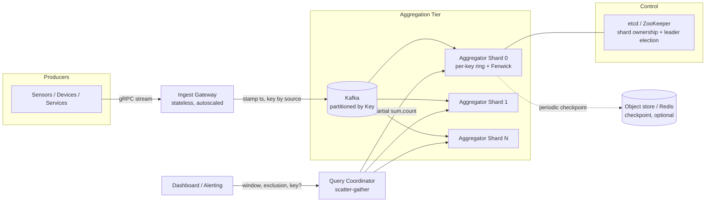

# Architectural Design: Real-Time Sliding-Window Packet Aggregator

> **Companion to** `PROBLEM.md`. This document is the candidate's full design write-up.
> **Role assumed:** Staff / Principal Data Engineer.

---

## 0. Scope Decisions (from clarification)

Three clarifications materially shape this design:

| # | Decision | Architectural consequence |
|---|----------|---------------------------|
| **D1** | **Both global *and* per-key (drill-down) averages** are required. | Aggregation state is **O(active_keys × W/B)**, not O(W/B). We need per-key ring-buffers that roll up to a global aggregate, a cold-key eviction policy, and a cardinality budget. |
| **D2** | **Bounded loss is acceptable.** | The **durable ingest log (Kafka)** is the source of truth. The in-memory aggregator is a *materialized view* rebuilt by replaying the last ~window+slack seconds. No synchronous WAL on the hot path. |
| **D3** | **Configurable window at query time** (e.g. last 10s, last 5m, custom exclusion). | We cannot use a fixed 59-bucket ring with a single `sum/count`. We need **fine-grained buckets + range-sum** (prefix sums / Fenwick tree) so any `[T−window, T−exclusion)` can be answered. |

> **Note on NFR3 (memory O(W/B)):** With per-key drill-down (D1) the *literal* O(W/B) is impossible — you cannot track per-key state without storing per-key data. We honor the *spirit* of the NFR: memory is **O(active_keys × W/B)** and independent of **event count / event rate**. A bucket still stores `(sum, count)`, never individual events.

---

## 1. Requirements

### 1.1 Functional

- **FR1** — Ingest stream of `{"Val": number, "Key": <optional source id>}` via gRPC (primary) / HTTP (compat).
- **FR2** — Server attaches an **ingestion timestamp** on arrival (authoritative time).
- **FR3** — Query endpoint returns the rolling average over `[T−window, T−exclusion)`; defaults to `window=60s, exclusion=1s`.
- **FR4** — The exclusion ("cooldown") zone is excluded to avoid partial-second skew.
- **FR5** — Auto-evict state older than `max(window)` so memory stays bounded.
- **FR6** — Handle out-of-order / late packets within a configurable lateness threshold.
- **FR7** *(from D1)* — Support both a **global** average and **per-key** drill-down.
- **FR8** *(from D3)* — Window and exclusion are **query parameters**, bounded by a configured max (e.g. ≤ 5 min).

### 1.2 Non-Functional

| Dim | Target |
|-----|--------|
| Latency | Query p99 ≤ 10 ms (per-shard local read is sub-ms; budget is for scatter-gather + network). |
| Throughput | ≥ 100K events/sec/node, no loss/back-pressure. |
| Memory | **O(active_keys × W/B)**, independent of event rate. |
| Accuracy | **Exact** average for the canonical window (sum/count, not sketch). |
| Fault tolerance | Single-node loss ⇒ no *durable* data loss (Kafka). In-flight view loss is tolerated and rebuilt (D2). |
| Scalability | Ingest horizontally partitionable by key; partial aggregates merge associatively. |

---

## 2. Back-of-Envelope Math

**Ingest volume**
- 100K pkt/s/node. Packet payload ~30–50 B; with framing ~100 B on the wire.
- Wire bandwidth/node ≈ 100K × 100 B = **~10 MB/s** (~80 Mbps). Trivial for a NIC; the cost is CPU/syscalls per packet, not bytes.

**Aggregation memory (the real constraint)**
- Bucket granularity `B = 1s`, max window `W = 300s` ⇒ **300 buckets/key**.
- Each bucket = `(sum: float64, count: uint64)` = 16 B. Per key ≈ 300 × 16 = **~4.8 KB**.
- 1M active keys ⇒ ~4.8 GB. **100K active keys ⇒ ~480 MB** — comfortable per node.
- ⇒ **Cardinality, not event rate, sizes the box.** A cardinality budget + cold-key eviction is mandatory (see §6.3).

**Kafka retention (source of truth, D2)**
- We only need replay of `W + slack`. Retain, say, **10 min** for safety.
- 100K/s × 100 B × 600 s = **~6 GB** per partition-window — set time-based retention to ~1 h and let it roll.

**Query QPS** — Assume reads ≪ writes (dashboard/alerting cadence, e.g. 1–100 QPS). Reads are cheap; writes dominate.

---

## 3. High-Level Architecture



### Components

1. **Ingest Gateway** — Stateless. Terminates gRPC/HTTP, validates payload, **stamps server ingestion timestamp** (§7.1), derives partition key, produces to Kafka. Autoscaled behind an L4 LB. Holds *no* aggregation state, so it scales independently and fails harmlessly.

2. **Kafka** — Durable, replayable, partitioned commit log. **Source of truth (D2).** Partitioned by `Key` so all events for a key land on one partition ⇒ one aggregator owns a key's full state (no cross-shard merge *for a single key*).

3. **Aggregator Shard** — Consumes one or more Kafka partitions. Maintains, per active key, a **time-bucketed ring buffer with a Fenwick tree** for O(log n) range-sum (§4). Also maintains a **node-local global aggregate** (sum of all its keys' buckets). Exposes a local read API returning `(sum, count)` for a requested `[window, exclusion]`.

4. **Query Coordinator** — Stateless scatter-gather. For a **global** query, fans out to all shards, sums the partial `(sum, count)`, divides once. For a **per-key** query, routes to the single shard owning that key (via the partition map in etcd) — a single hop, no fan-out.

5. **etcd / ZooKeeper** — Shard ownership map (key-range → shard), leader election for standby promotion.

6. **Checkpoint store (optional)** — Object store (S3/MinIO) or Redis for periodic state snapshots to shorten replay-on-recovery. Not on the hot path.

### Data Flow (happy path)

**Write:** Producer → Gateway stamps `ts_ingest`, computes `partition = hash(Key)` → produce to Kafka → Aggregator consumes → locate key's ring → `bucket = floor(ts_ingest / B)` → `bucket.sum += Val; bucket.count++`; Fenwick updated; node-global aggregate updated.

**Read (global):** Client → Coordinator → fan-out to all shards with `(window, exclusion)` → each shard range-sums its buckets over `[T−window, T−exclusion)` across all its keys → returns `(Σsum, Σcount)` → Coordinator computes `Σsum / Σcount`.

**Read (per-key):** Client → Coordinator looks up owning shard → single shard range-sum for that key → return average.

---

## 4. Storage & Data Structures (Deep Dive)

### 4.1 Why not a fixed 60-bucket ring with one (sum,count)?

The original problem's "60 one-second buckets, sum the 59" works **only for the fixed window**. D3 (configurable window/exclusion) means a query may ask for `[T−45s, T−2s)`. We need to range-sum an arbitrary contiguous span of buckets cheaply.

### 4.2 Per-key structure: ring of buckets + Fenwick tree

For each active key we keep a **circular array of `N = maxWindow / B` buckets** (e.g. 300 buckets at 1s granularity), plus a **Fenwick (Binary Indexed) Tree** over the buckets to answer prefix-sums in **O(log N)**.

```
key "device-42":
  buckets[0..299]  each = {sum: f64, count: u64, epoch: i64}
  fenwick_sum[0..299], fenwick_count[0..299]   # prefix-sum index
  base_epoch  # monotonic sweep pointer
```

- **`bucket_index = floor(ts_ingest / B) mod N`**.
- **`epoch`** stamped per bucket = `floor(ts_ingest / B)`. When a write lands in a slot whose stored `epoch` is older than the current epoch, the slot belongs to an **expired** time-period → **lazily zero it (subtract its old value from Fenwick) before adding** the new value. This is the eviction mechanism (FR5) and prevents stale carry-over without a background thread.

**Ingest cost:** O(log N) Fenwick update — for N=300 that's ≤ 9 ops. At 100K/s that's < 1M index ops/s/key-hot-path — fine.

**Query cost:** range-sum `[lo, hi]` = `prefix(hi) − prefix(lo−1)` = **O(log N)**, sub-microsecond.

> **Why Fenwick over a naive 59-bucket scan?** A naive scan is O(N) per query (fine for one global counter), but with **per-key** queries and **configurable spans up to 300 buckets**, O(log N) keeps the query path tight and uniform whether the window is 10s or 5m.

### 4.3 Node-global aggregate

Maintaining a separate ring + Fenwick for the **node-global** rollup (sum across all keys on the shard) makes global queries O(log N) **without iterating keys**. Every ingest updates *two* structures: the key's ring and the node-global ring. Cheap, and it's what makes the global query fast at high cardinality.

### 4.4 Bucket granularity trade-off

| B (granularity) | Buckets for 300s | Memory/key | Edge precision |
|-----------------|------------------|-----------|----------------|
| 1 s | 300 | ~4.8 KB | ±1s at window edges |
| 100 ms | 3000 | ~48 KB | ±100ms |

Default **B = 1s** (matches problem; the 1s exclusion zone already absorbs sub-second edge fuzz). Expose B as a deploy-time config, not per-query.

### 4.5 Why this storage stack (and what we rejected)

| Choice | Why | Why not the alternative |
|--------|-----|-------------------------|
| **In-memory ring + Fenwick** | Sub-ms reads/writes; exact (not sketch); bounded by W/B per key. | **Redis Sorted Sets per the problem hint:** ZADD/ZRANGEBYSCORE per packet at 100K/s is a network round-trip per event — blows the latency and throughput budget. Redis is fine as a *checkpoint* sink, not the hot aggregation path. |
| **Kafka as source of truth** | Replayable (rebuild view), decouples producers, natural partitioning, back-pressure handling. | **Direct-to-DB / synchronous WAL on hot path:** adds per-event fsync latency, can't sustain 100K/s/node cleanly. Rejected given D2 (bounded loss OK). |
| **Partition by Key** | A key's entire history lives on one shard ⇒ per-key query is single-hop, no merge. | **Partition by time/round-robin:** would scatter a key across shards, forcing a merge for *every* per-key query. |

---

## 5. Trade-offs & Justification (Staff-level)

### 5.1 Exact vs. approximate (NFR4)
We use **exact sum/count** (commutative + associative ⇒ trivially mergeable across shards). No HyperLogLog/t-digest needed — the aggregate is a mean, and `(Σsum, Σcount)` merges exactly. This is the same partial-aggregate trick used in Druid/Pinot for `AVG`.

### 5.2 Consistency vs. Availability (CAP)
This is a **telemetry/metrics** system: we favor **AP**. A query returns the best-available materialized view; if one shard is mid-recovery, the coordinator can return a partial result flagged with coverage (`"shards_responded": 14/15`) rather than blocking. Strong consistency is neither needed nor worth the latency for an *average over a 59s window*.

### 5.3 Push vs. Pull
- **Producers → Gateway: push** (gRPC stream) — producers are the event source; pull would require the system to know every producer.
- **Coordinator → Shards: pull** (scatter-gather on query) — reads are infrequent vs. writes; pulling on demand avoids constantly pushing partial aggregates around.
- **Gateway → Kafka: push** with Kafka providing back-pressure (producer blocks/buffers when brokers are slow) — this is how we avoid silent loss under spikes.

### 5.4 Lazy eviction vs. background sweep
We use **lazy eviction via per-bucket epoch stamping** (§4.2). It needs no background thread on the write path and is always correct *at read time* because a query only sums buckets whose epoch is in range. A **background sweep** is added only as a safety net to reclaim memory for **cold keys** (keys that stopped emitting) — see §6.3. This hybrid matches the problem's recommendation but ties the sweep to *key liveness*, not *bucket freshness*.

---

## 6. Reliability, Scaling & Operations

### 6.1 Bottlenecks & SPOFs
- **Hot key / hot partition:** one key (or a skewed key-space) overwhelms a single shard. Mitigation: detect hot keys and **sub-shard** them (salt the key, merge at query) — accept that a salted key needs a small fan-out. Monitor per-partition lag.
- **Coordinator fan-out:** global query fan-out grows with shard count. Mitigation: introduce a **two-level aggregation tree** (regional sub-coordinators) beyond ~50 shards; cap fan-out width.
- **Kafka:** replicated (RF=3, `min.insync.replicas=2`) — not a SPOF.

### 6.2 Failure handling
- **Aggregator crash:** Kafka consumer-group rebalances the partition to another shard; the new owner **replays the last `W + slack` (~62s–310s)** from Kafka to rebuild the view (D2). Optional checkpoint restore (§6.4) shortens this.
- **Region outage:** Kafka MirrorMaker / multi-region clusters; aggregators are stateless-rebuildable, so a standby region rehydrates from its Kafka replica.
- **Bad deploy:** aggregators are rebuildable ⇒ roll back and replay. No durable corruption because state is derived, not authoritative.

### 6.3 Cardinality control (the per-key risk from D1)
- **Cardinality budget per shard** (e.g. 200K keys). On breach: (a) evict **cold keys** — any key whose newest bucket epoch is older than `maxWindow` is dead and reclaimed by the background sweep; (b) for genuinely unbounded cardinality, fall back to **global-only** for the overflow and emit a metric.
- **TTL map of keys**: a background sweep (e.g. every 5s) drops keys with no events in the last `maxWindow`.

### 6.4 Persistence & recovery (D2)
- **Checkpoint** ring state to object store / Redis every N seconds **asynchronously** (off the hot path). Store `(base_epoch, buckets, Kafka offset)`.
- **Recovery:** load latest checkpoint → resume Kafka from the checkpointed offset → replay forward → drop any bucket whose epoch has since expired. Bounds replay to seconds.

### 6.5 Late & out-of-order data (FR6)
- **Lateness threshold L** (e.g. 2s, ≥ exclusion zone). A packet with `ts_ingest` mapping to a still-live, non-expired bucket → placed in its correct historical bucket (Fenwick handles arbitrary-index update). Because we stamp **server ingestion time**, "lateness" here is network/processing delay, which is small and bounded.
- Packets older than `L` → **dead-letter topic** for audit, counted in a `late_dropped` metric.
- The **1s exclusion zone is a built-in watermark**: by the time a bucket enters the queryable range, it has had ≥1s to receive stragglers, so the average is stable.

### 6.6 Back-pressure & spikes (edge cases)
- Gateway → Kafka producer back-pressure naturally throttles; gateways autoscale on CPU/queue depth.
- **Rate-limit / throttle** abusive producers at the gateway (token bucket per source).
- **Poison pill** (malformed payload, NaN/Inf `Val`): validated and rejected at the gateway → dead-letter, never reaches aggregation.

### 6.7 Observability — Golden Signals
- **Latency:** ingest gateway p99, query p99 (per-shard local + coordinator end-to-end).
- **Traffic:** events/s/shard, query QPS, Kafka produce rate.
- **Errors:** validation rejects, late-dropped, partial-query (shards not responding), DLQ rate.
- **Saturation:** **Kafka consumer lag** (the #1 health signal — lag ⇒ view is stale), active-key count vs. budget, heap usage, CPU.
- **Synthetic transactions:** inject a known packet stream, assert the computed average matches expected within tolerance.

### 6.8 SLOs
- **Freshness SLO:** materialized view is no more than **2s** behind real time (driven by Kafka lag) — 99.9%.
- **Query latency SLO:** p99 ≤ 10ms, 99.9%.
- **Availability SLO:** query endpoint returns a (possibly partial-flagged) result 99.99%.
- **Accuracy:** exact within the canonical window by construction; alert if any shard reports coverage gaps.

---

## 7. Time Correctness (Deep Dive)

### 7.1 Server ingestion time, not client time
We stamp time at the **gateway on arrival** (FR2). This eliminates client clock skew and makes the window definition unambiguous. Trade-off: a packet generated at the source but delayed in transit is attributed to its *arrival* second, not its *creation* second — acceptable for a telemetry average and removes a whole class of clock-skew bugs.

### 7.2 Monotonic vs. wall clock
- **Wall clock (NTP-synced)** is used only to **label** buckets (`floor(ts/B)`), so all shards agree on which second a packet belongs to.
- A **monotonic clock** advances the sweep/eviction pointer so NTP step-corrections (clock jumps backward) can't corrupt eviction or create negative durations.

### 7.3 NTP drift across shards
Each shard buckets independently using its own NTP-synced wall clock. The global merge sums `(sum, count)` — bucket *labels* must agree across shards for a coherent window. We require shards to be NTP-synced within a tolerance (< exclusion zone, i.e. < 1s). Monitor `client_ts − server_ts` delta to flag misbehaving producers and `server_ts` inter-shard skew to flag NTP problems.

---

## 8. Staff-Level Considerations

### 8.1 Cost
- **Dominant cost = aggregator RAM** (cardinality) + **Kafka storage/throughput**, not compute. At 100K keys/node (~480 MB), a single mid-size box per shard suffices; scale shards horizontally with cardinality.
- Kafka retention kept short (just enough for replay) to cap storage cost.
- No managed-NoSQL per-event writes (rejected in §4.5) — that would be the expensive design.

### 8.2 Security
- **PII:** `Key` may be a device/user id ⇒ treat as sensitive. Hash/tokenize keys at the gateway if drill-down identity isn't needed downstream.
- **Transit:** mTLS on gRPC ingest; TLS on query API. **At rest:** encrypt Kafka volumes and checkpoint store.
- **AuthN/Z:** producer credentials at the gateway; query API scoped by tenant so a tenant can only drill into its own keys.

### 8.3 Evolution / 10× scale
- **10× events (1M/s/node aggregate):** add more Kafka partitions + aggregator shards; the partition-by-key model scales linearly. Gateway is stateless ⇒ scale out freely.
- **10× cardinality:** the binding constraint. Move to **finer shard granularity**, tiered storage for warm keys, and the **two-level aggregation tree** (§6.1) to bound fan-out.
- **New aggregations:** the `(sum, count)` partial-aggregate generalizes to any **commutative + associative** function (min/max/count/sum). Adding `p99` would require swapping exact buckets for a mergeable sketch (t-digest) — a conscious accuracy trade-off, out of scope for the exact-average requirement.
- **Multiple/arbitrary windows:** already supported by D3's Fenwick range-sum; only constraint is `maxWindow` (sizes bucket count).

---

## 9. Summary

| Concern | Decision |
|---------|----------|
| Source of truth | **Kafka**, partitioned by key (D2) |
| Aggregation state | In-memory **per-key ring buffer + Fenwick tree**; plus a node-global ring |
| Eviction | **Lazy** (per-bucket epoch) + background **cold-key** sweep |
| Window | **Configurable** at query time up to `maxWindow` via range-sum (D3) |
| Query | Per-key = single-hop; global = scatter-gather sum of `(sum,count)` (D1) |
| Time | **Server ingestion timestamp**; wall clock labels buckets, monotonic drives eviction |
| Fault tolerance | Rebuild view by **Kafka replay** + optional async checkpoint |
| Accuracy | **Exact** mean via mergeable `(sum, count)` |
| Binding constraint | **Key cardinality** (memory), not event rate |
```

