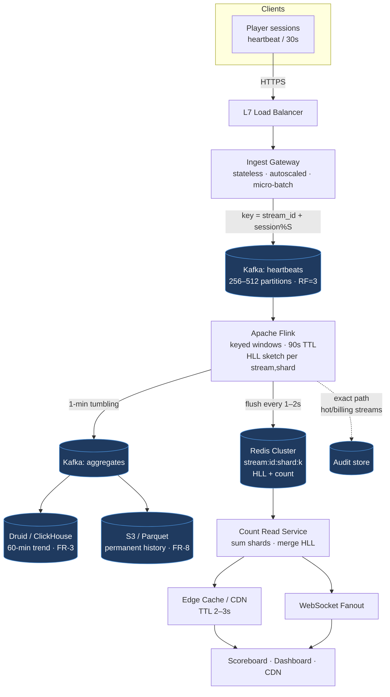

# Real-Time View Counter — Architectural Design Document

> **Scope:** Concurrent-viewer counting at Hotstar scale (≥ 50 M concurrent, 25 M+ on a single stream).
> **Role:** Staff/Principal-level design with explicit trade-offs and operational maturity.
> **Companion to:** [`PROBLEM.md`](./PROBLEM.md) — this document is the solution; the problem statement is authoritative for requirements.

---

## Phase 1 — Scoping & Clarification

### 1.1 Problem Restatement

We are building a **concurrent-viewer counter** for a live-streaming platform. Every viewing session emits heartbeats (join / keep-alive / leave). The system must derive *how many distinct sessions are currently active* per stream and platform-wide, surface that number to product surfaces with ≤ 5 s staleness at ≤ 50 ms p99 read latency, and survive 5–10× traffic spikes triggered by in-game moments — all at ~1.7 M events/s steady-state and 10–15 M events/s at peak.

The defining characteristic is the **asymmetry**: writes are enormous and bursty (millions/s, hot-keyed onto a handful of viral streams), reads are tiny in cardinality (one number per stream) but latency-critical and fanned out to millions of clients. The architecture is essentially a giant **fan-in (aggregation) → fan-out (distribution)** funnel, and almost every design decision falls out of reconciling those two halves.

### 1.2 Requirements

**Functional**

| ID | Requirement |
|----|-------------|
| FR-1 | Live concurrent-viewer count per stream, ≤ 5 s lag, reflecting *active* sessions not opens. |
| FR-2 | Ingest join/keep-alive/leave heartbeats `{stream_id, session_id, ts, region}`. |
| FR-3 | Tumbling (1 m, 5 m) + sliding windows; rolling 60-min trend timeline. |
| FR-4 | Counts at per-stream and platform-wide global granularity. |
| FR-5 | Session-level dedup (multi-tab/device counted once); user-level dedup best-effort. |
| FR-6 | Spike-resilient ingest — absorb surges without dropping events or stalling. |
| FR-7 | Low-latency read API (REST + WebSocket push). |
| FR-8 | Persist per-minute aggregates for post-match analytics / peak detection. |

**Non-Functional**

| ID | Target |
|----|--------|
| NFR-1 | ≥ 50 M concurrent platform-wide; 25 M+ single stream. |
| NFR-2 | ~1.7 M events/s baseline; 10–15 M events/s spike. |
| NFR-3 | p99 read ≤ 50 ms; staleness ≤ 5 s (eventual consistency OK). |
| NFR-4 | Approximate (HLL ±2%) for display; exact only for billing/audit. |
| NFR-5 | 99.99% availability during live events; stale ≫ 5XX. |
| NFR-6 | Hot-key handling via write-sharding + read fan-out. |
| NFR-7 | No O(n) downstream writes per event; buffer + batch flush. |
| NFR-8 | Kafka RF ≥ 3; replay from committed offset; ≤ 30 s state loss. |

### 1.3 Clarifying Questions (and the assumptions I'll proceed on)

In a live interview I would stop here. Since this is a document, I state the questions and the assumptions I adopt:

1. **What *is* a "concurrent viewer"?** → A session whose **most recent heartbeat is within a sliding TTL window** (we adopt **90 s**, i.e. 3× the 30 s heartbeat interval). No explicit "leave" is required for correctness; absence of heartbeats expires the session. This makes "leave" events an *optimization*, not a correctness dependency — critical because clients crash, lose network, or get OOM-killed without ever sending "leave".
2. **Display vs. billing precision?** → Display uses **approximate (HLL)**; billing/audit uses an **exact, separately-persisted path**. We treat these as two pipelines off the same ingest log, not one pipeline trying to satisfy both.
3. **Read fan-out shape?** → Millions of clients want the count. We assume reads are served from **edge cache (CDN) + WebSocket push**, *not* direct origin polling. The origin computes the number; the edge distributes it.
4. **Global count semantics?** → Platform-wide = sum of per-stream distinct-session counts (sessions are unique to one stream, so simple addition is valid; no cross-stream dedup needed).
5. **Retention?** → Raw heartbeats: 7 days in Kafka/lake for replay. Per-minute aggregates: indefinitely (cheap). Live in-memory state: ephemeral.

---

## Phase 2 — High-Level Design & Architecture

### 2.1 Back-of-the-Envelope Math

**Ingest throughput**
- 50 M sessions × (1 heartbeat / 30 s) = **1.67 M events/s** steady-state.
- Spike: 10–15 M events/s for 2–3 s bursts.
- Event size on the wire ≈ 100–200 B (compact binary/Avro). At 1.7 M/s ≈ **170–340 MB/s** ingest bandwidth; at spike ≈ **1.5–3 GB/s**.

**Kafka sizing**
- Target per-partition write ceiling ~10 MB/s (safe, replicated). At 340 MB/s steady → ~40 partitions minimum; for spike headroom and hot-stream sharding we provision **~256–512 partitions** on the heartbeat topic.
- Storage for 7-day replay: 1.7 M/s × 150 B × 86400 × 7 ≈ **154 TB** raw; with RF=3 ≈ **462 TB**. Mitigated heavily by compression (Avro+zstd, ~5×) → ~**90 TB** on disk. Tiered storage (Kafka → S3) for the cold tail keeps broker disks small.

**State / memory**
- Exact set of 25 M session IDs (16 B each) ≈ **400 MB per hot stream** — feasible in one box but *not* mergeable cheaply across shards.
- **HLL** at ~1.5% error uses ~**12 KB fixed** regardless of cardinality. 50 M sessions → still 12 KB. This is the entire justification for HLL (NFR-4): constant memory + **mergeable** registers across shards.

**Read QPS**
- If we naively let clients poll every 2 s and there are 50 M clients: 25 M reads/s — impossible at origin. With **edge caching (2–3 s TTL)** the origin sees ~(#streams × #edge-PoPs / TTL). For ~5,000 live streams × 50 PoPs / 2 s ≈ **125 K origin reads/s** — trivial. WebSocket push reduces it further. **The edge cache is what makes the read path tractable**, not origin scaling.

> **Q:** What is PoP here? Also does the web socket maintain connections with end user devices (browsers, apps) and push these live stream watching metrics?
>
>> **A:** **PoP = Point of Presence** — a CDN edge location (a cluster of edge servers in a city/metro, e.g. Mumbai, Singapore, Frankfurt). A CDN like CloudFront/Akamai/Fastly has dozens to hundreds of them worldwide. The "× 50 PoPs" in §2.1 assumes each PoP independently caches the count for a stream, so the origin is hit at most once per PoP per TTL window. More PoPs = more total edge cache copies = slightly more origin reads, but each region's users get served locally with low latency.
>>
>> On the WebSocket question — **two distinct serving models**, and the answer depends on which:
>>
>> - **WebSocket push (direct to devices):** Yes — the **WebSocket Fanout** tier holds a long-lived persistent connection to each subscribed browser/app and pushes the updated count (typically a small delta message) whenever it changes, every ~1–2 s. This avoids client polling entirely. The tradeoff: holding **tens of millions of concurrent sockets** is expensive — it needs a horizontally-scaled connection tier (e.g. many nodes each holding ~100K–1M sockets), a pub/sub backbone (Redis pub/sub / Kafka) to route "stream X count changed" to the right sockets, and sticky routing. This is the **low-latency path** for first-party surfaces (the player's live scoreboard overlay).
>>
>> - **CDN edge cache (pull):** The count is just a tiny JSON/number behind a REST URL with a 2–3 s TTL. The device (or a third-party embed, or CDN cache-population) **polls** that URL; the CDN serves it from the nearest PoP and only refreshes from origin once per TTL. No persistent connection — cheaper and infinitely scalable, at the cost of up-to-TTL staleness and per-request overhead.
>>
>> **In practice you use both:** WebSocket for the primary in-app experience where freshness matters, CDN/REST as the scalable fallback for everything that can't or shouldn't hold a socket. Both stay within the ≤ 5 s staleness budget (NFR-3). See §4.6 *Push vs. Pull*.

### 2.2 Core Components

```
Clients → Ingest GW (LB) → Kafka (heartbeats) → Stream Aggregators (Flink)
                                                      │
                                   ┌──────────────────┼───────────────────┐
                                   ▼                  ▼                   ▼
                          Redis (live HLL,     Kafka (1-min        OLAP / Lake
                          sharded per stream)   aggregates)        (history, FR-8)
                                   │
                          Count Read Service ──→ Edge Cache (CDN, 2–3s TTL)
                                   │                    │
                          WebSocket Fanout ────────────┴──→ Clients
```

1. **Ingest Gateway** — stateless, autoscaled, behind L4/L7 LB. Validates, authenticates, lightly batches, and produces to Kafka. Applies **client-side + edge batching** (a client sends one heartbeat per 30 s; gateways can micro-batch many sessions into one Kafka produce request).
2. **Kafka** — durable buffer & shock absorber (FR-6, NFR-8). Keyed by `stream_id + shard_suffix` (virtual sharding, NFR-6).
3. **Stream Aggregators (Apache Flink)** — consume heartbeats, maintain windowed distinct-session state per `(stream, shard)`, emit HLL sketches + windowed counts. This is the brain.
4. **Redis (live counts)** — holds current per-shard HLL sketches and pre-summed counts; serves the hot read path. Sharded N-keys-per-stream (NFR-6).
5. **Count Read Service** — stateless; sums shard counts (or reads pre-summed value), serves REST, drives WebSocket push, sets cache headers.
6. **Edge Cache (CDN / API GW)** — absorbs read fan-out with 2–3 s TTL (NFR-3, thundering-herd mitigation).
7. **OLAP store + Data Lake** — per-minute aggregates for trend/history (FR-3, FR-8); exact audit path.

### 2.3 Data Flow (Happy Path)

1. Client emits heartbeat every 30 s → nearest **Ingest Gateway**.
2. Gateway validates, stamps server-time, produces to Kafka topic `heartbeats`, partition = `hash(stream_id + (session_id % S))` where `S` = shard fan-out for that stream.
3. **Flink** consumes per partition. For each `(stream, shard)` it maintains a **keyed window** with **TTL-based session expiry** (90 s). Active-session membership is tracked in an **HLL sketch** (display) and, for hot/billing streams, an exact structure (audit path).
4. Every **1–2 s**, Flink flushes per-shard HLL + count to **Redis** (`stream:{id}:shard:{k}`) and emits a 1-min tumbling aggregate to Kafka `aggregates` topic. *(This is the buffer+batch-flush that kills write amplification — NFR-7.)*
5. **Count Read Service** answers a read by either reading a pre-summed `stream:{id}:total` (updated by a summing job) or merging the N shard HLLs on demand.
6. Response is cached at the **edge** (2–3 s TTL); WebSocket fanout pushes deltas to subscribed clients.
7. `aggregates` topic → OLAP (Druid/ClickHouse) for trend timeline + → Lake (S3/Parquet) for permanent history (FR-8).

### 2.4 Architecture Diagram



---

## Phase 3 — Deep Dive: Data & Storage

### 3.1 Data Model

**Heartbeat event (Kafka `heartbeats`, Avro)**
```json
{
  "stream_id":  "ipl_match_42",
  "session_id": "a3f9...",        // client-generated UUID, stable per session
  "event_type": "join | keepalive | leave",
  "ts":         1750665600123,    // client ts (advisory)
  "server_ts":  1750665600140,    // gateway-stamped (authoritative)
  "region":     "ap-south-1",
  "user_id":    "u_8842"          // optional; best-effort user-level dedup
}
```

**Live count state (Redis)**
```
stream:{id}:shard:{k}     → serialized HLL sketch        (per shard, k ∈ [0,S))
stream:{id}:shard:{k}:cnt → approx count (int)           (denormalized for fast sum)
stream:{id}:total         → summed count (int, TTL 5s)   (read-path fast path)
global:total              → platform-wide sum
```

**Per-minute aggregate (OLAP / Lake)**
```
(stream_id, minute_bucket, region, distinct_sessions, peak_within_minute)
```

### 3.2 Storage Strategy

**Why Redis for live state.** We need sub-millisecond reads of a tiny value under heavy write churn, with native support for the HLL data type (`PFADD`/`PFCOUNT`/`PFMERGE`). Redis Cluster gives us hash-slot sharding to spread hot streams. The *entire live working set* (≈ 5,000 streams × S shards × ~12 KB) is a few hundred MB — trivially RAM-resident.

- **Why not Postgres/row store for live counts?** Per-event upserts at millions/s would melt any OLTP DB and the hot `stream_id` row becomes a lock convoy. Rejected.
- **Why not just keep state in Flink and read from it (queryable state)?** Flink queryable state couples the read SLA to the aggregator's GC/checkpoint pauses and complicates fan-out. We deliberately **decouple compute (Flink) from serving (Redis)** so a Flink redeploy never takes down reads.

**Partitioning / Sharding (NFR-6, the crux).**
- Kafka key = `stream_id + (session_id mod S)`. For a cold stream `S=1`; for a viral stream `S` is large (e.g. 32–64), spreading its writes across many partitions and Flink keys. `S` is **adaptive** — promoted when a stream's rate crosses a threshold (see hot-key handling, Phase 5).
- Redis: same `S` shards per stream → distinct hash slots → distinct nodes. Read = `PFMERGE`/sum of S sketches. The fan-out cost at read is O(S) (≤ 64), bounded and cheap; the write benefit is dividing the hottest write stream's load by S.

**Hot / Warm / Cold tiering.**
- **Hot** — Redis, current live counts, ephemeral, ms reads.
- **Warm** — OLAP (Druid/ClickHouse), last 24–48 h per-minute trends for dashboards (FR-3 60-min timeline).
- **Cold** — S3/Parquet, partitioned by `dt/stream_id`, queried by Spark/Trino for post-match analytics (FR-8). Kafka tiered storage offloads the replay tail to S3 to keep broker disks lean.

**Caching.**
- **Look-aside at origin** is unnecessary because Redis *is* the fast store; the real cache that matters is the **edge cache (write-through-ish via short TTL)**. We push computed counts to CDN/API-GW with a 2–3 s TTL. This is the single most important caching decision — it converts an unbounded client read fan-out into a bounded origin load (see §2.1 math).

---

## Phase 4 — Trade-offs & Justification

### 4.1 Approximate (HLL) vs. Exact counting

**Chose HLL for display.** Fixed ~12 KB memory at any cardinality, ±1.5% error (within NFR-4's ±2%), and — the decisive property — **mergeability**: `PFMERGE(shard_0 … shard_S)` gives the stream total, and summing/merging stream sketches handles write-sharding cleanly. Exact session-set tracking at 25 M would need ~400 MB *and* a distributed-set merge on every read.

**Kept an exact path for audit/billing (NFR-4).** Billing can't be ±2%. We run a **separate, slower exact pipeline** off the same Kafka log: Flink writes exact distinct-session counts per minute to the audit store. It tolerates higher latency (minutes) and isn't on the read SLA path, so its cost is acceptable. *We do not try to make one pipeline serve both — that's the classic trap that makes the system both slow and expensive.*

### 4.2 Per-event write vs. Local buffer + batch flush

**Chose buffer + batch flush (NFR-7).** Flink accumulates membership in local keyed state and flushes to Redis every 1–2 s. This bounds Redis writes to `O(#streams × S / flush_interval)` — a few thousand writes/s — *independent of the 10 M events/s ingest rate*. Per-event writes would be O(n), saturate Redis, and re-create the hot-key on `stream:{id}`. The cost is ≤ 2 s of staleness, well inside the ≤ 5 s budget (NFR-3).

### 4.3 Kafka vs. alternatives

**Chose Kafka** as the durable shock absorber: replayability (NFR-8 replay-from-offset), RF≥3 durability, partition-level parallelism for write-sharding, and tiered storage for the cheap replay tail. It is the canonical choice at this scale (LinkedIn/Uber/Confluent lineage).

- **Why not RabbitMQ / SQS?** No cheap replay, weaker ordering-per-key, worse throughput ceiling. Rejected.
- **Why not Kinesis/Pub-Sub (managed)?** Defensible operationally, but per-shard limits and cost at 10–15 M events/s spikes make self-managed Kafka (or a Kafka-API store like Redpanda/Warpstream) the better fit for our bursty, sharded keyspace. Managed is the pragmatic pick if the org lacks Kafka ops muscle — an explicit cost/ops trade.

### 4.4 Flink vs. Spark Streaming vs. Kafka Streams

**Chose Flink.** True per-event streaming with **event-time windows + watermarks**, first-class **keyed state with TTL** (exactly our session-expiry model), exactly-once via checkpointing/barriers (NFR-8 ≤30 s loss = checkpoint interval), and proven at this scale. Spark Structured Streaming is micro-batch (higher floor latency, clumsier TTL state). Kafka Streams is great but co-locating this much state and rebalancing under spikes is operationally harder than Flink's managed state + savepoints.

> **Q:** Elaborate on the window type being used here? Is it a sliding window of 90 seconds sliding every 1-2 seconds or a session window? When are the results emitted. Present a simple pseudo code for the same.
>
>> **A:** Good catch — the doc uses "window" loosely. The cleanest model here is **neither a classic sliding window nor Flink's built-in session window**. It's a **keyed `ProcessFunction` with state TTL + a periodic emit timer**. Here's why, and what each alternative would actually do:
>>
>> **Why not a 90 s sliding window (slide 1–2 s)?** A `SlidingEventTimeWindows(90s, 2s)` would create **45 overlapping window panes** per key (90/2), and every event lands in all 45. At 10 M events/s that's a 45× state and compute blow-up — exactly the write amplification we're trying to avoid (NFR-7). Rejected.
>>
>> **Why not Flink's `SessionWindow`?** A session window groups events separated by a gap and **fires when the gap elapses** — i.e. it emits *when a session ends*. We want the opposite: a **continuously-updated live count of currently-active sessions**, emitted every 1–2 s regardless of whether anyone left. Session windows also key per-session, not per-stream, so they don't give us "distinct active sessions per stream" directly. Wrong tool.
>>
>> **What we actually want — two independent time concepts:**
>>
>> - **Liveness = per-session TTL of 90 s.** Each `session_id` is "alive" if seen in the last 90 s. This is **state TTL**, not a window. A heartbeat refreshes the TTL; 90 s of silence expires it. (This is the "concurrent viewer" definition from §1.3.)
>> - **Emit cadence = every 1–2 s.** A **processing-time timer** per `(stream, shard)` fires on a fixed interval and flushes the *current* count — decoupled from when sessions join/leave. This is a **tumbling trigger over continuously-maintained state**, not a window over the events.
>>
>> So: **state-TTL for membership + periodic timer for emission.** The "1-min tumbling window" mentioned elsewhere is a *separate, coarser* aggregation for the OLAP/history path (FR-3/FR-8) — don't conflate it with the live-count path.
>>
>> **Pseudocode** (Flink `KeyedProcessFunction`, keyed by `(stream_id, shard)`):
>>
>> ```python
>> # key = (stream_id, shard);  STATE persists per key
>> #   hll          : HyperLogLog sketch of active session_ids
>> #   last_seen    : MapState[session_id -> last_heartbeat_server_ts]
>> TTL          = 90_000   # ms — session liveness window
>> EMIT_EVERY   = 2_000    # ms — flush cadence to Redis
>>
>> def process_element(event, ctx):
>>     # 'leave' is an optimization; absence of heartbeats also expires via TTL
>>     if event.type == "leave":
>>         last_seen.remove(event.session_id)
>>         # note: HLL can't delete; see rebuild note below
>>     else:  # join | keepalive
>>         last_seen.put(event.session_id, event.server_ts)
>>         hll.add(event.session_id)
>>
>>     # register the periodic emit timer once
>>     if not emit_timer_registered.value():
>>         ctx.timer_service().register_processing_time_timer(
>>             align_to_next(EMIT_EVERY))
>>         emit_timer_registered.update(True)
>>
>> def on_timer(ts, ctx):
>>     now = ctx.timer_service().current_processing_time()
>>
>>     # expire sessions silent for > TTL
>>     for sid, last in list(last_seen.entries()):
>>         if now - last > TTL:
>>             last_seen.remove(sid)
>>
>>     # emit current active count for this (stream, shard)
>>     count = hll.estimate()            # display path (±2%)
>>     flush_to_redis(key, hll, count)   # stream:{id}:shard:{k}
>>
>>     # re-arm the timer
>>     ctx.timer_service().register_processing_time_timer(now + EMIT_EVERY)
>> ```
>>
>> **One honest wrinkle — HLL can't delete.** A plain HLL only supports add, so expired sessions don't shrink it; over a long stream the sketch would drift upward. Two standard fixes:
>>
>> 1. **Sliding HLL / rebuild on emit:** keep the exact `last_seen` map (authoritative for liveness) and **rebuild a fresh HLL from live sessions each emit** — or maintain a small ring of per-second mini-sketches and `PFMERGE` only the last 90 s' worth. This bounds the sketch to the live window.
>> 2. **Use a deletable sketch** (e.g. a Sliding-HyperLogLog or a counting variant) if exactness of decay matters more than memory.
>>
>> At Hotstar scale option 1 (rebuild from the bounded live-session map, which is at most ~25 M entries per hot stream **spread across `S` shards** so far smaller per key) is the pragmatic choice and keeps the ±2% guarantee honest.

### 4.5 CAP positioning

This is an **AP** system by mandate (NFR-5: "stale count ≫ 5XX"). On partition/failure we **serve the last-known count from Redis/edge** rather than erroring. Consistency is eventual with a bounded staleness SLA (≤ 5 s). The only **CP** island is the **exact audit path**, where we prefer correctness over latency and can block/retry.

### 4.6 Push vs. Pull

- **Ingest = push** (clients push heartbeats) — unavoidable; clients are the source of truth for liveness.
- **Read = push-preferred (WebSocket) with pull fallback (REST+edge cache).** Push to millions of clients avoids the polling stampede; REST+CDN serves clients/surfaces that can't hold a socket (CDN cache population, third-party embeds). The **edge TTL is the safety valve** that caps origin load regardless of which model a given client uses.

---

## Phase 5 — Reliability, Scaling & Operations

### 5.1 Bottlenecks & Single Points of Failure

| Risk | Mitigation |
|------|-----------|
| **Hot stream → hot Kafka partition** | Virtual sharding `stream_id + session%S`; adaptive `S`. |
| **Hot Redis key** `stream:{id}` | N shard keys across hash slots; sum/merge at read. |
| **Flink consumer lag at spike** | Autoscale on `records-lag-max`; over-provision partitions so we can scale out consumers without repartitioning. |
| **Read fan-out (thundering herd)** | Edge cache 2–3 s TTL + WebSocket push + request coalescing at origin. |
| **Redis node loss** | Cluster with replicas + AOF; on loss, Flink **re-flushes from its own state within one flush interval** — Redis is a cache of Flink state, so it self-heals. |

### 5.2 Failure Handling

- **Aggregator crash (NFR-8):** Flink restores from last checkpoint (interval = 30 s) and replays Kafka from committed offset. Worst case ≤ 30 s of state loss — and because session liveness is TTL-based, the count *self-corrects* within ~90 s as heartbeats re-populate. This is a key resilience property: **the system is self-healing because state is continuously refreshed by heartbeats**, not accumulated forever.
- **Redis loss:** read path degrades to last edge-cached value (stale, not error — NFR-5), and Flink repopulates on next flush.
- **Region outage:** ingest gateways are multi-region; Kafka is stretched or mirror-maker'd; counts continue from surviving regions (count may dip transiently — acceptable per AP mandate).
- **Bad deploy:** Flink savepoint before deploy → roll back to savepoint; blue/green on stateless gateways and read service.

### 5.3 Edge Cases

- **Poison-pill events** (malformed/oversized): schema-validate at gateway; route un-parseable to a **DLQ**, never block the main partition.
- **Spike (six-hit scenario):** Kafka absorbs the burst (that's its job); Flink autoscaling triggers on lag; Redis writes are *flush-rate-bounded* so spikes don't amplify; edge TTL caps reads. The buffer chain means a 10× *ingest* spike produces **~0× read-path spike**.
- **Clock skew / late heartbeats:** use **server_ts** as authoritative; Flink watermarks tolerate bounded lateness; drop events older than the window.
- **Client crash without "leave":** handled by design — TTL expiry, no leave required.
- **Session resurrection** (network blip): same `session_id` re-joins within TTL → still counted once (HLL idempotent on re-add).

### 5.4 Observability

**Golden signals**
- **Latency:** read p50/p99 (SLO ≤ 50 ms); end-to-end ingest→count freshness (SLO ≤ 5 s).
- **Traffic:** events/s in, reads/s, WebSocket connections.
- **Errors:** gateway 5XX, DLQ rate, Flink restart count, Redis errors.
- **Saturation:** Kafka **consumer lag** (the master scaling signal), Flink backpressure, Redis CPU/mem, partition skew.

**SLOs**
- Availability 99.99% during live events (NFR-5).
- Freshness ≤ 5 s for 99% of reads.
- Read p99 ≤ 50 ms.
- Accuracy within ±2% vs. exact audit (continuously validated — see below).

**Health**
- **Synthetic streams:** inject a known-cardinality synthetic stream and assert the count tracks → catches silent aggregation drift.
- **Accuracy canary:** periodically compare HLL display count vs. exact audit count; alert if error > 2%.
- Heartbeat/liveness probes on gateways, Flink TaskManagers, Redis nodes.

### 5.5 Scaling Levers

Each tier scales independently: gateways (stateless, HPA on CPU/conns), Kafka (add partitions/brokers — over-provisioned partitions let us add Flink consumers without repartition), Flink (parallelism + autoscale on lag), Redis (add shards / increase `S`), edge (CDN scales itself).

---

## Phase 6 — Staff-Level Considerations

### 6.1 Cost

- **Biggest line items:** Kafka storage/throughput and Flink compute. Tame Kafka with **tiered storage** (cold replay tail → S3) and aggressive **Avro+zstd** compression (~5×). Right-size Flink with **autoscaling on lag** so we pay for spike capacity only during spikes.
- **Avoid the trap:** running the *exact* pipeline at full ingest rate for *all* streams. Restrict exact computation to billing-relevant streams and tolerate minute-level latency there — keeps the expensive path narrow.
- **Edge cache is a cost lever, not just a latency lever:** it removes millions of origin reads/s, shrinking the read tier to near-nothing.
- **Managed vs. self-hosted:** self-managed Kafka/Flink/Redis is cheaper at this sustained scale but demands a platform team; the build-vs-buy line is an org decision, not a technical one.

### 6.2 Security & Privacy

- **PII:** `user_id`/`session_id` are pseudonymous; hash/tokenize at the gateway. Counts expose no individual identity. Apply retention limits on raw heartbeats (7 days) and purge per data-policy.
- **Encryption:** TLS in transit (client↔gateway, inter-service); at-rest encryption on Kafka disks, Redis, S3 (SSE-KMS).
- **AuthN/Z:** signed session tokens on heartbeats to prevent count inflation/spoofing; rate-limit per session/IP at the gateway to blunt fake-viewer attacks.
- **Abuse:** the count is a juicy target for manipulation (botted "viewers"); session-token validation + anomaly detection on join velocity per region.

### 6.3 Evolution (10×)

- **150 M concurrent:** the architecture scales horizontally on every tier — the only structural change is **larger and more dynamic `S`** and more Kafka partitions. Because HLL state is constant-size and mergeable, going 10× on cardinality costs ~0 extra state memory — **this is precisely why we chose HLL over exact counting.**
- **New dimensions** (per-region, per-device, per-content-type counts): add keying dimensions to Flink windows + OLAP cube; the sketch-merge model composes naturally (merge sketches along any grouping).
- **Cross-feature reuse:** the same ingest→Flink→sketch→serve funnel generalizes to "trending", "live reactions/s", and engagement metrics — making this a platform, not a one-off counter.

---

## Appendix — Design Tensions Resolved (mapping to PROBLEM.md)

| Tension | Resolution |
|---------|-----------|
| Exact vs. HLL | HLL for display (mergeable, fixed memory); separate exact path for audit only. |
| Per-event vs. buffer+flush | Flink local state + 1–2 s flush to Redis; bounds writes independent of ingest rate. |
| Hot key | Adaptive virtual sharding `stream_id + session%S` across Kafka partitions and Redis slots. |
| Spike | Kafka buffers; Flink autoscales on lag; flush-rate-bounded Redis; edge TTL caps reads. |
| Read fan-out | WebSocket push + CDN edge cache (2–3 s TTL) → bounded origin load. |
| Recovery ≤ 30 s | Flink 30 s checkpoints + replay-from-offset; TTL-based state self-heals in ≤ 90 s. |
