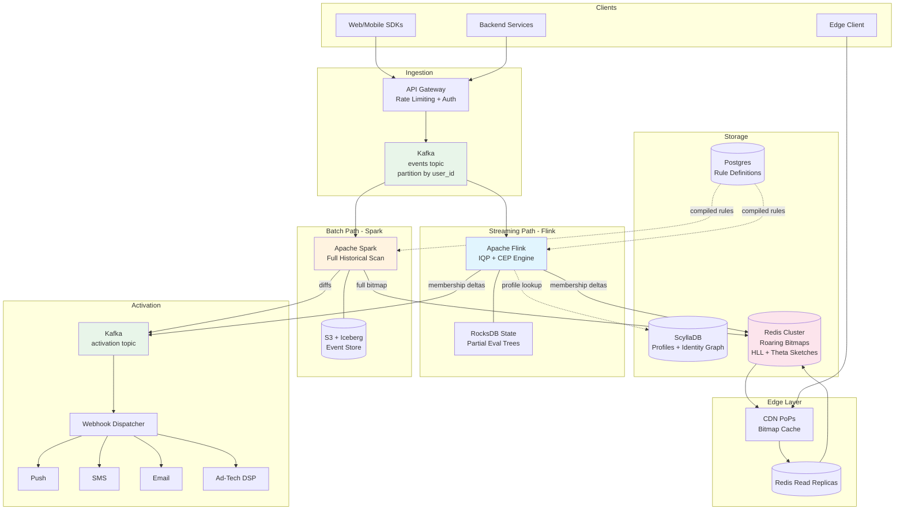

# Designing a Unified Batch and Real-Time Segmentation Engine

-----

## Original Problem statement

The fundamental conflict in segmentation design is the "Freshness-Depth Trade-off." Batch systems excel at deep historical analysis (e.g., "users who spent >$500 in the last year"), while streaming systems provide immediate responsiveness (e.g., "users who abandoned a cart 30 seconds ago"). The objective is to design a unified platform that allows a single rule definition to be evaluated across both processing modes without logic duplication.

### The Core Architectural Challenge

The primary technical hurdle is the State Management Problem. While batch segmentation can scan the entire profile store, streaming segmentation must maintain a "partial evaluation state" to remain performant. Engineers must implement Incremental Query Processing (IQP), where each incoming event only triggers a re-evaluation of relevant rule components rather than a full query. Furthermore, the system must handle "Profile Stitching"—merging anonymous and identified events in real-time to ensure that a user’s segment membership is accurate as they transition across devices.

### High-Level Requirements

| **Requirement Type** | **Description** |
| --- | --- |
| **Functional** | Unified Rule Engine: Support complex Boolean predicates and sequential logic (e.g., Event A followed by Event B). |
| **Functional** | Hybrid Processing: Support batch evaluation for historical look-backs and streaming for "in-the-moment" triggers. |
| **Functional** | Reach Estimation: Provide instant, probabilistic estimates of segment size during the rule-building process. |
| **Functional** | Multi-Channel Activation: Push segment membership updates to downstream sinks (Push, SMS, Email, Ad-Tech) via low-latency webhooks. |
| **Non-Functional** | Edge Latency: Sub-100ms p99 latency for segment membership checks at the network edge. |
| **Non-Functional** | Scalability: Support for 100,000+ requests per second (RPS) during peak global traffic. |
| **Non-Functional** | Accuracy: Approximate reach estimation with a standard error of $<2\%$ using probabilistic data structures. |
| **Non-Functional** | Availability: "Always-on" evaluation to prevent missed high-value user triggers. |

### Nuanced Considerations for Staff Engineers

A sophisticated approach utilizes Probabilistic Data Structures for reach estimation and overlap analysis. Instead of counting unique IDs—which is $O(N)$ and prohibitively expensive at scale—the system should employ HyperLogLog (HLL) for cardinality estimation and Theta Sketches for set intersections. Theta Sketches are particularly critical for "Segment Overlap" queries (e.g., "How many users are in both Segment A and Segment B?"), as they allow for union and intersection operations without re-scanning raw data.

-----

## Architectural Design: Unified Batch and Real-Time Segmentation Engine

-----

### Phase 1: Scoping & Requirements

#### Problem Restatement

Build a platform where a product/marketing team defines a segment rule **once** (e.g., *"users who spent >$500 in the last year AND abandoned a cart in the last 30 seconds"*), and the system evaluates it across both batch (historical depth) and streaming (real-time triggers) modes — without logic duplication. Must also handle probabilistic reach estimation, sub-100ms edge membership checks, profile stitching across devices, and multi-channel activation.

#### Functional Requirements

| # | Requirement | Detail |
|---|-------------|--------|
| F1 | **Unified Rule Engine** | A single DSL compiles to both streaming (Flink) and batch (Spark) execution plans. Supports Boolean predicates, aggregations, and sequential event patterns (CEP). |
| F2 | **Hybrid Processing** | Batch mode for historical look-backs (e.g., last 365 days of purchases). Streaming mode for in-the-moment triggers (e.g., cart abandon 30s ago). |
| F3 | **Reach Estimation** | Instant, probabilistic estimates of segment size during rule building using HyperLogLog + Theta Sketches. |
| F4 | **Multi-Channel Activation** | Push segment membership deltas to downstream sinks (Push Notifications, SMS, Email, Ad-Tech DSPs) via webhooks/Kafka. |
| F5 | **Profile Stitching** | Merge anonymous and identified user events in real-time via an Identity Graph, ensuring accurate membership as users transition across devices. |

#### Non-Functional Requirements

| # | Requirement | Target |
|---|-------------|--------|
| NF1 | **Edge Latency** | < 100ms p99 for segment membership checks |
| NF2 | **Throughput** | 100K+ RPS peak for membership checks; 100K+ EPS event ingestion |
| NF3 | **Accuracy** | Reach estimation standard error < 2% |
| NF4 | **Availability** | 99.99% — always-on evaluation |
| NF5 | **Consistency** | Eventual consistency for membership (seconds); strong consistency for rule definitions |
| NF6 | **Durability** | Zero event loss; exactly-once processing semantics |

#### Assumptions

- **DAU**: ~50M users on a large consumer platform
- **Events per user per day**: ~20 (page views, clicks, purchases, etc.)
- **Active segments**: 1,000–10,000 concurrently evaluated rules
- **Read-heavy**: membership checks dominate (~100K RPS) vs. writes (~12K EPS avg)

-----

### Phase 2: Back-of-Envelope Estimates

| Metric | Calculation | Result |
|--------|-------------|--------|
| Events/day | 50M users × 20 events | **1B events/day** |
| Events/sec (avg) | 1B / 86,400 | **~12K EPS** |
| Events/sec (peak, 8x burst) | 12K × 8 | **~100K EPS** |
| Event size (avg) | JSON with properties + context | **~500 bytes** |
| Daily ingestion | 1B × 500B | **~500 GB/day** |
| Yearly ingestion | 500GB × 365 | **~180 TB/year** |
| Profile store | 50M users × 5KB avg profile | **~250 GB** |
| Segment bitmaps (Roaring, 10K segments) | 10K segments × ~6MB compressed | **~60 GB** |
| Edge membership QPS | Peak global traffic | **100K+ RPS** |

-----

### Phase 3: High-Level Architecture

#### Core Components

```
┌─────────────────────────────────────────────────────────────────────────────┐
│                              CLIENT LAYER                                   │
│   Web/Mobile SDKs  │  Backend Services  │  Edge Workers (CDN PoPs)         │
└──────────┬──────────────────┬──────────────────────┬────────────────────────┘
           │ events           │ events               │ membership checks
           ▼                  ▼                       ▼
┌──────────────────────────────────┐    ┌─────────────────────────────────────┐
│        EVENT INGESTION           │    │       EDGE EVALUATION LAYER         │
│  ┌─────────────────────────┐     │    │  Redis Read Replicas / Bitmap Cache │
│  │  API Gateway + LB       │     │    │  at global PoPs                     │
│  │  (Rate Limiting, Auth)  │     │    │  Roaring Bitmap lookup: O(1)        │
│  └──────────┬──────────────┘     │    └──────────────┬──────────────────────┘
│             ▼                    │                    │ cache miss
│  ┌─────────────────────────┐     │                    ▼
│  │  Apache Kafka            │    │    ┌─────────────────────────────────────┐
│  │  (events topic,          │    │    │  SEGMENT MEMBERSHIP STORE           │
│  │   partitioned by user_id)│    │    │  Redis Cluster + Roaring Bitmaps    │
│  └──┬───────────────┬───────┘    │    │  ┌─────────────────────────────┐    │
│     │               │            │    │  │ seg:{id} → Roaring Bitmap   │    │
└─────┼───────────────┼────────────┘    │  │ user_segs:{uid} → Set<sid> │    │
      │               │                 │  │ seg_hll:{id} → HLL sketch   │    │
      ▼               ▼                 │  │ seg_theta:{id} → Θ sketch   │    │
┌───────────┐  ┌──────────────┐         │  └─────────────────────────────┘    │
│ STREAMING │  │   BATCH      │         └──────────────┬──────────────────────┘
│   PATH    │  │   PATH       │                        ▲
│           │  │              │                        │ writes
│  Apache   │  │  Apache      │         ┌──────────────┴──────────────────────┐
│  Flink    │  │  Spark       │         │      UNIFIED RULE ENGINE            │
│  (IQP +   │  │  (Full       │◄───────►│  Rule DSL → Flink Plan / Spark SQL  │
│   CEP)    │  │   Scan)      │         │  Stored in Postgres                 │
│           │  │              │         └──────────────────────────────────────┘
└─────┬─────┘  └──────┬───────┘
      │               │
      │  membership   │  membership
      │  deltas       │  full bitmap
      ▼               ▼
┌─────────────────────────────────────┐
│  ACTIVATION SERVICE                 │
│  Kafka activation topic →           │
│  Webhook Dispatcher (Fan-out)       │
│  Channels: Push, SMS, Email, DSP    │
└─────────────────────────────────────┘

 SUPPORTING STORES:
 ┌──────────────────────┐  ┌──────────────────────┐
 │ PROFILE STORE        │  │ EVENT STORE           │
 │ ScyllaDB (wide-col)  │  │ S3 + Apache Iceberg   │
 │ + Redis cache layer  │  │ (Parquet, partitioned  │
 │ Identity Graph table │  │  by date/hour)         │
 └──────────────────────┘  └──────────────────────┘
```

#### Component Responsibilities

| Component | Technology | Role |
|-----------|-----------|------|
| Event Ingestion | Kafka (3+ brokers, RF=3) | Durable, ordered event backbone. Partitioned by `user_id` for per-user ordering. |
| Stream Processor | Apache Flink | Real-time IQP: incremental rule evaluation per event. CEP for sequential patterns. Checkpointed to S3. |
| Batch Processor | Apache Spark | Full historical scan for look-back rules. Runs on schedule or on-demand for new segments. |
| Rule Engine | Custom compiler (Postgres-backed) | Parses rule DSL, compiles to Flink stateful functions + Spark SQL. Single source of truth. |
| Profile Store | ScyllaDB + Redis | Low-latency user attribute lookups. Identity graph for profile stitching. |
| Membership Store | Redis Cluster + Roaring Bitmaps | O(1) membership checks. Set operations for compound segments. |
| Reach Estimation | HLL + Theta Sketches (in Redis) | Probabilistic cardinality and set-intersection queries. |
| Edge Layer | Redis read replicas / CDN edge workers | Sub-100ms membership checks at global PoPs. |
| Activation | Kafka topic + Webhook Dispatcher | Fan-out membership deltas to downstream channels. |

-----

### Phase 4: Data Flow — Happy Paths

#### 4a. Streaming Path (Hot Path)

```
Event (SDK) → API Gateway → Kafka [events topic, partition=hash(user_id)]
                                      │
                                      ▼
                              Flink TaskManager
                              ┌────────────────────────────────┐
                              │ 1. Deserialize event            │
                              │ 2. Profile Stitching:           │
                              │    - Lookup identity graph      │
                              │      (anonymous_id → user_id)   │
                              │    - Enrich with canonical ID   │
                              │ 3. Load partial eval state      │
                              │    from RocksDB (keyed state)   │
                              │ 4. Determine affected segments: │
                              │    - Index: event_type → [sids] │
                              │ 5. IQP: re-evaluate ONLY the    │
                              │    predicate branches that this  │
                              │    event touches                 │
                              │ 6. If membership changed:        │
                              │    - Emit delta to Kafka         │
                              │      [activation topic]          │
                              │    - Write to Redis              │
                              │      (SETBIT / GETBIT)           │
                              │    - Update HLL/Theta sketch     │
                              └────────────────────────────────┘
                                      │
                                      ▼
                              Activation Service
                              → Webhook dispatch to channels
```

**Incremental Query Processing (IQP) Detail:**

Each user × segment pair maintains a partial evaluation tree in Flink's keyed state (RocksDB backend):

```
Rule: (SUM(purchase.amount, 365d) > 500) AND (SEQUENCE: add_to_cart → cart_abandon within 30m)

Partial State for user_123:
┌─────────────────────────────────────────┐
│ AND                                      │
│ ├── AGG: SUM(purchase.amount) = $472     │  ← only updated on "purchase" events
│ │        window_start: 2025-03-04        │
│ │        result: FALSE                   │
│ └── SEQ: [add_to_cart ✓ @ 14:02:30]     │  ← waiting for cart_abandon within 30m
│          [cart_abandon ? — pending]       │
│          result: PENDING                 │
│                                          │
│ Overall: FALSE (472 < 500 AND pending)   │
└─────────────────────────────────────────┘
```

When a `purchase` event with `amount=50` arrives:
1. Only the AGG branch is re-evaluated: `$472 + $50 = $522 > $500` → TRUE
2. SEQ branch untouched (still PENDING)
3. Overall: still FALSE (TRUE AND PENDING)

When `cart_abandon` arrives within 30m of the `add_to_cart`:
1. Only the SEQ branch is re-evaluated → TRUE
2. Overall: TRUE AND TRUE → **TRUE** → user enters segment → emit delta

This avoids full re-evaluation on every event — critical at 100K EPS.

#### 4b. Batch Path (Cold Path)

```
Scheduler / On-Demand Trigger
         │
         ▼
   Spark Job
   ┌────────────────────────────────────────────┐
   │ 1. Read rule DSL from Postgres              │
   │ 2. Compile to Spark SQL                     │
   │ 3. Scan Event Store (S3/Iceberg):           │
   │    - Partition pruning by date range         │
   │    - Predicate pushdown for event_type       │
   │ 4. Join with Profile Store (ScyllaDB export  │
   │    or Iceberg snapshot)                      │
   │ 5. Evaluate full rule across all users       │
   │ 6. Produce Roaring Bitmap of member user_ids │
   │ 7. Bulk write to Redis (pipeline):           │
   │    - Replace seg:{id} bitmap                 │
   │    - Rebuild HLL/Theta sketches              │
   │ 8. Emit diff (entered/exited) to activation  │
   │    topic for downstream sync                  │
   └────────────────────────────────────────────┘
```

#### 4c. Reconciliation (Streaming ↔ Batch)

Streaming state can drift from ground truth due to late events or edge cases. The batch path acts as a **periodic reconciliation**:

1. Batch job computes authoritative membership bitmap
2. Diff against current Redis bitmap
3. For any discrepancies: emit corrective deltas to activation topic
4. Reset Flink partial eval state via a "state bootstrap" mechanism (read from batch output on Flink restart/savepoint)

This follows the Lambda Architecture pattern but with Flink as the speed layer and Spark as the batch layer, unified by the shared rule DSL.

#### 4d. Edge Membership Check

```
Client Request: GET /segments/check?user_id=U&segment_id=S
         │
         ▼
   Edge Worker (CDN PoP)
   ┌──────────────────────────────────────┐
   │ 1. Lookup local bitmap cache          │
   │    (refreshed every 30s from Redis)   │
   │ 2. If hit: return membership boolean  │
   │ 3. If miss: query Redis read replica  │
   │    GETBIT seg:{S} hash(U)             │
   │ 4. Return result                      │
   │                                       │
   │ p99 latency: < 50ms (cache hit)       │
   │              < 100ms (Redis fallback)  │
   └──────────────────────────────────────┘
```

-----

### Phase 5: Deep Dive — Data Model & Storage

#### 5a. Event Schema (Kafka / Parquet)

```json
{
  "event_id": "evt_a1b2c3",
  "user_id": "usr_123",
  "anonymous_id": "anon_xyz",
  "event_type": "purchase",
  "properties": {
    "amount": 49.99,
    "currency": "USD",
    "product_id": "prod_456",
    "category": "electronics"
  },
  "timestamp": 1709568000000,
  "context": {
    "device_id": "dev_789",
    "ip": "203.0.113.42",
    "user_agent": "Mozilla/5.0...",
    "geo": { "country": "US", "city": "San Francisco" }
  }
}
```

#### 5b. User Profile (ScyllaDB)

```sql
CREATE TABLE user_profiles (
    user_id       TEXT,
    attr_ns       TEXT,       -- 'traits', 'computed', 'identity'
    attr_key      TEXT,       -- 'email', 'ltv', 'churn_score'
    attr_value    BLOB,       -- serialized (Avro/JSON)
    updated_at    TIMESTAMP,
    PRIMARY KEY (user_id, attr_ns, attr_key)
) WITH CLUSTERING ORDER BY (attr_ns ASC, attr_key ASC);
```

#### 5c. Identity Graph (ScyllaDB)

```sql
CREATE TABLE identity_graph (
    canonical_id  TEXT,       -- resolved user_id
    alias_type    TEXT,       -- 'anonymous_id', 'device_id', 'email'
    alias_value   TEXT,
    first_seen    TIMESTAMP,
    PRIMARY KEY (canonical_id, alias_type, alias_value)
);

-- Reverse lookup for stitching
CREATE TABLE identity_reverse (
    alias_type    TEXT,
    alias_value   TEXT,
    canonical_id  TEXT,
    PRIMARY KEY ((alias_type, alias_value))
);
```

#### 5d. Segment Rule (Postgres)

```sql
CREATE TABLE segment_rules (
    segment_id      UUID PRIMARY KEY,
    org_id          UUID NOT NULL,
    name            TEXT NOT NULL,
    rule_dsl        JSONB NOT NULL,
    processing_mode TEXT CHECK (processing_mode IN ('STREAMING', 'BATCH', 'HYBRID')),
    lookback_window INTERVAL,
    status          TEXT CHECK (status IN ('ACTIVE', 'PAUSED', 'ARCHIVED')),
    version         INT DEFAULT 1,
    created_at      TIMESTAMPTZ DEFAULT NOW(),
    updated_at      TIMESTAMPTZ DEFAULT NOW()
);

-- Which segments care about which event types (for IQP routing)
CREATE TABLE segment_event_index (
    event_type    TEXT,
    segment_id    UUID,
    PRIMARY KEY (event_type, segment_id)
);
```

#### 5e. Unified Rule DSL Example

```json
{
  "segment_id": "seg_abc123",
  "name": "High-Value Cart Abandoners",
  "processing_mode": "HYBRID",
  "rule": {
    "operator": "AND",
    "conditions": [
      {
        "type": "AGGREGATE",
        "event_type": "purchase",
        "function": "SUM",
        "property": "amount",
        "window": "365d",
        "comparator": ">",
        "value": 500
      },
      {
        "type": "SEQUENCE",
        "steps": [
          { "event_type": "add_to_cart" },
          { "event_type": "cart_abandon", "within": "30m" }
        ]
      },
      {
        "type": "PROFILE",
        "attribute": "traits.country",
        "comparator": "IN",
        "value": ["US", "CA", "GB"]
      }
    ]
  }
}
```

**Compilation targets:**

| Target | Transformation |
|--------|---------------|
| **Flink** | `AGGREGATE` → `AggregatingState<SumAccumulator>` keyed by user_id with event-time window. `SEQUENCE` → Flink CEP `Pattern.begin("add_to_cart").followedBy("cart_abandon").within(Time.minutes(30))`. `PROFILE` → side-input lookup from Redis/ScyllaDB. |
| **Spark** | `AGGREGATE` → `SELECT user_id, SUM(amount) FROM events WHERE event_type='purchase' AND ts > now()-365d GROUP BY user_id HAVING SUM(amount) > 500`. `SEQUENCE` → self-join with timestamp ordering + window constraint. `PROFILE` → broadcast join with profile snapshot. |

#### 5f. Storage Strategy

| Tier | Data | Technology | Retention | Access Pattern |
|------|------|-----------|-----------|----------------|
| **Hot** | Last 30 days events | Kafka (retention=30d) + S3 Parquet via Iceberg | 30 days | Streaming + ad-hoc queries |
| **Warm** | 30d–1y events | S3 Parquet / Iceberg | 1 year | Batch scans, partition-pruned |
| **Cold** | >1y events | S3 Glacier / Iceberg archived snapshots | 7 years | Compliance, rare backfill |
| **Profiles** | Current state | ScyllaDB + Redis cache (TTL=24h) | Indefinite | Random point reads |
| **Memberships** | Current bitmaps | Redis Cluster (Roaring Bitmaps) | Active segments only | O(1) bit checks, set ops |
| **Sketches** | HLL + Theta | Redis (alongside memberships) | Active segments | Reach estimation API |

**Partitioning:**

| System | Partition Key | Rationale |
|--------|--------------|-----------|
| Kafka | `hash(user_id)` | Per-user event ordering for sequential patterns |
| ScyllaDB | `user_id` | Co-locate all profile attributes for a user |
| S3/Iceberg | `date/hour` + `event_type` | Time-range pruning + type-based predicate pushdown |
| Redis Cluster | Hash-slot (automatic) | Even distribution across shards |

-----

### Phase 6: Trade-offs & Justification

#### Technology Choices

| Decision | Chosen | Rejected | Rationale |
|----------|--------|----------|-----------|
| **Event Backbone** | Apache Kafka | Pulsar, Redpanda | Battle-tested at scale, native Flink connector, replayability for segment backfill. Pulsar's BookKeeper dependency adds operational complexity. Redpanda lacks mature Flink integration. |
| **Stream Processor** | Apache Flink | Kafka Streams, Spark Structured Streaming | True event-time processing, exactly-once with Kafka, rich stateful processing (RocksDB), ms-level latency. Kafka Streams' embedded model makes state management harder at scale. Spark's micro-batch adds seconds of latency — unacceptable for real-time triggers. |
| **Profile Store** | ScyllaDB | Cassandra, DynamoDB | 10x better tail latency than Cassandra (no JVM GC pauses, shard-per-core C++ architecture). Same data model. DynamoDB rejected for vendor lock-in and cost at this throughput. Similar to how Discord migrated from Cassandra to ScyllaDB for latency predictability. |
| **Membership Store** | Redis + Roaring Bitmaps | Custom bitmap service, Postgres | Sub-ms reads, native cluster mode, Roaring Bitmap module for compressed bitmaps with O(1) membership check. 60GB total fits comfortably in a 3-node cluster. |
| **Batch Processor** | Apache Spark | Trino, Hive | Spark for batch is the standard: rich SQL + DataFrame API, native Iceberg integration, spot-instance friendly. Trino is better for interactive queries but less suited for heavy batch computation. |
| **Event Store** | S3 + Apache Iceberg | Delta Lake, Hudi | Iceberg: engine-agnostic (works with both Spark and Flink), hidden partitioning, time-travel for reproducible batch runs. Delta Lake's tight Spark coupling limits flexibility. |
| **Reach Estimation** | HLL + Theta Sketches | Exact count, Bloom Filters | HLL: ~0.8% error with 12KB per sketch — perfect for cardinality. Theta Sketches: support union/intersection/difference for overlap queries ("How many in A ∩ B?"). Exact count is O(N) and too slow for interactive UI. Bloom Filters give membership but not cardinality. |

#### Consistency vs. Availability

| Concern | Model | Justification |
|---------|-------|---------------|
| Segment membership | **Eventual consistency** (converges within seconds) | A few seconds of stale membership is acceptable. Availability and latency matter more than strict accuracy. |
| Rule definitions | **Strong consistency** (Postgres) | A rule change must be atomically visible to all evaluators. Stale rules cause incorrect segmentation. |
| Profile stitching | **Eventual consistency** with CRDT-like merge | Identity graph merges use union semantics. Conflicts resolved by earliest-association-wins. Temporary split-brain is tolerable. |

#### Push vs. Pull

| Interface | Model | Rationale |
|-----------|-------|-----------|
| Event ingestion | **Push** (SDKs push to Kafka) | Producers know when events happen. Pull would add latency and require polling. |
| Activation | **Push** (webhooks to downstream) | Downstream channels (email, SMS, ad-tech) need immediate notification of membership changes. Kafka decouples evaluation from dispatch, absorbing backpressure. |
| Edge membership | **Pull** (client queries edge) | Membership is read-heavy. Edge caches serve most requests; Redis fallback for misses. Push-to-edge would require maintaining connections to millions of clients. |

-----

### Phase 7: Reliability, Scaling & Operations

#### 7a. Failure Modes & Recovery

| Component | Failure | Recovery Strategy |
|-----------|---------|-------------------|
| **Kafka broker** | Single broker down | RF=3, `min.insync.replicas=2`. Automatic leader election. No data loss, brief latency spike. |
| **Flink TaskManager** | Process crash | Restart from last checkpoint (S3, every 60s). Exactly-once semantics via Kafka transactions. ~60s recovery window. |
| **Flink JobManager** | Leader crash | ZooKeeper-based HA with standby JobManager. Automatic failover in <30s. |
| **ScyllaDB node** | Node down | RF=3, `LOCAL_QUORUM` reads/writes. Survives 1 node failure per DC. Hinted handoff for catch-up. |
| **Redis shard** | Primary down | Cluster mode: 1 primary + 2 replicas per shard. Sentinel-driven automatic failover in <10s. |
| **Spark job** | Job failure | Idempotent writes to Iceberg (atomic commits). Retry from last successful partition. Alert on repeated failure. |
| **Region outage** | Full DC failure | Active-passive: Kafka MirrorMaker 2 replicates to standby region. ScyllaDB multi-DC replication. DNS failover via health checks. RPO < 60s. |

#### 7b. Edge Cases

| Scenario | Handling |
|----------|---------|
| **Poison pill events** | Flink dead-letter queue (DLQ) side output. Events that cause exceptions are routed to a Kafka DLQ topic. Alert on DLQ depth > threshold. |
| **Late-arriving events** | Flink watermark mechanism with allowed lateness = 5 minutes. Events beyond the watermark go to a "late events" side output for batch reconciliation. |
| **Traffic spikes** | Kafka absorbs burst (disk-backed, essentially unbounded). API Gateway enforces token-bucket rate limiting at 100K RPS. Flink reactive mode auto-scales TaskManagers. |
| **Profile stitching race** | Identity graph uses union-merge semantics. If two anonymous sessions merge simultaneously, both associations are kept (CRDT union). Dedup downstream. |
| **Rule hot-deploy** | Rule version bumps trigger Flink savepoint → redeploy with new rule plan. Zero-downtime via Flink's savepoint/restore mechanism. |
| **Segment cardinality explosion** | Circuit breaker: if a segment evaluates to >80% of all users, flag it as "universal" and skip per-event evaluation. Serve as static `true`. |

#### 7c. Observability

**Golden Signals:**

| Signal | Metrics | Source |
|--------|---------|--------|
| **Latency** | Edge membership check p50/p95/p99; Flink event processing time; Spark job duration; Webhook delivery time | Prometheus + Grafana |
| **Traffic** | Events/sec ingested; Membership checks/sec; Activation dispatches/sec; Segments evaluated/sec | Kafka metrics, Flink metrics, Redis `INFO` |
| **Errors** | DLQ depth; Failed webhook deliveries; Flink checkpoint failures; Spark job failures; Redis OOM events | Alertmanager |
| **Saturation** | Kafka consumer lag; Flink backpressure %; Redis memory usage %; ScyllaDB disk/CPU utilization | Prometheus exporters |

**SLAs/SLOs:**

| Metric | SLO | SLA |
|--------|-----|-----|
| Edge membership check p99 | < 50ms | < 100ms |
| Streaming evaluation latency (event → membership update) | < 5s | < 10s |
| Batch full recompute | < 2h | < 4h |
| Reach estimation error | < 1.5% | < 2% |
| System availability | 99.99% | 99.95% |
| Webhook delivery (first attempt) | < 2s | < 5s |
| Kafka consumer lag | < 10s | < 60s |

**Health & Alerting:**

- **Synthetic canary**: a test user with deterministic behavior whose segment membership is continuously verified end-to-end
- **Flink job health**: REST API monitoring + checkpoint interval drift alerting
- **Kafka lag monitoring**: Burrow or built-in consumer group lag metrics → alert when lag exceeds SLO
- **Redis memory headroom**: alert at 75% memory utilization
- **Batch reconciliation drift**: alert when batch vs. streaming membership diff exceeds 1% of segment size

-----

### Phase 8: Staff-Level Considerations

#### 8a. Cost Estimate (~50M DAU)

| Component | Sizing | Estimated Monthly Cost |
|-----------|--------|----------------------|
| Kafka | 3 brokers × r6i.2xlarge + 15TB EBS | ~$3,500 |
| Flink | 10 TaskManagers × m5.2xlarge (auto-scales) | ~$7,000 |
| ScyllaDB | 6 nodes (2 DC × 3) × i3.2xlarge | ~$6,000 |
| Redis | 3 nodes × r6g.2xlarge | ~$3,000 |
| Spark (batch) | Spot instances, daily/hourly jobs | ~$2,000 |
| S3 | 180TB/yr + lifecycle to Glacier | ~$4,000 |
| Edge (CDN + Redis replicas) | 5 PoPs | ~$2,500 |
| **Total** | | **~$28,000/mo** |

Cost optimization levers: Flink auto-scaling during off-peak (cuts Flink cost ~40%), Kafka tiered storage to S3 (reduces EBS costs), Spark on spot instances (already assumed).

#### 8b. Security & Compliance

| Concern | Approach |
|---------|----------|
| **Encryption at rest** | AES-256 on ScyllaDB, S3 (SSE-S3/SSE-KMS), Redis (at-rest encryption) |
| **Encryption in transit** | TLS 1.3 everywhere — Kafka inter-broker, client-broker, Flink-Kafka, Redis, ScyllaDB |
| **PII handling** | Profile attributes containing PII (email, phone) are encrypted at the field level. Segment membership bitmaps contain no PII (just positional bits). |
| **GDPR/CCPA deletion** | `user_delete` event on Kafka triggers a deletion pipeline: scrub from ScyllaDB, clear bitmap positions, tombstone in Iceberg, remove from identity graph. Audit trail in immutable Kafka compacted topic. |
| **RBAC** | Segment rule CRUD gated by org-level roles (Admin, Editor, Viewer). API Gateway enforces JWT-based auth with scope claims. |
| **Audit trail** | All rule changes logged to Kafka compacted topic → S3 for long-term retention. Immutable. |

#### 8c. 10x Evolution (500M DAU, 10B events/day)

| Component | Evolution Path |
|-----------|---------------|
| **Kafka** | Scale to 30+ brokers. Enable Kafka Tiered Storage (KIP-405) to offload cold segments to S3. |
| **Flink** | 100+ TaskManagers. Split into multiple Flink clusters by segment category (behavioral, transactional, engagement) for isolation. |
| **Profile Store** | ScyllaDB scales linearly — add nodes. Introduce a gRPC-based Profile Service abstraction for read-through caching and connection pooling. |
| **Edge** | 20+ global PoPs. Evaluate moving to WASM-based edge workers that evaluate simple Boolean rules locally (no Redis round-trip for basic segments). |
| **Rule Engine** | JIT-compile rule DSL to bytecode (via GraalVM or custom codegen) for 10x evaluation throughput. |
| **Segment Composition** | Support "Segment of Segments" — hierarchical definitions that compose existing memberships via bitmap set operations, avoiding redundant evaluation. |
| **ML Integration** | Expose ML model scores (e.g., churn probability, LTV prediction) as virtual profile attributes in the rule DSL, enabling hybrid rule+ML segments. |
| **Multi-tenancy** | Isolate tenant workloads via Kafka topic-per-tenant, Flink job-per-tenant, and Redis namespace-per-tenant. Resource quotas enforced at the API Gateway. |

-----

### Phase 9: Mermaid Architecture Diagram



-----

### References

- **LinkedIn's Unified Streaming and Batch**: inspiration for the "compile once, run on both Flink and Spark" approach to rule evaluation
- **Discord's Cassandra → ScyllaDB migration**: justification for ScyllaDB's superior tail latency characteristics
- **Apache Flink CEP**: native complex event processing for sequential pattern matching
- **Apache Iceberg**: engine-agnostic table format enabling both Spark and Flink reads with time-travel
- **Roaring Bitmaps**: compressed bitmap data structure used by Apache Druid, Apache Lucene, and others for fast set operations
- **HyperLogLog / Theta Sketches (Apache DataSketches)**: probabilistic cardinality and set-operation estimation used at Yahoo, Meta, and others
- **Kafka Tiered Storage (KIP-405)**: for cost-effective long-term event retention
- **Segment (Twilio) Personas**: real-world user segmentation platform that inspired several architectural choices

